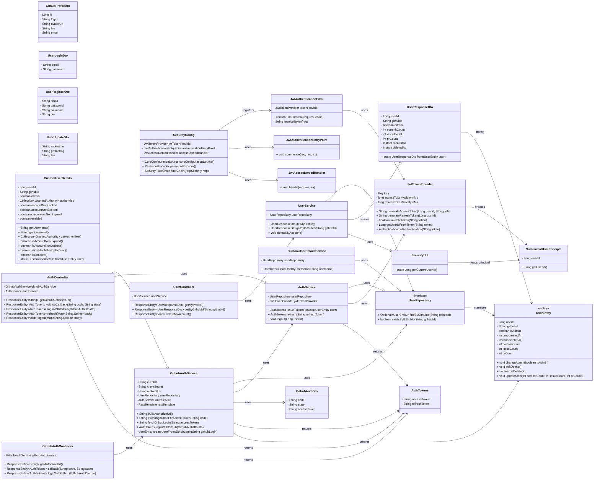
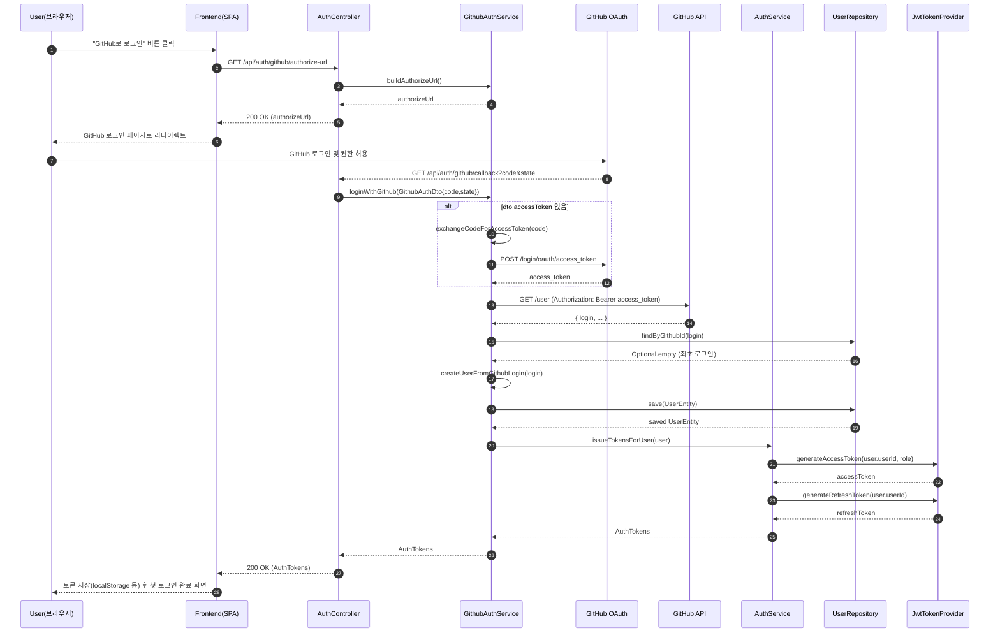
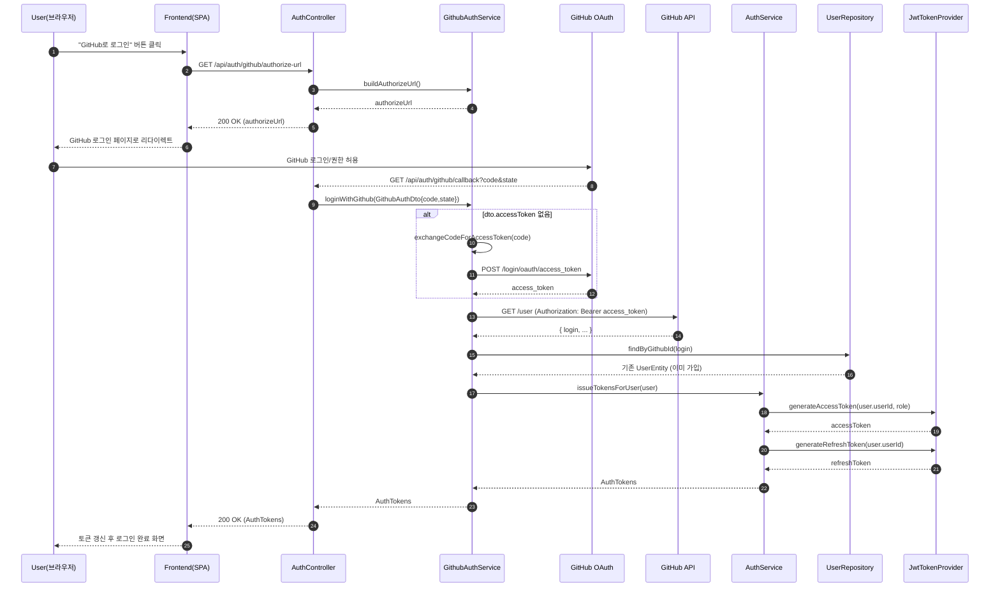

# Software Design Specification (SDS)

## 아이루트

**Team information:**
|    **Project title**    |                                                                                                                  아이루트                                                                                                                   |
| :---------------------: | :------------------------------------------------------------------------------------------------------------------------------------------------------------------------------------------------
|         **학번**          |                                                                                                                 **이름**                                                                                                                  |
|     22212006            |            박솔                                                                                                                                                                                                                          |
|    22321594             |          최은수                                                                                                                                                                                                                             |
|     22112056            |           김우주                                                                                                                                                                                                                           |
|     22312049            |          정석희                                                                                                                                                                                                                            |
|   22311952             |           석지윤                                                                                                                                                                                                                           |
|                 |                                                                                                                        
---

## Revision history

| Revision date | Version # | Description | Author |
|---------------|-----------|-------------|--------|
| 11/07/2025    | 1.00      | 1차완성 | Author name |
| | | | |
| | | | |
| | | | |
| | | | |
---

## Contents
1. Introduction  -------------------[Introduction](#1-introduction)
2. Use case analysis  --------------[Use case analysis](#2-use-case-analysis)
3. Class diagram  ------------------[Class diagram](#3-class-diagram)
4. Sequence diagram  ---------------[Sequence diagram](#4-sequence-diagram)
5. State machine diagram  ----------[State machine diagram](#5-state-machine-diagram)
6. User interface prototype  -------[User interface prototype](#6-user-interface-prototype)
7. Implementation requirements  ----[Implementation requirements](#7-implementation-requirements)
8. Glossary  -----------------------[Glossary](#8-glossary)
9. References  ---------------------[References](#9-references)

---

## Authors for each section

- Introduction – 
- Use case analysis – 
- Class diagram – 
- Sequence diagram – 
- State machine diagram – 
- User interface prototype –  
- Implementation requirements – 
- Glossary – 
- References – 

---

## 1. Introduction

---

## 2. Use case analysis
- Use case diagram

## 회원관리

1. 소셜 로그인
2. 일반 로그인
3. 회원가입
4. 내 프로필 조회
5. 내 프로필 수정
6. 소프트 삭제(계정 탈퇴)
7. 로그아웃
8. 토큰 재발급
9. 비밀번호 변경
10. 비밀번포 찾기
11. 사용자 유형 선택(학부모, 학원, 관리자)

## AI

12. 학생 성적 입력
13. 성적 그래프 추이
14. 맞춤 학습 자료 추천
15. 성적 분석 리포트
16. 학습 패턴 분석
17. 자주 틀리는 문제 분석 및 복습 문제 생성
18. 학생 맞춤 학습 진도 설계
19. 학생 맞춤 과목별 공부 방식 제안
20. 학생 자기 평가 입력란 (메타 인지)
21. 학생 학습 패턴 분석
22. 강사 피드백 입력란
23. 성장 예측 (지금 추세로 갔을 때 다음 시험 성적 예상)
24. 목표 기반 학습 추천
25. 강점 영역 분석(안정적인 부분)
26. 요약 리포트(성적 상승, 하락, 오답 유형 등)
27. 복습 주기 및 복습 내용 추천

## GPS

28. 학생 탑승 알림
29. 학생 하차 알림
30. 실시간 위치 추적
31. 도착 예정 시간
32. 정류장별 도착 예정 시간 조회
33. 차량 이동 경로 및 노선 조회
34. 경로 이탈 감지 (등록된 경로에서 크게 벗어나면 알림)
35. 비정상 정차 알림(너무 긴 시간 차량 정차 시)
36. 지각 위험 알림(도착 지연 예상 시 알림)
37. 탑승 학생 미리 알림 (3호차-누구, 누구, 누구 탑승)
38. 차량 및 기사 정보 조회(기사 연락처, 차량 번호 등)
39. 지연 원인 표시(교통체증, 장시간 정차 등)
40. 기사님께 최적의 노선 추천(빠른 경로 및 안전 경로 추천)
41. 위치 공유 시간 제한(운행 시간에만 차 위치 공유)

## 게시판

42. 개시판 생성
43. 게시판 목록 조회
44. 게시판 글 올리기
45. 게시판 사진 등록
46. 학원 페이지 조회
47. 다이렉트 메시지
48. 댓글 작성
49. 게시글 수정/삭제
50. 게시글 태그
51. 공지사항 안내
52. 이벤트, 홍보 게시판
53. 1:1 문의 게시판

## NFC 태그
54. 
55.
---
## 회원 관리

### **Use case #1 : GitHub OAuth 회원가입**
#### GENERAL CHARACTERISTICS
- **Summary**  
  

- **Scope**  
  아이루트

- **Level**  
  User level  

- **Author**  
  박솔

- **Last Update**  
  2026.03.24

- **Status**  
  Design

- **Primary Actor**  
  Non-member User (비회원 사용자)

- **Preconditions**  
  1. 사용자는 GitHub 계정을 보유하고 있으며 GitHub 인증에 정상적으로 접근할 수 있어야 한다.
  2. 서버는 GitHub OAuth App(Client ID / Client Secret)과 연결된 상태여야 한다.
  3. 백엔드는 다음 엔드포인트를 제공한다.
   - GET /api/auth/github/login : GitHub 인증 요청
   - GET /api/auth/github/callback : GitHub Access Token & user info 처리
  4. Supabase PostgreSQL DB 연결이 정상이어야 한다.

- **Trigger**  
  사용자가 “GitHub 로그인” 버튼 클릭 → GitHub OAuth 흐름 시작.

- **Success Post Condition**  
  1. GitHub에서 제공한 github_id로 새로운 UserEntity가 자동 생성됨.
   - githubId: GitHub API에서 받은 고유 ID
   - isAdmin = false
   - createdAt = now
   - deletedAt = null
   - commitCount, issueCount, prCount = 0
  2. 생성된 유저는 DB(users 테이블)에 저장된다.
  3. 서버는 유저 정보 기반으로 JWT AccessToken + RefreshToken을 발급해 클라이언트에 반환한다.
  4. 사용자는 로그인된 상태로 서비스 메인 페이지로 이동한다.

- **Failed Post Condition**  
 1.  GitHub Access Token이 정상 발급되지 않음 (“GitHub 액세스 토큰이 응답에 없습니다.” 오류 포함)
  2.GitHub API 호출 실패
  3. DB 저장 실패
  4. OAuth redirect URL 오류
   → UserEntity 생성 X / JWT 발급 X
 클라이언트는 GitHub 오류 팝업 또는 ‘다시 시도’ 안내 메시지를 표시한다.

#### MAIN SUCCESS SCENARIO
| Step | Action                                                                                                |
| ---- | ----------------------------------------------------------------------------------------------------- |
| S    | 사용자가 “GitHub 로그인” 버튼을 클릭한다.                                                                           |
| 1    | 클라이언트는 GitHub Authorization Endpoint로 리다이렉트한다.                                                        |
| 2    | 사용자는 GitHub에서 로그인 및 권한 동의를 완료한다.                                                                      |
| 3    | GitHub은 `authorization_code`를 서버의 `/callback` URL로 전달한다.                                              |
| 4    | 서버의 `GithubAuthService`는 code를 이용해 GitHub Access Token을 요청한다.                                         |
| 5    | GitHub Access Token 획득 성공 시, 서버는 GitHub User API를 호출한다.                                               |
| 6    | GitHub API 응답에서 `github_id`(고유 식별자)를 추출한다.                                                            |
| 7    | 서버는 DB에서 `githubId`가 존재하는지 조회한다.  - 존재하면 → 기존 계정으로 로그인 처리  - 존재하지 않으면 → 새로운 `UserEntity`를 생성한다. |
| 8    | 생성된(or 조회된) UserEntity 정보를 기반으로 JWT AccessToken & RefreshToken을 생성한다.                                 |
| 9    | 서버는 200 OK와 함께 JWT 및 사용자 정보를 클라이언트에 반환한다.                                                             |
| 10   | 클라이언트는 로그인 성공 상태로 메인 화면 또는 대시보드로 이동한다.                                                                |

#### EXTENSION SCENARIOS
| Step | Branching Action                                                                           |
| ---- | ------------------------------------------------------------------------------------------ |
| 4a   | GitHub Access Token 응답에 `access_token`이 없으면 “GitHub 액세스 토큰이 응답에 없습니다.” 오류 반환(현재 네가 만난 오류). |
| 5a   | GitHub API 서버 장애 또는 rate limit 초과 시 “GitHub 사용자 정보를 가져올 수 없습니다.” 오류 반환.                    |
| 7a   | DB 조회 중 장애 발생 시 “계정 정보를 확인할 수 없습니다.” 메시지를 반환하고 OAuth 프로세스를 종료한다.                           |
| 7b   | UserEntity 저장 실패 시 트랜잭션 롤백 후 “회원 생성 과정에서 오류가 발생했습니다.” 안내.                                  |
| 8a   | JWT 생성 오류 시 클라이언트는 로그인 실패 메시지를 표시한다.                                                       |
| 9a   | 응답 파싱 실패 시 클라이언트는 “로그인 처리 중 오류가 발생했습니다.” 메시지를 표시하고 다시 시도하도록 한다.                            |

#### RELATED INFORMATION
- **Performance**: 회원가입 전체 과정(요청 ~ 응답)은 평균 5초 이내에 완료되어야 한다.
비밀번호 암호화 및 DB 저장은 1초 이내 처리되는 것을 목표로 한다.
- **Frequency**: 신규 사용자마다 최초 1회 실행.
동일 이메일로 중복 가입은 허용하지 않는다.

- **Concurrency**: 최대 500명 동시 가입 요청을 처리할 수 있도록 API 서버 및 DB connection pool을 설정한다.
- **Due Date**: 2025. 11. 01 (예정)

---
## GPS

### **Use case #1 : GitHub OAuth 학생 탑승 알림**
#### GENERAL CHARACTERISTICS
- **Summary**  
  

- **Scope**  
  아이루트

- **Level**  
   

- **Author**  
  

- **Last Update**  
  

- **Status**  
  

- **Primary Actor**  
  

- **Preconditions**  
  1. 

- **Trigger**  
  

- **Success Post Condition**  
  1.
- **Failed Post Condition**  
 1.  

#### MAIN SUCCESS SCENARIO
| Step | Action                                                                                                |
| ---- | ----------------------------------------------------------------------------------------------------- |
| S    | .                                                                           |
| 1    |                                                         |
| 2    |                                                                       |
| 3    |                                               |
| 4    |                                          |
| 5    |                                                |
| 6    |                                                             |
| 7    |  |
| 8    |                                 |
| 9    |                                                              |
| 10   |                                                                |

#### EXTENSION SCENARIOS
| Step | Branching Action                                                                           |
| ---- | ------------------------------------------------------------------------------------------ |
| 4a   | |
| 5a   |                  |
| 7a   |                            |
| 7b   |                                   |
| 8a   |                                                       |
| 9a   |                           |

#### RELATED INFORMATION
- **Performance**: 
- **Frequency**:

- **Concurrency**: 
- **Due Date**: 

### **Use case #1 : GitHub OAuth 학생 하자 알림**
#### GENERAL CHARACTERISTICS
- **Summary**  
  

- **Scope**  
  아이루트

- **Level**  
   

- **Author**  
  

- **Last Update**  
  

- **Status**  
  

- **Primary Actor**  
  

- **Preconditions**  
  1. 

- **Trigger**  
  

- **Success Post Condition**  
  1.
- **Failed Post Condition**  
 1.  

#### MAIN SUCCESS SCENARIO
| Step | Action                                                                                                |
| ---- | ----------------------------------------------------------------------------------------------------- |
| S    | .                                                                           |
| 1    |                                                         |
| 2    |                                                                       |
| 3    |                                               |
| 4    |                                          |
| 5    |                                                |
| 6    |                                                             |
| 7    |  |
| 8    |                                 |
| 9    |                                                              |
| 10   |                                                                |

#### EXTENSION SCENARIOS
| Step | Branching Action                                                                           |
| ---- | ------------------------------------------------------------------------------------------ |
| 4a   | |
| 5a   |                  |
| 7a   |                            |
| 7b   |                                   |
| 8a   |                                                       |
| 9a   |                           |

#### RELATED INFORMATION
- **Performance**: 
- **Frequency**:

- **Concurrency**: 
- **Due Date**:

### **Use case #1 : 실시간 위치 추적**
#### GENERAL CHARACTERISTICS
- **Summary**  
  

- **Scope**  
  아이루트

- **Level**  
   

- **Author**  
  

- **Last Update**  
  

- **Status**  
  

- **Primary Actor**  
  

- **Preconditions**  
  1. 

- **Trigger**  
  

- **Success Post Condition**  
  1.
- **Failed Post Condition**  
 1.  

#### MAIN SUCCESS SCENARIO
| Step | Action                                                                                                |
| ---- | ----------------------------------------------------------------------------------------------------- |
| S    | .                                                                           |
| 1    |                                                         |
| 2    |                                                                       |
| 3    |                                               |
| 4    |                                          |
| 5    |                                                |
| 6    |                                                             |
| 7    |  |
| 8    |                                 |
| 9    |                                                              |
| 10   |                                                                |

#### EXTENSION SCENARIOS
| Step | Branching Action                                                                           |
| ---- | ------------------------------------------------------------------------------------------ |
| 4a   | |
| 5a   |                  |
| 7a   |                            |
| 7b   |                                   |
| 8a   |                                                       |
| 9a   |                           |

#### RELATED INFORMATION
- **Performance**: 
- **Frequency**:

- **Concurrency**: 
- **Due Date**: 

---
  ## 3. Class diagram
### 유저 관리

#### Entity Class

| Class Name        | UserEntity                         |         |            |
| ----------------- | ---------------------------------- | ------- | ---------- |
| Class Description | GitHub 계정 기반 사용자 정보를 저장하고 관리하는 엔티티 |         |            |
| 구분        | Name        | Type    | Visibility | Description                                   |
| --------- | ----------- | ------- | ---------- | --------------------------------------------- |
| Attribute | userId      | Long    | Private    | PK, 자동 증가(`IDENTITY`), ERD: `user_id`         |
| Attribute | githubId    | String  | Private    | GitHub 로그인 ID, 고유값, ERD: `github_id`          |
| Attribute | isAdmin     | boolean | Private    | 관리자 여부, ERD: `is_admin`                       |
| Attribute | createdAt   | Instant | Private    | 생성 시간, 최초 생성 시 자동 세팅, ERD: `created_at`       |
| Attribute | deletedAt   | Instant | Private    | 소프트 삭제 시간, 삭제되지 않은 경우 null, ERD: `deleted_at` |
| Attribute | commitCount | int     | Private    | 커밋 횟수, ERD: `commit_count`                    |
| Attribute | issueCount  | int     | Private    | 이슈 개수, ERD: `issue_count`                     |
| Attribute | prCount     | int     | Private    | PR 개수, ERD: `pr_count`                        |
| 구분       | Name       | Description                                   |
| -------- | ---------- | --------------------------------------------- |
| Callback | onCreate() | `@PrePersist` — createdAt 자동 세팅 및 통계 필드 0 초기화 |
| 구분     | Name                                                      | Return Type | Description                      |
| ------ | --------------------------------------------------------- | ----------- | -------------------------------- |
| Method | changeAdmin(boolean isAdmin)                              | void        | 사용자의 관리자 여부 변경                   |
| Method | softDelete()                                              | void        | 현재 시간을 deletedAt에 기록하여 소프트 삭제 처리 |
| Method | isDeleted()                                               | boolean     | deletedAt이 null이 아니면 탈퇴한 사용자로 판단 |
| Method | updateStats(int commitCount, int issueCount, int prCount) | void        | GitHub 통계 일괄 업데이트                |

#### DTO Class

| Class Name        | AuthTokens                             |        |            |
| ----------------- | ----------------------------------------- | ------ | ---------- |
| Class Description | 인증 후 발급되는 Access Token / Refresh Token 묶음 DTO |        |            |
| 구분        | Name         | Type   | Visibility | Description                        |
| --------- | ------------ | ------ | ---------- | ---------------------------------- |
| Attribute | accessToken  | String | Private    | 클라이언트 요청에 사용되는 JWT Access Token    |
| Attribute | refreshToken | String | Private    | Access Token 갱신용 JWT Refresh Token |

| Class Name        | GithubAuthDto                             |        |            |
| ----------------- | ----------------------------------------- | ------ | ---------- |
| Class Description | 깃허브 OAuth 인증 시 전달되는 인증 코드 및 상태 정보를 담는 DTO |        |            |
| 구분        | Name        | Type   | Visibility | Description                          |
| --------- | ----------- | ------ | ---------- | ------------------------------------ |
| Attribute | code        | String | Private    | GitHub 인증 과정에서 받은 authorization code |
| Attribute | state       | String | Private    | CSRF 방지용 state 값                     |
| Attribute | accessToken | String | Private    | GitHub에서 발급한 OAuth Access Token      |

| Class Name        | GithubProfileDto              |         |            |
| ----------------- | ----------------------------- | ------- | ---------- |
| Class Description | GitHub 사용자 프로필 정보를 담는 DTO |         |            |
| 구분        | Name      | Type   | Visibility | Description                |
| --------- | --------- | ------ | ---------- | -------------------------- |
| Attribute | id        | Long   | Private    | GitHub numeric id (고유 번호)  |
| Attribute | login     | String | Private    | GitHub username (로그인 ID)   |
| Attribute | avatarUrl | String | Private    | GitHub 프로필 이미지 URL         |
| Attribute | bio       | String | Private    | GitHub 프로필 소개 문구           |
| Attribute | email     | String | Private    | GitHub 이메일 (비공개 시 null 가능) |

| Class Name        | UserLoginDto                           |        |            |
| ----------------- | ------------------------------------- | ------ | ---------- |
| Class Description | 일반 이메일/비밀번호 기반 로그인 요청 DTO |        |            |
| 구분        | Name     | Type   | Visibility | Description               |
| --------- | -------- | ------ | ---------- | ------------------------- |
| Attribute | email    | String | Private    | 사용자 로그인 이메일               |
| Attribute | password | String | Private    | 사용자 비밀번호(평문, 서버에서 암호화 처리) |

| Class Name        | UserRegisterDto                           |        |            |
| ----------------- | ------------------------------------- | ------ | ---------- |
| Class Description | 일반 이메일/비밀번호 기반 로그인 요청 DTO |        |            |
| 구분        | Name     | Type   | Visibility | Description            |
| --------- | -------- | ------ | ---------- | ---------------------- |
| Attribute | email    | String | Private    | 회원가입 이메일(로그인 ID)       |
| Attribute | password | String | Private    | 회원 비밀번호(저장 전 해시 처리 예정) |
| Attribute | nickname | String | Private    | 서비스 내에서 사용할 닉네임        |
| Attribute | bio      | String | Private    | 한 줄 소개 / 자기소개          |

| Class Name        | UserResponseDto                           |        |            |
| ----------------- | ------------------------------------- | ------ | ---------- |
| Class Description | 클라이언트로 반환하는 사용자 정보 응답 DTO |        |            |
| 구분        | Name        | Type    | Visibility | Description              |
| --------- | ----------- | ------- | ---------- | ------------------------ |
| Attribute | userId      | Long    | Private    | 사용자 PK                   |
| Attribute | githubId    | String  | Private    | 사용자 GitHub ID (연동 계정)    |
| Attribute | admin       | boolean | Private    | 관리자 여부                   |
| Attribute | commitCount | int     | Private    | 누적 커밋 수                  |
| Attribute | issueCount  | int     | Private    | 누적 이슈 개수                 |
| Attribute | prCount     | int     | Private    | 누적 PR 개수                 |
| Attribute | createdAt   | Instant | Private    | 계정 생성 시각                 |
| Attribute | deletedAt   | Instant | Private    | 계정 삭제(탈퇴) 시각, 미탈퇴 시 null |
| 구분     | Name                  | Return Type     | Description                              |
| ------ | --------------------- | --------------- | ---------------------------------------- |
| Method | from(UserEntity user) | UserResponseDto | UserEntity를 기반으로 응답 DTO로 변환하는 정적 팩토리 메서드 |

| Class Name        | UserUpdateDto                           |        |            |
| ----------------- | ------------------------------------- | ------ | ---------- |
| Class Description | 마이페이지 등에서 사용자 프로필 수정 요청에 사용하는 DTO |        |            |
| 구분        | Name       | Type   | Visibility | Description     |
| --------- | ---------- | ------ | ---------- | --------------- |
| Attribute | nickname   | String | Private    | 변경할 닉네임         |
| Attribute | profileImg | String | Private    | 변경할 프로필 이미지 URL |
| Attribute | bio        | String | Private    | 변경할 자기소개/한 줄 소개 |

#### Repository Class

| Class Name        | UserRepository                                           |                      |            |
| ----------------- | -------------------------------------------------------- | -------------------- | ---------- |
| Class Description | UserEntity에 대한 CRUD 및 사용자 검색용 JPA Repository |                      |            |
| 구분     | Name                              | Return Type          | Description        |
| ------ | --------------------------------- | -------------------- | ------------------ |
| Method | findByGithubId(String githubId)   | Optional<UserEntity> | github_id로 사용자 조회  |
| Method | existsByGithubId(String githubId) | boolean              | github_id 존재 여부 확인 |

#### Security Class

| Class Name        | JwtTokenProvider                          |        |            |
| ----------------- | ----------------------------------------- | ------ | ---------- |
| Class Description | JWT Access/Refresh 토큰 생성·검증·파싱 담당         |        |            |
| 구분        | Name                     | Type | Visibility | Description      |
| --------- | ------------------------ | ---- | ---------- | ---------------- |
| Attribute | key                      | Key  | Private    | 서명 검증용 Key 객체    |
| Attribute | accessTokenValidityInMs  | long | Private    | 액세스토큰 유효 시간(ms)  |
| Attribute | refreshTokenValidityInMs | long | Private    | 리프레시토큰 유효 시간(ms) |
| 구분     | Name                                          | Return Type    | Description                            |
| ------ | --------------------------------------------- | -------------- | ---------------------------------------- |
| Method | generateAccessToken(Long userId, String role) | String         | Access Token 생성                          |
| Method | generateRefreshToken(Long userId)             | String         | Refresh Token 생성                         |
| Method | validateToken(String token)                   | boolean        | JWT 서명 및 만료 검증                           |
| Method | getUserIdFromToken(String token)              | Long           | JWT Payload에서 userId(subject) 추출         |
| Method | getAuthentication(String token)               | Authentication | SecurityContext에 넣을 Authentication 객체 생성 |

| Class Name        | JwtAuthenticationFilter                                              |                  |            |
| ----------------- | -------------------------------------------------------------------- | ---------------- | ---------- |
| 구분        | Name          | Type             | Visibility    | Description   |
| --------- | ------------- | ---------------- | ------------- | ------------- |
| Attribute | tokenProvider | JwtTokenProvider | Private/Final | JWT 생성·검증 제공자 |
| 구분     | Name                                 | Return Type | Description                                 |
| ------ | ------------------------------------ | ----------- | ------------------------------------------- |
| Method | doFilterInternal(...)                | void        | JWT 검증 후 SecurityContext에 Authentication 저장 |
| Method | resolveToken(HttpServletRequest req) | String      | Authorization 헤더에서 Bearer Token 추출          |

| Class Name        | JwtAuthenticationEntryPoint                                     |                        |            |
| ----------------- | -------------------------------------------------------- | ---------------------- | ---------- |
| 구분                    | Name                            | Type | Visibility |
| --------------------- | ------------------------------- | ---- | ---------- |
| **Class Name**        | JwtAuthenticationEntryPoint     |      |            |
| **Class Description** | 인증 실패(401 Unauthorized) 시 처리 담당 |      |            |
| 구분     | Name          | Return Type | Description       |
| ------ | ------------- | ----------- | ----------------- |
| Method | commence(...) | void        | 인증 실패 시 401 응답 전송 |

| Class Name        | JwtAccessDeniedHandler                                           |                             |            |
| ----------------- | --------------------------------------------------------- | --------------------------- | ---------- |
| 구분                    | Name                         | Type | Visibility |
| --------------------- | ---------------------------- | ---- | ---------- |
| **Class Name**        | JwtAccessDeniedHandler       |      |            |
| **Class Description** | 인가 실패(403 Forbidden) 시 처리 담당 |      |            |
| 구분     | Name        | Return Type | Description       |
| ------ | ----------- | ----------- | ----------------- |
| Method | handle(...) | void        | 권한 부족 시 403 응답 전송 |

| Class Name        | CustomUserDetailsService            |      |            |
| ----------------- | -------------------------------------- | ---- | ---------- |
| 구분                    | Name                                       | Type | Visibility |
| --------------------- | ------------------------------------------ | ---- | ---------- |
| **Class Name**        | CustomUserDetailsService                   |      |            |
| **Class Description** | GitHub ID 기반 사용자 조회(UserDetailsService 구현) |      |            |
| 구분        | Name           | Type           | Visibility    | Description        |
| --------- | -------------- | -------------- | ------------- | ------------------ |
| Attribute | userRepository | UserRepository | Private/Final | 사용자 조회용 Repository |
| 구분     | Name                                | Return Type | Description                             |
| ------ | ----------------------------------- | ----------- | --------------------------------------- |
| Method | loadUserByUsername(String githubId) | UserDetails | github_id로 유저 조회 후 CustomUserDetails 생성 |

| Class Name        | CustomUserDetails                |      | ---------- |
| ----------------- | ------------------------------------- | ---- | ---------- |
| 구분                    | Name                                             | Type | Visibility |
| --------------------- | ------------------------------------------------ | ---- | ---------- |
| **Class Name**        | CustomUserDetails                                |      |            |
| **Class Description** | UserEntity를 Spring Security의 UserDetails로 변환한 객체 |      |            |
| 구분        | Name                  | Type                                   | Visibility | Description             |
| --------- | --------------------- | -------------------------------------- | ---------- | ----------------------- |
| Attribute | userId                | Long                                   | Private    | 사용자 PK                  |
| Attribute | githubId              | String                                 | Private    | GitHub ID (username 대체) |
| Attribute | admin                 | boolean                                | Private    | 관리자 여부                  |
| Attribute | authorities           | Collection<? extends GrantedAuthority> | Private    | 역할/권한                   |
| Attribute | accountNonLocked      | boolean                                | Private    | 계정 잠김 여부                |
| Attribute | accountNonExpired     | boolean                                | Private    | 계정 만료 여부                |
| Attribute | credentialsNonExpired | boolean                                | Private    | 자격 만료 여부                |
| Attribute | enabled               | boolean                                | Private    | 활성화 여부(탈퇴 user=false)   |
| 구분     | Name                      | Return Type       | Description          |
| ------ | ------------------------- | ----------------- | -------------------- |
| Method | from(UserEntity user)     | CustomUserDetails | 엔티티 → UserDetails 변환 |
| Method | getAuthorities()          | Collection        | 권한 반환                |
| Method | getUsername()             | String            | GitHub ID 반환         |
| Method | getPassword()             | String            | (OAuth만 사용 → null)   |
| Method | isAccountNonLocked()      | boolean           | 잠김 여부                |
| Method | isAccountNonExpired()     | boolean           | 만료 여부                |
| Method | isCredentialsNonExpired() | boolean           | 자격증명 만료 여부           |
| Method | isEnabled()               | boolean           | 계정 활성 여부             |

| Class Name        | SecurityConfig                                      |                        |            |
| ----------------- | -------------------------------------------------------- | ---------------------- | ---------- |
| 구분                    | Name                               | Type | Visibility |
| --------------------- | ---------------------------------- | ---- | ---------- |
| **Class Name**        | SecurityConfig                     |      |            |
| **Class Description** | Spring Security 설정(필터, 권한, CORS 등) |      |            |
| 구분        | Name                     | Type                        | Visibility    | Description  |
| --------- | ------------------------ | --------------------------- | ------------- | ------------ |
| Attribute | jwtTokenProvider         | JwtTokenProvider            | Private/Final | JWT Provider |
| Attribute | authenticationEntryPoint | JwtAuthenticationEntryPoint | Private/Final | 401 에러 처리    |
| Attribute | accessDeniedHandler      | JwtAccessDeniedHandler      | Private/Final | 403 에러 처리    |
| 구분     | Name                           | Return Type             | Description            |
| ------ | ------------------------------ | ----------------------- | ---------------------- |
| Method | corsConfigurationSource()      | CorsConfigurationSource | CORS 설정 생성             |
| Method | passwordEncoder()              | PasswordEncoder         | BCrypt PasswordEncoder |
| Method | filterChain(HttpSecurity http) | SecurityFilterChain     | 전체 Security 설정 로직      |

| Class Name        | SecurityUtil                                    |                        |            |
| ----------------- | -------------------------------------------------------- | ---------------------- | ---------- |
| 구분                    | Name                                          | Type | Visibility |
| --------------------- | --------------------------------------------- | ---- | ---------- |
| **Class Name**        | SecurityUtil                                  |      |            |
| **Class Description** | SecurityContext에서 현재 로그인한 userId를 가져오는 유틸 클래스 |      |            |
| 구분     | Name               | Return Type | Description                            |
| ------ | ------------------ | ----------- | -------------------------------------- |
| Method | getCurrentUserId() | Long        | SecurityContext의 principal에서 userId 추출 |

#### Service Class

| Class Name        | AuthService                                                        |            |            |
| ----------------- | ------------------------------------------------------------------ | ---------- | ---------- |
| Class Description | GitHub 로그인, 로그아웃, 토큰 재발급 등 인증 관련 핵심 로직 담당                          |            |            |
| 구분        | Name             | Type             | Visibility      | Description         |
| --------- | ---------------- | ---------------- | --------------- | ------------------- |
| Attribute | userRepository   | UserRepository   | Private / Final | 사용자 조회용 JPA 리포지토리   |
| Attribute | jwtTokenProvider | JwtTokenProvider | Private / Final | JWT 생성 및 검증 담당 컴포넌트 |
| 구분     | Name                                | Return Type | Description                                                                      |
| ------ | ----------------------------------- | ----------- | -------------------------------------------------------------------------------- |
| Method | issueTokensForUser(UserEntity user) | AuthTokens  | GitHub OAuth 등을 통해 확보된 UserEntity 기반으로 역할(is_admin) 확인 후 Access/Refresh 토큰 세트 발급 |
| Method | refresh(String refreshToken)        | AuthTokens  | 전달받은 Refresh Token을 검증 후, 유저 상태를 확인하고 새 Access/Refresh Token 재발급                 |
| Method | logout(Long userId)                 | void        | 현재 구조에서는 stateless JWT 이므로 별도 처리 없이 로그아웃 훅 제공(추후 블랙리스트/저장소 도입 시 확장 가능)           |

| Class Name        | GithubAuthService                                                           |            |            |
| ----------------- | --------------------------------------------------------------------------- | ---------- | ---------- |
| Class Description | 깃허브 OAuth 인증 절차 및 GitHub 사용자 정보 연동 로직 수행                                    |            |            |
| 구분        | Name           | Type           | Visibility      | Description                               |
| --------- | -------------- | -------------- | --------------- | ----------------------------------------- |
| Attribute | clientId       | String         | Private         | GitHub OAuth Client ID (환경설정에서 주입)        |
| Attribute | clientSecret   | String         | Private         | GitHub OAuth Client Secret (환경설정에서 주입)    |
| Attribute | redirectUri    | String         | Private         | GitHub OAuth Redirect URI                 |
| Attribute | userRepository | UserRepository | Private / Final | GitHub 로그인(github_id) 기준 사용자 조회/저장용 리포지토리 |
| Attribute | authService    | AuthService    | Private / Final | 인증 토큰 발급 로직(AuthTokens 생성) 담당 서비스         |
| Attribute | restTemplate   | RestTemplate   | Private / Final | GitHub API 호출용 HTTP 클라이언트                 |
| 구분     | Name                                          | Return Type | Description                                                                                    |
| ------ | --------------------------------------------- | ----------- | ---------------------------------------------------------------------------------------------- |
| Method | buildAuthorizeUrl()                           | String      | 프론트에서 GitHub 로그인 버튼 클릭 시 사용할 `https://github.com/login/oauth/authorize` URL 생성                 |
| Method | exchangeCodeForAccessToken(String code)       | String      | GitHub가 넘겨준 인가 코드(code)를 이용해 Access Token으로 교환                                                 |
| Method | fetchGithubLogin(String accessToken)          | String      | GitHub API(`/user`) 호출로 프로필 조회 후 `login` 값을 github_id로 사용                                      |
| Method | loginWithGithub(GithubAuthDto dto)            | AuthTokens  | ① accessToken 없으면 code로 교환 → ② GitHub login 조회 → ③ 기존 유저 조회 or 신규 생성 → ④ AuthService 통해 JWT 발급 |
| Method | createUserFromGithubLogin(String githubLogin) | UserEntity  | GitHub로 처음 로그인한 사용자를 ERD 규칙에 맞게 생성 후 저장 (is_admin=false, 통계 0, createdAt=now 등)                |

| Class Name        | UserService                                        |                 |            |
| ----------------- | -------------------------------------------------- | --------------- | ---------- |
| Class Description | 사용자 정보 조회, 탈퇴(소프트 삭제) 등 일반 사용자 관리 로직 담당            |                 |            |
| 구분        | Name           | Type           | Visibility      | Description          |
| --------- | -------------- | -------------- | --------------- | -------------------- |
| Attribute | userRepository | UserRepository | Private / Final | 사용자 조회/저장용 JPA 리포지토리 |
| 구분     | Name                           | Return Type     | Description                                                     |
| ------ | ------------------------------ | --------------- | --------------------------------------------------------------- |
| Method | getMyProfile()                 | UserResponseDto | SecurityContext의 userId를 기준으로 내 프로필과 GitHub 통계 정보를 조회하여 DTO로 반환 |
| Method | getByGithubId(String githubId) | UserResponseDto | github_id 기준 사용자 정보를 조회하여 DTO로 반환(관리자/내부용)                      |
| Method | deleteMyAccount()              | void            | 현재 로그인한 사용자를 조회 후 soft delete(`user.softDelete()`) 수행           |

#### Controller Class

| Class Name        | AuthController                                                  |                            |            |
| ----------------- | --------------------------------------------------------------- | -------------------------- | ---------- |
| Class Description | GitHub 로그인, 로그아웃, 토큰 재발급 요청을 처리하는 컨트롤러                          |                            |            |
| 구분        | Name              | Type              | Visibility      | Description                   |
| --------- | ----------------- | ----------------- | --------------- | ----------------------------- |
| Attribute | githubAuthService | GithubAuthService | Private / Final | GitHub OAuth 및 로그인 처리 서비스     |
| Attribute | authService       | AuthService       | Private / Final | 토큰 재발급, 로그아웃 등 인증 비즈니스 로직 서비스 |
| 구분     | Name                                      | Return Type                | Description                                                                                 |
| ------ | ----------------------------------------- | -------------------------- | ------------------------------------------------------------------------------------------- |
| Method | getGithubAuthorizeUrl()                   | ResponseEntity<String>     | 프론트에서 GitHub 로그인 버튼 클릭 시, GitHub 인증 페이지로 이동할 authorize URL 반환 (`GET /github/authorize-url`) |
| Method | githubCallback(String code, String state) | ResponseEntity<AuthTokens> | GitHub에서 콜백으로 넘겨준 code/state로 GitHub 인증 및 JWT 발급 수행 (`GET /github/callback`)                |
| Method | loginWithGithub(GithubAuthDto dto)        | ResponseEntity<AuthTokens> | SPA 환경 등에서 code를 body로 받아 GitHub 로그인 처리 (`POST /github/login`)                              |
| Method | refresh(Map<String,String> body)          | ResponseEntity<AuthTokens> | 리프레시 토큰을 이용해 Access/Refresh 토큰 재발급 (`POST /refresh`)                                        |
| Method | logout(Map<String,Object> body)           | ResponseEntity<Void>       | 로그아웃 요청 처리, 필요 시 userId 기반 후처리 가능 (`POST /logout`)                                          |

| Class Name        | GithubAuthController                                                  |                            |            |
| ----------------- | --------------------------------------------------------------- | -------------------------- | ---------- |
| Class Description | GitHub OAuth 로그인 전용 엔드포인트를 제공하는 컨트롤러                          |                            |            |
| 구분        | Name              | Type              | Visibility      | Description                  |
| --------- | ----------------- | ----------------- | --------------- | ---------------------------- |
| Attribute | githubAuthService | GithubAuthService | Private / Final | GitHub OAuth 인증 및 로그인 처리 서비스 |
| 구분     | Name                                | Return Type                | Description                                                                |
| ------ | ----------------------------------- | -------------------------- | -------------------------------------------------------------------------- |
| Method | getAuthorizeUrl()                   | ResponseEntity<String>     | GitHub 로그인 버튼 클릭 시 사용할 authorize URL 반환 (`GET /authorize-url`)             |
| Method | callback(String code, String state) | ResponseEntity<AuthTokens> | GitHub OAuth 콜백 처리, code/state로 로그인 후 JWT 토큰 반환 (`GET /callback`)          |
| Method | loginWithGithub(GithubAuthDto dto)  | ResponseEntity<AuthTokens> | 프론트에서 이미 code → accessToken 교환 완료 후 accessToken만 보내는 경우 처리 (`POST /login`) |

| Class Name        | UserController                                 |                                 |            |
| ----------------- | ---------------------------------------------- | ------------------------------- | ---------- |
| Class Description | 현재 사용자 정보 조회, 계정 탈퇴 요청을 처리하는 컨트롤러              |                                 |            |
| 구분        | Name        | Type        | Visibility      | Description                    |
| --------- | ----------- | ----------- | --------------- | ------------------------------ |
| Attribute | userService | UserService | Private / Final | 사용자 정보 조회 및 계정 삭제 로직을 처리하는 서비스 |
| 구분     | Name                           | Return Type                     | Description                                                       |
| ------ | ------------------------------ | ------------------------------- | ----------------------------------------------------------------- |
| Method | getMyProfile()                 | ResponseEntity<UserResponseDto> | 현재 로그인한 사용자의 프로필 정보 조회 (`GET /me`)                                |
| Method | getByGithubId(String githubId) | ResponseEntity<UserResponseDto> | github_id 기준 특정 사용자 정보 조회 (관리자용 예시) (`GET /by-github/{githubId}`) |
| Method | deleteMyAccount()              | ResponseEntity<Void>            | 현재 로그인한 사용자의 소프트 삭제(탈퇴) 처리 (`DELETE /me`)                         |

## 4. Sequence diagram
## 유저
### 1. GitHub OAuth 회원가입

사용자가 웹 서비스에서 “GitHub로 로그인” 버튼을 클릭하면, 프론트엔드는 먼저 백엔드의 GET /api/auth/github/authorize-url 엔드포인트를 호출해 GitHub 인증 페이지로 이동할 수 있는 authorize URL을 요청한다. AuthController는 내부적으로 GithubAuthService.buildAuthorizeUrl()을 호출하여 GitHub OAuth 인증 URL을 생성해 프론트엔드에 전달한다. 프론트엔드는 해당 URL로 리다이렉트시켜 사용자를 GitHub 로그인 화면으로 보내고, 사용자는 GitHub 계정으로 로그인 및 권한 허용을 진행한다.

GitHub 로그인에 성공하면 GitHub는 등록된 redirect URI로 code와 state를 포함하여 백엔드로 콜백 요청을 보낸다. 이때 AuthController.githubCallback()이 호출되며, 컨트롤러는 전달받은 code/state 값을 GithubAuthDto에 담아 GithubAuthService.loginWithGithub()에 넘긴다.

GithubAuthService는 우선 DTO에 accessToken이 없는 경우 GitHub 토큰 발급 엔드포인트(https://github.com/login/oauth/access_token)에 client_id, client_secret, code, redirect_uri를 담아 POST 요청을 보내 액세스토큰을 받아온다. 이어서 이 액세스 토큰을 이용하여 GitHub API의 /user 엔드포인트를 호출해 사용자의 GitHub 프로필 정보를 조회하고, 이 중 login 값을 가져와 서비스에서 사용하는 github_id로 활용한다.

그 다음 UserRepository.findByGithubId()를 호출하여 해당 github_id가 이미 존재하는지 조회한다. 최초 로그인이라면 해당 값이 없기 때문에, GithubAuthService는 createUserFromGithubLogin()을 호출하여 새로운 UserEntity를 생성한다. 이때 관리자 여부는 기본적으로 false이며, commit/issue/pr 통계는 모두 0으로 초기화되고 created_at 값이 현재 시각으로 설정된다. 생성된 엔티티는 DB에 저장된다.

사용자 엔터티가 준비되면, GithubAuthService는 AuthService.issueTokensForUser()를 호출해 Access Token과 Refresh Token을 발급받는다. AuthService는 JWT 생성기 JwtTokenProvider를 사용하여, userId와 역할(is_admin 여부)을 포함한 Access Token과 Refresh Token을 각각 생성한다. 생성된 토큰 세트(AuthTokens)는 다시 컨트롤러를 통해 프론트엔드로 반환되며, 프론트는 이 토큰을 저장하여 최초 회원가입 및 로그인 과정을 마친다.

### 2. 로그인 (GitHub OAuth 재로그인)

재로그인 흐름은 회원가입과 거의 동일하게 시작된다. 사용자는 “GitHub로 로그인” 버튼을 클릭하고, 프론트엔드는 백엔드에서 authorize URL을 받아 GitHub 인증 페이지로 이동시킨다. GitHub에서 code/state를 전달하며 콜백 요청을 보내면, 백엔드는 code를 accessToken으로 교환하여 GitHub 계정 정보를 다시 읽어온다.

가장 큰 차이는 이 시점 이후이다. GithubAuthService.loginWithGithub()은 GitHub에서 넘어온 login 값을 기준으로 UserRepository.findByGithubId()를 조회하고, 이번에는 DB에 이미 저장된 기존 사용자 엔터티가 존재하므로 새롭게 생성하지 않는다. 이후 기존 사용자 정보로 AuthService.issueTokensForUser()를 호출해 JWT 토큰 세트를 새로 발급받는다. 프론트는 새로운 Access Token과 Refresh Token을 저장하여 로그인 상태가 갱신된다.

즉, 재로그인 과정에서는 회원가입이 발생하지 않고, 이미 등록된 사용자의 인증만 수행하는 방식으로 작동한다.
