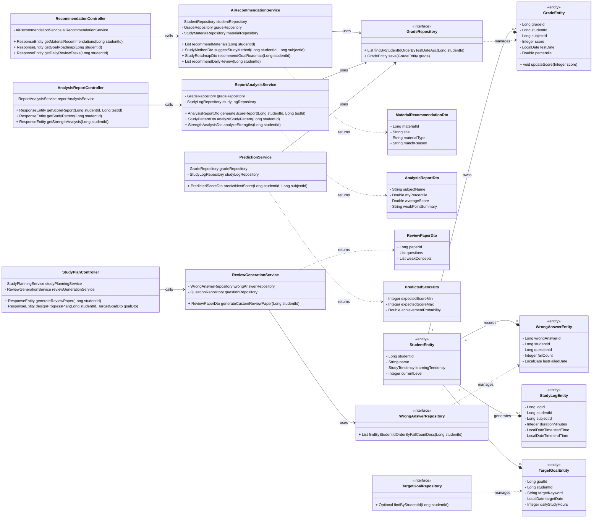
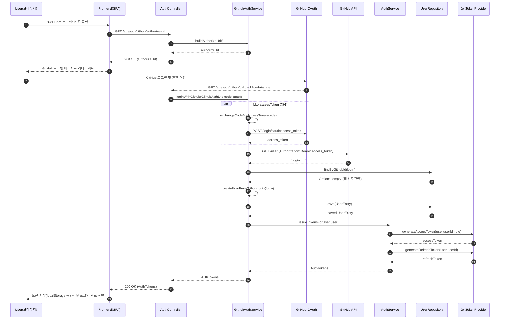
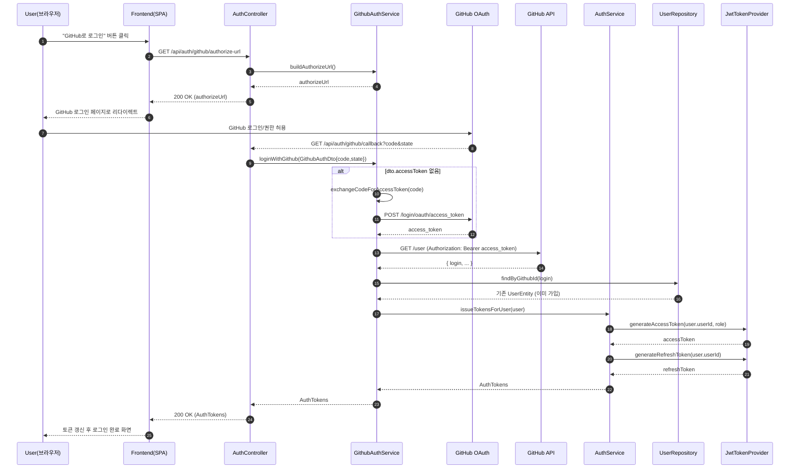

# Software Design Specification (SDS)

## 아이루트

**Team information:**
|    **Project title**    |                                                                                                                  아이루트                                                                                                                   |
| :---------------------: | :------------------------------------------------------------------------------------------------------------------------------------------------------------------------------------------------
|         **학번**          |                                                                                                                 **이름**                                                                                                                  |
|     22212006            |            박솔                                                                                                                                                                                                                          |
|    22321594             |          최은수                                                                                                                                                                                                                             |
|     22112056            |           김우주                                                                                                                                                                                                                           |
|     22312049            |          정석희                                                                                                                                                                                                                            |
|   22311952             |           석지윤                                                                                                                                                                                                                           |
|   22321642              |        박정은                                                                                                                
---

## Revision history

| Revision date | Version # | Description | Author |
|---------------|-----------|-------------|--------|
| 1/04/2026    | 1.00      | 1차완성 | Author name |
| | | | |
| | | | |
| | | | |
| | | | |
---

## Contents
1. Introduction  -------------------[Introduction](#1-introduction)
2. Use case analysis  --------------[Use case analysis](#2-use-case-analysis)
3. Class diagram  ------------------[Class diagram](#3-class-diagram)
4. Sequence diagram  ---------------[Sequence diagram](#4-sequence-diagram)
5. State machine diagram  ----------[State machine diagram](#5-state-machine-diagram)
6. User interface prototype  -------[User interface prototype](#6-user-interface-prototype)
7. Implementation requirements  ----[Implementation requirements](#7-implementation-requirements)
8. Glossary  -----------------------[Glossary](#8-glossary)
9. References  ---------------------[References](#9-references)

---

## Authors for each section

- Introduction – 
- Use case analysis – 
- Class diagram – 
- Sequence diagram – 
- State machine diagram – 
- User interface prototype –  
- Implementation requirements – 
- Glossary – 
- References – 

---

## 1. Introduction

---

## 2. Use case analysis
- Use case diagram

## 회원관리

1. 소셜 로그인
2. 일반 로그인
3. 회원가입
4. 내 프로필 조회
5. 내 프로필 수정
6. 소프트 삭제(계정 탈퇴)
7. 로그아웃
8. 토큰 재발급
9. 비밀번호 변경
10. 비밀번포 찾기
11. 사용자 유형 선택(학부모, 학원, 관리자)

## AI

### 성적 관리 및 리포트
학생의 학업 성취도를 데이터화하고, 이를 시계열 및 통계적으로 분석하여 시각화된 리포트를 제공하는 기능이다.

12. 학생 성적 입력
  - 과목별 점수 및 등급의 수동 입력 지원
  - 시험 종류(중간/기말/모의고사) 및 시행 일자 관리\
  - 입력된 데이터의 실시간 DB 연동 및 분석 엔진 전송
13. 성적 그래프 추이
  - 누적된 성적 데이터를 기반으로 한 시계열 선형 그래프 제공
  - 전체 평균 대비 나의 위치 및 과목별 점수 변동폭 시각화
14. 성적 분석 리포트
  - 과목별 백분위 및 성취 수준 상세 진단
  - 표준편차를 활용한 객관적 학업 역량 수치화
  - 요약 리포트 (성적 증감 및 오답 유형)
  - 전월 대비 성적 상승/하락 폭 핵심 요약
  - 주로 틀리는 문제 유형(개념 부족, 계산 실수 등)을 데이터로 요약 제공

### 학습 행동 및 패턴 분석
학생의 학습 습관, 메타인지 능력, 강사의 정성적 평가를 종합하여 학습의 질을 분석하는 기능이다.

15. 학습 패턴 분석
  - 앱 접속 시간대, 과목별 학습 지속 시간 분석
  - 집중력이 가장 높은 골든타임 식별 및 리포트 제공
16. 학생 자기 평가 입력란 (메타인지)
  - 학습 직후 본인의 이해도와 집중도를 스스로 체크 (별점 또는 척도)
  - 주관적 이해도와 실제 성적 간의 괴리 분석을 통한 메타인지 함양
17. 강사 피드백 입력란
  - 담당 강사가 학생의 태도 및 특이사항을 기록
  - AI 분석 데이터에 강사의 정성적 진단을 결합한 종합 분석 기반 마련
18. 강점 영역 분석 (안정적인 부분)
  - 지속적으로 높은 정답률을 유지하는 '안정적 단원' 식별
  - 학습 자신감을 높이기 위한 긍정적 지표 강조 표시

### 맞춤형 학습 솔루션 및 복습
AI 분석 결과를 바탕으로 학생의 약점을 보완하고 개인화된 학습 로드맵을 제공하는 기능이다.

20. 맞춤 학습 자료 추천
  - 현재 실력과 취약 단원을 고려한 난이도별 문제집 및 인강 추천
  - 유사 성적대 사용자들이 가장 선호하는 고효율 콘텐츠 매칭
21. 자주 틀리는 문제 분석 및 복습 문제 생성
  - 오답 노트 데이터를 분석하여 핵심 취약 개념(Tag) 추출
  - 해당 개념과 유사한 난이도의 변형 문제(쌍둥이 문제) 자동 생성
22. 학생 맞춤 과목별 공부 방식 제안
  - 학습 성향(시각/청각/행동형)과 성적 데이터를 결합한 공부 전략 제시
  - 단원별 특성에 맞는 고효율 학습 가이드(ex: 개념 중심 vs 문제 풀이 위주) 제공
23. 복습 주기 및 복습 내용 추천
  - 에빙하우스 망각 곡선을 적용하여 기억 소실 시점에 맞춰 복습 알림 발송
  - 오늘 반드시 다시 봐야 할 핵심 오답 및 개념을 카드 형태로 추천

### 미래 성장 및 목표 설계
현재의 데이터를 바탕으로 미래의 성적을 예측하고, 목표 달성을 위한 최적의 경로를 설계하는 기능이다.

24. 성장 예측 (차기 시험 성적 예상)
  - 현재 성적 추이와 학습량 변화를 머신러닝 모델에 대입하여 다음 시험 예상 점수 산출
  - 점수 하락 추세 시 '위험 학생 탐지' 로직과 연동하여 경고 제공
25. 학생 맞춤 학습 진도 설계
  - 목표 달성 기간과 학생의 하루 가용 시간을 고려한 일일 학습량 배분
  - 진도율에 따른 유연한 스케줄 자동 조정 및 가이드 제공
26. 목표 기반 학습 추천
  - 희망 대학/학과 또는 목표 점수 도달을 위한 단계별 로드맵 제시
  - 동일 목표를 달성한 선배 사용자들의 학습 데이터를 기반으로 한 성공 경로 추천

## GPS

### 위치/노선
차량의 현재 위치 및 운행 경로를 관리하고 사용자에게 시각적으로 제공하는 기능이다.

28. 실시간 위치 추적
   - 기사 앱에서 5초 주기로 GPS 데이터를 수신
   - 서버는 차량의 최신 위치를 저장 및 갱신
   - 학부모는 차량 위치를 실시간으로 조회 가능
29. 차량 이동 경로 및 노선 조회
   - 차량에 할당된 고정 노선 정보 제공
   - 정류장 순서 기반 경로 시각화
   - 지도 기반 UI로 경로 표시
30. 정류장 진행 상태 표시
   - 현재 차량 위치 기준으로 정류장 상태 구분
31. 위치 공유 시간 제한
   - 차량 운행 시간에만 위치 정보 제공
   - 운행 종료 후 위치 공유 자동 비활성화
32. 차량 및 기사 정보 조회
   - 차량 번호, 기사 이름, 연락처 제공
   - 학부모가 필요 시 확인 가능

### ETA 및 지연 분석 기능
차량 위치와 노선 정보를 기반으로 예상 도착 시간을 계산하고 지연 여부를 판단하는 기능이다.

33. 학생별 도착 예정 시간(ETA) 계산
   - 현재 차량 위치 + 정류장 순서를 기반으로 계산
   - 카카오 길찾기 API 활용
   - 정류장 간 이동 시간 누적 방식 적용
34. 정류장 별 도착 예정 시간 조회
   - 전체 노선의 정류장 별 ETA 제공
   - 학부모 화면에서 정류장 리스트 형태로 확인 가능
   - 학생 하차 정류장은 강조 표시
35. 지각 위험 판단
   - 학생별 하원 예정 시각과 ETA 비교
   - 5분 이상 지연 시 지각 위험 상태로 판단.
36. 지연 원인 표시
   - 교통 혼잡 또는 장시간 정차 여부 기반
   - 단순 텍스트 형태로 제공 (ex) "교통 혼잡", "정차 지연"
  
### 이벤트 및 알림 기능
학생의 탑승/하차 및 차량 상태 변화를 감지하여 학부모에게 알림을 제공하는 기능이다.

37. 학생 탑승 알림
   - NFC 태그를 통한 이벤트 발생
   - 학부모에게 즉시 푸시 알림 전송
38. 학생 하차 알림
   - 하차 시 이벤트 발생
   - 학부모에게 도착 알림 제공
39. 지각 위험 알림
   - ETA 기반 지연 판단 시 자동 알림
   - 예상 도착 시간 및 지연 시간 포함
40. 비정상 정차 알림
   - 일정 시간 이상 차량 정차 시 알림
41. 경로 이탈 감지 알림
   - 차량이 등록된 노선에서 일정 거리 이상 벗어난 경우 알림
   - GPS 오차를 고려한 임계값 적용
42. 알림 중복 방지 정책
   - 동일 이벤트는 5분 이내 재전송 제한
   - 상태 변화 기반 알림 처리

### 기사 지원 기능
차량 운행을 지원하기 위한 기사 전용 기능이다.

43. 탑승 예정 학생 리스트 조회
   - 해당 차량에 등록된 학생 목록 제공
   - 당일 운행 대상 학생 확인 가능

## 게시판

44. 개시판 생성
42. 게시판 목록 조회
43. 게시판 글 올리기
44. 게시판 사진 등록
45. 학원 페이지 조회
46. 다이렉트 메시지
47. 댓글 작성
48. 게시글 수정/삭제
49. 게시글 태그
50. 공지사항 안내
51. 이벤트, 홍보 게시판
52. 1:1 문의 게시판

## NFC 태그
53. 
54.
---
## 회원 관리

### **Use case #1 : GitHub OAuth 회원가입**
#### GENERAL CHARACTERISTICS
- **Summary**  
  

- **Scope**  
  아이루트

- **Level**  
  User level  

- **Author**  
  박솔

- **Last Update**  
  2026.03.24

- **Status**  
  Design

- **Primary Actor**  
  Non-member User (비회원 사용자)

- **Preconditions**  
  1. 사용자는 GitHub 계정을 보유하고 있으며 GitHub 인증에 정상적으로 접근할 수 있어야 한다.
  2. 서버는 GitHub OAuth App(Client ID / Client Secret)과 연결된 상태여야 한다.
  3. 백엔드는 다음 엔드포인트를 제공한다.
   - GET /api/auth/github/login : GitHub 인증 요청
   - GET /api/auth/github/callback : GitHub Access Token & user info 처리
  4. Supabase PostgreSQL DB 연결이 정상이어야 한다.

- **Trigger**  
  사용자가 “GitHub 로그인” 버튼 클릭 → GitHub OAuth 흐름 시작.

- **Success Post Condition**  
  1. GitHub에서 제공한 github_id로 새로운 UserEntity가 자동 생성됨.
   - githubId: GitHub API에서 받은 고유 ID
   - isAdmin = false
   - createdAt = now
   - deletedAt = null
   - commitCount, issueCount, prCount = 0
  2. 생성된 유저는 DB(users 테이블)에 저장된다.
  3. 서버는 유저 정보 기반으로 JWT AccessToken + RefreshToken을 발급해 클라이언트에 반환한다.
  4. 사용자는 로그인된 상태로 서비스 메인 페이지로 이동한다.

- **Failed Post Condition**  
 1.  GitHub Access Token이 정상 발급되지 않음 (“GitHub 액세스 토큰이 응답에 없습니다.” 오류 포함)
  2.GitHub API 호출 실패
  3. DB 저장 실패
  4. OAuth redirect URL 오류
   → UserEntity 생성 X / JWT 발급 X
 클라이언트는 GitHub 오류 팝업 또는 ‘다시 시도’ 안내 메시지를 표시한다.

#### MAIN SUCCESS SCENARIO
| Step | Action                                                                                                |
| ---- | ----------------------------------------------------------------------------------------------------- |
| S    | 사용자가 “GitHub 로그인” 버튼을 클릭한다.                                                                           |
| 1    | 클라이언트는 GitHub Authorization Endpoint로 리다이렉트한다.                                                        |
| 2    | 사용자는 GitHub에서 로그인 및 권한 동의를 완료한다.                                                                      |
| 3    | GitHub은 `authorization_code`를 서버의 `/callback` URL로 전달한다.                                              |
| 4    | 서버의 `GithubAuthService`는 code를 이용해 GitHub Access Token을 요청한다.                                         |
| 5    | GitHub Access Token 획득 성공 시, 서버는 GitHub User API를 호출한다.                                               |
| 6    | GitHub API 응답에서 `github_id`(고유 식별자)를 추출한다.                                                            |
| 7    | 서버는 DB에서 `githubId`가 존재하는지 조회한다.  - 존재하면 → 기존 계정으로 로그인 처리  - 존재하지 않으면 → 새로운 `UserEntity`를 생성한다. |
| 8    | 생성된(or 조회된) UserEntity 정보를 기반으로 JWT AccessToken & RefreshToken을 생성한다.                                 |
| 9    | 서버는 200 OK와 함께 JWT 및 사용자 정보를 클라이언트에 반환한다.                                                             |
| 10   | 클라이언트는 로그인 성공 상태로 메인 화면 또는 대시보드로 이동한다.                                                                |

#### EXTENSION SCENARIOS
| Step | Branching Action                                                                           |
| ---- | ------------------------------------------------------------------------------------------ |
| 4a   | GitHub Access Token 응답에 `access_token`이 없으면 “GitHub 액세스 토큰이 응답에 없습니다.” 오류 반환(현재 네가 만난 오류). |
| 5a   | GitHub API 서버 장애 또는 rate limit 초과 시 “GitHub 사용자 정보를 가져올 수 없습니다.” 오류 반환.                    |
| 7a   | DB 조회 중 장애 발생 시 “계정 정보를 확인할 수 없습니다.” 메시지를 반환하고 OAuth 프로세스를 종료한다.                           |
| 7b   | UserEntity 저장 실패 시 트랜잭션 롤백 후 “회원 생성 과정에서 오류가 발생했습니다.” 안내.                                  |
| 8a   | JWT 생성 오류 시 클라이언트는 로그인 실패 메시지를 표시한다.                                                       |
| 9a   | 응답 파싱 실패 시 클라이언트는 “로그인 처리 중 오류가 발생했습니다.” 메시지를 표시하고 다시 시도하도록 한다.                            |

#### RELATED INFORMATION
- **Performance**: 회원가입 전체 과정(요청 ~ 응답)은 평균 5초 이내에 완료되어야 한다.
비밀번호 암호화 및 DB 저장은 1초 이내 처리되는 것을 목표로 한다.
- **Frequency**: 신규 사용자마다 최초 1회 실행.
동일 이메일로 중복 가입은 허용하지 않는다.

- **Concurrency**: 최대 500명 동시 가입 요청을 처리할 수 있도록 API 서버 및 DB connection pool을 설정한다.
- **Due Date**: 2025. 11. 01 (예정)

---
## AI

### **Use case #12 : 학생 성적 입력
#### GENERAL CHARACTERISTICS
- **Summary**  
  학생이 자신의 시험 성적을 직접 시스템에 입력하고 저장하는 기능이다. 이를 통해 학생은 자신의 학업 성취도를 데이터화할 수 있다.
- **Scope**
  아이루트
- **Level**
  User level
- **Author**
  김우주
- **Last Update**
  2026.03.30
- **Status**
  Design
- **Primary Actor**
  학생 (User)
- **Preconditions**
  1. 사용자는 시스템에 로그인된 상태여야 한다.
  2.  사용자의 화면이 대시보드 또는 성적 관리 탭이어야 한다.
- **Trigger** 
  사용자가 앱에서 “성적 입력” 버튼을 클릭한다.
- **Success Post Condition** 
  1. 입력된 성적 데이터가 DB에 정상 저장된다.
  2.  사용자의 성적 추이 그래프 및 분석 리포트 데이터에 즉각 반영된다.
- **Failed Post Condition** 
  1. 유효하지 않은 데이터 형식 입력
  2.  서버 데이터베이스 연결 실패
  
  -> 성적 데이터가 저장되지 않음
  -> 클라이언트는 “저장에 실패했습니다” 또는 “유효한 점수를 입력해주세요” 메시지를 표시한다.
#### MAIN SUCCESS SCENARIO
| Step | Action                                                    |
| ---- | --------------------------------------------------------- |
| S    | 사용자가 앱에서 성적 입력 화면에 진입한다.                 |
| 1    | 클라이언트는 사용자의 대시보드에서 "성적 입력" 폼을 활성화한다.                 |
| 2    | 사용자는 과목, 시험 일자, 점수를 입력하고 "저장" 버튼을 누른다.                 |
| 3    | 서버는 수신된 데이터의 유효성을 검증하고 DB에 저장한다.                 |
| 4    | 시스템은 저장 성공 알림을 띄우고 메인 대시보드로 복귀한다.                 |
#### EXTENSION SCENARIOS
| Step | Branching Action                                                                |
| ---- | --------------------------------------------------------- |
| 2a   | 필수 입력 필드를 비워둔 채 저장을 누른 경우 경고창을 띄우고 저장을 차단한다.                 |
| 3a   | 점수란에 범위를 벗어난 값이 기입된 경우 “유효한 숫자를 입력해주세요” 문구를 띄우고 재입력을 대기한다.                 |
| 4a   |서버 장애로 DB 저장에 실패한 경우 “일시적인 오류가 발생했습니다” 알림을 띄우고 입력 데이터를 유지한다.                 |
#### RELATED INFORMATION
- **Performance**: 
성적 데이터 저장 및 알림 응답은 2초 이내에 완료되어야 한다.
- **Frequency**:
시험 기간 전후로 사용자당 월 평균 1~3회 사용된다.
- **Concurrency**:
시스템 부하에 무리 없이 다수의 입력 요청을 처리할 수 있어야 한다.
- **Due Date**:
  2026.03.30
 ### **Use case #13 : 성적 그래프 추이
GENERAL CHARACTERISTICS
- **Summary**  
 입력된 성적 데이터를 바탕으로 성적의 상승 및 하락 추이를 시각화된 그래프로 제공하는 기능이다.
- **Scope** 
  아이루트
- **Level**   
  User level
- **Author**   
  김우주
- **Last Update**
  2026.03.30
- **Status**
  Design
- **Primary Actor**
  학생 (User)
- **Preconditions**
  1. 사용자는 로그인된 상태여야 한다.
  2.  DB에 사용자의 성적 데이터가 1건 이상 존재해야 한다.
- **Trigger**
  사용자가 앱에서 “성적 그래프” 탭을 클릭한다.
- **Success Post Condition** 
  1. 과거부터 현재까지의 성적 흐름이 시계열 선형 그래프로 화면에 표시된다.
- **Failed Post Condition** 
  1. 성적 데이터 로드 실패
  2.  차트 렌더링 라이브러리 오류
  -> 성적 추이 그래프가 정상적으로 표시되지 않음
  -> 클라이언트는 “그래프를 불러올 수 없습니다” 메시지를 표시한다.
#### MAIN SUCCESS SCENARIO
| Step | Action                                               |
| ---- | --------------------------------------------------------- |
| S    | 사용자가 성적 변화 추이 확인을 시도한다.                 |
| 1    | 사용자는 앱 메뉴에서 "성적 그래프" 탭을 클릭한다.                 |
| 2    | 클라이언트는 서버에 해당 사용자의 과거 성적 데이터를 요청한다.                 |
| 3    | 서버는 DB에서 데이터를 불러와 시계열 순서로 정렬하여 반환한다.                 |
| 4    | 클라이언트는 반환된 데이터를 기반으로 선형 그래프를 렌더링한다.                 |
#### EXTENSION SCENARIOS
| Step | Branching Action                                                                |
| ---- | --------------------------------------------------------- |
| 3a   | 시스템에 저장된 성적 데이터가 0~1개인 경우 “비교할 성적 데이터가 부족합니다” 안내 문구를 반환한다.                 |
| 4a   | 차트 로딩에 실패한 경우 그래프 대신 텍스트 형태의 성적 히스토리 표를 대체하여 렌더링한다.                 |
#### RELATED INFORMATION
- **Performance**: 
데이터 조회 및 그래프 렌더링은 3초 이내에 완료되어야 한다.
- **Frequency**:
사용자당 주 평균 1~2회 조회한다.
- **Concurrency**:
다수의 사용자가 동시에 그래프를 조회해도 안정적인 응답 속도를 유지해야 한다.
- **Due Date**:
  2026.03.30
 ### **Use case #14 : 맞춤 학습 자료 추천
GENERAL CHARACTERISTICS
- **Summary**  
  AI 추천 알고리즘을 통해 사용자의 취약점과 수준에 맞는 문제집과 인강을 큐레이션하여 제공한다.
- **Scope**
  아이루트
- **Level**
  User level
- **Author**
  김우주
- **Last Update**
  2026.03.30
- **Status**
  Design
- **Primary Actor**
  학생 (User)
- **Preconditions**
  1. 사용자는 로그인된 상태여야 한다.
  2.  추천 알고리즘에 쓰일 사전 학습 데이터(성적 등)가 존재해야 한다.
  3.  학습 콘텐츠 메타데이터가 DB에 구축되어 있어야 한다.
- **Trigger** 
  사용자가 앱에서 “학습 자료 추천” 메뉴에 접근한다.
- **Success Post Condition** 
  1. AI 엔진이 분석을 완료하여 최적화된 학습 자료 리스트가 화면에 표시된다.
- **Failed Post Condition** 
  1. 추천 알고리즘 서버 통신 오류
  2.  적절한 콘텐츠 매칭 실패
  -> 사용자 맞춤 자료가 표시되지 않음
  -> 클라이언트는 시스템 기본 인기 자료 리스트를 대체하여 제공한다.
#### MAIN SUCCESS SCENARIO
| Step | Action                                               |
| ---- | --------------------------------------------------------- |
| S    | 사용자가 현재 수준에 맞는 학습 자료를 추천받고자 한다.                 |
| 1    | 사용자는 "학습 자료 추천" 탭을 클릭하여 추천 화면에 진입한다.                 |
| 2    | 서버의 알고리즘이 사용자의 성적과 최근 풀이 문제 난이도를 분석한다.                 |
| 3    | 분석 결과를 바탕으로 사용자 수준에 맞는 최적화된 콘텐츠를 추출한다.                 |
| 4    | 서버는 추출된 문제집과 인강 리스트를 클라이언트에 반환한다.                 |
| 5	   | 클라이언트는 반환된 맞춤형 콘텐츠 썸네일을 화면에 렌더링한다.                 |
#### EXTENSION SCENARIOS
| Step | Branching Action                                                                |
| ---- | --------------------------------------------------------- |
| 2a   | 추천에 필요한 사전 데이터가 없는 경우 “실력 진단이 필요합니다” 팝업을 띄우고 진단 평가 페이지로 이동시킨다.                 |
| 3a   | 분석된 수준에 일치하는 콘텐츠가 부족할 경우 해당 과목의 범용적인 우수 콘텐츠 리스트를 반환한다.                 |
| 5a   | 썸네일 이미지를 불러오지 못한 경우 텍스트 기반의 제목 리스트만 우선적으로 렌더링한다.                 |
#### RELATED INFORMATION
- **Performance**: 
AI 추천 연산 및 리스트 반환은 3초 이내에 이루어져야 한다.
- **Frequency**:
사용자당 주 평균 2~3회 추천 기능을 조회한다.
- **Concurrency**:
추천 모델 추론에 병목이 발생하지 않도록 비동기 처리를 고려한다.
- **Due Date**:
  2026.03.30
 ### **Use case #15 : 성적 분석 리포트
GENERAL CHARACTERISTICS
- **Summary**  
  특정 시험의 점수를 바탕으로 전체 평균 대비 위치, 과목별 백분위를 종합 분석한 리포트를 제공한다.
- **Scope** 
  아이루트
- **Level**
  User level
- **Author**   
  김우주
- **Last Update**
  2026.03.30
- **Status**
  Design
- **Primary Actor**
  학생 (User)
- **Preconditions**
  1. 사용자의 해당 시험 성적이 시스템에 입력되어 있어야 한다.
  2.  해당 시험의 전체 평균 통계용 데이터가 시스템에 수집되어 있어야 한다.
- **Trigger** 
  사용자가 앱에서 “성적 분석 리포트” 버튼을 클릭하고 시험을 선택한다.
- **Success Post Condition** 
  1. 과목별 평가가 담긴 원페이지 대시보드 형태의 종합 리포트가 화면에 출력된다.
- **Failed Post Condition** 
  1. 해당 시험의 통계 데이터 부재
  2.  분석 연산 오류
  -> 리포트가 정상적으로 생성되지 않음
  -> 클라이언트는 “분석할 데이터가 없습니다” 메시지를 띄운다.
#### MAIN SUCCESS SCENARIO
| Step | Action                                               |
| ---- | --------------------------------------------------------- |
| S    | 사용자가 상세한 성적 분석 리포트 열람을 시도한다.                 |
| 1    | 사용자는 "성적 분석 리포트" 버튼을 클릭하고 열람할 시험을 선택한다.                 |
| 2    | 서버는 선택된 시험에 대한 전체 평균 데이터와 사용자의 성적을 대조한다.                 |
| 3    | 서버는 사용자 위치, 백분위 등을 수치화하여 종합 분석 결과를 반환한다.                 |
| 4    | 클라이언트는 전달받은 데이터로 시각화된 분석 리포트를 렌더링한다.                 |
#### EXTENSION SCENARIOS
| Step | Branching Action                                                                |
| ---- | --------------------------------------------------------- |
| 2a   | 집계된 전체 모집단 평균 통계가 없는 경우 비교군이 배제된 사용자 개인의 성적 요약본 리포트만 반환한다.                 |
| 3a   | 계산 중 시스템 내부 오류가 발생한 경우 “리포트 분석에 실패했습니다” 경고창을 띄우고 이전 화면으로 돌아간다.                 |
#### RELATED INFORMATION
- **Performance**: 
데이터 대조 및 리포트 렌더링은 2초 이내에 완료되어야 한다.
- **Frequency**:
모의고사 등 주요 시험 직후 사용자의 조회가 집중 발생한다.
- **Concurrency**:
대규모 접속 시 지연을 방지하기 위해 캐시 시스템을 활용하여 설계한다.
- **Due Date**:
  2026.03.30
 ### **Use case #16 : 학습 패턴 분석
GENERAL CHARACTERISTICS
- **Summary**  
  사용자의 누적 접속 로그를 AI가 분석하여 집중 시간대와 과목별 밸런스를 차트로 제공한다.
- **Scope** 
  아이루트
- **Level**   
  User level
- **Author**   
  김우주
- **Last Update**
  2026.03.30
- **Status**
  Design
- **Primary Actor**
  학생 (User)
- **Preconditions**
  1. 사용자는 로그인된 상태여야 한다.
  2.  분석에 필요한 학습 세션 로그가 최소 기준치 이상 누적되어 있어야 한다.
- **Trigger** 
  사용자가 앱에서 “학습 패턴 분석” 메뉴에 접근한다.
- **Success Post Condition** 
  1. 집중 시간대와 과목별 체류 시간을 설명하는 텍스트 분석과 도넛 차트가 표시된다.
- **Failed Post Condition** 
  1. 로그 집계 서버 오류
  2.  데이터 로드 지연
  -> 패턴 분석 데이터가 표시되지 않음
  -> 클라이언트는 “패턴 분석 정보를 불러올 수 없습니다” 메시지를 노출한다.
#### MAIN SUCCESS SCENARIO
| Step | Action                                               |
| ---- | --------------------------------------------------------- |
| S    | 사용자가 자신의 전반적인 학습 습관과 패턴을 분석하고자 한다.                 |
| 1    | 사용자는 "학습 패턴 분석" 메뉴를 클릭하여 해당 화면에 진입한다.                 |
| 2    | 서버는 접속 기록, 과목별 체류 시간 데이터를 종합하여 패턴을 도출한다.                 |
| 3    | 도출된 시간대 및 과목 밸런스 데이터를 클라이언트에 반환한다.                 |
| 4    | 클라이언트는 "심야 시간에 집중력이 높습니다" 문구와 차트를 화면에 띄운다.                 |
#### EXTENSION SCENARIOS
| Step | Branching Action                                                                |
| ---- | --------------------------------------------------------- |
| 2a   | 학습 로그가 최소 기준치에 미달하는 경우 “데이터 수집 중입니다” 안내와 함께 프로그레스 바를 노출한다.                 |
| 4a   | 차트 렌더링에 오류가 발생한 경우 차트 UI를 숨기고 분석된 텍스트 요약 문구만 우선적으로 제공한다.                 |
#### RELATED INFORMATION
- **Performance**: 
로그 데이터 집계 및 차트 표시는 3초 이내에 이루어져야 한다.
- **Frequency**:
사용자당 주 평균 1회 확인한다.
- **Concurrency**:
배치 처리 서버를 분리하여 과부하를 방지한다.
- **Due Date**:
  2026.03.30
 ### **Use case #17 : 자주 틀리는 문제 분석 및 복습 문제 생성
GENERAL CHARACTERISTICS
- **Summary**  
  오답 노트 DB를 분석하여 핵심 취약 개념을 찾아내고 이를 타겟팅한 변형 복습 문제를 자동 생성한다.
- **Scope** 
  아이루트
- **Level**   
  User level
- **Author**   
  김우주
- **Last Update**
  2026.03.30
- **Status**
  Design
- **Primary Actor**
  학생 (User)
- **Preconditions**
  1. 사용자는 1건 이상의 오답 이력 데이터를 보유하고 있어야 한다.
  2.  문제 은행 DB에 문제별 개념 태그가 정상적으로 매핑되어 있어야 한다.
- **Trigger** 
  사용자가 앱 오답 노트 화면에서 “복습 문제 생성” 버튼을 클릭한다.
- **Success Post Condition** 
  1. 사용자의 취약 개념만을 모아둔 맞춤형 가상 문제지가 화면에 렌더링된다.
- **Failed Post Condition** 
  1. 문제 은행 DB 연동 오류
  2.  문제 추출 실패
  -> 새로운 문제지가 생성되지 않음
  -> 클라이언트는 “문제 생성 중 오류가 발생했습니다” 알림을 띄우고 기존 화면을 유지한다.
#### MAIN SUCCESS SCENARIO
| Step | Action                                               |
| ---- | --------------------------------------------------------- |
| S    | 사용자가 취약점 보완을 위해 맞춤형 복습 문제 생성을 요청한다.                 |
| 1    | 사용자는 "오답 복습 문제 생성" 버튼을 누른다.                 |
| 2    | AI 엔진이 빈도수가 높은 취약 개념 태그를 오답 DB에서 식별한다.                 |
| 3    | 식별된 태그를 바탕으로 문제 은행에서 유사 변형 문제를 추출하여 조합한다.                 |
| 4    | 추출된 문제들로 새로운 복습 문제지를 구성하여 반환한다.                 |
| 5	   | 클라이언트는 생성된 복습 시험지 UI를 화면에 렌더링한다.                 |
#### EXTENSION SCENARIOS
| Step | Branching Action                                                                |
| ---- | --------------------------------------------------------- |
| 2a   | 오답 데이터가 없는 경우 “먼저 오늘의 과제를 풀어주세요” 알림을 띄우고 문제 풀이 창으로 유도한다.                 |
| 2b	 | 오답이 전혀 없는(정답률 100%) 경우 “상위 1% 심화 문제를 생성할까요?” 팝업을 띄우고 심화 로직으로 분기한다.                 |
| 3a   | 변형 문제가 부족한 경우 해당 과목의 기본 핵심 점검 문제로 부족한 문항 수를 채운다.                 |
#### RELATED INFORMATION
- **Performance**: 
DB 스캔 및 문항 추출 완료까지 5초 이내에 제공되어야 한다.
- **Frequency**:
사용자당 일 평균 1~2회 요청된다.
- **Concurrency**:
시험 기간 동시 접속자 수 증가에 대비한 확장성 있는 시스템을 고려한다.
- **Due Date**:
  2026.03.30
 ### **Use case #18 : 학생 맞춤 학습 진도 설계
GENERAL CHARACTERISTICS
- **Summary**  
  설정한 목표 기간과 일일 학습 가능 시간을 바탕으로 최적의 학습 분량을 달력 형태로 배분해 준다.
- **Scope** 
  아이루트
- **Level**   
  User level
- **Author**   
  김우주
- **Last Update**
  2026.03.30
- **Status**
  Design
- **Primary Actor**
  학생 (User)
- **Preconditions**
  1. 사용자가 '목표 시험일'과 '하루 목표 학습 시간'을 입력한 상태여야 한다.
- **Trigger** 
  사용자가 조건 입력 후 “진도 설계하기” 버튼을 클릭한다.
- **Success Post Condition** 
  1. 과목별 진도가 일자별로 적절히 분배된 스터디 플래너 UI가 생성된다.
- **Failed Post Condition** 
  1. 잘못된 목표일 지정 (과거 날짜 등)
  2.  필수 정보 누락
  -> 진도 플랜이 생성되지 않음
  -> 클라이언트는 “올바른 목표일을 설정해주세요” 경고 메시지를 띄운다.
#### MAIN SUCCESS SCENARIO
| Step | Action                                               |
| ---- | --------------------------------------------------------- |
| S    | 사용자가 목표 기간에 맞춘 학습 플랜 설계를 시도한다.                 |
| 1    | 사용자는 목표일과 일일 학습 시간을 설정하고 "진도 설계하기"를 누른다.                 |
| 2    | 서버는 남은 일수와 현재 과목별 진도율을 바탕으로 필요 학습량을 산출한다.                 |
| 3    | 일일 최적 학습 분량을 분배하는 알고리즘을 적용해 데이터를 반환한다.                 |
| 4    | 클라이언트는 반환된 데이터를 스터디 플래너 UI로 렌더링한다.                 |
#### EXTENSION SCENARIOS
| Step | Branching Action                                                                |
| ---- | --------------------------------------------------------- |
| 1a   | 필수 입력 조건(목표일, 시간)을 누락한 경우 입력 폼 주변을 붉게 표시하고 진행을 막는다.                 |
| 3a   | 필요 학습량이 물리적으로 달성 불가능할 경우 “핵심 요약 코스로 대체합니다” 알림 후 압축 커리큘럼으로 분기한다.                 |
#### RELATED INFORMATION
- **Performance**: 
데이터 산출 및 달력 렌더링은 2초 이내에 완료되어야 한다.
- **Frequency**:
사용자당 월 평균 1회 계획 수립 시 사용된다.
- **Concurrency**:
제한 없음.
- **Due Date**:
  2026.03.30
 ### **Use case #19 : 학생 맞춤 과목별 공부 방식 제안
GENERAL CHARACTERISTICS
- **Summary**  
  사용자의 학습 성향과 메타인지 데이터를 분석하여 특정 취약 과목에 특화된 최적의 공부법을 가이드한다.
- **Scope** 
  아이루트
- **Level**   
  User level
- **Author**   
  김우주
- **Last Update**
  2026.03.30
- **Status**
  Design
- **Primary Actor**
  학생 (User)
- **Preconditions**
  1. 시스템 내에 사용자의 사전 학습 성향(시각적/청각적 등) 데이터가 존재해야 한다.
- **Trigger** 
  사용자가 앱에서 취약 과목 선택 후 “공부법 제안받기” 버튼을 클릭한다.
- **Success Post Condition** 
  1. 개인화된 텍스트 가이드 정보가 화면에 표시된다.
- **Failed Post Condition** 
  1. 서버 분석 로직 통신 실패
  -> 맞춤 공부법이 표시되지 않음
  -> 클라이언트는 “공부법을 불러올 수 없습니다” 안내 창을 띄운다.
#### MAIN SUCCESS SCENARIO
| Step | Action                                               |
| ---- | --------------------------------------------------------- |
| S    | 사용자가 특정 취약 과목의 효율적인 공부법을 알고자 한다.                 |
| 1    | 사용자는 앱에서 취약 과목을 선택 후 "공부법 제안받기"를 클릭한다.                 |
| 2    | 서버는 사용자의 사전 학습 성향 및 메타인지 데이터를 분석한다.                 |
| 3    | 분석 결과를 바탕으로 해당 과목에 알맞은 공부법 텍스트를 반환한다.                 |
| 4    | 클라이언트는 개인화된 공부법 가이드 텍스트를 화면에 띄운다.                 |
#### EXTENSION SCENARIOS
| Step | Branching Action                                                                |
| ---- | --------------------------------------------------------- |
| 2a   | 사전 테스트 데이터가 없는 경우 “학습 성향 테스트를 진행해주세요” 팝업을 노출하여 데이터를 우선 수집한다.                 |
| 3a   | 개인화 텍스트가 부족할 경우 해당 과목의 범용적인 우수 공부법(Best Practice) 데이터를 대체 제공한다.                 |
#### RELATED INFORMATION
- **Performance**: 
공부법 텍스트 매칭은 2초 이내에 완료되어야 한다.
- **Frequency**:
학기별, 시험별로 사용자당 1~2회 사용된다.
- **Concurrency**:
제한 없음.
- **Due Date**:
  2026.03.30
 ### **Use case #20 : 학생 자기 평가 입력란 (메타 인지)
GENERAL CHARACTERISTICS
- **Summary**  
  당일 학습에 대해 학생 스스로 이해도와 집중도를 평가하고 기록하여 메타인지를 돕는 기능이다.
- **Scope** 
  아이루트
- **Level**   
  User level
- **Author**   
  김우주
- **Last Update**
  2026.03.30
- **Status**
  Design
- **Primary Actor**
  학생 (User)
- **Preconditions**
  1. 사용자는 시스템에 로그인된 상태여야 한다.
- **Trigger** 
  사용자가 대시보드의 "자기 평가" 섹션에서 작성을 마치고 “저장” 버튼을 누른다.
- **Success Post Condition** 
  1. 입력된 자기 평가 데이터가 DB에 정상 저장된다.
  2.  해당 데이터는 이후 AI 학습 패턴 모델의 변수로 연동된다.
- **Failed Post Condition** 
  1. DB 접근 오류
  -> 데이터 저장 불가
  -> 클라이언트는 “평가 내용 저장에 실패했습니다” 메시지를 노출한다.
#### MAIN SUCCESS SCENARIO
| Step | Action                                               |
| ---- | --------------------------------------------------------- |
| S    | 사용자가 당일 학습에 대한 자기 평가를 기록하고자 한다.                 |
| 1    | 사용자는 대시보드의 "자기 평가" 폼에 접근한다.                 |
| 2    | 이해도와 집중도를 별점(1~5점)으로 체크하고 보완할 점을 작성한다.                 |
| 3    | "저장" 버튼을 누르면 클라이언트는 서버로 데이터를 전송한다.                 |
| 4    | 시스템은 데이터를 DB에 저장하고 성공 알림을 띄운다.                 |
#### EXTENSION SCENARIOS
| Step | Branching Action                                                                |
| ---- | --------------------------------------------------------- |
| 3a   | 필수 항목인 별점 평가를 누락한 경우 “별점 평가는 필수 항목입니다” 문구를 띄우고 저장을 제한한다.                 |
| 4a   | 서버 지연으로 데이터 전송에 실패한 경우 폼 데이터를 보존한 채 “잠시 후 다시 시도해주세요” 알림을 띄운다.                 |
#### RELATED INFORMATION
- **Performance**: 
저장 및 동기화 응답은 2초 이내에 제공되어야 한다.
- **Frequency**:
학생 사용자당 하루 평균 1회(학습 종료 후) 작성된다.
- **Concurrency**:
매일 특정 시간대(심야) 부하를 견딜 수 있어야 한다.
- **Due Date**:
  2026.03.30
 ### **Use case #21 : 강사 피드백 입력란
GENERAL CHARACTERISTICS
- **Summary**  
  강사가 배정된 학생의 리포트를 열람하고 직접 텍스트 피드백을 작성하여 전송하는 기능이다.
- **Scope** 
  아이루트
- **Level**   
  User level
- **Author**   
  김우주
- **Last Update**
  2026.03.30
- **Status**
  Design
- **Primary Actor**
  강사 (Instructor)
- **Preconditions**
  1. 강사 계정으로 정상 로그인되어 있어야 한다.
  2.  해당 학생 리포트에 대한 열람 및 피드백 작성 권한이 부여되어 있어야 한다.
- **Trigger** 
  강사가 코멘트 작성을 완료하고 “전송” 버튼을 누른다.
- **Success Post Condition** 
  1. 피드백 내용이 DB에 저장된다.
  2.  학생 계정의 앱으로 새로운 피드백 도착 푸시 알림이 발송된다.
- **Failed Post Condition** 
  1. 권한 오류 발생
  -> 피드백 전송 불가
  -> 클라이언트는 “전송 권한이 없습니다” 경고창을 띄우고 입력을 거부한다.
#### MAIN SUCCESS SCENARIO
| Step | Action                                               |
| ---- | --------------------------------------------------------- |
| S    | 강사가 특정 학생에게 학습 피드백을 전달하고자 한다.                 |
| 1    | 강사는 담당 학생의 리포트를 열람하고 "피드백 작성" 창을 활성화한다.                 |
| 2    | 격려나 보완점 등 텍스트 코멘트를 작성하고 "전송" 버튼을 누른다.                 |
| 3    | 시스템은 해당 텍스트를 학생의 피드백 DB에 저장한다.                 |
| 4    | 클라이언트는 작성 성공 알림을 띄우고 학생 앱으로 푸시 알림을 발송한다.                 |
#### EXTENSION SCENARIOS
| Step | Branching Action                                                                |
| ---- | --------------------------------------------------------- |
| 1a   | 학생 리포트를 불러오지 못한 경우 “학생 데이터를 불러올 수 없습니다” 경고창을 띄우고 폼을 비활성화한다.                 |
| 2a   | 내용란을 공백으로 두고 전송을 누른 경우 “피드백 내용을 입력해주세요” 경고 문구를 띄우고 전송을 막는다.                 |
#### RELATED INFORMATION
- **Performance**: 
피드백 저장 및 푸시 발송 트리거는 2초 이내에 이루어져야 한다.
- **Frequency**:
강사당 하루 평균 수회(여러 학생 대상) 작성된다.
- **Concurrency**:
제한 없음.
- **Due Date**:
  2026.03.30
 ### **Use case #22 : 성장 예측
GENERAL CHARACTERISTICS
- **Summary**  
  과거의 성적 상승 기울기와 최근의 학습량을 머신러닝 모델에 대입하여 다음 시험의 예상 점수를 도출한다.
- **Scope** 
  아이루트
- **Level**   
  User level
- **Author**   
  김우주
- **Last Update**
  2026.03.30
- **Status**
  Design
- **Primary Actor**
  학생 (User)
- **Preconditions**
  1. 사용자는 최소 2회 이상의 누적된 성적 데이터를 보유해야 한다.
  2.  최근 2주간의 일일 학습량 로그 데이터가 존재해야 한다.
- **Trigger** 
  사용자가 앱에서 “AI 성적 예측” 탭을 클릭한다.
- **Success Post Condition** 
  1. 다음 시험의 예상 점수 구간과 달성 확률이 게이지 바 UI 형태로 화면에 렌더링된다.
- **Failed Post Condition** 
  1. 예측 모델 연산 실패
  -> 예측 점수 도출 불가
  -> 클라이언트는 “예측 데이터를 산출할 수 없습니다”를 출력하고 빈 게이지를 표시한다.
#### MAIN SUCCESS SCENARIO
| Step | Action                                               |
| ---- | --------------------------------------------------------- |
| S    | 사용자가 다음 시험의 예상 성적을 조회하고자 한다.                 |
| 1    | 사용자는 "AI 성적 예측" 탭을 클릭한다.                 |
| 2    | 클라이언트는 서버의 예측 모델로 성적 및 학습량 데이터 조회를 요청한다.                 |
| 3    | AI 모델은 분석을 통해 타겟 시험의 예상 점수 구간과 확률을 도출한다.                 |
| 4    | 서버는 예측된 결과값 데이터를 클라이언트에 반환한다.                 |
| 5	   | 클라이언트는 결과 문구와 게이지 UI를 화면에 보여준다.                 |
#### EXTENSION SCENARIOS
| Step | Branching Action                                                                |
| ---- | --------------------------------------------------------- |
| 3a   | 누적 데이터가 2회 미만이어서 연산이 불가능한 경우 “예측을 위해 한 번 더 성적을 입력해주세요” 알림을 띄운다.                 |
| 3b	 | 학습량 감소로 예측 점수가 하락한 경우 경고 코드를 반환하고 게이지 색상을 붉게 렌더링한다.                 |
#### RELATED INFORMATION
- **Performance**: 
예측 모델 연산 및 결과 렌더링은 3초 이내 제공되어야 한다.
- **Frequency**:
모의고사 직전 월 평균 2~3회 집중적으로 사용된다.
- **Concurrency**:
AI 추론 서버의 부하를 막기 위해 분산 처리 시스템을 고려한다.
- **Due Date**:
  2026.03.30
 ### **Use case #23 : 목표 기반 학습 추천
GENERAL CHARACTERISTICS
- **Summary**  
  설정한 타겟 목표를 달성한 우수 그룹의 데이터를 군집 분석하여 최적의 단계별 커리큘럼을 추천한다.
- **Scope** 
  아이루트
  
- **Level**   
  User level
- **Author**   
  김우주
- **Last Update**
  2026.03.30
- **Status**
  Design
- **Primary Actor**
  학생 (User)
- **Preconditions**
  1. 사용자가 프로필에 명확한 타겟 목표를 저장해야 한다.
  2.  기 달성자 그룹의 학습 커리큘럼 빅데이터가 시스템에 구축되어 있어야 한다.
- **Trigger** 
  사용자가 목표를 입력하고 “저장 및 로드맵 확인” 버튼을 누른다.
- **Success Post Condition** 
  1. 추출된 단계별 학습 로드맵이 타임라인 형태로 화면에 표시된다.
- **Failed Post Condition** 
  1. 목표 매칭 분석 실패
  -> 맞춤형 로드맵 제공 불가
  -> 클라이언트는 “로드맵 생성에 실패했습니다” 알림 후 홈 화면으로 돌아간다.
#### MAIN SUCCESS SCENARIO
| Step | Action                                                                                                |
| ---- | ----------------------------------------------------------------------------------------------------- |
| S    | 사용자가 목표 달성을 위한 최적의 학습 로드맵을 추천받고자 한다.                                            |
| 1    | 사용자는 목표(예: 컴공과 합격)를 검색하고 저장을 누른다.                                                   |
| 2    | 서버는 해당 목표를 달성한 그룹의 데이터를 유사도 기반으로 군집 분석한다.                                    |
| 3    | 우수 그룹이 공통 수강한 커리큘럼 순서 데이터를 생성하여 반환한다.                                          |
| 4    | 클라이언트는 반환된 로드맵을 타임라인 UI 형태로 화면에 렌더링한다.                                         |
#### EXTENSION SCENARIOS
| Step | Branching Action                                                                                      |
| ---- | ----------------------------------------------------------------------------------------------------- |
| 2a   | 설정한 목표 키워드가 존재하지 않는 경우 “관련 데이터를 찾을 수 없습니다” 경고창을 띄우고 재검색을 유도한다.   |
| 2b	 | 비교할 합격자 데이터가 부족한 경우 “데이터 수집 중입니다” 문구와 함께 기본 심화 로드맵을 제공한다.                 |
#### RELATED INFORMATION
- **Performance**: 
군집 데이터 조회 및 반환은 4초 이내에 완료되어야 한다.
- **Frequency**:
목표 변경 시 1회 또는 학기 초에 집중 사용된다.
- **Concurrency**:
제한 없음.
- **Due Date**:
  2026.03.30
 ### **Use case #24 : 강점 영역 분석
GENERAL CHARACTERISTICS
- **Summary**  
  전체 학습 데이터 중 정답률이 지속적으로 상위권이고 안정적인 단원 또는 과목을 AI가 추출하여 피드백한다.
- **Scope** 
  아이루트
- **Level**   
  User level
- **Author**   
  김우주
- **Last Update**
  2026.03.30
- **Status**
  Design
- **Primary Actor**
  학생 (User)
- **Preconditions**
  1. 단원별 정답률 통계 산출이 가능할 정도로 문제 풀이 데이터가 누적되어 있어야 한다.
- **Trigger** 
  사용자가 앱 리포트 메뉴에서 “나의 강점 분석”을 클릭한다.
- **Success Post Condition** 
  1. 추출된 강점 영역이 텍스트와 성취도 배지 UI로 화면에 렌더링된다.
- **Failed Post Condition** 
  1. 분석 데이터 집계 지연
  
  -> 강점 데이터 표시 불가
  -> 클라이언트는 “현재 데이터를 분석 중입니다” 문구를 띄우고 빈 화면을 유지한다.
#### MAIN SUCCESS SCENARIO
| Step | Action                                               |
| ---- | --------------------------------------------------------- |
| S    | 사용자가 자신의 학습 강점을 파악하고자 한다.                 |
| 1    | 사용자는 리포트 메뉴에서 "나의 강점 분석"을 클릭한다.                 |
| 2    | 서버는 사용자의 데이터 중 정답률이 가장 높고 풀이 시간이 짧은 영역을 탐색한다.                 |
| 3    | 서버는 강점으로 식별된 단원명과 배지 코드를 클라이언트에 반환한다.                 |
| 4    | 클라이언트는 식별된 텍스트와 함께 배지 UI를 렌더링한다.                 |
#### EXTENSION SCENARIOS
| Step | Branching Action                                                                |
| ---- | --------------------------------------------------------- |
| 2a   | 정답률이 낮아 강점이 없는 경우 기준을 '가장 성적이 많이 오른 단원'으로 변경하여 재탐색한다.                 |
| 4a   | 기준 변경을 통해 추출된 경우 “가장 성장세가 좋은 파트는 XX입니다”라는 문구로 라벨링을 대체하여 렌더링한다.                 |
#### RELATED INFORMATION
- **Performance**: 
데이터 탐색 및 화면 표시는 2초 이내에 이루어져야 한다.
- **Frequency**:
사용자당 월 평균 1회 확인한다.
- **Concurrency**:
제한 없음.
- **Due Date**:
  2026.03.30
 ### **Use case #25 : 요약 리포트
GENERAL CHARACTERISTICS
- **Summary**  
  정해진 주기마다 전월 대비 성적 증감, 오답 유형, 목표 달성률 등을 인포그래픽 형태로 종합하여 제공한다.
- **Scope** 
  아이루트
- **Level**   
  User level
- **Author**   
  김우주
- **Last Update**
  2026.03.30
- **Status**
  Design
- **Primary Actor**
  학생 (User)
- **Preconditions**
  1. 시스템의 스케줄러가 매월 정해진 일자에 사용자별 학습 데이터를 컴파일해 두어야 한다.
- **Trigger** 
  사용자가 앱 알림 센터를 통해 수신된 “월간 요약 리포트” 링크를 클릭한다.
- **Success Post Condition** 
  1. 직관적인 인포그래픽 UI 형태의 리포트가 화면에 성공적으로 표시된다.
- **Failed Post Condition** 
  1. 리포트 데이터 로드 오류
  -> 리포트 화면 진입 불가
  -> 클라이언트는 “리포트를 불러올 수 없습니다” 안내를 띄운다.
#### MAIN SUCCESS SCENARIO
| Step | Action                                               |
| ---- | --------------------------------------------------------- |
| S    | 사용자가 월간 종합 학습 성과를 확인하고자 한다.                 |
| 1    | 사용자는 알림 센터를 통해 "월간 요약 리포트" 항목을 클릭한다.                 |
| 2    | 클라이언트는 서버에 미리 컴파일된 해당 월의 요약 데이터를 요청한다.                 |
| 3    | 서버는 성적 증감, 다빈도 오답, 학습 달성률 데이터를 반환한다.                 |
| 4    | 클라이언트는 수신한 데이터를 인포그래픽 형태의 요약 UI로 화면에 띄운다.                 |
#### EXTENSION SCENARIOS
| Step | Branching Action                                                                |
| ---- | --------------------------------------------------------- |
| 3a   | 해당 월에 접속 및 학습 기록이 단 한 건도 없는 경우 서버는 "기록 없음" 상태를 반환한다.                 |
| 4a   | 기록 없음 상태 전달 시 클라이언트는 빈 리포트 대신 “이번 달은 학습 기록이 없습니다”라는 메시지만 표시한다.                 |
#### RELATED INFORMATION
- **Performance**: 
컴파일된 데이터의 응답 및 화면 로딩은 2초 이내 제공되어야 한다.
- **Frequency**:
매월 초 사용자에게 자동 생성되어 월 1회 조회된다.
- **Concurrency**:
제한 없음.
- **Due Date**:
  2026.03.30
 ### **Use case #26 : 복습 주기 및 복습 내용 추천
GENERAL CHARACTERISTICS
- **Summary**  
  망각 곡선 이론을 알고리즘화하여 기억 소실 시점에 도달한 핵심 오답 및 개념을 당일 최우선 복습 할 일로 추천한다.
- **Scope** 
  아이루트
- **Level**   
  User level
- **Author**   
  김우주
- **Last Update**
  2026.03.30
- **Status**
  Design
- **Primary Actor**
  학생 (User)
- **Preconditions**
  1. 과거 오답 및 개념 학습 이력과 해당 일자(Date)가 DB에 기록되어 있어야 한다.
  2.  매일 자정 시스템이 전체 사용자의 복습 주기를 갱신해야 한다.
- **Trigger** 
  사용자가 대시보드 메인 화면의 “오늘의 복습 할 일” 영역에 스크롤하여 접근한다.
- **Success Post Condition** 
  1. 당일 복습 효율이 가장 높은 개념 콘텐츠가 카드 UI 형태로 나열된다.
- **Failed Post Condition** 
  1. 복습 대상 데이터 로드 실패
  -> 카드 UI 생성 불가
  -> 클라이언트는 “추천 복습을 불러오는 중 오류가 발생했습니다” 텍스트를 노출한다.
#### MAIN SUCCESS SCENARIO
| Step | Action                                               |
| ---- | --------------------------------------------------------- |
| S    | 사용자가 오늘 복습해야 할 최우선 내용을 추천받고자 한다.                 |
| 1    | 사용자는 대시보드 메인 화면의 "오늘의 복습 할 일" 영역에 접근한다.                 |
| 2    | 클라이언트는 서버에 금일자 망각 곡선 복습 대상 리스트 조회를 요청한다.                 |
| 3    | 서버는 특정 학습 주기에 도달한 주요 오답 데이터를 계산하여 추출한다.                 |
| 4    | 클라이언트는 반환받은 최우선순위 복습 콘텐츠를 카드 UI 형태로 나열한다.                 |
#### EXTENSION SCENARIOS
| Step | Branching Action                                                                |
| ---- | --------------------------------------------------------- |
| 3a   | 특정일에 망각 주기가 겹쳐 추천 항목이 방대해질 경우 서버는 내부 중요도 알고리즘을 거쳐 상위 10개로 커트한다.                 |
| 4a   | 상위 10개로 렌더링하는 경우 클라이언트는 “핵심만 먼저 추천해 드려요” 안내 문구를 함께 표시한다.                 |
#### RELATED INFORMATION
- **Performance**: 
복습 대상 조회 및 렌더링은 2초 이내에 제공되어야 한다.
- **Frequency**:
사용자당 앱 접속 시 매일 하루 평균 1회 확인된다.
- **Concurrency**:
제한 없음.
- **Due Date**:
  2026.03.30

---
## GPS

### **Use case #28 : 실시간 위치 추적**
#### GENERAL CHARACTERISTICS
- **Summary**  
  기사 앱에서 주기적으로 전송하는 GPS 데이터를 기반으로 차량의 현재 위치를 서버에 반영하고, 학부모가 앱에서 자녀가 탑승한 차량의 실시간 위치를 조회할 수 있도록 제공하는 기능이다.

- **Scope**  
  아이루트

- **Level**  
   User level

- **Author**  
   박솔

- **Last Update**  
   2026.03.30

- **Status**  
   Design

- **Primary Actor**  
   학부모 (Parent User)

- **Preconditions**  
  1. 학부모는 아이루트 서비스에 로그인된 상태여야 한다.
  2. 학부모 계정에는 조회 대상 학생이 등록되어 있어야 한다.
  3. 학생은 특정 차량 및 고정 노선(Route)에 배정되어 있어야 한다.
  4. 학생은 현재 탑승 상태여야 한다.
  5. 기사 앱은 운행 시작 후 5초 주기로 GPS 좌표를 서버에 전송해야 한다.
  6. 서버는 차량의 최신 위치 정보를 저장 및 갱신할 수 있어야 한다.
  7. 지도 화면 표시를 위한 지도 API 연동이 가능해야 한다.
  8. 위치 정보는 운행 시간 동안에만 조회 가능해야 한다.

- **Trigger**  
  학부모가 앱에서 “실시간 위치 조회” 화면에 접근한다.

- **Success Post Condition**  
  1. 학부모는 자녀가 탑승한 차량의 현재 위치를 지도에서 확인할 수 있다.
  2. 차량 위치는 기사 앱으로부터 수신된 최신 GPS 데이터를 기준으로 표시된다.
  3. 차량 위치 정보는 5초 주기로 갱신된다.
  4. 위치 조회는 현재 탑승 중인 학생에 한해서만 제공된다.
  5. 운행 종료 또는 학생 하차 이후에는 위치 공유가 중단된다.
 
  → 차량의 실시간 위치가 정상적으로 표시되지 않음
  → 클라이언트는 “차량 위치를 불러올 수 없습니다” 또는 “현재 공유 가능한 차량 정보가 없습니다” 메시지를 표시한다.

#### MAIN SUCCESS SCENARIO
| Step | Action                                                                                                |
| ---- | ----------------------------------------------------------------------------------------------------- |
| S    | 학부모가 앱에서 실시간 위치 조회 화면에 진입한다.                                                                           |
| 1    | 클라이언트는 로그인한 학부모 계정과 연결된 학생 정보를 서버에 요청한다.                                                        |
| 2    |  서버는 해당 학생의 현재 탑승 상태를 확인한다.                                                                     |
| 3    |  서버는 학생에게 배정된 차량 정보와 최신 GPS 데이터를 조회한다.                                             |
| 4    |  서버는 차량의 현재 위치 좌표(lat, lng)와 위치 갱신 시각을 클라이언트에 반환한다.                                        |
| 5    |   클라이언트는 지도 화면에 차량의 현재 위치를 표시한다.                                             |
| 6    |  학부모는 지도에서 차량 위치를 확인한다.                                                           |
| 7    | 클라이언트는 일정 주기마다 서버에 최신 위치 정보를 재요청한다. |
| 8    | 서버는 기사 앱으로부터 수신된 최신 GPS 데이터를 반영하여 위치 정보를 갱신한다.                                |
| 9    |  클라이언트는 갱신된 차량 위치를 지도에 다시 표시한다.                                                            |
| 10   |  학부모는 차량의 이동 상태를 실시간으로 확인한다.                                                              |

#### EXTENSION SCENARIOS
| Step | Branching Action                                                                           |
| ---- | ------------------------------------------------------------------------------------------ |
| 2a   |학생이 현재 탑승 상태가 아닐 경우 서버는 “현재 탑승 중인 차량 정보가 없습니다.” 메시지를 반환한다. |
| 3a   |  학생에게 차량 정보가 연결되어 있지 않을 경우 위치 조회를 중단하고 오류 메시지를 반환한다.                |
| 3b   | 최근 30초 이상 새로운 GPS 데이터가 수신되지 않은 경우 서버는 마지막 위치를 반환하고 “위치 갱신 지연 상태”를 함께 전달한다.                           |
| 4a   |  서버가 최신 위치 데이터를 조회하지 못할 경우 클라이언트는 오류 메시지를 표시한다.                                 |
| 5a   |  지도 API 로딩 실패 시 지도 표시를 생략하고 텍스트 기반 위치 상태만 제공한다.                                                     |
| 7a   |  위치 재조회 요청이 실패할 경우 클라이언트는 이전 위치를 유지하고 다음 주기에 다시 요청한다.                         |
| 8a   |  기사 앱의 GPS 전송이 중단될 경우 서버는 추가 갱신 없이 마지막 정상 위치를 유지한다.                         |
| 9a   |  운행 종료 또는 학생 하차 처리 완료 시 클라이언트는 위치 공유를 종료한다.                         |

#### RELATED INFORMATION
- **Performance**:
  실시간 위치 조회 요청에 대한 초기 응답은 2초 이내 제공되어야 한다.
GPS 위치 갱신 정보는 5초 주기로 반영되는 것을 목표로 한다.
- **Frequency**:
  학부모는 차량 운행 중 필요할 때마다 반복적으로 실시간 위치 조회 기능을 사용할 수 있다.
위치 정보는 운행 중 지속적으로 갱신된다.

- **Concurrency**:
  동일 차량에 대해 다수의 학부모가 동시에 위치를 조회하더라도 안정적으로 응답할 수 있어야 하며, 최대 1,000건 이상의 동시 조회 요청을 처리할 수 있도록 설계한다.
- **Due Date**:
  2025. 11. 01 (예정)

### **Use case #29 : 차량 이동 경로 및 노선 조회**
#### GENERAL CHARACTERISTICS
- **Summary**
  학부모가 앱을 통해 자녀가 탑승한 차량의 고정 노선 정보와 현재 이동 경로를 조회하고, 정류장 순서 및 차량의 진행 상태를 확인할 수 있도록 제공하는 기능이다.
  

- **Scope**  
  아이루트

- **Level**  
   User level

- **Author**  
  박솔

- **Last Update**  
  2026.03.30

- **Status**  
  학부모 (Parent User)

- **Primary Actor**  
  

- **Preconditions**  
  1. 학부모는 아이루트 서비스에 로그인된 상태여야 한다.
  2. 학부모 계정에는 조회 대상 학생이 등록되어 있어야 한다.
  3. 학생은 특정 차량 및 고정 노선(Route)에 배정되어 있어야 한다.
  4. 차량의 노선 정보와 정류장 순서가 DB에 사전 등록되어 있어야 한다.
  5. 각 정류장은 이름 및 GPS 좌표 정보를 보유하고 있어야 한다.
  6. 기사 앱은 운행 시작 후 5초 주기로 GPS 좌표를 서버에 전송해야 한다.
  7. 서버는 차량의 최신 위치와 노선 정보를 함께 조회할 수 있어야 한다.
  8. 지도 화면 표시를 위한 지도 API 연동이 가능해야 한다.

- **Trigger**  
  학부모가 앱에서 “차량 이동 경로 및 노선 조회” 화면에 접근한다.

- **Success Post Condition**  
  1. 학부모는 자녀가 탑승한 차량의 고정 노선 정보를 확인할 수 있다.
  2. 노선에 포함된 정류장 목록과 정류장 순서가 화면에 표시된다.
  3. 차량의 현재 위치가 지도 위에 표시된다.
  4. 시스템은 현재 차량 위치를 기준으로 정류장별 진행 상태를 구분하여 표시한다.
     - 이미 지난 정류장
     - 현재 이동 중인 구간
     - 앞으로 도착할 정류장
  5. 학부모는 자녀가 하차할 예정인 정류장을 식별할 수 있다.
  6. 운행 중에는 차량 위치 및 진행 상태가 주기적으로 갱신된다.

- **Failed Post Condition**  
 1. 차량 정보 조회 실패
 2. 노선 정보 또는 정류장 순서 조회 실패
 3. GPS 데이터 수신 실패 또는 최근 30초 이상 위치 갱신 없음
 4. 학생-차량 또는 학생-정류장 매핑 정보 조회 실패
 5. 지도 API 렌더링 실패

→ 차량의 현재 이동 경로 또는 노선 정보가 정상적으로 표시되지 않음
→ 클라이언트는 “노선 정보를 불러올 수 없습니다” 또는 “현재 운행 정보가 없습니다” 메시지를 표시한다. 

#### MAIN SUCCESS SCENARIO
| Step | Action                                                    |
| ---- | --------------------------------------------------------- |
| S    | 학부모가 앱에서 차량 이동 경로 및 노선 조회 화면에 진입한다.                       |
| 1    | 클라이언트는 로그인한 학부모 계정과 연결된 학생 정보를 서버에 요청한다.                  |
| 2    | 서버는 해당 학생에게 배정된 차량과 고정 노선 정보를 조회한다.                       |
| 3    | 서버는 노선에 포함된 정류장 목록과 정류장 순서를 조회한다.                         |
| 4    | 서버는 해당 학생의 하차 정류장 정보를 조회한다.                               |
| 5    | 서버는 차량의 최신 GPS 데이터를 조회한다.                                 |
| 6    | 서버는 차량 현재 위치, 노선 정보, 정류장 목록, 학생 하차 정류장 정보를 클라이언트에 반환한다.   |
| 7    | 클라이언트는 지도 위에 차량 현재 위치와 노선 경로를 표시한다.                       |
| 8    | 클라이언트는 정류장 목록을 순서대로 화면에 렌더링한다.                            |
| 9    | 현재 차량 위치를 기준으로 이미 지난 정류장, 현재 이동 중인 구간, 남은 정류장을 구분하여 표시한다. |
| 10   | 클라이언트는 학생의 하차 예정 정류장을 강조 표시한다.                            |
| 11   | 학부모는 차량의 이동 경로와 노선 진행 상태를 확인한다.                           |
| 12   | 클라이언트는 일정 주기마다 최신 위치 및 진행 상태 정보를 재조회하여 화면을 갱신한다.          |

#### EXTENSION SCENARIOS
| Step | Branching Action                                                       |
| ---- | ---------------------------------------------------------------------- |
| 2a   | 학생에게 차량 또는 노선 정보가 연결되어 있지 않을 경우 서버는 “배정된 노선 정보가 없습니다.” 메시지를 반환한다.      |
| 3a   | 정류장 목록 또는 정류장 순서 정보가 누락된 경우 노선 조회를 중단하고 오류 메시지를 반환한다.                  |
| 4a   | 학생의 하차 정류장 정보가 존재하지 않을 경우 서버는 학생 하차 정류장 강조 표시 없이 기본 노선 정보만 반환한다.       |
| 5a   | 최근 30초 이상 GPS 데이터가 갱신되지 않은 경우 서버는 마지막 위치를 반환하고 “위치 갱신 지연 상태”를 함께 전달한다. |
| 6a   | 서버 응답 생성 중 오류가 발생할 경우 클라이언트는 오류 메시지를 표시하고 재요청을 유도한다.                   |
| 7a   | 지도 API 로딩 실패 시 지도 표시를 생략하고 정류장 목록 및 진행 상태를 텍스트 기반으로 제공한다.              |
| 9a   | 차량이 아직 운행 시작 전일 경우 전체 정류장을 “대기 상태”로 표시한다.                              |
| 12a  | 실시간 재조회 요청이 실패할 경우 클라이언트는 이전 화면 상태를 유지하고 다음 주기에 다시 요청한다.               |

#### RELATED INFORMATION
- **Performance**:
  차량 이동 경로 및 노선 조회 요청에 대한 초기 응답은 2초 이내 제공되어야 한다.
운행 중 위치 및 진행 상태 갱신은 5초 주기로 반영되는 것을 목표로 한다.
- **Frequency**:
  학부모는 차량 운행 중 필요할 때마다 반복적으로 해당 기능을 사용할 수 있다.
노선 정보는 정적으로 유지되며, 차량 위치와 진행 상태는 실시간으로 갱신된다.

- **Concurrency**:
  동일 차량에 대해 다수의 학부모가 동시에 노선 및 이동 경로를 조회하더라도 안정적으로 응답할 수 있어야 하며, 최대 1,000건 이상의 동시 조회 요청을 처리할 수 있도
- **Due Date**:
  2026.03.30

### **Use case #30 : 정류장 진행 상태 표시**
#### GENERAL CHARACTERISTICS
- **Summary**  
  차량의 현재 GPS 위치와 고정 노선의 정류장 순서를 기반으로 각 정류장의 진행 상태를 분석하여, 학부모가 앱에서 정류장별 현재 진행 상황을 확인할 수 있도록 제공하는 기능이다.

- **Scope**  
  아이루트

- **Level**  
   Uesr

- **Author**  
  박솔

- **Last Update**  
  2026.03.30

- **Status**  
  Design

- **Primary Actor**  
  학부모 (Parent User)

- **Preconditions**  
  1. 학부모는 아이루트 서비스에 로그인된 상태여야 한다.
  2. 학부모 계정에는 조회 대상 학생이 등록되어 있어야 한다.
  3. 학생은 특정 차량 및 고정 노선(Route)에 배정되어 있어야 한다.
  4. 차량의 노선 정보와 정류장 순서는 DB에 사전 등록되어 있어야 한다.
  5. 각 정류장은 이름, 순서, GPS 좌표 정보를 보유하고 있어야 한다.
  6. 기사 앱은 운행 시작 후 5초 주기로 GPS 좌표를 서버에 전송해야 한다.
  7. 서버는 차량의 현재 위치와 노선상의 정류장 정보를 비교하여 진행 상태를 판단할 수 있어야 한다.
  8. 학생의 하차 예정 정류장 정보가 시스템에 저장되어 있어야 한다.

- **Trigger**  
  학부모가 앱에서 차량 노선 또는 이동 경로 조회 화면에 접근한다.

- **Success Post Condition**  
  1. 시스템은 노선에 포함된 각 정류장의 진행 상태를 판단한다.
  2. 각 정류장은 다음 상태 중 하나로 표시된다.
     - 이미 지난 정류장
     - 현재 이동 중인 구간의 다음 정류장
     - 앞으로 도착할 정류장
  3. 학부모는 차량이 현재 어느 구간을 지나고 있는지 확인할 수 있다.
  4. 학생의 하차 예정 정류장은 다른 정류장과 구분되도록 강조 표시된다.
  5. 차량 위치가 갱신되면 정류장 진행 상태도 함께 갱신된다.
- **Failed Post Condition**  
 1.  차량 위치 정보 조회 실패
 2.  정류장 목록 또는 정류장 순서 정보 조회 실패
 3.  최근 30초 이상 GPS 데이터가 갱신되지 않음
 4.  학생의 하차 정류장 정보 조회 실패
 5.  진행 상태 계산 로직 오류

→ 정류장 진행 상태가 정상적으로 표시되지 않음
→ 클라이언트는 “정류장 상태를 불러올 수 없습니다” 또는 “현재 진행 상태 확인이 어렵습니다” 메시지를 표시한다.

#### MAIN SUCCESS SCENARIO
| Step | Action                                               |
| ---- | ---------------------------------------------------- |
| S    | 학부모가 앱에서 차량 노선 또는 이동 경로 조회 화면에 진입한다.                 |
| 1    | 클라이언트는 로그인한 학부모 계정과 연결된 학생 정보를 서버에 요청한다.             |
| 2    | 서버는 해당 학생에게 배정된 차량과 고정 노선 정보를 조회한다.                  |
| 3    | 서버는 노선에 포함된 정류장 목록과 정류장 순서를 조회한다.                    |
| 4    | 서버는 학생의 하차 예정 정류장 정보를 조회한다.                          |
| 5    | 서버는 기사 앱으로부터 수신된 최신 GPS 위치를 조회한다.                    |
| 6    | 서버는 현재 차량 위치를 기준으로 노선상 현재 진행 중인 구간을 계산한다.            |
| 7    | 서버는 각 정류장을 이미 지난 정류장, 다음 도착 정류장, 앞으로 도착할 정류장으로 분류한다. |
| 8    | 서버는 정류장 진행 상태와 학생 하차 예정 정류장 정보를 클라이언트에 반환한다.         |
| 9    | 클라이언트는 정류장 목록을 상태별로 구분하여 화면에 표시한다.                   |
| 10   | 클라이언트는 학생의 하차 예정 정류장을 강조 표시한다.                       |
| 11   | 학부모는 차량의 현재 진행 상태와 자녀의 하차 예정 정류장을 확인한다.              |
| 12   | 클라이언트는 일정 주기마다 최신 위치 정보를 재조회하고 정류장 진행 상태를 갱신한다.      |

#### EXTENSION SCENARIOS
| Step | Branching Action                                                                |
| ---- | ------------------------------------------------------------------------------- |
| 2a   | 학생에게 차량 또는 노선 정보가 연결되어 있지 않을 경우 서버는 “배정된 노선 정보가 없습니다.” 메시지를 반환한다.               |
| 3a   | 정류장 목록 또는 정류장 순서 정보가 누락된 경우 진행 상태 계산을 중단하고 오류 메시지를 반환한다.                        |
| 4a   | 학생의 하차 정류장 정보가 존재하지 않을 경우 서버는 하차 정류장 강조 표시 없이 정류장 상태만 반환한다.                     |
| 5a   | 최근 30초 이상 GPS 데이터가 갱신되지 않은 경우 서버는 마지막 위치를 기준으로 상태를 계산하고 “위치 갱신 지연 상태”를 함께 전달한다. |
| 6a   | 차량이 아직 운행 시작 전일 경우 모든 정류장을 “대기 상태”로 표시한다.                                       |
| 6b   | 차량이 모든 정류장 운행을 완료한 경우 모든 정류장을 “통과 완료 상태”로 표시한다.                                 |
| 7a   | 차량 위치가 정류장 간 경계 구간에 있어 상태 판별이 불명확할 경우 가장 가까운 정류장 기준으로 진행 상태를 계산한다.              |
| 9a   | 클라이언트 렌더링 실패 시 상태 표시를 단순 텍스트 목록 형태로 대체한다.                                       |
| 12a  | 실시간 재조회 요청이 실패할 경우 이전 상태를 유지하고 다음 주기에 다시 요청한다.                                  |

#### RELATED INFORMATION
- **Performance**:
  정류장 진행 상태 조회 요청에 대한 초기 응답은 2초 이내 제공되어야 한다.
차량 위치 갱신에 따른 정류장 상태 반영은 5초 주기로 수행되는 것을 목표로 한다.
- **Frequency**:
  학부모는 차량 운행 중 필요할 때마다 반복적으로 해당 기능을 사용할 수 있다.
정류장 진행 상태는 운행 중 실시간으로 갱신된다.

- **Concurrency**:
  동일 차량에 대해 다수의 학부모가 동시에 정류장 진행 상태를 조회하더라도 안정적으로 응답할 수 있어야 하며, 최대 1,000건 이상의 동시 조회 요청을 처리할 수 있도록 설계한다.
- **Due Date**:
  2026.03.30

### **Use case #31 : 위치 공유 시간 제한**
#### GENERAL CHARACTERISTICS
- **Summary**  
  차량 운행 시간과 학생의 탑승 상태를 기준으로 위치 정보 제공 범위를 제한하여, 학부모에게 필요한 시간 동안만 차량 위치를 공유하고 운행 종료 또는 하차 이후에는 위치 공유를 중단하는 기능이다.

- **Scope**  
  아이루트

- **Level**  
   User level

- **Author**  
  박솔

- **Last Update**  
  2026.03.30

- **Status**  
  Design

- **Primary Actor**  
  학부모 (Parent User)

- **Preconditions**  
  1. 학부모는 아이루트 서비스에 로그인된 상태여야 한다.
  2. 학부모 계정에는 조회 대상 학생이 등록되어 있어야 한다.
  3. 학생은 특정 차량 및 노선에 배정되어 있어야 한다.
  4. 차량은 운행 시작 상태이거나 학생이 탑승 상태여야 한다.
  5. 시스템은 차량 운행 상태(운행 시작/종료)를 관리할 수 있어야 한다.
  6. 시스템은 학생의 탑승 및 하차 상태를 실시간으로 관리할 수 있어야 한다.

- **Trigger**  
  학부모가 실시간 위치 조회 또는 차량 노선 조회 기능을 요청할 때.

- **Success Post Condition**  
  1. 학생이 탑승 상태이며 차량이 운행 중일 경우 위치 정보가 정상적으로 제공된다.
  2. 학생이 하차하면 해당 학생에 대한 위치 정보 제공이 즉시 중단된다.
  3. 차량 운행이 종료되면 모든 학생에 대한 위치 공유가 중단된다.
  4. 위치 공유가 제한된 경우 클라이언트는 위치 정보 대신 상태 메시지를 표시한다.
  5. 위치 공유는 서비스 정책에 따라 허용된 시간 범위 내에서만 제공된다.
     
- **Failed Post Condition**  
 1.  학생 탑승 상태 확인 실패
 2.  차량 운행 상태 조회 실패
 3.  학생-차량 매핑 정보 조회 실패
 4.  위치 공유 정책 적용 로직 오류

→ 위치 제공 여부 판단이 정상적으로 수행되지 않음
→ 클라이언트는 “위치 정보를 확인할 수 없습니다” 메시지를 표시한다.

#### MAIN SUCCESS SCENARIO
| Step | Action                                   |
| ---- | ---------------------------------------- |
| S    | 학부모가 앱에서 실시간 위치 또는 노선 조회 기능을 요청한다.       |
| 1    | 클라이언트는 로그인한 학부모 계정과 연결된 학생 정보를 서버에 요청한다. |
| 2    | 서버는 해당 학생의 현재 탑승 상태를 조회한다.               |
| 3    | 서버는 해당 차량의 운행 상태(운행 중 / 운행 종료)를 조회한다.    |
| 4    | 서버는 위치 공유 가능 여부를 판단한다.                   |
| 5    | 학생이 탑승 상태이며 차량이 운행 중일 경우 위치 조회를 허용한다.    |
| 6    | 서버는 차량의 현재 위치 정보를 조회하여 클라이언트에 반환한다.      |
| 7    | 클라이언트는 지도에 차량 위치를 표시한다.                  |
| 8    | 이후 클라이언트는 주기적으로 위치 조회 요청을 반복한다.          |

#### EXTENSION SCENARIOS
| Step | Branching Action                                                 |
| ---- | ---------------------------------------------------------------- |
| 2a   | 학생이 탑승 상태가 아닐 경우 서버는 위치 공유를 차단하고 “현재 위치를 확인할 수 없습니다.” 메시지를 반환한다. |
| 3a   | 차량이 운행 종료 상태일 경우 서버는 위치 공유를 차단한다.                                |
| 4a   | 위치 공유 정책 판단 중 오류 발생 시 서버는 위치 제공을 중단하고 오류 메시지를 반환한다.              |
| 5a   | 학생이 하차 처리된 경우 이후 모든 위치 조회 요청에 대해 위치 정보를 제공하지 않는다.                |
| 6a   | 위치 데이터 조회 실패 시 클라이언트는 오류 메시지를 표시하고 재시도한다.                        |
| 8a   | 운행 종료 또는 학생 하차 이벤트 발생 시 클라이언트는 위치 조회를 중단한다.                      |

#### RELATED INFORMATION
- **Performance**:
  위치 공유 가능 여부 판단은 0.5초 이내 수행되어야 한다.
위치 조회 응답은 2초 이내 제공되는 것을 목표로 한다.
- **Frequency**:
  위치 공유 제한 정책은 위치 조회 요청 시마다 적용된다.
운행 중에는 5초 주기로 반복 적용된다.

- **Concurrency**:
  다수의 학부모가 동시에 위치 조회를 요청하더라도 각 요청에 대해 독립적으로 위치 공유 제한 정책이 적용되어야 하며, 최대 1,000건 이상의 동시 요청을 처리할 수 있도록 설계한다.
- **Due Date**:
  2026.03.30

### **Use case #32 : 차량 및 기사 정보 조회**
#### GENERAL CHARACTERISTICS
- **Summary**  
  학부모가 앱을 통해 자녀가 탑승한 차량의 기본 정보와 담당 기사 정보를 조회할 수 있도록 제공하는 기능이다. 이를 통해 학부모는 차량 식별 정보와 기사 연락처를 확인하여 통학 차량 운행 정보를 보다 명확하게 파악할 수 있다.

- **Scope**  
  아이루트

- **Level**  
   User

- **Author**  
  박솔

- **Last Update**  
  2026.03.30

- **Status**  
  Design

- **Primary Actor**  
  학부모 (Parent User)

- **Preconditions**  
  1. 학부모는 아이루트 서비스에 로그인된 상태여야 한다.
  2. 학부모 계정에는 조회 대상 학생이 등록되어 있어야 한다.
  3. 학생은 특정 차량에 배정되어 있어야 한다.
  4. 차량 정보와 기사 정보가 DB에 사전 등록되어 있어야 한다.
  5. 차량과 기사 간 매핑 정보가 시스템에 저장되어 있어야 한다.
  6. 학부모는 조회 권한이 있는 학생 정보만 확인할 수 있어야 한다.

- **Trigger**  
  학부모가 앱에서 “차량 및 기사 정보 조회” 화면에 접근한다.

- **Success Post Condition**  
  1. 학부모는 자녀가 배정된 차량의 기본 정보를 확인할 수 있다.
  2. 학부모는 해당 차량의 담당 기사 정보를 확인할 수 있다.
  3. 화면에는 다음 정보가 표시된다.
     - 차량 번호
     - 차량 종류 또는 차량명
     - 기사 이름
     - 기사 연락처
  4. 표시되는 차량 및 기사 정보는 현재 학생에게 배정된 차량 기준으로 제공된다.
  5. 차량 또는 기사 정보가 변경된 경우 최신 정보가 반영된다.
     
- **Failed Post Condition**  
 1.  학생-차량 매핑 정보 조회 실패
 2.  차량 정보 조회 실패
 3.  기사 정보 조회 실패
 4.  학부모의 조회 권한 검증 실패

→ 차량 및 기사 정보가 정상적으로 표시되지 않음
→ 클라이언트는 “차량 및 기사 정보를 불러올 수 없습니다” 또는 “조회 가능한 정보가 없습니다” 메시지를 표시한다.

#### MAIN SUCCESS SCENARIO
| Step | Action                                         |
| ---- | ---------------------------------------------- |
| S    | 학부모가 앱에서 차량 및 기사 정보 조회 화면에 진입한다.               |
| 1    | 클라이언트는 로그인한 학부모 계정과 연결된 학생 정보를 서버에 요청한다.       |
| 2    | 서버는 해당 학생에게 배정된 차량 정보를 조회한다.                   |
| 3    | 서버는 차량에 연결된 담당 기사 정보를 조회한다.                    |
| 4    | 서버는 차량 번호, 차량 종류(또는 차량명), 기사 이름, 기사 연락처를 수집한다. |
| 5    | 서버는 차량 및 기사 정보를 클라이언트에 반환한다.                   |
| 6    | 클라이언트는 차량 정보와 기사 정보를 화면에 표시한다.                 |
| 7    | 학부모는 자녀가 이용하는 차량과 담당 기사 정보를 확인한다.              |

#### EXTENSION SCENARIOS
| Step | Branching Action                                                       |
| ---- | ---------------------------------------------------------------------- |
| 2a   | 학생에게 차량이 배정되어 있지 않을 경우 서버는 “배정된 차량 정보가 없습니다.” 메시지를 반환한다.               |
| 3a   | 차량에는 배정되어 있으나 기사 정보가 존재하지 않을 경우 서버는 차량 정보만 반환하고 기사 정보는 “미등록” 상태로 표시한다. |
| 4a   | 차량 또는 기사 정보의 일부 필드가 누락된 경우 서버는 조회 가능한 정보만 반환한다.                        |
| 5a   | 서버 응답 생성 중 오류가 발생할 경우 클라이언트는 오류 메시지를 표시하고 재요청을 유도한다.                   |
| 6a   | 클라이언트 렌더링 실패 시 차량 및 기사 정보를 기본 텍스트 목록 형태로 대체 표시한다.                      |

#### RELATED INFORMATION
- **Performance**:
  차량 및 기사 정보 조회 요청에 대한 응답은 2초 이내 제공되어야 한다.
정적 정보 조회 기능이므로 반복 요청 시에도 안정적으로 동일한 응답 속도를 유지해야 한다.

- **Frequency**:
  학부모는 필요 시 언제든지 해당 기능을 사용할 수 있다.
차량 또는 기사 정보 변경 시 최신 정보가 즉시 반영되어야 한다.

- **Concurrency**:
  다수의 학부모가 동시에 차량 및 기사 정보를 조회하더라도 안정적으로 응답할 수 있어야 하며, 최대 1,000건 이상의 동시 조회 요청을 처리할 수 있도록 설계한다.
  
- **Due Date**:
  2026.03.30

### **Use case #33 : 차량 및 기사 정보 조회**
#### GENERAL CHARACTERISTICS
- **Summary**
  차량의 실시간 GPS 위치와 고정 노선의 정류장 순서를 기반으로 각 학생의 하차 예정 정류장까지의 예상 도착 시간(ETA)을 계산하여 학부모에게 제공하는 기능이다.

- **Scope**  
  아이루트

- **Level**  
   User

- **Author**  
  박솔

- **Last Update**  
  2026.03.30

- **Status**  
  Design

- **Primary Actor**  
  학부모 (Parent User)

- **Preconditions**  
  1. 학부모는 아이루트 서비스에 로그인된 상태여야 한다.
  2. 학부모 계정에는 조회 대상 학생이 등록되어 있어야 한다.
  3. 학생은 특정 차량 및 고정 노선(Route)에 배정되어 있어야 한다.
  4. 학생의 하차 정류장 정보가 시스템에 저장되어 있어야 한다.
  5. 노선의 정류장 순서 정보가 DB에 사전 등록되어 있어야 한다.
  6. 기사 앱은 운행 시작 후 5초 주기로 GPS 좌표를 서버에 전송해야 한다.
  7. 서버는 카카오 길찾기 API를 이용하여 정류장 간 예상 이동 시간을 계산할 수 있어야 한다.
  8. 학생은 현재 탑승 상태이거나 ETA 계산 대상 상태여야 한다. 

- **Trigger**  
  학부모가 앱에서 자녀의 도착 예정 시간을 조회하거나, 시스템이 위치 갱신 이벤트를 수신하여 ETA를 갱신할 때.

- **Success Post Condition**  
  1. 시스템은 현재 차량 위치와 남은 정류장 순서를 기반으로 학생별 ETA를 계산한다.
  2. 학생의 ETA는 현재 차량 위치부터 해당 학생의 하차 정류장까지의 누적 이동 시간을 기준으로 산출된다
  3. 계산된 ETA는 학부모 화면에 예상 도착 시각 또는 남은 예상 시간 형태로 표시된다.
  4. 차량 위치가 갱신되면 ETA도 함께 갱신된다.
  5. 학생의 하차가 완료되면 더 이상 ETA를 계산하지 않는다.
     
- **Failed Post Condition**  
 1. 차량 위치 정보 조회 실패
 2. 학생 하차 정류장 정보 조회 실패
 3. 정류장 순서 정보 조회 실패
 4. 카카오 길찾기 API 호출 실패
 5. ETA 계산 로직 오류
 6. 최근 30초 이상 GPS 데이터가 갱신되지 않음

→ 학생 ETA가 정상적으로 계산되지 않음
→ 클라이언트는 “도착 예정 시간을 계산할 수 없습니다” 또는 “현재 ETA 정보를 불러올 수 없습니다” 메시지를 표시한다.

#### MAIN SUCCESS SCENARIO
| Step | Action                                                         |
| ---- | -------------------------------------------------------------- |
| S    | 학부모가 앱에서 학생의 도착 예정 시간 조회 기능을 요청하거나, 시스템이 새로운 GPS 위치 이벤트를 수신한다. |
| 1    | 서버는 로그인한 학부모 계정과 연결된 학생 정보를 조회한다.                              |
| 2    | 서버는 해당 학생의 현재 탑승 상태와 배정된 차량 정보를 확인한다.                          |
| 3    | 서버는 학생이 속한 고정 노선(Route)과 정류장 순서 정보를 조회한다.                      |
| 4    | 서버는 학생의 하차 예정 정류장 정보를 조회한다.                                    |
| 5    | 서버는 차량의 최신 GPS 위치를 조회한다.                                       |
| 6    | 서버는 현재 차량 위치부터 학생의 하차 정류장까지의 남은 정류장 경로를 구성한다.                  |
| 7    | 서버는 카카오 길찾기 API를 호출하여 현재 위치와 정류장 간 예상 이동 시간을 계산한다.             |
| 8    | 서버는 각 구간의 예상 이동 시간을 누적하여 학생의 ETA를 산출한다.                        |
| 9    | 서버는 계산된 ETA를 예상 도착 시각 또는 남은 시간 형태로 변환한다.                       |
| 10   | 서버는 ETA 정보를 클라이언트에 반환한다.                                       |
| 11   | 클라이언트는 학생의 도착 예정 시간을 화면에 표시한다.                                 |
| 12   | 차량 위치가 갱신되면 서버는 ETA를 다시 계산하고 클라이언트는 화면을 갱신한다.                  |

#### EXTENSION SCENARIOS
| Step | Branching Action                                                                 |
| ---- | -------------------------------------------------------------------------------- |
| 2a   | 학생이 현재 탑승 상태가 아닐 경우 서버는 ETA 계산을 수행하지 않고 “현재 도착 예정 시간을 확인할 수 없습니다.” 메시지를 반환한다.    |
| 3a   | 학생에게 노선 정보가 연결되어 있지 않을 경우 서버는 ETA 계산을 중단하고 오류 메시지를 반환한다.                         |
| 4a   | 학생의 하차 정류장 정보가 존재하지 않을 경우 ETA 계산을 중단하고 오류 메시지를 반환한다.                             |
| 5a   | 최근 30초 이상 GPS 데이터가 갱신되지 않은 경우 서버는 마지막 위치를 기준으로 ETA를 계산하고 “위치 갱신 지연 상태”를 함께 전달한다. |
| 7a   | 카카오 길찾기 API 호출 실패 시 서버는 최근 평균 속도 기반으로 ETA를 fallback 계산한다.                        |
| 8a   | 정류장 간 예상 이동 시간 일부가 누락된 경우 조회 가능한 구간까지만 계산하고 ETA 정확도가 낮음을 함께 표시한다.                |
| 10a  | 서버 응답 생성 중 오류가 발생할 경우 클라이언트는 오류 메시지를 표시하고 재요청을 유도한다.                             |
| 12a  | 학생 하차 이벤트가 발생하면 이후 ETA 갱신을 중단한다.                                                 |

#### RELATED INFORMATION

- **Performance**:
  ETA 계산 요청에 대한 응답은 2초 이내 제공되어야 한다.
차량 위치 갱신에 따른 ETA 재계산은 5초 주기로 수행되는 것을 목표로 한다.

- **Frequency**:
  ETA 계산은 GPS 위치 이벤트 수신 시마다 반복 수행될 수 있다.
학부모는 차량 운행 중 필요할 때마다 반복적으로 ETA 정보를 조회할 수 있다.
 

- **Concurrency**:
  동일 차량에 대해 다수의 학부모가 동시에 ETA를 조회하더라도 안정적으로 응답할 수 있어야 하며, 최대 1,000건 이상의 동시 조회 요청을 처리할 수 있도록 설계한다
  
  
- **Due Date**:
  2026.03.30
  

  ### **Use case #34 : 정류장 별 도착 예정 시간 조회**
#### GENERAL CHARACTERISTICS
- **Summary**
  차량의 실시간 GPS 위치와 고정 노선의 정류장 순서를 기반으로 각 정류장까지의 예상 도착 시간(ETA)을 계산하여, 학부모가 노선 전체의 정류장별 도착 예정 시간을 조회할 수 있도록 제공하는 기능이다.

- **Scope**  
  아이루트

- **Level**  
   User

- **Author**  
  박솔

- **Last Update**  
  2026.03.30

- **Status**  
  Design

- **Primary Actor**  
  학부모 (Parent User)
  보조 Actor : 시스템 서버, 차량 기사 (Driver)

- **Preconditions**  
  1.  학부모는 아이루트 서비스에 로그인된 상태여야 한다.
  2.  학부모 계정에는 조회 대상 학생이 등록되어 있어야 한다.
  3.  학생은 특정 차량 및 고정 노선(Route)에 배정되어 있어야 한다.
  4.  노선의 정류장 정보와 정류장 순서가 DB에 사전 등록되어 있어야 한다.
  5.  각 정류장은 이름, 순서, GPS 좌표 정보를 보유하고 있어야 한다.
  6.  기사 앱은 운행 시작 후 5초 주기로 GPS 좌표를 서버에 전송해야 한다.
  7.  서버는 카카오 길찾기 API를 이용하여 현재 위치와 정류장 간 예상 이동 시간을 계산할 수 있어야 한다.
  8.  차량은 현재 운행 중이거나 ETA 계산이 가능한 상태여야 한다.
     
- **Trigger**  
  학부모가 앱에서 노선의 정류장별 도착 예정 시간 조회 기능을 요청하거나, 시스템이 위치 갱신 이벤트를 수신하여 정류장 ETA를 갱신할 때.

- **Success Post Condition**  
  1. 시스템은 현재 차량 위치를 기준으로 노선의 각 정류장까지의 ETA를 계산한다.
  2. 각 정류장의 ETA는 현재 차량 위치부터 해당 정류장까지의 누적 이동 시간을 기준으로 산출된다.
  3. 이미 지난 정류장은 도착 완료 상태로 표시된다.
  4. 앞으로 도착할 정류장은 예상 도착 시각 또는 남은 예상 시간 형태로 표시된다.
  5. 학생의 하차 예정 정류장은 다른 정류장과 구분되도록 강조 표시된다.
  6. 차량 위치가 갱신되면 정류장별 ETA도 함께 갱신된다.
     
- **Failed Post Condition**  
 1. 차량 위치 정보 조회 실패
 2. 노선 정류장 정보 또는 정류장 순서 정보 조회 실패
 3. 카카오 길찾기 API 호출 실패
 4. ETA 계산 로직 오류
 5. 최근 30초 이상 GPS 데이터가 갱신되지 않음
 6. 학생-노선 매핑 정보 조회 실패

→ 정류장별 ETA가 정상적으로 계산되지 않음
→ 클라이언트는 “정류장별 도착 예정 시간을 불러올 수 없습니다” 또는 “현재 ETA 정보를 확인할 수 없습니다” 메시지를 표시한다.

#### MAIN SUCCESS SCENARIO
| Step | Action                                                          |
| ---- | --------------------------------------------------------------- |
| S    | 학부모가 앱에서 정류장별 도착 예정 시간 조회 기능을 요청하거나, 시스템이 새로운 GPS 위치 이벤트를 수신한다. |
| 1    | 서버는 로그인한 학부모 계정과 연결된 학생 정보를 조회한다.                               |
| 2    | 서버는 해당 학생의 배정 차량과 고정 노선(Route) 정보를 조회한다.                        |
| 3    | 서버는 노선에 포함된 전체 정류장 목록과 정류장 순서를 조회한다.                            |
| 4    | 서버는 학생의 하차 예정 정류장 정보를 조회한다.                                     |
| 5    | 서버는 차량의 최신 GPS 위치를 조회한다.                                        |
| 6    | 서버는 현재 차량 위치를 기준으로 남은 정류장 경로를 구성한다.                             |
| 7    | 서버는 카카오 길찾기 API를 호출하여 현재 위치와 각 정류장 간 예상 이동 시간을 계산한다.            |
| 8    | 서버는 정류장 순서에 따라 구간별 이동 시간을 누적하여 각 정류장의 ETA를 산출한다.                |
| 9    | 서버는 이미 지난 정류장과 앞으로 도착할 정류장을 구분한다.                               |
| 10   | 서버는 각 정류장의 ETA와 학생의 하차 예정 정류장 정보를 클라이언트에 반환한다.                  |
| 11   | 클라이언트는 정류장 목록을 순서대로 표시하고 각 정류장의 ETA를 화면에 출력한다.                  |
| 12   | 학생의 하차 예정 정류장은 강조 표시된다.                                         |
| 13   | 차량 위치가 갱신되면 서버는 정류장 ETA를 다시 계산하고 클라이언트는 화면을 갱신한다.               |

#### EXTENSION SCENARIOS
| Step | Branching Action                                                                 |
| ---- | -------------------------------------------------------------------------------- |
| 2a   | 학생에게 차량 또는 노선 정보가 연결되어 있지 않을 경우 서버는 “배정된 노선 정보가 없습니다.” 메시지를 반환한다.                |
| 3a   | 정류장 목록 또는 정류장 순서 정보가 누락된 경우 ETA 계산을 중단하고 오류 메시지를 반환한다.                           |
| 4a   | 학생의 하차 정류장 정보가 존재하지 않을 경우 서버는 하차 정류장 강조 표시 없이 정류장 ETA만 반환한다.                     |
| 5a   | 최근 30초 이상 GPS 데이터가 갱신되지 않은 경우 서버는 마지막 위치를 기준으로 ETA를 계산하고 “위치 갱신 지연 상태”를 함께 전달한다. |
| 7a   | 카카오 길찾기 API 호출 실패 시 서버는 최근 평균 속도 기반으로 정류장 ETA를 fallback 계산한다.                    |
| 8a   | 일부 정류장 구간의 예상 이동 시간 계산이 실패한 경우 계산 가능한 범위까지만 ETA를 제공하고 정확도 저하 상태를 함께 표시한다.        |
| 9a   | 차량이 아직 운행 시작 전일 경우 모든 정류장을 “대기 상태”로 표시한다.                                        |
| 9b   | 차량이 모든 정류장을 통과한 경우 전체 정류장을 “도착 완료 상태”로 표시한다.                                     |
| 11a  | 클라이언트 렌더링 실패 시 정류장명과 ETA를 텍스트 목록 형태로 대체 표시한다.                                    |
| 13a  | 실시간 재조회 요청이 실패할 경우 이전 ETA 값을 유지하고 다음 주기에 다시 요청한다.                                |

#### RELATED INFORMATION

- **Performance**:
 정류장별 ETA 조회 요청에 대한 응답은 2초 이내 제공되어야 한다.
차량 위치 갱신에 따른 ETA 재계산은 5초 주기로 수행되는 것을 목표로 한다.

- **Frequency**:
  정류장별 ETA 계산은 GPS 위치 이벤트 수신 시마다 반복 수행될 수 있다.
학부모는 차량 운행 중 필요할 때마다 반복적으로 정류장별 ETA 정보를 조회할 수 있다.
 

- **Concurrency**:
  동일 차량에 대해 다수의 학부모가 동시에 정류장별 ETA를 조회하더라도 안정적으로 응답할 수 있어야 하며, 최대 1,000건 이상의 동시 조회 요청을 처리할 수 있도록 설계한다.
  
  
- **Due Date**:
  2026.03.30

### **Use case #35 : 지각 위험 판단**
#### GENERAL CHARACTERISTICS
- **Summary**  
  차량의 실시간 GPS 위치와 고정 노선의 정류장 순서를 기반으로 학생별 예상 하차 시간을 계산하고, 예정 시각 대비 5분 이상 지연이 예상될 경우 학부모에게 지각 위험 알림을 제공하는 기능이다.

- **Scope**  
  아이루트

- **Level**  
   User level

- **Author**  
  박솔

- **Last Update**  
  2026.3.30

- **Status**  
  Design

- **Primary Actor**  
  학부모 (Parent User)
  보조 Actor: 차량 기사 (Driver), 시스템 서버

- **Preconditions**  
  1. 차량에 읶는 GPS 모듈이 탑재되어 있으며 실시간 위치 데이터가 서버로 전송되고 있어야 한다.
  2. 학생은 특정 차량 및 노선(Route)에 등록되어 있어야 한다.
  3. 학생의 예상 도착시간(스케줄)이 DB에 정의되어 있어야 한다.
  4. 기사 앱은 운행 시작 후 5초 주기로 GPS 좌표를 서버에 전송해야 한다.
  5. 서버는 카카오 길찾기 API를 이용하여 정류장 간 이동 시간 계산이 가능해야 한다.
  6. 메시지 큐 기반 비동기 처리 구조가 구성되어 있어야 한다.
  7. 푸시 알림 시스템(FCM)이 정상적으로 동작해야 한다.

- **Trigger**  
  기사 앱으로부터 GPS 위치 데이터가 주기적으로 수신되고, ETA 계산 결과 특정 학생의 도착 지연이 감지될 때.
- **Success Post Condition**  
  1.  서버는 현재 차량 위치와 남은 정류장 순서를 기반으로 학생별 예상 하차 시간을 계산한다.
 2.  각 학생의 ETA는 현재 위치부터 해당 학생의 하차 정류장까지의 경로를 기준으로 누적 계산된다.
 3.  계산된 ETA가 학생의 하원 예정 시각보다 5분 이상 늦을 경우 지각 위험 상태로 판단한다.
 4.  해당 학생의 학부모에게 지각 위험 푸시 알림이 전송된다.
 5.  알림에는 다음 정보가 포함된다.
    - 학생 이름
    - 현재 차량 위치
    - 예상 도착 시간
    - 지연 예상 시간
6. 동일 학생에 대한 동일 유형의 알림은 5분 이내 중복 전송되지 않는다.
- **Failed Post Condition**
  1. GPS 데이터 수신 실패 (30초 이상 위치 갱신 없음)
  2. 카카오 길찾기 API 호출 실패 또는 응답 오류
  3. ETA 계산 로직 실패
  4. 메시지 큐 처리 지연 또는 실패
  5. FCM 푸시 알림 전송 실패
  
#### MAIN SUCCESS SCENARIO
| Step | Action                                                                                                |
| ---- | ----------------------------------------------------------------------------------------------------- |
| S    | 차량 운행이 시작되고 기사 앱이 5초 주기로 GPS 데이터를 서버에 전송한다.                                                                          |
| 1    |     서버는 GPS 데이터를 수신하여 메시지 큐에 위치 이벤트를 적재한다.                                                   |
| 2    |    ETA 계산 워커가 큐에서 위치 이벤트를 소비한다.                                                                   |
| 3    |     서버는 해당 차량의 노선(Route)과 정류장 순서 정보를 조회한다.                                          |
| 4    |   현재 차량 위치 기준으로 다음 정류장부터 각 정류장까지의 이동 경로를 구성한다.                                       |
| 5    |    카카오 길찾기 API를 호출하여 정류장 간 예상 이동 시간을 계산한다.                                          |
| 6    |     남은 정류장 경로를 누적하여 학생별 예상 하차 시각(ETA)을 산출한다.                                                       |
| 7    | 각 학생의 ETA와 DB에 저장된 하원 예정 시각을 비교한다. |
| 8    |  ETA가 예정 시각보다 5분 이상 늦을 경우 지각 위험 상태로 판단한다.                              |
| 9    |    최근 알림 전송 기록을 확인하여 중복 여부를 검사한다.                                                          |
| 10   |     조건을 만족하면 지각 위험 알림을 생성한다.                                                           |
| 11   |     알림 서비스가 FCM을 통해 학부모 앱으로 푸시 메시지를 전송한다.                                                           |
| 12   |     학부모는 앱에서 지연 정보를 확인한다..                                                           |

#### EXTENSION SCENARIOS
| Step | Branching Action                                                                           |
| ---- | ------------------------------------------------------------------------------------------ |
| 1a   |GPS 데이터가 30초 이상 수신되지 않을 경우 “위치 갱신 지연 상태”로 처리하고 ETA 계산을 제한적으로 수행한다. |
| 2a   |  메시지 큐 적재 실패 시 해당 이벤트를 로그로 기록하고 재시도한다.                |
| 5a   | 카카오 길찾기 API 호출 실패 시 평균 속도 기반 ETA 계산으로 fallback 처리한다.                           |
| 6a   |  특정 정류장 정보가 누락된 경우 해당 학생을 ETA 계산 대상에서 제외한다.                                |
| 8a   |  지연 시간이 5분 미만일 경우 정상 상태로 간주하고 알림을 전송하지 않는다.                        |
| 9a   |   동일 학생에 대해 최근 5분 이내 동일 알림이 전송된 경우 알림을 차단한다.                        |
| 11a   |  FCM 전송 실패 시 최대 N회 재시도 후 실패 로그를 저장한다.                       |
| 11b   |  디바이스 토큰이 유효하지 않을 경우 해당 토큰을 비활성화 처리한다.                        |

#### RELATED INFORMATION
- **Performance**:
  GPS 데이터 처리 및 ETA 계산은 1초 이내 수행되어야 한다.
알림 생성 및 전송까지 전체 처리 시간은 3초 이내를 목표로 한다.
- **Frequency**:
  GPS 데이터는 5초 주기로 수신되며, ETA 계산은 위치 이벤트 수신 시마다 수행된다.
지각 위험 알림은 동일 이벤트 기준으로 제한적으로 발생한다.

- **Concurrency**:
  최대 1,000대 차량 동시 운행 상황에서도 처리 가능하도록 메시지 큐 기반 비동기 구조를 적용한다.
- **Due Date**:
  2025. 11. 01 (예정)
  

### **Use case #36 : 지연 원인 표시**
#### GENERAL CHARACTERISTICS
- **Summary**  
  차량의 실시간 위치, ETA 계산 결과, 교통 정보 및 정차 상태를 기반으로 도착 지연이 발생한 원인을 분석하여 학부모에게 간단한 형태로 제공하는 기능이다.
- **Scope**  
  아이루트

- **Level**  
   User level
- **Author**  
  박솔

- **Last Update**  
  2026.03.30

- **Status**  
  Design

- **Primary Actor**  
  학부모 (Parent User)
  보조 Actor : 시스템 서

- **Preconditions**  
  1. 학부모는 아이루트 서비스에 로그인된 상태여야 한다.
  2. 학부모 계정에는 조회 대상 학생이 등록되어 있어야 한다.
  3. 학생은 특정 차량 및 고정 노선(Route)에 배정되어 있어야 한다.
  4. 학생의 하차 정류장 및 하원 예정 시각이 시스템에 저장되어 있어야 한다.
  5. 차량의 실시간 GPS 위치 데이터가 정상적으로 수신되고 있어야 한다.
  6. 시스템은 카카오 길찾기 API를 통해 교통 정보를 포함한 ETA 계산이 가능해야 한다.
  7. 시스템은 차량 정차 시간 및 이동 상태를 분석할 수 있어야 한다.

- **Trigger**  
  학부모가 도착 예정 시간 또는 지각 위험 알림 정보를 조회할 때, 또는 시스템이 ETA 계산 과정에서 지연을 감지했을 때.
- **Success Post Condition**  
  1. 시스템은 학생의 ETA와 하원 예정 시각을 비교하여 지연 여부를 판단한다.
  2. 지연이 발생한 경우, 시스템은 지연 원인을 분석한다.
  3. 분석 결과는 다음과 같은 유형으로 분류된다.
     - 교통 혼잡
     - 장시간 정차
     - 복합 원인 (교통 + 정차)
  4. 학부모 화면에 지연 원인이 간단한 텍스트 형태로 표시된다.
  5. 지연 원인은 ETA 정보 또는 지각 위험 알림과 함께 제공된다.

- **Failed Post Condition**  
 1.  ETA 계산 실패
 2.  교통 정보(API) 조회 실패
 3.  정차 시간 분석 실패
 4.  지연 원인 분류 로직 오류

→ 지연 원인을 정상적으로 판단하지 못함
→ 클라이언트는 “지연 원인을 확인할 수 없습니다” 메시지를 표시하거나 원인 표시를 생략한다.

#### MAIN SUCCESS SCENARIO
| Step | Action                                              |
| ---- | --------------------------------------------------- |
| S    | 학부모가 도착 예정 시간 또는 지각 관련 정보를 조회하거나, 시스템이 지연 상태를 감지한다. |
| 1    | 서버는 학생의 ETA와 하원 예정 시각을 비교한다.                        |
| 2    | ETA가 예정 시각보다 5분 이상 지연된 경우 지연 상태로 판단한다.              |
| 3    | 서버는 카카오 길찾기 API를 통해 교통 상황 정보를 확인한다.                 |
| 4    | 서버는 차량의 최근 이동 패턴을 분석하여 정차 여부 및 정차 시간을 계산한다.         |
| 5    | 서버는 교통 정보와 정차 데이터를 기반으로 지연 원인을 분류한다.                |
| 6    | 서버는 지연 원인을 텍스트 형태로 생성한다.                            |
| 7    | 서버는 ETA 정보와 함께 지연 원인을 클라이언트에 반환한다.                  |
| 8    | 클라이언트는 학부모 화면에 지연 원인을 표시한다.                         |

#### EXTENSION SCENARIOS
| Step | Branching Action                                |
| ---- | ----------------------------------------------- |
| 1a   | ETA 계산이 불가능한 경우 지연 원인 분석을 수행하지 않고 오류 메시지를 반환한다. |
| 2a   | 지연 시간이 5분 미만일 경우 정상 상태로 간주하고 지연 원인을 표시하지 않는다.   |
| 3a   | 교통 정보 API 호출 실패 시 교통 관련 원인 분석을 생략한다.            |
| 4a   | 정차 시간 분석이 불가능한 경우 정차 관련 원인 분석을 생략한다.            |
| 5a   | 교통 및 정차 정보가 모두 부족한 경우 “원인 분석 불가” 상태로 처리한다.      |
| 5b   | 교통 혼잡과 정차가 동시에 발생한 경우 “복합 원인”으로 분류한다.           |
| 7a   | 서버 응답 생성 실패 시 클라이언트는 원인 표시 없이 ETA 정보만 제공한다.     |
| 8a   | 클라이언트 렌더링 실패 시 지연 원인을 텍스트 목록 형태로 대체 표시한다.       |

#### RELATED INFORMATION
- **Performance**:
  지연 원인 분석은 ETA 계산 과정 내에서 수행되며, 추가 처리 시간은 1초 이내를 목표로 한다.
전체 응답 시간은 2초 이내 유지해야 한다.
- **Frequency**:
  지연 원인 분석은 ETA 계산 시마다 수행될 수 있으며, 지연 상태 발생 시에만 사용자에게 표시된다.

- **Concurrency**:
  다수의 학부모가 동시에 지연 원인 정보를 조회하더라도 안정적으로 처리될 수 있도록 설계하며, 최대 1,000건 이상의 동시 요청을 처리할 수 있어야 한다.
- **Due Date**:
  2026.03.30

  

### **Use case #37 : 학생 탑승 알림**
#### GENERAL CHARACTERISTICS
- **Summary**  
  학생이 셔틀버스에 탑승하여 NFC 카드를 태깅하면 시스템이 이를 인식하여 학부모 유저에게 앱으로 실시간 탑승 알림을 전송

- **Scope**  
  아이루트

- **Level**  
   User level

- **Author**  
   최은수

- **Last Update**  
   2026.03.30

- **Status**  
   Design

- **Primary Actor**  
   Student

- **Preconditions**  
  1. 학생은 학원의 고유 식별 번호가 입력된 NFC 카드를 소지하고 있어야 한다. (단, 학생은 직접적인 앱 사용자는 아니며 대신 물리적인 NFC 카드 태깅을 통해 승하차 이벤트를 발생시키는 주체이다.)
  2. 셔틀버스 내 라즈베리파이 단말기가 설치되어 있어야 하고 네트워크에 연결된 상태여야 한다.
  3. 학부모는 스마트폰에 '아이루트'앱을 설치하고 학부모 유저로 로그인 되어 있어야 하며 알림 수신에 동의한 상태여야 한다.

- **Trigger**  
  학생이 라즈베리파이 단말기(NFC 리더기)에 NFC 카드를 태깅하였을 때

- **Success Post Condition**  
  1. 단말기 화면에 해당 학생의 이름과 프로필 이미지가 3초간 출력되며 '반가워!', '안녕?', '어서와!'와 같은 환영 메시지가 내장된 스피커를 통해 밝은 톤의 음성(TTS 사용)으로 랜덤 송출된다.
  2. 라즈베리파이 단말기에서 인식된 학생 고유 식별자와 태깅 타임스탬프를 즉시 승차 처리 API로 전송하여 승차 정보를 동기화한다.
  3. 서버는 학부모 유저의 스마트폰으로 실시간 푸시 알림을 전송한다.
- **Failed Post Condition**  
 1. 단말기 화면에 붉은색 경고 UI과 함께 실패 원인에 따른 안내 문구가 팝업 형태로 3초간 출력되며 상황별 맞춤형 경고 음성이 내장 스피커를 통해 송출되어 학생이 재태깅이 필요함을 인지할 수 있도록 한다.

#### MAIN SUCCESS SCENARIO
| Step | Action                                                                                                |
| ---- | ----------------------------------------------------------------------------------------------------- |
| S    | 학생이 단말기에 NFC 카드를 접촉하면 학부모 유저에게 실시간 탑승 알림이 전송되고 단말기 화면과 음성을 통해 랜덤 환영 인삿말이 출력된다.                                                |
| 1    | 학생이 셔틀버스에 탑승하며 단말기에 NFC 카드를 접촉한다.                                                     |
| 2    | 단말기(라즈베리파이)가 NFC의 식별 정보를 백엔드 서버로 전송하고 서버는 FCM을 통해 학부모 유저에게 탑승 푸시 알림을 전송한다.                                                                   |
| 3    | 단말기 화면에 학생의 프로필과 랜덤 환영 인삿말이 표시와 함께 음성(TTS)이 송출된다.                                               |

#### EXTENSION SCENARIOS
| Step | Branching Action                                                                           |
| ---- | ------------------------------------------------------------------------------------------ |
| 1a   | 태깅 인식 오류로 식별 정보 인식에 실패할 경우 단말기 화면에 붉은색 경고 UI를 송출한다. |
| 1b   | '카드를 다시 대주세요.'라는 TTS 음성을 송출하여 재태깅을 유도한다.                 |
| 2a   | 네트워크 연결 오류로 서버 전송에 실패할 경우 태깅 데이터를 로컬 DB에 임시 저장한다.                           |
| 2b   | 단말기 상단에 네트워크 연결 중임을 알리는 상태 아이콘을 표시한다.                                  |

#### RELATED INFORMATION
- **Performance**: NFC 태그 인식부터 서버 전송 및 학부모 유저 푸시 알림까지의 프로세스는 2초 이내로 수행될 것을 목표로 한다.
- 단말기(라즈베리파이) 내에서의 UI 전환 및 랜덤 TTS 출력은 태깅 후 0.5초 이내에 수행될 것으로 목표로 한다.
- **Frequency**: 학생이 셔틀버스에 승차하여 NFC 카드를 태깅할 때 마다 매번 수행된다.
- **Concurrency**: 한 대의 셔틀버스 내에서 다수의 학생이 1~2초 간격을 두고 연속적으로 태깅하더라도 식별 정보의 유실 없이 순차적으로 처리되어야 한다.
- 여러 대의 셔틀버스가 동시에 운행되는 상황에서 단시간에 데이터가 서버로 집중되더라도 학부모 유저 푸시 알림 발송에 지연이 발생하지 않도록 대규모의 데이터 동시 전송에 대한 서버 안정성을 확보한다.
- **Due Date**: 2026.03.31 

### **Use case #38 : 학생 하차 알림**
#### GENERAL CHARACTERISTICS
- **Summary**  
  학생이 셔틀버스 하차 시 NFC 카드를 태깅하여 학부모 유저에게 실시간 하차 알림을 전송하고 단말기에는 작별 인삿말 문구와 TTS가 출력되는 기능이다.

- **Scope**  
  아이루트

- **Level**  
   User level

- **Author**  
   최은수

- **Last Update**  
   2026.03.30

- **Status**  
   Design

- **Primary Actor**  
   Student

- **Preconditions**  
  1. 학생은 학원의 고유 식별 번호가 입력된 NFC 카드를 소지하고 있어야 한다. (단, 학생은 직접적인 앱 사용자는 아니며 대신 물리적인 NFC 카드 태깅을 통해 승하차 이벤트를 발생시키는 주체이다.)
  2. 셔틀버스 내 라즈베리파이 단말기가 설치되어 있어야 하고 네트워크에 연결된 상태여야 한다.
  3. 학부모는 스마트폰에 '아이루트'앱을 설치하고 학부모 유저로 로그인 되어 있어야 하며 알림 수신에 동의한 상태여야 한다.

- **Trigger**  
  학생이 라즈베리파이 단말기(NFC 리더기)에 NFC 카드를 태깅하였을 때

- **Success Post Condition**  
  1. 단말기 화면에 해당 학생의 이름과 프로필 이미지가 3초간 출력되며 '반가워!', '안녕?', '어서와!'와 같은 환영 메시지가 내장된 스피커를 통해 밝은 톤의 음성(TTS 사용)으로 랜덤 송출된다.
  2. 라즈베리파이 단말기에서 인식된 학생 고유 식별자와 태깅 타임스탬프를 즉시 승차 처리 API로 전송하여 승차 정보를 동기화한다.
  3. 서버는 학부모 유저의 스마트폰으로 실시간 푸시 알림을 전송한다.
- **Failed Post Condition**  
 1. 단말기 화면에 붉은색 경고 UI과 함께 실패 원인에 따른 안내 문구가 팝업 형태로 3초간 출력되며 상황별 맞춤형 경고 음성이 내장 스피커를 통해 송출되어 학생이 재태깅이 필요함을 인지할 수 있도록 한다.

#### MAIN SUCCESS SCENARIO
| Step | Action                                                                                                |
| ---- | ----------------------------------------------------------------------------------------------------- |
| S    | 학생이 단말기에 NFC 카드를 접촉하면 학부모 유저에게 실시간 탑승 알림이 전송되고 단말기 화면과 음성을 통해 랜덤 환영 인삿말이 출력된다.                                                |
| 1    | 학생이 셔틀버스에 탑승하며 단말기에 NFC 카드를 접촉한다.                                                     |
| 2    | 단말기(라즈베리파이)가 NFC의 식별 정보를 서버로 전송하고 서버는 FCM을 통해 학부모 유저에게 하차 푸시 알림을 전송한다.                                                                   |
| 3    | 단말기 화면에 학생의 프로필과 랜덤 작별 인삿말 문구와 함께 음성(TTS)이 송출된다.                                               |

#### EXTENSION SCENARIOS
| Step | Branching Action                                                                           |
| ---- | ------------------------------------------------------------------------------------------ |
| 1a   | 태깅 인식 오류로 식별 정보 인식에 실패할 경우 단말기 화면에 붉은색 경고 UI를 송출한다. |
| 1b   | '카드를 다시 대주세요.'라는 TTS 음성을 송출하여 재태깅을 유도한다.                 |
| 2a   | 네트워크 연결 오류로 서버 전송에 실패할 경우 태깅 데이터를 로컬 DB에 임시 저장한다.                           |
| 2b   | 단말기 화면 상단에 네트워크 연결 중임을 알리는 상태 아이콘을 표시한다.                                  |

#### RELATED INFORMATION
- **Performance**: NFC 태그 인식부터 서버 전송 및 학부모 유저 푸시 알림까지의 프로세스는 2초 이내로 수행될 것을 목표로 한다.
- 단말기(라즈베리파이) 내에서의 UI 전환 및 랜덤 TTS 출력은 태깅 후 0.5초 이내에 수행될 것으로 목표로 한다.
- **Frequency**: 학생이 셔틀버스에서 하차하며 NFC 카드를 태깅할 때 마다 매번 수행된다.
- **Concurrency**: 한 대의 셔틀버스 내에서 다수의 학생이 1~2초 간격을 두고 연속적으로 태깅하더라도 데이터 유실 없이 순차적으로 처리되어야 한다.
- 여러 대의 셔틀버스가 동시에 운행되는 상황에서 단시간에 데이터가 서버로 집중되더라도 학부모 유저 푸시 알림 발송에 지연이 발생하지 않도록 대규모의 데이터 동시 전송에 대한 서버 안정성을 확보한다.
- **Due Date**: 2026.03.31

### **Use case #39 : 지각 위험 알림**
#### GENERAL CHARACTERISTICS
- **Summary**  
  셔틀버스의 실시간 GPS 위치와 고정 노선의 정류장 정보를 기반으로 산출된 예상도착시간(ETA)을 분석하여 하원 예정 시간 대비 5분 이상의 지연이 예상될 경우 학부모 유저에게 알림을 발송하는 기능이다.

- **Scope**  
  아이루트

- **Level**  
   User level

- **Author**  
   최은수

- **Last Update**  
   2026.04.01

- **Status**  
   Design

- **Primary Actor**  
   Parent User
  보조 Actor : Driver User

- **Preconditions**  
  1. 셔틀버스 기사는 앱에 회원가입 및 로그인이 되어 있는 상태여야 한다.
  2. Driver User는 운행 시작 후 5초 주기로 실시간 GPS 좌표를 서버에 전송하고 있어야 한다.
  3. 서버는 카카오 길찾기 API를 통해 실시간 교통 정보를 반영한 ETA 계산이 가능해야 한다.
  4. Parent User는 푸시 알림 수신(FCM)에 동의한 상태여야 한다.
  5. 학생의 하원 예정 시각 혹은 스케줄과 하차 정류장 정보가 DB에 등록되어 있어야 한다.
  6. 단말기를 통한 NFC 태깅으로 현재 차량에 탑승 중인 학생의 식별 정보가 서버와 동기화되어 있어야 한다.

- **Trigger**  
  시스템이 ETA를 계산하는 과정에서 특정 학생의 하차 예정 시각이 5분 이상 지연됨을 감지 하였을 때

- **Success Post Condition**  
  1. 시스템은 지연 상태가 감지되었을 때 즉시 해당 학생의 학부모 유저에게 지각 위험 푸시 알림을 전송한다.
  2. 전송하는 알림에는 학생의 이름, 현재 차량 위치, 예상 도착 시간(ETA 사용), 지연 예상 시간 정보를 포함한다.
  3. 동일 이벤트에 대한 중복 알림은 5분 이내 재전송이 불가하도록 제한한다.
  4. 차량 위치가 정상화되면(지연 시간이 5분 미만이 되면) 알림 전송 대기를 중단한다.
 
- **Failed Post Condition**  
 1. GPS 데이터 수신이 불가능한 상태가 30초 이상으로 지속되는 경우 실시간 위치 추적이 불가능한 것으로 판단하고 지각 위험 분석 프로세스를 일시 중단시킨다. 잘못된 알림 전송을 방지하기 위해 지각 위험 알림 생성도 함께 일시 중단한다.
 2. 외부 API (카카오 길찾기 API) 연동에 오류가 있을 경우(API 호출 실패, 네트워크 타임아웃, 내부 ETA 계산 오류) 제대로 된 지연시간을 산출할 수 없는 상태이므로 지각 위험 분석 프로세스를 전면 중단하고 앱 관리자 유저 로그에 오류 사유를 전송하고 학부모 유저의 화면에는 마지막 정상 ETA 정보를 유지하고 '실시간 정보 호출 불가 상태' 메시지를 전송한다.
 3. 메시지 큐 처리 지연 혹은 로직 오류 발생 시 시스템 로그에 즉시 오류 사유를 기록하고 최대 3회의 재시도를 수행한다. 30초 이상 GPS 데이터 수신이 중단되는 등 실시간 추적이 불가할 경우, 장애 대응 전략에 따른 평균 거리 계산을 수행한다.
 4. 최종적으로 전송에 실패할 경우 추후 학부모 유저가 알림 수신 누락 사유를 확인하고 해당 알림 메시지를 모니터링 할 수 있도록 실패한 알림 메시지의 원본 내용을 전송 이력과 함께 DB에 저장하여 관리한다.

#### MAIN SUCCESS SCENARIO
| Step | Action                                                                                                |
| ---- | ----------------------------------------------------------------------------------------------------- |
| S    | 시스템이 차량의 실시간 위치를 수신하여 차량별 ETA를 분석하고 지각 위험 여부를 판단한다.                                     |
| 1    | 서버는 기사 유저로부터 수신된 5초 주기의 GPS 데이터를 기반으로 고정 노선 정류장별 이동 시간을 반복적으로 실시간 계산 한다.                                              |
| 2    | 서버는 각 학생의 하차 예정 정류장까지의 누적 이동 시간을 합산하여 최종 ETA를 도출한다.                                                                  |
| 3    | 서버는 산출된 ETA를 DB에 등록된 하원 예정 시각과 비교하여 지연 시간을 도출한다.                                            |
| 4    | 지연 시간이 5분 이상일 경우 해당 학생을 지각 위험 대상으로 분류한다.|
| 5    | 시스템은 알림 중복 방지 정책에 따라 최근 5분 이내에 동일한 지각 알림이 전송되었었는지 이력을 확인한다.|
| 6    | 중복 전송이 아닌 경우에 학부모 유저에게 학생 이름, 현재 위치, 예상 도착 시간, 지연 시간이 포함된 푸시 알림을 발송한다.|
| 7    | 학부모 유저는 수신된 푸시 알림을 통해 자녀의 지각 예정 여부를 실시간으로 확인할 수 있다.|

#### EXTENSION SCENARIOS
| Step | Branching Action                                                                           |
| ---- | ------------------------------------------------------------------------------------------ |
| 1a   | 지연 시간이 5분 미만일 경우 '정상 운행' 상태로 간주하고 알림 전송 단계로 진입하지 않는다. |
| 2a   | 동일 이벤트 알림 전송 중복 제한 정책 : 이미 5분 이내에 지각 위험 알림이 전송된 상태라면 새로운 지연 정보가 있더라도 마지막 전송 시간이 5분이 초과될 때까지 알림 발송을 제한한다.               |
| 2b   | 상태 변화 처리 : 만약 지연이 해소되어 정상 상태로 돌아왔다가 다시 지연이 발생한 경우에는 2a의 정책과 별개로 알림을 재발송한다.     |
| 3a   | FCM 전송 실패 시 시스템은 최대 3회 재시도를 수행하며 최종 실패 시 오류 로그를 저장한다. 또한 학부모 유저가 재전송 실패 알림에 대한 모니터링이 가능하도록 알림 메시지 내용도 함께 저장한다.  |

#### RELATED INFORMATION
- **Performance**: 지각 위험 판단 로직은 ETA 계산 완료 후 1초 이내에 수행되도록 한다. 알림 발송 프로세스는 3초 이내에 도달하는 것을 목표로 한다.
- **Frequency**: 기본적으로 GPS 위치 수신(5초 주기) 시마다 수행되며 지연 조건 충족 시에만 별도 추가 발생한다.
- **Concurrency**: 최대 1,000대 이상의 차량이 운행되는 환경에서도 지연 조건 계산 및 알림 생성과 발송이 딜레이 없이 처리될 수 있도록 구현한다.
- **Due Date**: 2026.04.01

### **Use case #40 : 비정상 정차 알림**
#### GENERAL CHARACTERISTICS
- **Summary**  
  셔틀버스의 실시간 GPS 위치를 분석하여 운행 노선 상에서 5분 이상 차량이 정차할 경우 안전 확인을 위해 학부모 유저에게 비정상 정차 알림을 전송하는 기능이다.

- **Scope**  
  아이루트

- **Level**  
   User level

- **Author**  
   최은수

- **Last Update**  
   2026.04.01

- **Status**  
   Design

- **Primary Actor**  
   Parent User
  보조 Actor : Driver User

- **Preconditions**  
  1. 셔틀버스 기사는 앱에 회원가입 및 로그인이 되어 있는 상태여야 한다.
  2. Driver User는 운행 시작 후 5초 주기로 실시간 GPS 좌표를 서버에 전송하고 있어야 한다.
  3. 시스템은 셔틀버스의 정차 여부를 판단하기 위한 위치 변화 임계값이 설정되어 있어야 한다.
  4. Parent User는 푸시 알림 수신(FCM)에 동의한 상태여야 한다.
  5. 시스템 내에 메시지 큐와 ETA 계산 워커가 정상 작동 중이어야 한다.
  6. 단말기를 통한 NFC 태깅으로 현재 셔틀버스에 탑승 중인 학생의 식별 정보가 서버와 동기화되어 있어야 한다.

- **Trigger**  
  시스템이 메시지 큐에 적재된 위치 정보를 분석하는 과정에서 셔틀버스의 위치 변화가 없는 상태가 5분 이상 경과 했음을 감지했을 때

- **Success Post Condition**  
  1. 시스템은 비정상 정차를 감지한 즉시 해당 셔틀버스에 탑승한 학생의 학부모에게 FCM 푸시 알림을 전송한다.
  2. 알림 메시지에는 현재 차량의 정차 위치와 정차 지속 시간을 포함한다.
  3. 동일한 정차 정보에 대해서는 5분 이내 중복 전송 제한 정책을 적용한다.
  4. 차량이 정상적으로 다시 이동을 시작하여 GPS의 변화가 생기면 해당 비정상 정차 정보에 대해 '종료'처리하여 서버에 반영한다.
 
- **Failed Post Condition**  
 1. GPS 데이터 수신이 불가능한 상태가 30초 이상으로 지속되는 경우 실시간 위치 추적이 불가능한 것으로 판단하고 비정상 정차 프로세스를 일시 중단시킨다. 잘못된 알림 전송을 방지하기 위해 비정상 정차 알림 생성도 함께 일시 중단한다.
 2. 외부 API (카카오 길찾기 API) 연동에 오류가 있을 경우(API 호출 실패, 네트워크 타임아웃, 내부 ETA 계산 오류) 제대로 된 위치를 산출할 수 없는 상태이므로 비정상 정차 프로세스를 전면 중단하고 앱 관리자 유저 로그에 오류 사유를 전송한다. 학부모 유저의 화면에는 마지막 정상 GPS 정보를 유지하고 '실시간 정보 호출 불가 상태' 메시지를 전송한다.
 3. 메시지 큐 처리 지연 혹은 로직 오류 발생 시 시스템 로그에 즉시 오류 사유를 기록하고 최대 3회의 재시도를 수행한다. 30초 이상 GPS 데이터 수신이 중단되는 등 실시간 추적이 불가할 경우, 장애 대응 전략에 따른 평균 거리 계산을 수행한다.
 4. 최종적으로 전송에 실패할 경우 추후 학부모 유저가 알림 수신 누락 사유를 확인하고 해당 알림 메시지를 모니터링 할 수 있도록 실패한 알림 메시지의 원본 내용을 전송 이력과 함께 DB에 저장하여 관리한다.

#### MAIN SUCCESS SCENARIO
| Step | Action                                                                                                |
| ---- | ----------------------------------------------------------------------------------------------------- |
| S    | 시스템이 Driver 유저의 GPS 데이터와 메시지 큐를 활용하여 비정상 정차를 감지하고 학부모 유저에게 알림을 발송한다.                                     |
| 1    | Driver 유저는 운행 시작 후 GPS 좌표를 5초 간격으로 서버에 전송한다.                                             |
| 2    | 서버는 수신된 GPS 데이터를 메시지 큐에 위치 이벤트로 적재시킨다.                                                               |
| 3    | 워커는 큐에서 이벤트를 사용하여 차량의 실시간 이동 속도와 위치 변화량을 분석한다.                                            |
| 4    | 차량의 위치가 고정 노선 상에서 변화 없이 5분 이상 머무를 경우 비정상 정차로 판단한다.|
| 5    | 서버는 라즈베리파이에서 동기화된 승차 정보를 바탕으로 알림 발송 대상 학부모 유저 리스트를 도출한다.|
| 6    | 시스템은 중복 알림 전송 방지 정책을 확인한 후 학부모 유저에게 비정상 정차 알림을 전송한다.|
| 7    | 차량의 이동이 정상적으로 재개되어 새로운 GPS 정보가 수신되면 정차 카운트를 종료하고 시스템 상태를 갱신한다.|

#### EXTENSION SCENARIOS
| Step | Branching Action                                                                           |
| ---- | ------------------------------------------------------------------------------------------ |
| 1a   | Driver 유저와 서버 간의 통신이 끊길 경우 마지막으로 수집된 1~3분 전의 속도 데이터를 기반으로 위치를 Fallback 한다. |
| 4a   | 5분이 경과되지 않은 일시 정차의 경우 알림을 발송하지 않는다.    |
| 6a   | FCM 서버 연동 실패 시 최대 3회 재시도하며 실패 시 장애 대응 전략에 따라 평균 거리를 기준으로 로그를 기록한다.|

#### RELATED INFORMATION
- **Performance**: GPS 데이터 수신부터 메시지 큐 처리 및 알림 생성과 발송까지 전체 소요 시간은 2초 이내를 목표로 한다.
- **Frequency**: Driver 유저의 GPS 전송 간격 5초에 맞추어 지속적으로 수행된다.
- **Concurrency**: 다수의 셔틀버스가 동시에 정차하더라도 메시지 큐를 활용해 발생하는 이벤트를 분산 처리하여 최대 1,000건 이상의 알림 발송 요청을 수용할 수 있도록 구현한다.
- **Due Date**: 2026.04.01

### **Use case #41 : 경로 이탈 감지 알림**
#### GENERAL CHARACTERISTICS
- **Summary**  
  셔틀버스의 실시간 GPS 위치를 사전에 등록한 고정 노선과 대조하여 셔틀버스가 정해진 경로에서 설정된 값 이상으로 벗어날 경우 이를 감지하여 학부모 유저에게 경로 이탈 감지가 되었음을 알리는 알림을 발송하는 기능이다. 

- **Scope**  
  아이루트

- **Level**  
   User level

- **Author**  
   최은수

- **Last Update**  
   2026.04.01

- **Status**  
   Design

- **Primary Actor**  
   Parent User
  보조 Actor : Driver User

- **Preconditions**  
  1. 셔틀버스 기사는 앱에 회원가입 및 로그인이 되어 있는 상태여야 한다.
  2. Driver User는 운행 시작 후 5초 주기로 실시간 GPS 좌표를 서버에 전송하고 있어야 한다.
  3. DB에 고정 노선별 표준 GPS 경로 좌표 데이터가 사전에 등록되어 있어야 한다.
  4. Parent User는 푸시 알림 수신(FCM)에 동의한 상태여야 한다.
  5. 경로 이탈 판단을 위한 GPS 오차 보정 값이 시스템에 정의되어 있어야 한다.
  6. 단말기를 통한 NFC 태깅으로 현재 셔틀버스에 탑승 중인 학생의 식별 정보가 서버와 동기화되어 있어야 한다.

- **Trigger**  
  시스템이 메시지 큐에 적재된 위치 데이터를 분석하였을 때 셔틀버스의 위치가 고정 노선의 경로상에서 정해진 오차 범위를 벗어났음을 감지하였을 때

- **Success Post Condition**  
  1. 서버는 경로 이탈 상태가 확인되는 즉시 해당 셔틀버스에 타고 있는 학생의 학부모에게 푸시 알림을 전송한다.
  2. 알림 메시지에는 경로 이탈 사실과 현재 셔틀버스의 실시간 위치 정보를 포함한다.
  3. 동일한 이탈 정보에 대해서는 5분 이내 중복 전송 제한 정책을 적용한다.
  4. 셔틀버스가 다시 정상 경로로 복귀하였거나 목적지에 도착하여 운행이 종료될 때 까지 셔틀버스의 위치 상태를 지속적으로 모니터링한다.
 
- **Failed Post Condition**  
 1. GPS 데이터 수신이 불가능한 상태가 30초 이상으로 지속되는 경우 실시간 위치 추적이 불가능한 것으로 판단하고 경로 이탈 감지 프로세스를 일시 중단시킨다. 잘못된 알림 전송을 방지하기 위해 경로 이탈 알림 생성도 함께 일시 중단한다.
 2. 외부 API (카카오 길찾기 API) 연동에 오류가 있을 경우(API 호출 실패, 네트워크 타임아웃, 내부 ETA 계산 오류) 제대로 된 위치를 산출할 수 없는 상태이므로 경로 이탈 감지 프로세스를 전면 중단하고 앱 관리자 유저 로그에 오류 사유를 전송한다. 학부모 유저의 화면에는 마지막 정상 GPS 정보를 유지하고 '실시간 정보 호출 불가 상태' 메시지를 전송한다.
 3. 메시지 큐 처리 지연 혹은 로직 오류 발생 시 시스템 로그에 즉시 오류 사유를 기록하고 최대 3회의 재시도를 수행한다. 30초 이상 GPS 데이터 수신이 중단되는 등 실시간 추적이 불가할 경우, 장애 대응 전략에 따른 평균 거리 계산을 수행한다.
 4. 최종적으로 전송에 실패할 경우 추후 학부모 유저가 알림 수신 누락 사유를 확인하고 해당 알림 메시지를 모니터링 할 수 있도록 실패한 알림 메시지의 원본 내용을 전송 이력과 함께 DB에 저장하여 관리한다.

#### MAIN SUCCESS SCENARIO
| Step | Action                                                                                                |
| ---- | ----------------------------------------------------------------------------------------------------- |
| S    | 시스템이 Driver 유저로부터 수신한 GPS 데이터와 고정 노선 경로를 비교하여 이탈 발생 시 학부모 유저에게 즉시 경로 이탈 발생 알림을 발송한다.                     |
| 1    | Driver 유저는 운행 시작 후 GPS 좌표를 5초 간격으로 서버에 전송한다.                                             |
| 2    | 서버는 수신된 GPS 데이터를 메시지 큐에 위치 이벤트로 적재한 후 워커로 분석을 시작한다.                                                               |
| 3    | 워커는 차량의 현재 위치와 DB에 등록된 노선 경로 간의 거리를 계산한다.                                           |
| 4    | 계산된 거리가 GPS 오차를 고려한 지정값을 초과하여 일정 거리 이상 이탈함이 감지되면 '이탈'상태로 판단한다.|
| 5    | 서버는 라즈베리파이에서 동기화된 승차 정보를 바탕으로 알림 발송 대상 학부모 유저 리스트를 도출한다.|
| 6    | 시스템은 중복 알림 전송 방지 정책을 확인한 후 학부모 유저에게 경로 이탈 발생 알림을 전송한다.|
| 7    | 셔틀버스가 다시 고정 노선 경로 내로 복귀하거나 목적지에 도달하여 운행이 종료되면 분석을 종료하고 상태 변화를 DB에 기록한다.|

#### EXTENSION SCENARIOS
| Step | Branching Action                                                                           |
| ---- | ------------------------------------------------------------------------------------------ |
| 1a   | Driver 유저와 서버 간의 통신이 끊길 경우 마지막으로 수집된 1~3분 전의 속도 데이터를 기반으로 위치를 Fallback 한다. |
| 4a   | 일시적으로 GPS가 튀어오르는 현상으로 인해 알림이 오발송 되는 것을 방지하기 위해 지정값 이탈 상태가 5초 이상으로 지속될 때만 이탈로 간주한다.    |
| 6a   | FCM 서버 연동 실패 시 최대 3회까진 전송을 재시도하며 실패 시 학부모 유저가 앱 접속 시 확인할 수 있도록 실패 이력을 DB에 기록하고 모니터링 UI에 해당 이력을 반영한다.|

#### RELATED INFORMATION
- **Performance**: 경로 이탈 판단 로직은 GPS 데이터 수신 후 5초 이내에 완료되어야 하며 알림 발송은 1초 이내에 완료될 것을 목표로 한다.
- **Frequency**: 운행 중인 모든 셔틀버스에 대해 GPS 수신 주기(5초)마다 지속적으로 수행된다.
- **Concurrency**: 다수의 셔틀버스가 동시에 경로를 이탈하더라도 메시지 큐를 활용해 발생하는 이벤트를 분산 처리하여 최대 1,000건 이상의 알림 발송 요청을 수용할 수 있도록 구현한다.
- **Due Date**: 2026.04.01

### **Use case #42 : 알림 중복 방지 정책**
#### GENERAL CHARACTERISTICS
- **Summary**  
  동일한 유형의 알림이 단시간에 반복적으로 발송되어 유저에게 피로감을 주는 것을 방지하기 위해 5분 이내 재전송 제한 및 상태 변화를 기반으로 하여 알림 발송 간격을 제어하는 정책 기능이다.

- **Scope**  
  아이루트

- **Level**  
   User level

- **Author**  
   최은수

- **Last Update**  
   2026.04.01

- **Status**  
   Design

- **Primary Actor**  
   Parent User

- **Preconditions**  
  1. 시스템 내부의 로직(지각, 정차, 경로 이탈 등)에 의해 알림 발송이 이루어져야 한다.
  2. DB에는 각 학생 및 이벤트 유형별로 알림 발송 이력이 최신순으로 저장되어 있어야 한다.
  3. FCM이 정상적으로 동작하고 있어야 한다.

- **Trigger**  
  시스템 내부의 알림 생성 모듈이 특정 유저에게 보낼 알림 이벤트를 발생시켰을 때

- **Success Post Condition**  
  1. 알림 중복 방지 정책에 따라 유효하다고 판단된 알림만 FCM을 통해 유저에게 전송된다.
  2. 각 이벤트별로 지연->정상 등의 상태 변화가 발생한 경우 해당 정책 기능과 관계없이 즉각적인 알림 전송이 완료된다.
  3. 전송된 알림 데이터는 타임스탬프를 기준으로 DB에 순차적으로 기록되어 다음 알림의 중복 여부를 판단하는 기준점으로 활용한다.
 
- **Failed Post Condition**  
 1. 알림 발송 실패 시 최대 3회의 재전송을 시도하며 최종 실패 시 이력을 'failed' 상태로 DB에 저장한다.
 2. 중복 방지 로직의 오류로 인해 필수적인 상태 변화 알림이 누락되거나 불필요한 중복 알림이 발생할 경우 시스템에 해당 오류에 대한 로그를 기록하고 가중치를 재조정한다.
 3. 학부모 유저가 알림 발송 실패 내역을 모니터링할 수 있도록 알림 메시지 원본을 손실 없이 DB에 보존한다.

#### MAIN SUCCESS SCENARIO
| Step | Action                                                                                                |
| ---- | ----------------------------------------------------------------------------------------------------- |
| S    | 시스템이 생성된 알림 이벤트를 중복 방지 정책에 따라 필터링하여 유에게 최적화된 시점에 알림을 발송한다.     |
| 1    | 지각 위험 판단, 비정상 정차, 경로 이탈 감지 등의 모듈에서 특정 학생에 대한 알림 요청이 발생한다.                                    |
| 2    | 서버는 DB에서 해당 학생에 대한 동일한 유형의 이벤트에 대하여 최근 5분간의 송 이력을 조회한다.                                                              |
| 3    | 동일 이벤트이고 상태 변화가 없으나 5분이 초과하였거나 상태 변화가 감지된 경우에만 송 대상으로 승인한다.                                    |
| 4    | 계산된 거리가 GPS 오차를 고려한 지정값을 초과하여 일정 거리 이상 이탈함이 감지되면 '이탈'상태로 판단한다.|
| 5    | 승인된 알림은 FCM을 통해 학부모 유저에 즉시 발송한다.

#### EXTENSION SCENARIOS
| Step | Branching Action                                                                           |
| ---- | ------------------------------------------------------------------------------------------ |
| 4a   | 게시판 기능 중 '다이렉트 메시지'는 실시간 상호작용이 필수적인 요소이므로 본 중복 방지 정책을 적용하지 않고 이벤트 발생 시마다 즉시 전송한다.    |
| 5a   | FCM 서버 연동 실패 시 최대 3회까진 전송을 재시도하며 실패 시 학부모 유저가 앱 접속 시 확인할 수 있도록 실패 이력을 DB에 기록하고 모니터링 UI에 해당 이력을 반영한다.|

#### RELATED INFORMATION
- **Performance**: 중복 판단 및 필터링 처리는 각 이벤트 수신 후 0.5초 이내에 완료하는 것을 목표로 한다.
- **Frequency**: 시스템 내 모든 알림 발생 시점마다 반복적으로 수행된다.
- **Concurrency**: 모든 유저로부터 발생하는 대규모 알림 요청에 대해 메시지 큐 기반 비동기 처리를 적용하여 안정성을 확보한다.
- **Due Date**: 2026.04.01

### **Use case #43 : 탑승 예정 학생 리스트 조회**
#### GENERAL CHARACTERISTICS
- **Summary**  
  셔틀버스 운행을 지원하기 위해 각 셔틀버스에 등록된 전체 학생 목록과 당일 운행 대상 학생의 탑승 현황을 실시간으로 조회할 수 있는 기능이다.

- **Scope**  
  아이루트

- **Level**  
   User level

- **Author**  
   최은수

- **Last Update**  
   2026.04.01

- **Status**  
   Design

- **Primary Actor**  
   Driver User

- **Preconditions**  
  1. Driver 유저는 회원가입 및 앱에 로그인되어 있어야 하며, 해당 차량 및 노선에 대한 조회 권한이 있어야 한다.
  2. 라즈베리파이 단말기가 정상 작동하여 실시간 NFC 태깅 정보를 서버와 동기화하고 있어야 한다.

- **Trigger**  
  Driver 유저가 앱에서 탑승 예정 학생 리스트 기능을 실행하거나 라즈베리파이 단말기를 통해 새로운 탑승 정보가 수신되어 리스트가 자동 갱신될 때마다

- **Success Post Condition**  
  1. 유저는 해당 차량에 등록된 전체 학생 목록과 당일 운행 대상 학생의 명단을 한눈에 확인할 수 있다. 
2. 라즈베리파이에서 전송된 NFC 태깅 정보를 바탕으로 학생별 탑승 완료 여부가 실시간으로 리스트에 반영된다.
3. 승차 시 목적지 정보가 서버로 전송되어 리스트 내 하차 예정 정보와 연동된 상태가 유지된다.
 
- **Failed Post Condition**  
1. 리스트 조회 및 데이터 연동 실패 시 시스템은 최대 3회까지 재시도를 수행한다. 
2. 재시도에도 실패할 시 해당 이력을 'failed' 상태로 DB에 저장하며 유저가 조회 실패 내역을 모니터링할 수 있도록 요청 내역을 보존한다.
3. 통신 장애 시에는 최근 1~3분 전의 캐시 데이터를 기반으로 리스트를 출력하거나 장애 대응 전략에 따라 평균 데이터를 제공한다.

#### MAIN SUCCESS SCENARIO
| Step | Action                                                                                                |
| ---- | ----------------------------------------------------------------------------------------------------- |
| S    | 유저가 앱을 통해 당일 탑승 예정인 학생 리스트를 조회하고, NFC 태깅과 연동된 실시간 탑승 현황을 확인한다.    |
| 1    | 유저는 기사 전용 앱 또는 관리자 화면의 '탑승 예정 학생 리스트 조회' 메뉴를 실행한다.                                  |
| 2    | 앱은 현재 배정된 차량 식별자 정보를 백엔드 서버로 전송하여 학생 목록 데이터를 요청한다.                                                             |
| 3    | 서버는 DB에서 해당 차량에 등록된 학생 목록과 당일 운행 대상 여부를 필터링하여 조회한다.                              |
| 4    | 서버는 라즈베리파이 단말기에서 전송된 최신 NFC 태깅 데이터를 메시지 큐를 거쳐 리스트에 매핑한다.|
| 5    | 서버는 가공된 학생 리스트(이름, 탑승 상태, 하차 정류장 등) 정보를 반환한다. |
| 6    | 서버는 라즈베리파이 단말기에서 전송된 최신 NFC 태깅 데이터를 메시지 큐를 거쳐 리스트에 매핑한다.|
| 7    | 클라이언트는 당일 운행 대상 학생을 우선적으로 표시하며 탑승 완료와 미탑승 상태를 구분하여 출력한다.|
| 8    | 운행 중 새로운 학생이 NFC 카드를 태깅하면 리스트의 탑승 상태 정보가 즉시 실시간으로 업데이트된다.|

#### EXTENSION SCENARIOS
| Step | Branching Action                                                                           |
| ---- | ------------------------------------------------------------------------------------------ |
| 1a   | 네트워크 연결 오류 시 기기 로컬 저장소에 저장된 최근 1~3분 전의 리스트 정보를 활용하여 화면에 표시한다.   |
| 3a   | 해당 차량 또는 노선에 등록된 학생 정보가 존재하지 않을 경우 "운행 대상 학생 목록이 없습니다" 메시지를 반환한다.|
| 5a   | 해당 차량 또는 노선에 등록된 학생 정보가 존재하지 않을 경우 "운행 대상 학생 목록이 없습니다" 메시지를 반환한다.|
| 7a   | 비정상적인 태깅 정보가 수신될 경우, 기존 리스트 상태를 유지하며 해당 이벤트를 로그로 기록한다.    |

#### RELATED INFORMATION
- **Performance**: 리스트 조회 및 실시간 데이터 매핑은 요청 후 1초 이내 수행 완료를 목표로 하며, 전체 응답 시간은 2초 이내를 유지한다.
- **Frequency**: 유저의 메뉴 접근 시 및 실시간 데이터(NFC 태깅) 수신 시마다 상시 발생한다.
- **Concurrency**: 모든 유저가 동시에 리스트를 조회하더라도 메시지 큐 기반 비동기 구조를 통해 안정적으로 데이터를 제공한다.
- **Due Date**: 2026.04.01

---
  ## 3. Class diagram

### AI

#### Entity Class

| Class Name        |	StudentEntity                      |               |             |                           |
| ----------------- | ---------------------------------- | ------------- | ----------- | --------------------------|
|Class Description	| 학습 서비스의 주체가 되는 학생 정보를 저장하는 엔티티 |             |                 |                  |
|구분	              | Name	                             | Type	         | Visibility  | Description                      |
| ---	              | ---                                | ---           | ---         | ---                |
|Attribute	        | studentId                          |	Long         | Private     | 학생 PK                             |
|Attribute          | name                               | String        | Private     | 학생 이름                          |
|Attribute          | learningTendency                   | StudyTendency | Private     | 학생 학습 성향 (시각/청각 등)           |
|Attribute          |	currentLevel                       | Integer       | Private     | 현재 학습 수준 (레벨)           |

| Class Name	      | GradeEntity                        |               |             |                           |
| ----------------- | ---------------------------------- | ------------- | ----------- | --------------------------|
| Class Description	| 학생이 입력한 시험 성적 데이터를 저장하는 엔티티	 |             |                 |                  |
| 구분	            | Name	                             | Type	         | Visibility  | Description                      |
| ---	              | ---                                | ---           | ---         | ---                      |
| Attribute	        | gradeId                            | Long	         | Private	   | 성적 데이터 PK  | 
| Attribute	        | studentId	                         | Long	         | Private	   | 학생 ID         | 
| Attribute	        | subjectId	                         | Long	         | Private	   | 과목 ID          | 
| Attribute        	| score	                             | Integer	     | Private	   | 시험 점수        | 
| Attribute	        | testDate	                         | LocalDate	   | Private	   | 시험 일자        | 
| Attribute	        | percentile	| Double	| Private	| 백분위| 
|구분	              | Name	                             | Type	         | Visibility  | Description                      |	
| ---	              | ---                                | ---           | ---         | ---                               |
| Method	          | updateScore(Integer score)	       | void	         | 점수        | 수정	| 

|Class Name	        | StudyLogEntity                     |               |             |                           |
| ----------------- | ---------------------------------- | ------------- | ----------- | --------------------------|
|Class Description	| 학생의 학습 체류 시간 및 패턴 분석을 위한 로그 엔티티 |              |                 |                  |			
|구분	              | Name	                             | Type	         | Visibility  | Description                      |
| ---	              | ---                                | ---           | ---         | ---                               |
| Attribute	        | logId	                             | Long	         | Private	   | 학습 로그 PK| 
| Attribute        	| studentId	                         | Long	         | Private	   | 학생 ID| 
| Attribute        	| subjectId	                         | Long	         | Private	   | 학습 과목 ID| 
| Attribute	        | durationMinutes	                   | Integer	     | Private     | 학습 지속 시간(분)| 
| Attribute	        | startTime	                         | LocalDateTime | 	Private    | 	세션 시작 시간| 
| Attribute	        | endTime	                           | LocalDateTime | 	Private    | 	세션 종료 시간| 

| Class Name	      | WrongAnswerEntity	                 |               |             |                           |
| ----------------- | ---------------------------------- | ------------- | ----------- | --------------------------|	
| Class Description |	자주 틀리는 문제 및 오답 노트 관리를 위한 엔티티 |             |                 |                  |			
|구분	              | Name	                             | Type	         | Visibility  | Description                      |
| ---	              | ---                                | ---           | ---         | ---                               |
| Attribute        	| wrongAnswerId	                     | Long	         | Private	   | 오답 기록 PK| 
| Attribute        	| studentId	                         | Long	         | Private	   | 학생 ID| 
| Attribute	        | questionId	                       | Long	         | Private	   | 문제 ID| 
| Attribute	        | failCount	                         | Integer	     | Private	   | 누적 오답 횟수| 
| Attribute	        | lastFailedDate	                   | LocalDate	   | Private	   | 마지막 오답 일자| 

| Class Name	      | TargetGoalEntity                   |               |             |                           |
| ----------------- | ---------------------------------- | ------------- | ----------- | --------------------------|			
| Class Description | 학생이 설정한 학습 목표 및 진도 설계 기준 정보를 저장하는 엔티티                      |               |             |                           |			
| 구분	            | Name	                             | Type	         | Visibility  | Description                      |
| ---	              | ---                                | ---           | ---         | ---                               |
| Attribute	        | goalId	                           | Long	         | Private     | 	목표 PK      | 
| Attribute	        | studentId	                         | Long	         | Private	   | 학생 ID  | 
| Attribute	        | targetKeyword	                     | String	       | Private     | 	목표 키워드 (예: 컴공과 합격)  | 
| Attribute	        | targetDate	                       | LocalDate     | 	Private    | 	목표 달성(시험) 일자    | 
| Attribute	        | dailyStudyHours	                   | Integer       | 	Private    | 	일일 목표 학습 시간  | 

#### DTO Class

| Class Name	      | MaterialRecommendationDto          |               |             |                           |
| ----------------- | ---------------------------------- | ------------- | ----------- | --------------------------|			
| Class Description	| AI가 추천하는 맞춤형 학습 자료(문제집, 인강 등) 반환 응답 DTO                      |               |             |                           |			
| 구분	            | Name	                             | Type	         | Visibility  | Description                      |
| ---	              | ---                                | ---           | ---         | ---                               |
| Attribute	        | materialId	                       | Long	         | Private	   | 학습 자료 PK| 
| Attribute	        | title	                             | String	       | Private	   | 자료 제목| 
| Attribute	        | materialType	                     | String	       | Private     | 자료 유형 (교재/인강)| 
| Attribute	        | matchReason	                       | String	       | Private     | AI 추천 근거 (매칭 이유)| 

| Class Name	      | AnalysisReportDto                  |               |             |                           |
| ----------------- | ---------------------------------- | ------------- | ----------- | --------------------------|		
| Class Description	| 성적 분석 종합 리포트 및 월간 요약 반환 응답 DTO      |               |             |                           |			
|구분	              | Name	                             | Type	         | Visibility  | Description                      |
| ---	              | ---                                | ---           | ---         | ---                               |
| Attribute	        | subjectName	                       | String        | 	Private	   | 분석 과목명    | 
| Attribute	        | myPercentile	                     | Double	       | Private	   | 사용자 백분위 | 
| Attribute	        | averageScore	                     | Double        | 	Private	   | 전체 평균 점수  |   
| Attribute	        | weakPointSummary	                 | String	       | Private     | 취약점 요약 텍스트  | 

| Class Name	      | ReviewPaperDto                     |               |             |                           |
| ----------------- | ---------------------------------- | ------------- | ----------- | --------------------------|			
| Class Description | 	취약 개념 기반으로 자동 생성된 가상 복습 문제지 응답 DTO                      |               |             |                           |			
|구분	              | Name	                             | Type	         | Visibility  | Description                      |
| ---	              | ---                                | ---           | ---         | ---                               |
| Attribute	        | paperId	                           | Long	         | Private	   | 문제지 식별자| 
| Attribute	        | questions	                         | List	         | Private	   | 생성된 문항 리스트| 
| Attribute	        | weakConcepts	                     | List	         | Private     | 	기반이 된 취약 개념 태그 목록|  |

| Class Name	      | PredictedScoreDto			             |               |             |                           |
| ----------------- | ---------------------------------- | ------------- | ----------- | --------------------------|
| Class Description	| AI 성적 예측 결과(예상 점수 구간 및 달성 확률) 응답 DTO                      |               |             |                           |			
| 구분	            | Name	                             | Type	         | Visibility  | Description                      |
| ---	              | ---                                | ---           | ---         | ---                               |
| Attribute	        | expectedScoreMin	                 | Integer	     | Private	   | 예상 점수 최소치  |  |
| Attribute	        | expectedScoreMax	                 | Integer	     | Private     | 예상 점수 최대치    |  |
| Attribute	        | achievementProbability	           | Double	       | Private	   | 점수 달성 확률 (%)  |  |

#### Repository Class

| Class Name	      | GradeRepository                    |               |             |                           |
| ----------------- | ---------------------------------- | ------------- | ----------- | --------------------------|	
| Class Description	| GradeEntity(성적)에 대한 저장/조회용 JPA Repository                      |               |             |                           |		
|구분	              | Name	                             | Type	         | Visibility  | Description                      |
| ---	              | ---                                | ---           | ---         | ---                               |
| Method	          | findByStudentIdOrderByTestDateAsc(Long studentId)	 |  List	      | 학생의 과거 성적을 시간순 정렬 조회 | |
| Method	          | save(GradeEntity grade)	           | GradeEntity	 | 신규 성적 데이터 저장| |  |

| Class Name	      | WrongAnswerRepository              |               |             |                           |
| ----------------- | ---------------------------------- | ------------- | ----------- | --------------------------|	
| Class Description | 	WrongAnswerEntity(오답 노트) 조회용 JPA Repository                      |               |             |                           |		
|구분	              | Name	                             | Type	         | Visibility  | Description                      |
| ---	              | ---                                | ---           | ---         | ---                               |
| Method	          | findByStudentIdOrderByFailCountDesc(Long studentId)	| List| 	다빈도 오답을 내림차순으로 추출| | 

| Class Name	      | TargetGoalRepository               |               |             |                           |
| ----------------- | ---------------------------------- | ------------- | ----------- | --------------------------|
| Class Description | TargetGoalEntity(목표 정보) 조회용 JPA Repository		
|구분	              | Name	                             | Type	         | Visibility  | Description                      |
| ---	              | ---                                | ---           | ---         | ---                               |
| Method            | 	findByStudentId(Long studentId)| 	Optional	| 학생의 설정된 학습 목표 조회| |  |

#### Service Class

| Class Name	      | AiRecommendationService                  |               |             |                           |
| ----------------- | ---------------------------------- | ------------- | ----------- | --------------------------|			
| Class Description | 맞춤 학습 자료, 공부법, 목표 로드맵, 복습 주기를 AI 추천하는 서비스                      |               |             |                           |			
|구분	              | Name	                             | Type	         | Visibility  | Description                      |
| ---	              | ---                                | ---           | ---         | ---                               |
| Attribute	        | studentRepository	                 | StudentRepository	| Private / Final	| 학생 정보 조회용| 
| Attribute	        | gradeRepository	                   | GradeRepository	| Private / Final	| 성적 데이터 조회용| 
| Attribute	        | materialRepository	               | StudyMaterialRepository	| Private / Final	| 교재/인강 DB 조회용| 
|구분	              | Name	                             | Type	         | Visibility  | Description                      |
| ---	              | ---                                | ---           | ---         | ---                               |
| Method	          | recommendMaterials(Long studentId)	| List	| 성적/난이도 기반 최적화 콘텐츠 리스트 반환	| | 
| Method	          | suggestStudyMethod(Long studentId, Long subjectId)	| StudyMethodDto	| 성향 데이터 기반 맞춤 공부법 텍스트 반환	| | 
| Method	          | recommendGoalRoadmap(Long studentId)	| StudyRoadmapDto	| 우수 그룹 군집 분석을 통한 학습 커리큘럼 로드맵 반환	| | 
| Method	          | recommendDailyReview(Long studentId)	| List	| 망각 곡선 이론 기반 당일 최우선 복습 대상 반환	| | 

| Class Name	      | ReportAnalysisService              |               |             |                           |
| ----------------- | ---------------------------------- | ------------- | ----------- | --------------------------|		
| Class Description	| 성적 분석, 학습 패턴 분석, 강점 분석, 요약 리포트 로직을 처리하는 서비스                      |               |             |                           |			
|구분	              | Name	                             | Type	         | Visibility  | Description                      |
| ---	              | ---                                | ---           | ---         | ---                               |
| Attribute        	| gradeRepository	                   | GradeRepository	| Private / Final	| 성적 통계 대조용| 
| Attribute	        | studyLogRepository               	 | StudyLogRepository	| Private / Final	| 학습 시간 패턴 집계용| 
|구분	              | Name	                             | Type	         | Visibility  | Description                      |
| ---	              | ---                                | ---           | ---         | ---                               |
| Method	          | generateScoreReport(Long studentId, Long testId)	| AnalysisReportDto	| 전체 평균 대비 개인의 백분위 종합 리포트 산출	| | 
| Method	          | analyzeStudyPattern(Long studentId)	| StudyPatternDto	| 누적 로그 기반 집중 시간대/과목 밸런스 도출	| | 
| Method	          | analyzeStrengths(Long studentId)	| StrengthAnalysisDto	| 정답률/시간 기반 안정적인 강점 단원 추출	| | 

| Class Name	      | ReviewGenerationService            |               |             |                           |
| ----------------- | ---------------------------------- | ------------- | ----------- | --------------------------|		
| Class Description	| 오답 DB 스캔 및 변형 문항을 조합하여 복습 문제지를 자동 생성하는 서비스                      |               |             |                           |			
|구분	              | Name	                             | Type	         | Visibility  | Description                      |
| ---	              | ---                                | ---           | ---         | ---                               |
| Attribute	        | wrongAnswerRepository	             | WrongAnswerRepository	| Private / Final	| 취약 개념 식별용| 
| Attribute	        | questionRepository	               | QuestionRepository	| Private / Final	| 유사 변형 문제 추출용| 
|구분	              | Name	                             | Type	         | Visibility  | Description                      |
| ---	              | ---                                | ---           | ---         | ---                               |
| Method	          | generateCustomReviewPaper(Long studentId)	| ReviewPaperDto	| 빈도수 높은 취약 개념을 모아 맞춤형 문제지 생성 반환	|  |

| Class Name	      | PredictionService                  |               |             |                           |
| ----------------- | ---------------------------------- | ------------- | ----------- | --------------------------|		
|Class Description	| 성적 상승 기울기와 학습량 데이터를 머신러닝 모델에 대입해 점수를 예측하는 서비스                      |               |             |                           |			
|구분	              | Name	                             | Type	         | Visibility  | Description                      |
| ---	              | ---                                | ---           | ---         | ---                               |
| Attribute	        | gradeRepository	                   | GradeRepository	| Private / Final	| 누적 성적 추세 파악용| 
| Attribute	        | studyLogRepository	               | StudyLogRepository	| Private / Final	| 최근 2주간 일일 학습량 분석용| 
|구분	              | Name	                             | Type	         | Visibility  | Description                      |	
| ---	              | ---                                | ---           | ---         | ---                               |
| Method	          | predictNextScore(Long studentId, Long subjectId)  | 	PredictedScoreDto  | 	타겟 시험의 예상 점수 구간 및 확률 도출	| | 

#### Controller Class

| Class Name	      | RecommendationController           |               |             |                           |
| ----------------- | ---------------------------------- | ------------- | ----------- | --------------------------|		
| Class Description	| AI 기반 학습 자료 추천, 로드맵 제공 API를 담당하는 컨트롤러	                      |               |             |                           |		
| 구분	            | Name	                             | Type	         | Visibility  | Description                      |
| ---	              | ---                                | ---           | ---         | ---                               |
| Attribute	        | aiRecommendationService	           | AiRecommendationService	| Private / Final	| 추천 기능 로직 서비스| 
|구분	              | Name	                             | Type	         | Visibility  | Description                      |
| ---	              | ---                                | ---           | ---         | ---                               |
| Method	          | getMaterialRecommendations(Long studentId)	| ResponseEntity<List>	  | 학생 수준에 맞는 최적화된 자료 리스트 응답	| | 
| Method  	        | getGoalRoadmap(Long studentId)	| ResponseEntity	| 목표 기반 단계별 학습 커리큘럼 로드맵 응답	| | 
| Method	          | getDailyReviewTasks(Long studentId)	| ResponseEntity<List>	| 당일 최우선 복습 대상 목록 응답	| | 

| Class Name	      | AnalysisReportController           |               |             |                           |
| ----------------- | ---------------------------------- | ------------- | ----------- | --------------------------|		
| Class Description	  | 성적 분석, 패턴 분석, 월간 리포트 API를 제공하는 컨트롤러	                      |               |             |                           |		
|구분	              | Name	                             | Type	         | Visibility  | Description                      |
| ---	              | ---                                | ---           | ---         | ---                               |
| Attribute	        | reportAnalysisService	             | ReportAnalysisService	| Private / Final	| 데이터 분석 로직 서비스| 
|구분	              | Name	                             | Type	         | Visibility  | Description                      |
| ---	              | ---                                | ---           | ---         | ---                               |
| Method	          | getScoreReport(Long studentId, Long testId)	| ResponseEntity	| 특정 시험의 종합 백분위/비교 리포트 응답	| | 
| Method	          | getStudyPattern(Long studentId)	   | ResponseEntity	| 집중 시간대 및 과목 밸런스 분석 결과 응답	| | 
| Method	          | getStrengthAnalysis(Long studentId)| ResponseEntity	| 정답률이 높은 사용자 강점 단원 결과 응답	| | 

|Class Name	        | StudyPlanController                |               |             |                           |
| ----------------- | ---------------------------------- | ------------- | ----------- | --------------------------|		
| Class Description	| 진도 설계 및 오답 복습 문제지 생성 API를 제공하는 컨트롤러                      |               |             |                           |
| 구분	            | Name	                             | Type	         | Visibility  | Description                      |
| ---	              | ---                                | ---           | ---         | ---                               |
| Attribute	        | studyPlanningService	             | StudyPlanningService	        | Private / Final	| 진도 설계 로직 서비스  | 
| Attribute	        | reviewGenerationService	           | ReviewGenerationService	    | Private / Final	| 복습 문제 생성 서비스| 
|구분	              | Name	                             | Type	         | Visibility  | Description                      |
| ---	              | ---                                | ---           | ---         | ---                               |
| Method	          | generateReviewPaper(Long studentId)|	ResponseEntity  |	취약 개념 기반의 맞춤형 가상 문제지 응답|	       | |
| Method	          | designProgressPlan(Long studentId, TargetGoalDto goalDto)|	ResponseEntity|	목표일에 맞춘 일일 최적 학습 분량 분배 응답 |         |

### GPS

```mermaid
classDiagram
    direction LR

    %% =========================
    %% 도메인(Entity)
    %% =========================
    class ParentEntity {
        <<entity>>
        - Long parentId
        - String name
        - String phoneNumber
        - String fcmToken
        + void updateFcmToken(String fcmToken)
    }

    class StudentEntity {
        <<entity>>
        - Long studentId
        - String name
        - String cardUid
        - LocalTime scheduledDropTime
        - StudentStatus status
        + void changeStatus(StudentStatus status)
    }

    class DriverEntity {
        <<entity>>
        - Long driverId
        - String name
        - String phoneNumber
        + void updatePhoneNumber(String phoneNumber)
    }

    class VehicleEntity {
        <<entity>>
        - Long vehicleId
        - String vehicleNumber
        - String vehicleName
        - Integer capacity
        - VehicleStatus status
        + void changeStatus(VehicleStatus status)
    }

    class RouteEntity {
        <<entity>>
        - Long routeId
        - String routeName
        - boolean active
        + void changeActive(boolean active)
    }

    class StopEntity {
        <<entity>>
        - Long stopId
        - String stopName
        - Double latitude
        - Double longitude
    }

    class RouteStopEntity {
        <<entity>>
        - Long routeStopId
        - Integer stopSequence
    }

    class StudentRouteAssignmentEntity {
        <<entity>>
        - Long assignmentId
        - LocalTime scheduledDropTime
        - boolean active
        + void changeActive(boolean active)
    }

    class RideSessionEntity {
        <<entity>>
        - Long rideSessionId
        - LocalDate operationDate
        - RideSessionStatus status
        - Instant startedAt
        - Instant endedAt
        + void startSession()
        + void endSession()
    }

    class RideStatusEntity {
        <<entity>>
        - Long rideStatusId
        - Instant boardedAt
        - Instant droppedAt
        - RideState state
        + void markBoarded()
        + void markDropped()
    }

    class NfcLogEntity {
        <<entity>>
        - Long nfcLogId
        - String cardUid
        - Instant taggedAt
        - NfcEventType eventType
    }

    class GpsRecordEntity {
        <<entity>>
        - Long gpsRecordId
        - Double latitude
        - Double longitude
        - Double speed
        - Instant recordedAt
    }

    class RouteProgressEntity {
        <<entity>>
        - Long progressId
        - Integer currentSequence
        - ProgressStatus progressStatus
        - Instant updatedAt
        + void updateProgress(Integer currentSequence, ProgressStatus progressStatus)
    }

    class EtaInfoEntity {
        <<entity>>
        - Long etaId
        - Instant expectedArrivalTime
        - Integer remainingMinutes
        - Integer delayMinutes
        - boolean delayed
        + void updateEta(Instant expectedArrivalTime, Integer remainingMinutes, Integer delayMinutes, boolean delayed)
    }

    class DelayAnalysisEntity {
        <<entity>>
        - Long analysisId
        - DelayReason reason
        - Integer stopDurationSeconds
        - boolean trafficCongestion
        + void updateReason(DelayReason reason)
    }

    class NotificationEntity {
        <<entity>>
        - Long notificationId
        - NotificationType type
        - String title
        - String message
        - Instant sentAt
        - NotificationStatus status
        + void markSent()
        + void markFailed()
        + void markBlocked()
    }

    class NotificationPolicyEntity {
        <<entity>>
        - Long policyId
        - Integer cooldownMinutes
        - boolean duplicateBlockEnabled
        + boolean canSend(NotificationType type, Long studentId)
    }

    class NotificationLogEntity {
        <<entity>>
        - Long notificationLogId
        - NotificationType type
        - Long targetStudentId
        - Instant sentAt
        - boolean success
        + void record(NotificationType type, Long targetStudentId, boolean success)
    }

    %% =========================
    %% DTOs
    %% =========================
    class VehicleLocationResponseDto {
        - Long vehicleId
        - Double latitude
        - Double longitude
        - Instant recordedAt
        - String sharingStatus
    }

    class RouteInfoResponseDto {
        - Long routeId
        - String routeName
        - List~StopSummaryDto~ stops
        - String vehicleNumber
        - String vehicleName
    }

    class StopSummaryDto {
        - Long stopId
        - String stopName
        - Integer stopSequence
        - String progressStatus
    }

    class EtaResponseDto {
        - Long studentId
        - Instant expectedArrivalTime
        - Integer remainingMinutes
        - Integer delayMinutes
        - boolean delayed
        - String delayReason
    }

    class NotificationResponseDto {
        - Long notificationId
        - String type
        - String title
        - String message
        - Instant sentAt
        - String status
    }

    class DriverVehicleInfoResponseDto {
        - String driverName
        - String driverPhoneNumber
        - String vehicleNumber
        - String vehicleName
    }

    class PlannedBoardingStudentDto {
        - Long studentId
        - String studentName
        - String stopName
        - LocalTime scheduledDropTime
    }

    %% =========================
    %% Repository
    %% =========================
    class ParentRepository {
        <<interface>>
        + Optional~ParentEntity~ findById(Long parentId)
    }

    class StudentRepository {
        <<interface>>
        + Optional~StudentEntity~ findById(Long studentId)
    }

    class VehicleRepository {
        <<interface>>
        + Optional~VehicleEntity~ findById(Long vehicleId)
    }

    class RouteRepository {
        <<interface>>
        + Optional~RouteEntity~ findById(Long routeId)
    }

    class RideSessionRepository {
        <<interface>>
        + Optional~RideSessionEntity~ findActiveByVehicleId(Long vehicleId)
    }

    class RideStatusRepository {
        <<interface>>
        + Optional~RideStatusEntity~ findByRideSessionIdAndStudentId(Long rideSessionId, Long studentId)
    }

    class GpsRecordRepository {
        <<interface>>
        + Optional~GpsRecordEntity~ findTopByVehicleIdOrderByRecordedAtDesc(Long vehicleId)
    }

    class EtaInfoRepository {
        <<interface>>
        + Optional~EtaInfoEntity~ findByRideSessionIdAndStudentId(Long rideSessionId, Long studentId)
    }

    class NotificationRepository {
        <<interface>>
        + NotificationEntity save(NotificationEntity notification)
    }

    class NotificationLogRepository {
        <<interface>>
        + Optional~NotificationLogEntity~ findTopByTypeAndTargetStudentIdOrderBySentAtDesc(NotificationType type, Long studentId)
    }

    %% =========================
    %% Service 계층
    %% =========================
    class GpsTrackingService {
        - GpsRecordRepository gpsRecordRepository
        - RideStatusRepository rideStatusRepository
        + VehicleLocationResponseDto getRealtimeLocation(Long parentId, Long studentId)
        + void saveGpsRecord(Long vehicleId, Double latitude, Double longitude, Double speed)
        + boolean isLocationShareAllowed(Long studentId)
    }

    class RouteQueryService {
        - RouteRepository routeRepository
        - VehicleRepository vehicleRepository
        + RouteInfoResponseDto getRouteInfo(Long parentId, Long studentId)
        + List~StopSummaryDto~ getStopProgress(Long vehicleId)
    }

    class EtaService {
        - GpsRecordRepository gpsRecordRepository
        - EtaInfoRepository etaInfoRepository
        + EtaResponseDto calculateStudentEta(Long studentId)
        + List~EtaResponseDto~ calculateStopEta(Long vehicleId)
    }

    class DelayAnalysisService {
        - EtaInfoRepository etaInfoRepository
        + String analyzeDelayReason(Long studentId)
        + boolean isTardyRisk(Long studentId)
        + boolean isAbnormalStop(Long vehicleId)
        + boolean isRouteDeviation(Long vehicleId)
    }

    class NotificationPolicyService {
        - NotificationLogRepository notificationLogRepository
        + boolean canSend(NotificationType type, Long studentId)
    }

    class NotificationService {
        - NotificationRepository notificationRepository
        - NotificationLogRepository notificationLogRepository
        - NotificationPolicyService notificationPolicyService
        + NotificationResponseDto sendBoardingAlert(Long studentId)
        + NotificationResponseDto sendDropoffAlert(Long studentId)
        + NotificationResponseDto sendTardinessAlert(Long studentId)
        + NotificationResponseDto sendAbnormalStopAlert(Long vehicleId)
        + NotificationResponseDto sendRouteDeviationAlert(Long vehicleId)
    }

    class RideService {
        - RideStatusRepository rideStatusRepository
        - RideSessionRepository rideSessionRepository
        + void processBoarding(Long studentId, String cardUid)
        + void processDropoff(Long studentId, String cardUid)
        + List~PlannedBoardingStudentDto~ getPlannedBoardingStudents(Long vehicleId)
    }

    %% =========================
    %% Controller 계층
    %% =========================
    class GpsController {
        - GpsTrackingService gpsTrackingService
        - RouteQueryService routeQueryService
        - EtaService etaService
        + ResponseEntity~VehicleLocationResponseDto~ getRealtimeLocation(Long studentId)
        + ResponseEntity~RouteInfoResponseDto~ getRouteInfo(Long studentId)
        + ResponseEntity~List~StopSummaryDto~~ getStopProgress(Long studentId)
        + ResponseEntity~EtaResponseDto~ getStudentEta(Long studentId)
        + ResponseEntity~List~EtaResponseDto~~ getStopEta(Long studentId)
    }

    class NotificationController {
        - NotificationService notificationService
        + ResponseEntity~NotificationResponseDto~ sendBoardingAlert(Long studentId)
        + ResponseEntity~NotificationResponseDto~ sendDropoffAlert(Long studentId)
        + ResponseEntity~NotificationResponseDto~ sendTardinessAlert(Long studentId)
    }

    class RideController {
        - RideService rideService
        + ResponseEntity~Void~ tagBoarding(Long studentId, String cardUid)
        + ResponseEntity~Void~ tagDropoff(Long studentId, String cardUid)
        + ResponseEntity~List~PlannedBoardingStudentDto~~ getPlannedStudents(Long vehicleId)
    }

    %% =========================
    %% 관계
    %% =========================
    ParentRepository --> ParentEntity : manages
    StudentRepository --> StudentEntity : manages
    VehicleRepository --> VehicleEntity : manages
    RouteRepository --> RouteEntity : manages
    RideSessionRepository --> RideSessionEntity : manages
    RideStatusRepository --> RideStatusEntity : manages
    GpsRecordRepository --> GpsRecordEntity : manages
    EtaInfoRepository --> EtaInfoEntity : manages
    NotificationRepository --> NotificationEntity : manages
    NotificationLogRepository --> NotificationLogEntity : manages

    ParentEntity "1" --> "1..*" StudentEntity : protects
    DriverEntity "1" --> "1" VehicleEntity : drives
    VehicleEntity "1" --> "1" RouteEntity : assignedTo
    RouteEntity "1" --> "1..*" RouteStopEntity : contains
    RouteStopEntity "*" --> "1" StopEntity : refersTo
    StudentEntity "1" --> "1" StudentRouteAssignmentEntity : has
    StudentRouteAssignmentEntity "*" --> "1" RouteEntity : belongsTo
    StudentRouteAssignmentEntity "*" --> "1" StopEntity : dropStop

    VehicleEntity "1" --> "0..*" RideSessionEntity : operates
    RideSessionEntity "1" --> "0..*" RideStatusEntity : tracks
    StudentEntity "1" --> "0..*" RideStatusEntity : has
    StudentEntity "1" --> "0..*" NfcLogEntity : taggedBy
    VehicleEntity "1" --> "0..*" GpsRecordEntity : generates
    RideSessionEntity "1" --> "1" RouteProgressEntity : has
    StudentEntity "1" --> "0..*" EtaInfoEntity : has
    EtaInfoEntity "1" --> "0..1" DelayAnalysisEntity : analyzedBy
    NotificationEntity "1" --> "0..1" NotificationLogEntity : recordedAs

    GpsTrackingService --> GpsRecordRepository : uses
    GpsTrackingService --> RideStatusRepository : uses
    GpsTrackingService --> VehicleLocationResponseDto : returns

    RouteQueryService --> RouteRepository : uses
    RouteQueryService --> VehicleRepository : uses
    RouteQueryService --> RouteInfoResponseDto : returns
    RouteQueryService --> StopSummaryDto : returns

    EtaService --> GpsRecordRepository : uses
    EtaService --> EtaInfoRepository : uses
    EtaService --> EtaResponseDto : returns

    DelayAnalysisService --> EtaInfoRepository : uses

    NotificationPolicyService --> NotificationLogRepository : uses
    NotificationService --> NotificationRepository : uses
    NotificationService --> NotificationLogRepository : uses
    NotificationService --> NotificationPolicyService : uses
    NotificationService --> NotificationResponseDto : returns

    RideService --> RideStatusRepository : uses
    RideService --> RideSessionRepository : uses
    RideService --> PlannedBoardingStudentDto : returns

    GpsController --> GpsTrackingService : uses
    GpsController --> RouteQueryService : uses
    GpsController --> EtaService : uses
    NotificationController --> NotificationService : uses
    RideController --> RideService : uses

```

#### Entity Class

| Class Name        | ParentEntity                          |             |                 |                  |
| ----------------- | ------------------------------------- | ----------- | --------------- | ---------------- |
| Class Description | 학생 보호자 정보를 저장하고 푸시 알림 수신 정보를 관리하는 엔티티 |             |                 |                  |
| 구분                | Name                                  | Type        | Visibility      | Description      |
| ---               | ---                                   | ---         | ---             | ---              |
| Attribute         | parentId                              | Long        | Private         | 보호자 PK           |
| Attribute         | name                                  | String      | Private         | 보호자 이름           |
| Attribute         | phoneNumber                           | String      | Private         | 보호자 연락처          |
| Attribute         | fcmToken                              | String      | Private         | 푸시 알림 수신용 FCM 토큰 |
| 구분                | Name                                  | Return Type | Description     |                  |
| ---               | ---                                   | ---         | ---             |                  |
| Method            | updateFcmToken(String fcmToken)       | void        | 보호자의 FCM 토큰을 갱신 |                  |

| Class Name        | StudentEntity                        |               |             |              |
| ----------------- | ------------------------------------ | ------------- | ----------- | ------------ |
| Class Description | 통학 차량 추적 및 알림 대상이 되는 학생 정보를 저장하는 엔티티 |               |             |              |
| 구분                | Name                                 | Type          | Visibility  | Description  |
| ---               | ---                                  | ---           | ---         | ---          |
| Attribute         | studentId                            | Long          | Private     | 학생 PK        |
| Attribute         | name                                 | String        | Private     | 학생 이름        |
| Attribute         | cardUid                              | String        | Private     | NFC 카드 UID   |
| Attribute         | scheduledDropTime                    | LocalTime     | Private     | 학생별 하원 예정 시각 |
| Attribute         | status                               | StudentStatus | Private     | 학생 상태값       |
| 구분                | Name                                 | Return Type   | Description |              |
| ---               | ---                                  | ---           | ---         |              |
| Method            | changeStatus(StudentStatus status)   | void          | 학생 상태 변경    |              |

| Class Name        | DriverEntity                          |             |             |             |
| ----------------- | ------------------------------------- | ----------- | ----------- | ----------- |
| Class Description | 차량 운행을 담당하는 기사 정보를 저장하는 엔티티           |             |             |             |
| 구분                | Name                                  | Type        | Visibility  | Description |
| ---               | ---                                   | ---         | ---         | ---         |
| Attribute         | driverId                              | Long        | Private     | 기사 PK       |
| Attribute         | name                                  | String      | Private     | 기사 이름       |
| Attribute         | phoneNumber                           | String      | Private     | 기사 연락처      |
| 구분                | Name                                  | Return Type | Description |             |
| ---               | ---                                   | ---         | ---         |             |
| Method            | updatePhoneNumber(String phoneNumber) | void        | 기사 연락처 수정   |             |

| Class Name        | VehicleEntity                      |               |             |             |
| ----------------- | ---------------------------------- | ------------- | ----------- | ----------- |
| Class Description | 통학 차량의 식별 정보 및 운행 상태를 저장하는 엔티티     |               |             |             |
| 구분                | Name                               | Type          | Visibility  | Description |
| ---               | ---                                | ---           | ---         | ---         |
| Attribute         | vehicleId                          | Long          | Private     | 차량 PK       |
| Attribute         | vehicleNumber                      | String        | Private     | 차량 번호       |
| Attribute         | vehicleName                        | String        | Private     | 차량명 또는 호차   |
| Attribute         | capacity                           | Integer       | Private     | 차량 정원       |
| Attribute         | status                             | VehicleStatus | Private     | 차량 운행 상태    |
| 구분                | Name                               | Return Type   | Description |             |
| ---               | ---                                | ---           | ---         |             |
| Method            | changeStatus(VehicleStatus status) | void          | 차량 상태 변경    |             |

| Class Name        | RouteEntity                  |             |             |             |
| ----------------- | ---------------------------- | ----------- | ----------- | ----------- |
| Class Description | 차량의 고정 노선 정보를 저장하는 엔티티       |             |             |             |
| 구분                | Name                         | Type        | Visibility  | Description |
| ---               | ---                          | ---         | ---         | ---         |
| Attribute         | routeId                      | Long        | Private     | 노선 PK       |
| Attribute         | routeName                    | String      | Private     | 노선 이름       |
| Attribute         | active                       | boolean     | Private     | 노선 활성화 여부   |
| 구분                | Name                         | Return Type | Description |             |
| ---               | ---                          | ---         | ---         |             |
| Method            | changeActive(boolean active) | void        | 노선 활성 상태 변경 |             |

| Class Name        | StopEntity                   |        |            |             |
| ----------------- | ---------------------------- | ------ | ---------- | ----------- |
| Class Description | 노선에 포함되는 개별 정류장 정보를 저장하는 엔티티 |        |            |             |
| 구분                | Name                         | Type   | Visibility | Description |
| ---               | ---                          | ---    | ---        | ---         |
| Attribute         | stopId                       | Long   | Private    | 정류장 PK      |
| Attribute         | stopName                     | String | Private    | 정류장 이름      |
| Attribute         | latitude                     | Double | Private    | 정류장 위도      |
| Attribute         | longitude                    | Double | Private    | 정류장 경도      |

| Class Name        | RouteStopEntity          |         |            |              |
| ----------------- | ------------------------ | ------- | ---------- | ------------ |
| Class Description | 노선 내 정류장 순서를 관리하는 매핑 엔티티 |         |            |              |
| 구분                | Name                     | Type    | Visibility | Description  |
| ---               | ---                      | ---     | ---        | ---          |
| Attribute         | routeStopId              | Long    | Private    | 노선-정류장 매핑 PK |
| Attribute         | stopSequence             | Integer | Private    | 노선 내 정류장 순서  |

| Class Name        | StudentRouteAssignmentEntity       |             |                |              |
| ----------------- | ---------------------------------- | ----------- | -------------- | ------------ |
| Class Description | 학생과 노선, 하차 정류장, 예정 시각을 연결하는 매핑 엔티티 |             |                |              |
| 구분                | Name                               | Type        | Visibility     | Description  |
| ---               | ---                                | ---         | ---            | ---          |
| Attribute         | assignmentId                       | Long        | Private        | 학생-노선 배정 PK  |
| Attribute         | scheduledDropTime                  | LocalTime   | Private        | 학생별 하차 예정 시각 |
| Attribute         | active                             | boolean     | Private        | 배정 활성화 여부    |
| 구분                | Name                               | Return Type | Description    |              |
| ---               | ---                                | ---         | ---            |              |
| Method            | changeActive(boolean active)       | void        | 학생 배정 활성 상태 변경 |              |

| Class Name        | RideSessionEntity         |                   |             |             |
| ----------------- | ------------------------- | ----------------- | ----------- | ----------- |
| Class Description | 날짜별 차량 운행 세션 정보를 저장하는 엔티티 |                   |             |             |
| 구분                | Name                      | Type              | Visibility  | Description |
| ---               | ---                       | ---               | ---         | ---         |
| Attribute         | rideSessionId             | Long              | Private     | 운행 세션 PK    |
| Attribute         | operationDate             | LocalDate         | Private     | 운행 일자       |
| Attribute         | status                    | RideSessionStatus | Private     | 운행 상태       |
| Attribute         | startedAt                 | Instant           | Private     | 운행 시작 시각    |
| Attribute         | endedAt                   | Instant           | Private     | 운행 종료 시각    |
| 구분                | Name                      | Return Type       | Description |             |
| ---               | ---                       | ---               | ---         |             |
| Method            | startSession()            | void              | 운행 시작 처리    |             |
| Method            | endSession()              | void              | 운행 종료 처리    |             |

| Class Name        | RideStatusEntity               |             |             |             |
| ----------------- | ------------------------------ | ----------- | ----------- | ----------- |
| Class Description | 운행 세션 내 학생별 탑승/하차 상태를 관리하는 엔티티 |             |             |             |
| 구분                | Name                           | Type        | Visibility  | Description |
| ---               | ---                            | ---         | ---         | ---         |
| Attribute         | rideStatusId                   | Long        | Private     | 운행 상태 PK    |
| Attribute         | boardedAt                      | Instant     | Private     | 탑승 시각       |
| Attribute         | droppedAt                      | Instant     | Private     | 하차 시각       |
| Attribute         | state                          | RideState   | Private     | 학생 탑승 상태    |
| 구분                | Name                           | Return Type | Description |             |
| ---               | ---                            | ---         | ---         |             |
| Method            | markBoarded()                  | void        | 탑승 상태로 변경   |             |
| Method            | markDropped()                  | void        | 하차 상태로 변경   |             |

| Class Name        | NfcLogEntity               |              |            |              |
| ----------------- | -------------------------- | ------------ | ---------- | ------------ |
| Class Description | 학생의 NFC 태그 이력을 저장하는 로그 엔티티 |              |            |              |
| 구분                | Name                       | Type         | Visibility | Description  |
| ---               | ---                        | ---          | ---        | ---          |
| Attribute         | nfcLogId                   | Long         | Private    | NFC 로그 PK    |
| Attribute         | cardUid                    | String       | Private    | 태깅된 카드 UID   |
| Attribute         | taggedAt                   | Instant      | Private    | 태깅 시각        |
| Attribute         | eventType                  | NfcEventType | Private    | 탑승/하차 이벤트 구분 |

| Class Name        | GpsRecordEntity                         |         |            |             |
| ----------------- | --------------------------------------- | ------- | ---------- | ----------- |
| Class Description | 기사 앱에서 주기적으로 전송한 차량 GPS 위치 기록을 저장하는 엔티티 |         |            |             |
| 구분                | Name                                    | Type    | Visibility | Description |
| ---               | ---                                     | ---     | ---        | ---         |
| Attribute         | gpsRecordId                             | Long    | Private    | GPS 기록 PK   |
| Attribute         | latitude                                | Double  | Private    | 차량 위도       |
| Attribute         | longitude                               | Double  | Private    | 차량 경도       |
| Attribute         | speed                                   | Double  | Private    | 차량 속도       |
| Attribute         | recordedAt                              | Instant | Private    | 위치 기록 시각    |

| Class Name        | RouteProgressEntity                                                    |                |              |              |
| ----------------- | ---------------------------------------------------------------------- | -------------- | ------------ | ------------ |
| Class Description | 현재 차량이 노선의 어느 정류장 구간을 통과 중인지 저장하는 엔티티                                  |                |              |              |
| 구분                | Name                                                                   | Type           | Visibility   | Description  |
| ---               | ---                                                                    | ---            | ---          | ---          |
| Attribute         | progressId                                                             | Long           | Private      | 진행 상태 PK     |
| Attribute         | currentSequence                                                        | Integer        | Private      | 현재 기준 정류장 순서 |
| Attribute         | progressStatus                                                         | ProgressStatus | Private      | 진행 상태        |
| Attribute         | updatedAt                                                              | Instant        | Private      | 마지막 갱신 시각    |
| 구분                | Name                                                                   | Return Type    | Description  |              |
| ---               | ---                                                                    | ---            | ---          |              |
| Method            | updateProgress(Integer currentSequence, ProgressStatus progressStatus) | void           | 정류장 진행 상태 갱신 |              |

| Class Name        | EtaInfoEntity                                                                                           |             |             |             |
| ----------------- | ------------------------------------------------------------------------------------------------------- | ----------- | ----------- | ----------- |
| Class Description | 학생별 또는 정류장별 예상 도착 시간 정보를 저장하는 엔티티                                                                       |             |             |             |
| 구분                | Name                                                                                                    | Type        | Visibility  | Description |
| ---               | ---                                                                                                     | ---         | ---         | ---         |
| Attribute         | etaId                                                                                                   | Long        | Private     | ETA 정보 PK   |
| Attribute         | expectedArrivalTime                                                                                     | Instant     | Private     | 예상 도착 시각    |
| Attribute         | remainingMinutes                                                                                        | Integer     | Private     | 남은 예상 시간(분) |
| Attribute         | delayMinutes                                                                                            | Integer     | Private     | 지연 예상 시간(분) |
| Attribute         | delayed                                                                                                 | boolean     | Private     | 지연 여부       |
| 구분                | Name                                                                                                    | Return Type | Description |             |
| ---               | ---                                                                                                     | ---         | ---         |             |
| Method            | updateEta(Instant expectedArrivalTime, Integer remainingMinutes, Integer delayMinutes, boolean delayed) | void        | ETA 정보 갱신   |             |

| Class Name        | DelayAnalysisEntity              |             |             |              |
| ----------------- | -------------------------------- | ----------- | ----------- | ------------ |
| Class Description | 지연 원인 분석 결과를 저장하는 엔티티            |             |             |              |
| 구분                | Name                             | Type        | Visibility  | Description  |
| ---               | ---                              | ---         | ---         | ---          |
| Attribute         | analysisId                       | Long        | Private     | 지연 분석 PK     |
| Attribute         | reason                           | DelayReason | Private     | 지연 원인 분류     |
| Attribute         | stopDurationSeconds              | Integer     | Private     | 장시간 정차 시간(초) |
| Attribute         | trafficCongestion                | boolean     | Private     | 교통 혼잡 여부     |
| 구분                | Name                             | Return Type | Description |              |
| ---               | ---                              | ---         | ---         |              |
| Method            | updateReason(DelayReason reason) | void        | 지연 원인 갱신    |              |

| Class Name        | NotificationEntity            |                    |                 |             |
| ----------------- | ----------------------------- | ------------------ | --------------- | ----------- |
| Class Description | 학부모에게 발송되는 푸시 알림 정보를 저장하는 엔티티 |                    |                 |             |
| 구분                | Name                          | Type               | Visibility      | Description |
| ---               | ---                           | ---                | ---             | ---         |
| Attribute         | notificationId                | Long               | Private         | 알림 PK       |
| Attribute         | type                          | NotificationType   | Private         | 알림 유형       |
| Attribute         | title                         | String             | Private         | 알림 제목       |
| Attribute         | message                       | String             | Private         | 알림 본문       |
| Attribute         | sentAt                        | Instant            | Private         | 발송 시각       |
| Attribute         | status                        | NotificationStatus | Private         | 발송 상태       |
| 구분                | Name                          | Return Type        | Description     |             |
| ---               | ---                           | ---                | ---             |             |
| Method            | markSent()                    | void               | 알림 발송 성공 처리     |             |
| Method            | markFailed()                  | void               | 알림 발송 실패 처리     |             |
| Method            | markBlocked()                 | void               | 중복 정책에 의해 차단 처리 |             |

| Class Name        | NotificationPolicyEntity                       |             |                            |                    |
| ----------------- | ---------------------------------------------- | ----------- | -------------------------- | ------------------ |
| Class Description | 알림 중복 방지 및 쿨다운 정책을 관리하는 엔티티                    |             |                            |                    |
| 구분                | Name                                           | Type        | Visibility                 | Description        |
| ---               | ---                                            | ---         | ---                        | ---                |
| Attribute         | policyId                                       | Long        | Private                    | 정책 PK              |
| Attribute         | cooldownMinutes                                | Integer     | Private                    | 동일 알림 재전송 제한 시간(분) |
| Attribute         | duplicateBlockEnabled                          | boolean     | Private                    | 중복 차단 기능 사용 여부     |
| 구분                | Name                                           | Return Type | Description                |                    |
| ---               | ---                                            | ---         | ---                        |                    |
| Method            | canSend(NotificationType type, Long studentId) | boolean     | 동일 학생/동일 유형 알림 발송 가능 여부 판단 |                    |

| Class Name        | NotificationLogEntity                                                |                  |             |             |
| ----------------- | -------------------------------------------------------------------- | ---------------- | ----------- | ----------- |
| Class Description | 알림 발송 이력을 저장하여 중복 방지 정책에 활용하는 로그 엔티티                                 |                  |             |             |
| 구분                | Name                                                                 | Type             | Visibility  | Description |
| ---               | ---                                                                  | ---              | ---         | ---         |
| Attribute         | notificationLogId                                                    | Long             | Private     | 알림 로그 PK    |
| Attribute         | type                                                                 | NotificationType | Private     | 발송 알림 유형    |
| Attribute         | targetStudentId                                                      | Long             | Private     | 알림 대상 학생 ID |
| Attribute         | sentAt                                                               | Instant          | Private     | 발송 시각       |
| Attribute         | success                                                              | boolean          | Private     | 발송 성공 여부    |
| 구분                | Name                                                                 | Return Type      | Description |             |
| ---               | ---                                                                  | ---              | ---         |             |
| Method            | record(NotificationType type, Long targetStudentId, boolean success) | void             | 알림 발송 이력 기록 |             |

#### DTO Class

| Class Name        | VehicleLocationResponseDto  |         |            |             |
| ----------------- | --------------------------- | ------- | ---------- | ----------- |
| Class Description | 학부모에게 현재 차량 위치를 반환하는 응답 DTO |         |            |             |
| 구분                | Name                        | Type    | Visibility | Description |
| ---               | ---                         | ---     | ---        | ---         |
| Attribute         | vehicleId                   | Long    | Private    | 차량 PK       |
| Attribute         | latitude                    | Double  | Private    | 차량 위도       |
| Attribute         | longitude                   | Double  | Private    | 차량 경도       |
| Attribute         | recordedAt                  | Instant | Private    | 위치 수신 시각    |
| Attribute         | sharingStatus               | String  | Private    | 위치 공유 가능 상태 |

| Class Name        | RouteInfoResponseDto            |                      |            |             |
| ----------------- | ------------------------------- | -------------------- | ---------- | ----------- |
| Class Description | 차량의 노선 및 정류장 목록 정보를 반환하는 응답 DTO |                      |            |             |
| 구분                | Name                            | Type                 | Visibility | Description |
| ---               | ---                             | ---                  | ---        | ---         |
| Attribute         | routeId                         | Long                 | Private    | 노선 PK       |
| Attribute         | routeName                       | String               | Private    | 노선명         |
| Attribute         | stops                           | List<StopSummaryDto> | Private    | 정류장 요약 목록   |
| Attribute         | vehicleNumber                   | String               | Private    | 차량 번호       |
| Attribute         | vehicleName                     | String               | Private    | 차량명         |

| Class Name        | StopSummaryDto       |         |            |             |
| ----------------- | -------------------- | ------- | ---------- | ----------- |
| Class Description | 정류장 진행 상태 표시용 요약 DTO |         |            |             |
| 구분                | Name                 | Type    | Visibility | Description |
| ---               | ---                  | ---     | ---        | ---         |
| Attribute         | stopId               | Long    | Private    | 정류장 PK      |
| Attribute         | stopName             | String  | Private    | 정류장명        |
| Attribute         | stopSequence         | Integer | Private    | 정류장 순서      |
| Attribute         | progressStatus       | String  | Private    | 정류장 진행 상태   |

| Class Name        | EtaResponseDto                  |         |            |             |
| ----------------- | ------------------------------- | ------- | ---------- | ----------- |
| Class Description | 학생별 또는 정류장별 ETA 정보를 반환하는 응답 DTO |         |            |             |
| 구분                | Name                            | Type    | Visibility | Description |
| ---               | ---                             | ---     | ---        | ---         |
| Attribute         | studentId                       | Long    | Private    | 학생 PK       |
| Attribute         | expectedArrivalTime             | Instant | Private    | 예상 도착 시각    |
| Attribute         | remainingMinutes                | Integer | Private    | 남은 예상 시간    |
| Attribute         | delayMinutes                    | Integer | Private    | 지연 예상 시간    |
| Attribute         | delayed                         | boolean | Private    | 지연 여부       |
| Attribute         | delayReason                     | String  | Private    | 지연 원인 표시 문구 |

| Class Name        | NotificationResponseDto |         |            |             |
| ----------------- | ----------------------- | ------- | ---------- | ----------- |
| Class Description | 알림 발송 결과를 반환하는 응답 DTO   |         |            |             |
| 구분                | Name                    | Type    | Visibility | Description |
| ---               | ---                     | ---     | ---        | ---         |
| Attribute         | notificationId          | Long    | Private    | 알림 PK       |
| Attribute         | type                    | String  | Private    | 알림 유형       |
| Attribute         | title                   | String  | Private    | 알림 제목       |
| Attribute         | message                 | String  | Private    | 알림 본문       |
| Attribute         | sentAt                  | Instant | Private    | 알림 발송 시각    |
| Attribute         | status                  | String  | Private    | 알림 처리 결과    |

| Class Name        | DriverVehicleInfoResponseDto  |        |            |             |
| ----------------- | ----------------------------- | ------ | ---------- | ----------- |
| Class Description | 학부모에게 차량 및 기사 정보를 반환하는 응답 DTO |        |            |             |
| 구분                | Name                          | Type   | Visibility | Description |
| ---               | ---                           | ---    | ---        | ---         |
| Attribute         | driverName                    | String | Private    | 기사 이름       |
| Attribute         | driverPhoneNumber             | String | Private    | 기사 연락처      |
| Attribute         | vehicleNumber                 | String | Private    | 차량 번호       |
| Attribute         | vehicleName                   | String | Private    | 차량명         |

| Class Name        | PlannedBoardingStudentDto   |           |            |             |
| ----------------- | --------------------------- | --------- | ---------- | ----------- |
| Class Description | 기사 앱에서 조회하는 탑승 예정 학생 정보 DTO |           |            |             |
| 구분                | Name                        | Type      | Visibility | Description |
| ---               | ---                         | ---       | ---        | ---         |
| Attribute         | studentId                   | Long      | Private    | 학생 PK       |
| Attribute         | studentName                 | String    | Private    | 학생 이름       |
| Attribute         | stopName                    | String    | Private    | 하차 예정 정류장명  |
| Attribute         | scheduledDropTime           | LocalTime | Private    | 예정 하차 시각    |

#### Repository Class

| Class Name        | ParentRepository                    |                        |             |
| ----------------- | ----------------------------------- | ---------------------- | ----------- |
| Class Description | ParentEntity에 대한 조회용 JPA Repository |                        |             |
| 구분                | Name                                | Return Type            | Description |
| ---               | ---                                 | ---                    | ---         |
| Method            | findById(Long parentId)             | Optional<ParentEntity> | 보호자 ID로 조회  |

| Class Name        | StudentRepository                    |                         |             |
| ----------------- | ------------------------------------ | ----------------------- | ----------- |
| Class Description | StudentEntity에 대한 조회용 JPA Repository |                         |             |
| 구분                | Name                                 | Return Type             | Description |
| ---               | ---                                  | ---                     | ---         |
| Method            | findById(Long studentId)             | Optional<StudentEntity> | 학생 ID로 조회   |

| Class Name        | VehicleRepository                    |                         |             |
| ----------------- | ------------------------------------ | ----------------------- | ----------- |
| Class Description | VehicleEntity에 대한 조회용 JPA Repository |                         |             |
| 구분                | Name                                 | Return Type             | Description |
| ---               | ---                                  | ---                     | ---         |
| Method            | findById(Long vehicleId)             | Optional<VehicleEntity> | 차량 ID로 조회   |

| Class Name        | RouteRepository                    |                       |             |
| ----------------- | ---------------------------------- | --------------------- | ----------- |
| Class Description | RouteEntity에 대한 조회용 JPA Repository |                       |             |
| 구분                | Name                               | Return Type           | Description |
| ---               | ---                                | ---                   | ---         |
| Method            | findById(Long routeId)             | Optional<RouteEntity> | 노선 ID로 조회   |

| Class Name        | RideSessionRepository                 |                             |                      |
| ----------------- | ------------------------------------- | --------------------------- | -------------------- |
| Class Description | 활성 운행 세션 조회용 Repository               |                             |                      |
| 구분                | Name                                  | Return Type                 | Description          |
| ---               | ---                                   | ---                         | ---                  |
| Method            | findActiveByVehicleId(Long vehicleId) | Optional<RideSessionEntity> | 차량 기준 현재 활성 운행 세션 조회 |

| Class Name        | RideStatusRepository                                                |                            |                    |
| ----------------- | ------------------------------------------------------------------- | -------------------------- | ------------------ |
| Class Description | 학생별 탑승/하차 상태 조회용 Repository                                         |                            |                    |
| 구분                | Name                                                                | Return Type                | Description        |
| ---               | ---                                                                 | ---                        | ---                |
| Method            | findByRideSessionIdAndStudentId(Long rideSessionId, Long studentId) | Optional<RideStatusEntity> | 운행 세션과 학생 기준 상태 조회 |

| Class Name        | GpsRecordRepository                                     |                           |                    |
| ----------------- | ------------------------------------------------------- | ------------------------- | ------------------ |
| Class Description | 차량 최신 GPS 위치 조회용 Repository                             |                           |                    |
| 구분                | Name                                                    | Return Type               | Description        |
| ---               | ---                                                     | ---                       | ---                |
| Method            | findTopByVehicleIdOrderByRecordedAtDesc(Long vehicleId) | Optional<GpsRecordEntity> | 차량 기준 최신 GPS 기록 조회 |

| Class Name        | EtaInfoRepository                                                   |                         |                     |
| ----------------- | ------------------------------------------------------------------- | ----------------------- | ------------------- |
| Class Description | ETA 정보 저장 및 조회용 Repository                                          |                         |                     |
| 구분                | Name                                                                | Return Type             | Description         |
| ---               | ---                                                                 | ---                     | ---                 |
| Method            | findByRideSessionIdAndStudentId(Long rideSessionId, Long studentId) | Optional<EtaInfoEntity> | 운행 세션과 학생 기준 ETA 조회 |

| Class Name        | NotificationRepository                |                    |             |
| ----------------- | ------------------------------------- | ------------------ | ----------- |
| Class Description | 알림 저장용 Repository                     |                    |             |
| 구분                | Name                                  | Return Type        | Description |
| ---               | ---                                   | ---                | ---         |
| Method            | save(NotificationEntity notification) | NotificationEntity | 알림 저장       |

| Class Name        | NotificationLogRepository                                                               |                                 |                         |
| ----------------- | --------------------------------------------------------------------------------------- | ------------------------------- | ----------------------- |
| Class Description | 알림 중복 방지용 최근 이력 조회 Repository                                                           |                                 |                         |
| 구분                | Name                                                                                    | Return Type                     | Description             |
| ---               | ---                                                                                     | ---                             | ---                     |
| Method            | findTopByTypeAndTargetStudentIdOrderBySentAtDesc(NotificationType type, Long studentId) | Optional<NotificationLogEntity> | 동일 학생/유형 기준 최근 발송 이력 조회 |

#### Service Class

| Class Name        | GpsTrackingService                                                             |                            |                                       |                         |
| ----------------- | ------------------------------------------------------------------------------ | -------------------------- | ------------------------------------- | ----------------------- |
| Class Description | 차량 실시간 위치 저장 및 학부모 위치 조회 기능을 담당하는 서비스                                          |                            |                                       |                         |
| 구분                | Name                                                                           | Type                       | Visibility                            | Description             |
| ---               | ---                                                                            | ---                        | ---                                   | ---                     |
| Attribute         | gpsRecordRepository                                                            | GpsRecordRepository        | Private / Final                       | GPS 기록 저장/조회 Repository |
| Attribute         | rideStatusRepository                                                           | RideStatusRepository       | Private / Final                       | 학생 탑승 상태 확인 Repository  |
| 구분                | Name                                                                           | Return Type                | Description                           |                         |
| ---               | ---                                                                            | ---                        | ---                                   |                         |
| Method            | getRealtimeLocation(Long parentId, Long studentId)                             | VehicleLocationResponseDto | 현재 위치 공유 가능 여부를 확인한 뒤 차량의 최신 위치 반환    |                         |
| Method            | saveGpsRecord(Long vehicleId, Double latitude, Double longitude, Double speed) | void                       | 기사 앱에서 받은 GPS 위치 기록 저장                |                         |
| Method            | isLocationShareAllowed(Long studentId)                                         | boolean                    | 운행 상태 및 학생 탑승 여부를 기반으로 위치 공유 가능 여부 판단 |                         |

| Class Name        | RouteQueryService                           |                      |                                |                  |
| ----------------- | ------------------------------------------- | -------------------- | ------------------------------ | ---------------- |
| Class Description | 차량 노선, 정류장 목록, 정류장 진행 상태 조회를 담당하는 서비스       |                      |                                |                  |
| 구분                | Name                                        | Type                 | Visibility                     | Description      |
| ---               | ---                                         | ---                  | ---                            | ---              |
| Attribute         | routeRepository                             | RouteRepository      | Private / Final                | 노선 조회 Repository |
| Attribute         | vehicleRepository                           | VehicleRepository    | Private / Final                | 차량 조회 Repository |
| 구분                | Name                                        | Return Type          | Description                    |                  |
| ---               | ---                                         | ---                  | ---                            |                  |
| Method            | getRouteInfo(Long parentId, Long studentId) | RouteInfoResponseDto | 학생에게 배정된 차량의 노선 및 정류장 정보를 반환   |                  |
| Method            | getStopProgress(Long vehicleId)             | List<StopSummaryDto> | 차량 현재 위치를 기준으로 정류장 진행 상태 목록 반환 |                  |

| Class Name        | EtaService                          |                      |                     |                      |
| ----------------- | ----------------------------------- | -------------------- | ------------------- | -------------------- |
| Class Description | 학생별 ETA 및 정류장별 ETA 계산을 담당하는 서비스     |                      |                     |                      |
| 구분                | Name                                | Type                 | Visibility          | Description          |
| ---               | ---                                 | ---                  | ---                 | ---                  |
| Attribute         | gpsRecordRepository                 | GpsRecordRepository  | Private / Final     | 최신 GPS 조회 Repository |
| Attribute         | etaInfoRepository                   | EtaInfoRepository    | Private / Final     | ETA 저장/조회 Repository |
| 구분                | Name                                | Return Type          | Description         |                      |
| ---               | ---                                 | ---                  | ---                 |                      |
| Method            | calculateStudentEta(Long studentId) | EtaResponseDto       | 학생의 하차 정류장까지 ETA 계산 |                      |
| Method            | calculateStopEta(Long vehicleId)    | List<EtaResponseDto> | 노선 전체 정류장별 ETA 계산   |                      |

| Class Name        | DelayAnalysisService               |                   |                                    |                   |
| ----------------- | ---------------------------------- | ----------------- | ---------------------------------- | ----------------- |
| Class Description | 지연 원인 분석 및 위험 이벤트 판단을 담당하는 서비스     |                   |                                    |                   |
| 구분                | Name                               | Type              | Visibility                         | Description       |
| ---               | ---                                | ---               | ---                                | ---               |
| Attribute         | etaInfoRepository                  | EtaInfoRepository | Private / Final                    | ETA 조회 Repository |
| 구분                | Name                               | Return Type       | Description                        |                   |
| ---               | ---                                | ---               | ---                                |                   |
| Method            | analyzeDelayReason(Long studentId) | String            | 지연 원인을 교통 혼잡, 장시간 정차, 복합 원인 등으로 분석 |                   |
| Method            | isTardyRisk(Long studentId)        | boolean           | 학생별 ETA와 예정 시각 비교 후 지각 위험 여부 판단    |                   |
| Method            | isAbnormalStop(Long vehicleId)     | boolean           | 차량 장시간 정차 여부 판단                    |                   |
| Method            | isRouteDeviation(Long vehicleId)   | boolean           | 차량이 고정 노선에서 크게 벗어났는지 판단            |                   |

| Class Name        | NotificationPolicyService                      |                           |                                      |                        |
| ----------------- | ---------------------------------------------- | ------------------------- | ------------------------------------ | ---------------------- |
| Class Description | 알림 중복 방지 정책 적용 여부를 판단하는 서비스                    |                           |                                      |                        |
| 구분                | Name                                           | Type                      | Visibility                           | Description            |
| ---               | ---                                            | ---                       | ---                                  | ---                    |
| Attribute         | notificationLogRepository                      | NotificationLogRepository | Private / Final                      | 최근 알림 이력 조회 Repository |
| 구분                | Name                                           | Return Type               | Description                          |                        |
| ---               | ---                                            | ---                       | ---                                  |                        |
| Method            | canSend(NotificationType type, Long studentId) | boolean                   | 동일 학생/동일 알림 유형에 대해 쿨다운 내 중복 발송 여부 판단 |                        |

| Class Name        | NotificationService                          |                           |                            |                           |
| ----------------- | -------------------------------------------- | ------------------------- | -------------------------- | ------------------------- |
| Class Description | 탑승, 하차, 지각 위험, 비정상 정차, 경로 이탈 알림 발송을 담당하는 서비스 |                           |                            |                           |
| 구분                | Name                                         | Type                      | Visibility                 | Description               |
| ---               | ---                                          | ---                       | ---                        | ---                       |
| Attribute         | notificationRepository                       | NotificationRepository    | Private / Final            | 알림 저장 Repository          |
| Attribute         | notificationLogRepository                    | NotificationLogRepository | Private / Final            | 알림 발송 이력 저장/조회 Repository |
| Attribute         | notificationPolicyService                    | NotificationPolicyService | Private / Final            | 중복 방지 정책 서비스              |
| 구분                | Name                                         | Return Type               | Description                |                           |
| ---               | ---                                          | ---                       | ---                        |                           |
| Method            | sendBoardingAlert(Long studentId)            | NotificationResponseDto   | 학생 탑승 시 학부모에게 푸시 알림 발송     |                           |
| Method            | sendDropoffAlert(Long studentId)             | NotificationResponseDto   | 학생 하차 시 학부모에게 푸시 알림 발송     |                           |
| Method            | sendTardinessAlert(Long studentId)           | NotificationResponseDto   | 도착 지연 예상 시 지각 위험 알림 발송     |                           |
| Method            | sendAbnormalStopAlert(Long vehicleId)        | NotificationResponseDto   | 일정 시간 이상 정차 시 비정상 정차 알림 발송 |                           |
| Method            | sendRouteDeviationAlert(Long vehicleId)      | NotificationResponseDto   | 등록 노선 이탈 시 경로 이탈 알림 발송     |                           |

| Class Name        | RideService                                     |                                 |                             |                           |
| ----------------- | ----------------------------------------------- | ------------------------------- | --------------------------- | ------------------------- |
| Class Description | NFC 태깅 기반 탑승/하차 처리 및 탑승 예정 학생 목록 조회를 담당하는 서비스   |                                 |                             |                           |
| 구분                | Name                                            | Type                            | Visibility                  | Description               |
| ---               | ---                                             | ---                             | ---                         | ---                       |
| Attribute         | rideStatusRepository                            | RideStatusRepository            | Private / Final             | 학생 운행 상태 조회/저장 Repository |
| Attribute         | rideSessionRepository                           | RideSessionRepository           | Private / Final             | 활성 운행 세션 조회 Repository    |
| 구분                | Name                                            | Return Type                     | Description                 |                           |
| ---               | ---                                             | ---                             | ---                         |                           |
| Method            | processBoarding(Long studentId, String cardUid) | void                            | NFC 태그를 통해 학생 탑승 처리 및 상태 변경 |                           |
| Method            | processDropoff(Long studentId, String cardUid)  | void                            | NFC 태그를 통해 학생 하차 처리 및 상태 변경 |                           |
| Method            | getPlannedBoardingStudents(Long vehicleId)      | List<PlannedBoardingStudentDto> | 기사 앱에서 조회할 탑승 예정 학생 목록 반환   |                           |

#### Controller Class

| Class Name        | GpsController                                  |                                            |                        |               |
| ----------------- | ---------------------------------------------- | ------------------------------------------ | ---------------------- | ------------- |
| Class Description | GPS 기반 위치, 노선, 정류장 진행 상태, ETA 조회 요청을 처리하는 컨트롤러 |                                            |                        |               |
| 구분                | Name                                           | Type                                       | Visibility             | Description   |
| ---               | ---                                            | ---                                        | ---                    | ---           |
| Attribute         | gpsTrackingService                             | GpsTrackingService                         | Private / Final        | 실시간 위치 추적 서비스 |
| Attribute         | routeQueryService                              | RouteQueryService                          | Private / Final        | 노선/정류장 조회 서비스 |
| Attribute         | etaService                                     | EtaService                                 | Private / Final        | ETA 계산 서비스    |
| 구분                | Name                                           | Return Type                                | Description            |               |
| ---               | ---                                            | ---                                        | ---                    |               |
| Method            | getRealtimeLocation(Long studentId)            | ResponseEntity<VehicleLocationResponseDto> | 학생 기준 현재 차량 위치 조회      |               |
| Method            | getRouteInfo(Long studentId)                   | ResponseEntity<RouteInfoResponseDto>       | 학생 기준 노선 및 정류장 정보 조회   |               |
| Method            | getStopProgress(Long studentId)                | ResponseEntity<List<StopSummaryDto>>       | 학생 기준 정류장 진행 상태 조회     |               |
| Method            | getStudentEta(Long studentId)                  | ResponseEntity<EtaResponseDto>             | 학생 기준 ETA 조회           |               |
| Method            | getStopEta(Long studentId)                     | ResponseEntity<List<EtaResponseDto>>       | 학생이 속한 노선의 정류장별 ETA 조회 |               |

| Class Name        | NotificationController             |                                         |                 |             |
| ----------------- | ---------------------------------- | --------------------------------------- | --------------- | ----------- |
| Class Description | 탑승/하차/지각 위험 관련 알림 발송 요청을 처리하는 컨트롤러 |                                         |                 |             |
| 구분                | Name                               | Type                                    | Visibility      | Description |
| ---               | ---                                | ---                                     | ---             | ---         |
| Attribute         | notificationService                | NotificationService                     | Private / Final | 알림 발송 서비스   |
| 구분                | Name                               | Return Type                             | Description     |             |
| ---               | ---                                | ---                                     | ---             |             |
| Method            | sendBoardingAlert(Long studentId)  | ResponseEntity<NotificationResponseDto> | 학생 탑승 알림 발송     |             |
| Method            | sendDropoffAlert(Long studentId)   | ResponseEntity<NotificationResponseDto> | 학생 하차 알림 발송     |             |
| Method            | sendTardinessAlert(Long studentId) | ResponseEntity<NotificationResponseDto> | 지각 위험 알림 발송     |             |

| Class Name        | RideController                               |                                                 |                      |              |
| ----------------- | -------------------------------------------- | ----------------------------------------------- | -------------------- | ------------ |
| Class Description | NFC 탑승/하차 처리 및 기사용 탑승 예정 학생 목록 조회를 처리하는 컨트롤러 |                                                 |                      |              |
| 구분                | Name                                         | Type                                            | Visibility           | Description  |
| ---               | ---                                          | ---                                             | ---                  | ---          |
| Attribute         | rideService                                  | RideService                                     | Private / Final      | 운행 상태 처리 서비스 |
| 구분                | Name                                         | Return Type                                     | Description          |              |
| ---               | ---                                          | ---                                             | ---                  |              |
| Method            | tagBoarding(Long studentId, String cardUid)  | ResponseEntity<Void>                            | NFC 태깅 기반 학생 탑승 처리   |              |
| Method            | tagDropoff(Long studentId, String cardUid)   | ResponseEntity<Void>                            | NFC 태깅 기반 학생 하차 처리   |              |
| Method            | getPlannedStudents(Long vehicleId)           | ResponseEntity<List<PlannedBoardingStudentDto>> | 차량 기준 탑승 예정 학생 목록 조회 |              |

## 4. Sequence diagram
## 유저
### 1. GitHub OAuth 회원가입

사용자가 웹 서비스에서 “GitHub로 로그인” 버튼을 클릭하면, 프론트엔드는 먼저 백엔드의 GET /api/auth/github/authorize-url 엔드포인트를 호출해 GitHub 인증 페이지로 이동할 수 있는 authorize URL을 요청한다. AuthController는 내부적으로 GithubAuthService.buildAuthorizeUrl()을 호출하여 GitHub OAuth 인증 URL을 생성해 프론트엔드에 전달한다. 프론트엔드는 해당 URL로 리다이렉트시켜 사용자를 GitHub 로그인 화면으로 보내고, 사용자는 GitHub 계정으로 로그인 및 권한 허용을 진행한다.

GitHub 로그인에 성공하면 GitHub는 등록된 redirect URI로 code와 state를 포함하여 백엔드로 콜백 요청을 보낸다. 이때 AuthController.githubCallback()이 호출되며, 컨트롤러는 전달받은 code/state 값을 GithubAuthDto에 담아 GithubAuthService.loginWithGithub()에 넘긴다.

GithubAuthService는 우선 DTO에 accessToken이 없는 경우 GitHub 토큰 발급 엔드포인트(https://github.com/login/oauth/access_token)에 client_id, client_secret, code, redirect_uri를 담아 POST 요청을 보내 액세스토큰을 받아온다. 이어서 이 액세스 토큰을 이용하여 GitHub API의 /user 엔드포인트를 호출해 사용자의 GitHub 프로필 정보를 조회하고, 이 중 login 값을 가져와 서비스에서 사용하는 github_id로 활용한다.

그 다음 UserRepository.findByGithubId()를 호출하여 해당 github_id가 이미 존재하는지 조회한다. 최초 로그인이라면 해당 값이 없기 때문에, GithubAuthService는 createUserFromGithubLogin()을 호출하여 새로운 UserEntity를 생성한다. 이때 관리자 여부는 기본적으로 false이며, commit/issue/pr 통계는 모두 0으로 초기화되고 created_at 값이 현재 시각으로 설정된다. 생성된 엔티티는 DB에 저장된다.

사용자 엔터티가 준비되면, GithubAuthService는 AuthService.issueTokensForUser()를 호출해 Access Token과 Refresh Token을 발급받는다. AuthService는 JWT 생성기 JwtTokenProvider를 사용하여, userId와 역할(is_admin 여부)을 포함한 Access Token과 Refresh Token을 각각 생성한다. 생성된 토큰 세트(AuthTokens)는 다시 컨트롤러를 통해 프론트엔드로 반환되며, 프론트는 이 토큰을 저장하여 최초 회원가입 및 로그인 과정을 마친다.

### 2. 로그인 (GitHub OAuth 재로그인)

재로그인 흐름은 회원가입과 거의 동일하게 시작된다. 사용자는 “GitHub로 로그인” 버튼을 클릭하고, 프론트엔드는 백엔드에서 authorize URL을 받아 GitHub 인증 페이지로 이동시킨다. GitHub에서 code/state를 전달하며 콜백 요청을 보내면, 백엔드는 code를 accessToken으로 교환하여 GitHub 계정 정보를 다시 읽어온다.

가장 큰 차이는 이 시점 이후이다. GithubAuthService.loginWithGithub()은 GitHub에서 넘어온 login 값을 기준으로 UserRepository.findByGithubId()를 조회하고, 이번에는 DB에 이미 저장된 기존 사용자 엔터티가 존재하므로 새롭게 생성하지 않는다. 이후 기존 사용자 정보로 AuthService.issueTokensForUser()를 호출해 JWT 토큰 세트를 새로 발급받는다. 프론트는 새로운 Access Token과 Refresh Token을 저장하여 로그인 상태가 갱신된다.

즉, 재로그인 과정에서는 회원가입이 발생하지 않고, 이미 등록된 사용자의 인증만 수행하는 방식으로 작동한다.
