# Software Design Specification (SDS)

## 아이루트

**Team information:**
|    **Project title**    |                                                                                                                  아이루트                                                                                                                   |
| :---------------------: | :------------------------------------------------------------------------------------------------------------------------------------------------------------------------------------------------
|         **학번**          |                                                                                                                 **이름**                                                                                                                  |
|     22212006            |            박솔                                                                                                                                                                                                                          |
|    22321594             |          최은수                                                                                                                                                                                                                             |
|     22112056            |           김우주                                                                                                                                                                                                                           |
|     22312049            |          정석희                                                                                                                                                                                                                            |
|   22311952             |           석지윤                                                                                                                                                                                                                           |
|   22321642              |        박정은                                                                                                                
---

## Revision history

| Revision date | Version # | Description | Author |
|---------------|-----------|-------------|--------|
| 1/04/2026    | 1.00      | 1차완성 | Author name |
| 6/10/2026    | 2.00      | AI 기능 추가 구현·변경 반영 (#59~#63: AI 질문, 영어·과학·사회 리포트, 개념 추천 AI 위임, OCR 채점, 집중도 기록 / AI 클래스·시퀀스 다이어그램, 배포 구성) | 김우주 |
| 6/10/2026    | 2.01      | 기존 AI 유스케이스(#12~#26)의 구현 현황 반영, 제목·표 형식 수정, AI 클래스 표 재작성, #64(AI 맞춤 족보 탐색) 추가 | 김우주 |
| | | | |
| | | | |
---

## Contents
1. Introduction  -------------------[Introduction](#1-introduction)
2. Use case analysis  --------------[Use case analysis](#2-use-case-analysis)
3. Class diagram  ------------------[Class diagram](#3-class-diagram)
4. Sequence diagram  ---------------[Sequence diagram](#4-sequence-diagram)
5. State machine diagram  ----------[State machine diagram](#5-state-machine-diagram)
6. User interface prototype  -------[User interface prototype](#6-user-interface-prototype)
7. Implementation requirements  ----[Implementation requirements](#7-implementation-requirements)
8. Glossary  -----------------------[Glossary](#8-glossary)
9. References  ---------------------[References](#9-references)

---

## Authors for each section

- Introduction – 
- Use case analysis – 
- Class diagram – 
- Sequence diagram – 
- State machine diagram – 
- User interface prototype –  
- Implementation requirements – 
- Glossary – 
- References – 

---

## 1. Introduction

---

## 2. Use case analysis
- Use case diagram

## 회원관리

1. 소셜 로그인
2. 일반 로그인
3. 회원가입
4. 내 프로필 조회
5. 내 프로필 수정
6. 소프트 삭제(계정 탈퇴)
7. 로그아웃
8. 토큰 재발급
9. 비밀번호 변경
10. 비밀번포 찾기
11. 사용자 유형 선택(학부모, 학원, 관리자)

## AI

> 번호는 아래 유스케이스 상세(#12~#26, #59~#64)와 같다. 구현하지 않은 기능은 "(미구현)"으로 표시했다.

### 성적 관리 및 리포트
학생의 학업 성취도를 데이터화하고, 이를 시계열 및 통계적으로 분석하여 시각화된 리포트를 제공하는 기능이다.

- **#12 학생 성적 입력**
  - 과목별 점수 및 등급의 수동 입력 지원, 수정·삭제
  - 시험 종류(중간/기말/모의고사) 및 시행 일자 관리
  - 저장한 성적은 분석 리포트(#15)와 AI 리포트(#60, #61)에 사용
- **#13 성적 그래프 추이**
  - 누적된 성적 데이터를 기반으로 한 시계열 선형 그래프 제공
  - 전체 평균 대비 나의 위치 및 과목별 점수 변동폭 시각화
- **#15 성적 분석 리포트**
  - 과목별 백분위, 과목 평균, 표준편차를 활용한 학업 역량 수치화
  - 전회 대비 성적 상승/하락 폭, 취약 개념과 오류 유형(개념 부족, 계산 실수 등) 요약
- **#25 요약 리포트 (월간)** — 미구현
  - 성적 증감·오답 유형을 월 단위로 요약(현재는 #15와 #60이 대신함)

### 학습 행동 및 패턴 분석
학생의 학습 습관, 메타인지 능력, 강사의 정성적 평가를 종합하여 학습의 질을 분석하는 기능이다.

- **#16 학습 패턴 분석**
  - 학습 활동 기록의 시간대별·과목별 학습 시간 분석
  - 가장 오래 공부한 시간대(골든타임) 식별 및 리포트 제공
- **#20 학생 자기 평가 입력란 (메타인지)**
  - 학습 직후 본인의 이해도와 집중도를 스스로 체크(별점)
  - 주관적 이해도와 실제 성적 간의 괴리 분석(HIGH/MEDIUM/LOW)을 통한 메타인지 함양
- **#21 강사 피드백 입력란**
  - 담당 강사가 학생의 태도 및 특이사항을 기록
  - 가장 최근 강사 피드백이 AI 리포트의 입력으로 쓰임(#60)
- **#24 강점 영역 분석 (안정적인 부분)**
  - 과목별 평균 백분위 70 이상인 과목을 강점으로 식별(단원 단위는 미구현)

### 맞춤형 학습 솔루션 및 복습
AI 분석 결과를 바탕으로 학생의 약점을 보완하고 개인화된 학습 로드맵을 제공하는 기능이다.

- **#14 맞춤 학습 자료 추천**
  - 현재 레벨과 학습 성향을 고려한 교재 및 인강 추천(규칙 기반)
  - 비슷한 성적대 학생 기준의 자료 매칭, AI 맞춤 족보 탐색(#64)
- **#17 자주 틀리는 문제 분석 및 복습 문제 생성**
  - 누적 오답 상위 문제에서 핵심 취약 개념(Tag) 추출
  - 같은 개념의 다른 문제를 문제 은행에서 골라 맞춤 복습 시험지 생성(PDF 인쇄)
- **#19 학생 맞춤 과목별 공부 방식 제안**
  - 학습 성향(시각/청각/행동형)별 공부 가이드와 권장 학습 방식 제시
- **#26 복습 주기 및 복습 내용 추천**
  - 에빙하우스 망각 곡선(1·3·7일)에 맞춰 복습 알림 생성(매일 09:00)
  - 오늘 복습할 항목을 카드 형태로 표시

### 미래 성장 및 목표 설계
현재의 데이터를 바탕으로 미래의 성적을 예측하고, 목표 달성을 위한 경로를 설계하는 기능이다.

- **#22 성장 예측 (차기 시험 성적 예상)**
  - 과거 성적 추세(선형 회귀)와 학습량으로 예상 점수 구간과 달성 확률 산출
  - 연속 성적 하락은 위험 학생 탐지 API가 경고
- **#18 학생 맞춤 학습 진도 설계**
  - 목표일과 하루 학습 시간으로 최대 8주 주차별 계획 설계
  - 날짜별 할 일은 학습 체크리스트로 관리
- **#23 목표 기반 학습 추천**
  - 저장된 목표의 남은 기간에 맞춘 단계별 로드맵(기초 → 유형별 → 실전 모의)
  - 비슷한 선배 학생의 점수 향상 경로 안내(peer-path)

### AI 질문 및 과목 확장 (2026.10 추가)
학생이 직접 묻는 질문에 교과 자료를 근거로 답하고, AI 리포트 지원 과목을 넓힌 기능이다.

- **#59 AI에게 질문하기**
  - 과목(자동/수학/영어/국어/사회/과학)을 고르고 300자 이내로 질문
  - 교과 개념 노트(ConceptMap)와 교과 자료(FAISS)를 근거로 AI가 답변, 수식은 KaTeX로 표시
- **#60 과목별 메타인지 리포트 (영어·과학·사회)**
  - 수학·국어·프리미엄 3종에 영어·과학·사회를 더해 6종
  - 과목 백분위, 최다 오답 개념, 강사 피드백을 반영한 분석과 학습 전략
- **#61 AI 맞춤 개념 추천 (변경)**
  - 취약 개념 설명을 AI 서버가 생성하고, AI 서버가 실패하면 규칙 기반 리포트로 대체
- **#64 AI 맞춤 족보 탐색**
  - 과목·개념을 입력하면 AI 서버가 교과 자료를 찾아 보여 줌(검색만, 생성 없음)

### 학습 기기(라즈베리파이) 연동 (2026.09 추가)
교실의 라즈베리파이로 채점·집중도 데이터를 모아 AI 분석에 반영하는 기능이다.

- **#62 손글씨 답안 OCR 채점 및 오답 기록**
  - 워크시트의 손글씨 답을 인식·채점하고 오답을 자동 기록(이후 리포트의 취약 개념에 반영)
- **#63 학습 집중도 측정 및 기록**
  - 카메라로 집중 상태를 판정해 학습 활동의 집중도 별점으로 기록

## GPS

### 위치/노선
차량의 현재 위치 및 운행 경로를 관리하고 사용자에게 시각적으로 제공하는 기능이다.

27. 실시간 위치 추적
   - 기사 앱에서 5초 주기로 GPS 데이터를 수신
   - 서버는 차량의 최신 위치를 저장 및 갱신
   - 학부모는 차량 위치를 실시간으로 조회 가능
28. 차량 이동 경로 및 노선 조회
   - 차량에 할당된 고정 노선 정보 제공
   - 정류장 순서 기반 경로 시각화
   - 지도 기반 UI로 경로 표시
29. 정류장 진행 상태 표시
   - 현재 차량 위치 기준으로 정류장 상태 구분
30. 위치 공유 시간 제한
   - 차량 운행 시간에만 위치 정보 제공
   - 운행 종료 후 위치 공유 자동 비활성화
31. 차량 및 기사 정보 조회
   - 차량 번호, 기사 이름, 연락처 제공
   - 학부모가 필요 시 확인 가능

### ETA 및 지연 분석 기능
차량 위치와 노선 정보를 기반으로 예상 도착 시간을 계산하고 지연 여부를 판단하는 기능이다.

32. 학생별 도착 예정 시간(ETA) 계산
   - 현재 차량 위치 + 정류장 순서를 기반으로 계산
   - 카카오 길찾기 API 활용
   - 정류장 간 이동 시간 누적 방식 적용
33. 정류장 별 도착 예정 시간 조회
   - 전체 노선의 정류장 별 ETA 제공
   - 학부모 화면에서 정류장 리스트 형태로 확인 가능
   - 학생 하차 정류장은 강조 표시
34. 지각 위험 판단
   - 학생별 하원 예정 시각과 ETA 비교
   - 5분 이상 지연 시 지각 위험 상태로 판단.
35. 지연 원인 표시
   - 교통 혼잡 또는 장시간 정차 여부 기반
   - 단순 텍스트 형태로 제공 (ex) "교통 혼잡", "정차 지연"
  
### 이벤트 및 알림 기능
학생의 탑승/하차 및 차량 상태 변화를 감지하여 학부모에게 알림을 제공하는 기능이다.

36. 학생 탑승 알림
   - NFC 태그를 통한 이벤트 발생
   - 학부모에게 즉시 푸시 알림 전송
37. 학생 하차 알림
   - 하차 시 이벤트 발생
   - 학부모에게 도착 알림 제공
38. 지각 위험 알림
   - ETA 기반 지연 판단 시 자동 알림
   - 예상 도착 시간 및 지연 시간 포함
39. 비정상 정차 알림
   - 일정 시간 이상 차량 정차 시 알림
40. 경로 이탈 감지 알림
   - 차량이 등록된 노선에서 일정 거리 이상 벗어난 경우 알림
   - GPS 오차를 고려한 임계값 적용
41. 알림 중복 방지 정책
   - 동일 이벤트는 5분 이내 재전송 제한
   - 상태 변화 기반 알림 처리

### 기사 지원 기능
차량 운행을 지원하기 위한 기사 전용 기능이다.

42. 탑승 예정 학생 리스트 조회
   - 해당 차량에 등록된 학생 목록 제공
   - 당일 운행 대상 학생 확인 가능

## 게시판

44. 게시판 조회
45. 게시판 및 게시글 작성
46. 게시판 및 게시글 수정
47. 게시판 및 게시글 삭제
48. 게시판 및 게시글 검색
49. 즐겨찾기
50. 게시판 상세 조회(게시글 목록 보기)
51. 게시글 상세 조회
52. 공감 또는 댓글 달기

## NFC 태그
55. 승/하차 알림
56. 기사 gps 공유
---
## 회원 관리

### **Use case #1 : 소셜 로그인
GENERAL CHARACTERISTICS
- **Summary**  
  사용자가 소셜 계정을 이용하여 아이루트 시스템에 간편하게 로그인한다. 소셜 로그인에 성공하면 사용자는 별도의 일반 로그인 절차 없이 아이루트 서비스를 이용할 수 있다.
- **Scope**
  아이루트
- **Level**   
  Guest level
- **Author**   
  박정은
- **Last Update**
  2026.04.01
- **Status**
  Design
- **Primary Actor**
  Guest
- **Preconditions**
    1. 사용자는 소셜 로그인 제공자의 계정을 보유하고 있어야 한다.
    2. 인터넷 연결이 가능해야 한다.
    3. 소셜 인증 서비스가 정상적으로 동작해야 한다.
- **Trigger**
  사용자가 로그인 화면에서 “소셜 로그인” 버튼을 클릭한 경우
- **Success Post Condition**
    1. 사용자가 소셜 인증에 성공한다.
    2. 아이루트 시스템은 사용자 계정을 확인하고 로그인을 완료한다.
    3. 신규 사용자일 경우 추가 정보 입력 또는 사용자 유형 선택 화면으로 이동할 수 있다.
- **Failed Post Condition**
  1. 소셜 인증이 실패하거나 중단되면 로그인은 완료되지 않는다.
#### MAIN SUCCESS SCENARIO
| Step | Action                                               |
| ---- | --------------------------------------------------------- |
| S    | 사용자가 아이루트 로그인 화면에 접속한다.                    |
| 1    | 이 Use case는 사용자가 소셜 로그인을 시도할 때 시작된다.          |
| 2    | 사용자는 “소셜 로그인” 버튼을 클릭한다.           |
| 3    | 아이루트 시스템은 소셜 인증 페이지 또는 앱으로 이동시킨다.               |
| 4    | 사용자는 소셜 계정을 이용해 인증을 진행한다.                |
| 5    | 소셜 인증이 완료되면 아이루트 시스템은 사용자 식별 정보를 전달받는다.                |
| 6    | 아이루트 시스템은 기존 가입 여부를 확인한다.                |
| 7    | 기존 가입 사용자이면 로그인을 처리한다.                |
| 8    | 신규 사용자이면 추가 정보 입력 또는 사용자 유형 선택 화면으로 이동시킨다.                |
| 9    | 이 Use case는 사용자가 성공적으로 인증되면 끝난다.                |
#### EXTENSION SCENARIOS
| Step | Branching Action                                                                |
| ---- | --------------------------------------------------------- |
| 4a   | 사용자가 인증 절차를 중단하는 경우 사용자가 인증 절차를 중단한다.              |
| 5a   | 인증 서버와의 통신에 실패하는 경우 “소셜 로그인에 실패했습니다. 잠시 후 다시 시도해 주세요.”라고 안내한다.              |
| 6a   | 소셜 계정과 기존 회원 정보가 충돌하는 경우  추가 본인 확인 또는 계정 연동 절차를 요구한다.              |
#### RELATED INFORMATION
- **Performance**:
  3초 이내에 완료되어야 한다.
- **Frequency**:
  회원당 하루에 여러 번 수행 가능
- **Concurrency**:
  동일 소셜 계정으로 동시에 여러 로그인 요청이 들어온 경우 가장 최근 인증 결과를 우선 적용한다.
- **Due Date**:
  ...

### **Use case #2 : 일반 로그인
GENERAL CHARACTERISTICS
- **Summary**  
  등록된 사용자가 아이디와 비밀번호를 입력하여 아이루트 시스템에 로그인한다.
- **Scope**
  아이루트
- **Level**   
  Guest level
- **Author**   
  박정은
- **Last Update**
  2026.04.01
- **Status**
  Design
- **Primary Actor**
  Guest
- **Preconditions**
    1. 아이루트 시스템에 계정이 존재해야 한다.
    2. 인터넷 연결이 가능해야 한다.
    3. 사용자는 로그인에 필요한 아이디와 비밀번호를 알고 있어야 한다.
- **Trigger**
  사용자가 로그인 화면에서 아이디와 비밀번호를 입력하고 로그인 버튼을 누른 경우
- **Success Post Condition**
    1. 사용자가 정상적으로 인증된다.
    2. 인증 토큰이 발급된다.
    3. 사용자는 자신의 역할에 맞는 메인 화면으로 이동한다.
- **Failed Post Condition**
    1. 아이디 또는 비밀번호가 잘못된 경우 로그인은 실패한다.
    2. 반복적인 로그인 실패 시 일정 시간 로그인 시도가 제한될 수 있다.
#### MAIN SUCCESS SCENARIO
| Step | Action                                               |
| ---- | --------------------------------------------------------- |
| S    | 사용자가 아이루트 로그인 화면에 접속한다.                    |
| 1    | 이 Use case는 사용자가 일반 로그인을 시도할 때 시작된다.          |
| 2    | 사용자는 아이디와 비밀번호를 입력한다.         |
| 3    | 사용자는 “로그인” 버튼을 클릭한다.          |
| 4    | 아이루트 시스템은 입력된 인증 정보를 검증한다.                |
| 5    | 아이루트 시스템은 사용자 계정을 확인하고 인증 토큰을 발급한다.                |
| 6    | 아이루트 시스템은 사용자 유형에 맞는 메인 화면으로 이동시킨다.               |
| 7    | 이 Use case는 로그인에 성공하면 끝난다.                |
#### EXTENSION SCENARIOS
| Step | Branching Action                                                                |
| ---- | --------------------------------------------------------- |
| 4a   | 아이디 또는 비밀번호가 올바르지 않을 경우 “아이디 또는 비밀번호가 올바르지 않습니다.”라는 메시지를 보여준다.             |
| 4b  | 로그인 실패가 일정 횟수 이상 누적되면 일정 시간 동안 추가 로그인을 제한한다.    |
| 5a   | 계정 상태가 비활성 또는 탈퇴 처리 상태이면 로그인 실패 메시지를 보여준다.         |
#### RELATED INFORMATION
- **Performance**:
  2초 이내에 완료되어야 한다.
- **Frequency**:
  회원당 하루에 여러 번 수행 가능
- **Concurrency**:
  로그인 실패 횟수 제한 정책을 적용할 수 있다.
- **Due Date**:
  ...

### **Use case #3 : 회원가입
GENERAL CHARACTERISTICS
- **Summary**  
  비회원 사용자가 아이루트 시스템을 이용하기 위해 기본 회원 정보를 입력하여 신규 계정을 등록한다.
- **Scope**
  아이루트
- **Level**   
  Guest level
- **Author**   
  박정은
- **Last Update**
  2026.04.01
- **Status**
  Design
- **Primary Actor**
  Guest
- **Preconditions**
    1. 사용자는 아이루트 앱 또는 웹에 접근 가능한 상태여야 한다.
    2. 인터넷 연결이 가능해야 한다.
- **Trigger**
  사용자가 회원가입 버튼을 클릭한 경우
- **Success Post Condition**
    1. 사용자의 계정이 정상적으로 생성된다.
    2. 사용자는 이후 로그인할 수 있다.
- **Failed Post Condition**
  1. 필수 정보가 누락되거나 중복 또는 유효하지 않은 경우 회원가입은 완료되지 않는다.
#### MAIN SUCCESS SCENARIO
| Step | Action                                               |
| ---- | --------------------------------------------------------- |
| S    | 사용자가 아이루트 회원가입 화면에 접속한다.                    |
| 1    | 이 Use case는 사용자가 회원가입을 시도할 때 시작된다.        |
| 2    | 사용자는 아이디, 비밀번호, 이름, 이메일, 전화번호 등의 필수 정보를 입력한다.          |
| 3    | 사용자는 개인정보 수집 및 이용 동의 내용을 확인하고 동의한다.               |
| 4    | 사용자는 “회원가입” 버튼을 클릭한다.               |
| 5    | 아이루트 시스템은 입력값의 유효성과 중복 여부를 검증한다.              |
| 6    | 아이루트 시스템은 새로운 계정을 생성한다.               |
| 7    | 아이루트 시스템은 “회원가입이 완료되었습니다.”라는 메시지를 보여준다.            |
| 8    | 이 Use case는 계정 생성이 완료되면 끝난다.           |
#### EXTENSION SCENARIOS
| Step | Branching Action                                                                |
| ---- | --------------------------------------------------------- |
| 2a   | 필수 정보가 누락되면 누락된 항목을 표시한다.              |
| 5a   | 아이디 또는 이메일이 이미 사용 중이면 중복 메시지를 보여준다.            |
| 5b   | 비밀번호가 정책에 맞지 않으면 비밀번호 규칙을 안내한다.            |
| 6a   | 서버 오류로 계정 생성에 실패하면 "회원가입에 실패했습니다. 잠시 후 다시 시도해 주세요" 라고 안내한다. |
#### RELATED INFORMATION
- **Performance**:
  2초 이내에 완료되어야 한다.
- **Frequency**:
  개별 사용자 기준 일반적으로 1회 수행
- **Concurrency**:
  제한 없음
- **Due Date**:
  ...

### **Use case #4: 프로필 조회
GENERAL CHARACTERISTICS
- **Summary**  
  로그인된 사용자가 자신의 프로필 정보를 조회한다.
- **Scope**
  아이루트
- **Level**   
  User level
- **Author**   
  박정은
- **Last Update**
  2026.04.01
- **Status**
  Design
- **Primary Actor**
  학부모(Parent User), 학원(Instructor), 관리자(Administrator)
- **Preconditions**
    1. 사용자는 로그인된 상태여야 한다.
    2. 프로필 정보가 시스템에 저장되어 있어야 한다.
- **Trigger**
  사용자가 마이페이지 또는 내 프로필 메뉴에 접근한 경우
- **Success Post Condition**
  1. 사용자는 자신의 프로필 정보를 확인할 수 있다.
- **Failed Post Condition**
  1. 프로필 정보를 불러오지 못하면 화면에 정보가 표시되지 않는다.
#### MAIN SUCCESS SCENARIO
| Step | Action                                               |
| ---- | --------------------------------------------------------- |
| S    | 사용자가 회원 프로필 정보 조회를 시도한다.                    |
| 1    | 사용자는 마이페이지 또는 프로필 메뉴를 선택한다.          |
| 2    | 아이루트 시스템은 저장된 프로필 정보를 조회한다.           |
| 3    | 아이루트 시스템은 사용자에게 이름, 연락처, 이메일, 사용자 유형 등의 정보를 보여준다.              |
| 4    | 이 Use case는 프로필 정보가 정상적으로 표시되면 끝난다.             |
#### EXTENSION SCENARIOS
| Step | Branching Action                                                                |
| ---- | --------------------------------------------------------- |
| 2a   | 서버 오류 또는 네트워크 오류로 인해 정보를 불러오지 못한 경우 “프로필 정보를 불러올 수 없습니다. 다시 시도해 주세요.”라고 안내한다.         |
#### RELATED INFORMATION
- **Performance**:
  2초 이내에 완료되어야 한다.
- **Frequency**:
  회원당 하루에 여러 번 수행 가능
- **Concurrency**:
  제한 없음
- **Due Date**:
  ...

### **Use case #5: 프로필 수정
GENERAL CHARACTERISTICS
- **Summary**  
  로그인된 사용자가 자신의 프로필 정보를 수정한다.
- **Scope**
  아이루트
- **Level**   
  User level
- **Author**   
  박정은
- **Last Update**
  2026.04.01
- **Status**
  Design
- **Primary Actor**
  학부모(Parent User), 학원(Instructor)
- **Preconditions**
    1. 사용자는 로그인된 상태여야 한다.
    2. 프로필 정보가 시스템에 저장되어 있어야 한다.
- **Trigger**
  사용자가 내 프로필 수정 화면에 접근한 경우
- **Success Post Condition**
  1. 변경된 프로필 정보가 정상적으로 저장된다.
- **Failed Post Condition**
  1. 입력값이 유효하지 않거나 서버 오류가 발생하면 수정이 완료되지 않는다.
#### MAIN SUCCESS SCENARIO
| Step | Action                                               |
| ---- | --------------------------------------------------------- |
| S    | 이 Use case는 사용자가 내 프로필 수정을 시도할 때 시작된다.                 |
| 1    | 사용자가 로그인된 상태에서 프로필 수정 화면에 접근한다.         |
| 2    | 아이루트 시스템은 현재 저장된 프로필 정보를 보여준다.           |
| 3    | 사용자는 수정 가능한 항목을 변경한다.            |
| 4    | 사용자는 “저장” 버튼을 클릭한다.         |
| 5    | 아이루트 시스템은 입력값의 형식과 유효성을 검증한다.         |
| 6    | 아이루트 시스템은 변경된 정보를 저장한다.       |
| 7    | 아이루트 시스템은 “프로필이 수정되었습니다.”라는 메시지를 보여준다.       |
| 8    | 이 Use case는 프로필 수정이 완료되면 끝난다.         |
#### EXTENSION SCENARIOS
| Step | Branching Action                                                                |
| ---- | --------------------------------------------------------- |
| 3a   | 사용자가 잘못된 형식의 연락처 또는 이메일을 입력하면 오류 메시지를 보여준다.         |
| 6a   | 서버 오류로 저장에 실패하면 "프로필 수정에 실패했습니다. 다시 시도해 주세요" 라고 안내한다.         |
#### RELATED INFORMATION
- **Performance**:
  2초 이내에 완료되어야 한다.
- **Frequency**:
  회원당 일주일에 한 번 정도 수행
- **Concurrency**:
  동일 계정에서 동시에 수정 요청이 발생하는 경우 최신 저장 요청을 우선 적용한다.
- **Due Date**:
  ...

### **Use case #6: 소프트 삭제(계정 탈퇴)
GENERAL CHARACTERISTICS
- **Summary**  
  로그인된 사용자가 계정 탈퇴를 요청하면, 아이루트 시스템은 계정을 즉시 완전 삭제하지 않고 소프트 삭제 상태로 전환한다.
- **Scope**
  아이루트
- **Level**   
  User level
- **Author**   
  박정은
- **Last Update**
  2026.04.01
- **Status**
  Design
- **Primary Actor**
  학부모(Parent User), 학원(Instructor), 관리자(Administrator)
- **Preconditions**
    1. 사용자는 로그인된 상태여야 한다.
    2. 탈퇴 가능한 계정 상태여야 한다.
- **Trigger**
  탈퇴 가능한 계정 상태여야 한다.
- **Success Post Condition**
    1. 계정이 소프트 삭제 상태로 변경된다.
    2. 사용자는 이후 일반적인 방식으로 로그인할 수 없다.
- **Failed Post Condition**
  1. 시스템 오류가 발생하면 탈퇴 처리가 완료되지 않는다.
#### MAIN SUCCESS SCENARIO
| Step | Action                                               |
| ---- | --------------------------------------------------------- |
| S    | 이 Use case는 사용자가 계정 탈퇴를 시도할 때 시작된다.           |
| 1    | 사용자가 로그인된 상태에서 계정 탈퇴 메뉴에 접근한다.          |
| 2    | 사용자는 탈퇴 안내 사항을 확인한다.         |
| 3    | 사용자는 탈퇴 의사를 최종 확인한다.            |
| 4    | 아이루트 시스템은 계정 상태를 소프트 삭제 상태로 변경한다.             |
| 5    | 아이루트 시스템은 인증 정보를 무효화한다.            |
| 6    | 아이루트 시스템은 “회원 탈퇴가 완료되었습니다.”라는 메시지를 보여주고 초기 화면으로 이동시킨다.      |
| 7    | 이 Use case는 계정 탈퇴가 완료되면 끝난다.             |
#### EXTENSION SCENARIOS
| Step | Branching Action                                                                |
| ---- | --------------------------------------------------------- |
| 3a   | 사용자가 최종 확인 단계에서 취소하면 탈퇴 절차를 중단하고 이전 화면으로 복귀시킨다.    |
| 4a   | 서버 오류로 상태 연결에 실패하면 "회원 탈퇴 처리에 실패했습니다. 다시 시도해 주세요" 라고 안내한다.  |
#### RELATED INFORMATION
- **Performance**:
  2초 이내에 완료되어야 한다.
- **Frequency**:
  개별 사용자 기준 매우 낮음
- **Concurrency**:
  동일 계정에 대해 중복 탈퇴 요청이 들어온 경우 최초 처리 요청만 유효하게 반영한다.
- **Due Date**:
  ...

### **Use case #7: 로그아웃
GENERAL CHARACTERISTICS
- **Summary**  
  로그인된 사용자가 아이루트 시스템에서 안전하게 로그아웃하여 인증 상태를 종료한다.
- **Scope**
  아이루트
- **Level**   
  User level
- **Author**   
  박정은
- **Last Update**
  2026.04.01
- **Status**
  Design
- **Primary Actor**
  학부모(Parent User), 학원(Instructor), 관리자(Administrator)
- **Preconditions**
    1. 사용자는 로그인된 상태여야 한다.
    2. 유효한 인증 토큰이 존재해야 한다.
- **Trigger**
  사용자가 로그아웃 버튼을 클릭한 경우
- **Success Post Condition**
    1. 현재 인증 토큰이 무효화되거나 삭제된다.
    2. 사용자는 비로그인 상태로 전환된다.
- **Failed Post Condition**
  1. 로그아웃 처리 실패 시 사용자가 로그인 상태로 남아 있을 수 있다.
#### MAIN SUCCESS SCENARIO
| Step | Action                                               |
| ---- | --------------------------------------------------------- |
| S    | 이 Use case는 로그인한 사용자가 로그아웃을 시도할 때 시작된다.                  |
| 1    | 사용자는 “로그아웃” 버튼을 클릭한다.          |
| 2    | 아이루트 시스템은 현재 인증 토큰 또는 세션을 무효화한다.           |
| 3    | 아이루트 시스템은 “로그아웃되었습니다.”라는 메시지를 보여준다.             |
| 4    | 아이루트 시스템은 로그인 화면 또는 초기 화면으로 이동시킨다.             |
| 5    | 이 Use case는 로그아웃이 완료되면 끝난다.            |
#### EXTENSION SCENARIOS
| Step | Branching Action                                                                |
| ---- | --------------------------------------------------------- |
| 2a   | 서버 오류 또는 네트워크 오류로 인해 로그아웃 처리에 실패한 경우 “로그아웃에 실패했습니다. 다시 시도해 주세요.”라고 안내한다.      |
#### RELATED INFORMATION
- **Performance**:
  1초 이내에 완료되어야 한다.
- **Frequency**:
  회원당 하루에 여러 번 수행 가능
- **Concurrency**:
  동일 계정이 여러 기기에서 로그인된 경우 현재 기기만 로그아웃하거나 전체 로그아웃 정책을 적용할 수 있다.
- **Due Date**:
  ...

### **Use case #8: 토큰 재발급
GENERAL CHARACTERISTICS
- **Summary**  
  로그인된 사용자의 액세스 토큰이 만료되었을 때, 아이루트 시스템은 유효한 리프레시 토큰을 이용해 새로운 액세스 토큰을 발급한다.
- **Scope**
  아이루트
- **Level**   
  System level, User level
- **Author**   
  박정은
- **Last Update**
  2026.04.01
- **Status**
  Design
- **Primary Actor**
  학부모(Parent User), 학원(Instructor), 관리자(Administrator), System(시스템)
- **Preconditions**
    1. 사용자는 로그인된 상태여야 한다.
    2. 유효한 리프레시 토큰이 존재해야 한다.
- **Trigger**
  액세스 토큰이 만료되었거나 재발급 요청이 발생한 경우
- **Success Post Condition**
    1. 새로운 액세스 토큰이 발급된다.
    2. 사용자는 재로그인 없이 서비스를 계속 이용할 수 있다.
- **Failed Post Condition**
  1. 리프레시 토큰이 유효하지 않으면 토큰 재발급에 실패하고 재로그인이 필요하다.
#### MAIN SUCCESS SCENARIO
| Step | Action                                               |
| ---- | --------------------------------------------------------- |
| S    | 이 Use case는 액세스 토큰 재발급이 필요할 때 시작된다.                  |
| 1    | 사용자가 로그인된 상태로 서비스를 이용 중이다.         |
| 2    | 아이루트 시스템은 액세스 토큰 만료를 감지한다.        |
| 3    | 아이루트 시스템은 저장된 리프레시 토큰의 유효성을 확인한다.             |
| 4    | 아이루트 시스템은 새로운 액세스 토큰을 발급한다.             |
| 5    | 아이루트 시스템은 사용자 요청을 계속 처리한다.          |
| 6    | 이 Use case는 토큰 재발급이 완료되면 끝난다.     |
#### EXTENSION SCENARIOS
| Step | Branching Action                                                                |
| ---- | --------------------------------------------------------- |
| 2a   | 리프레시 토큰이 만료되었거나 유효하지 않으면 토큰 재발급을 중단하고 재로그인을 요구한다.    |
| 3a   | 서버 오류로 토큰 발급에 실패하면 요청 처리에 실패하고 오류를 반환한다.    |
#### RELATED INFORMATION
- **Performance**:
  1초 이내에 완료되어야 한다.
- **Frequency**:
  토큰 만료 주기에 따라 반복적으로 발생 가능
- **Concurrency**:
  동일 계정에서 동시에 여러 재발급 요청이 발생하면 가장 최근 요청 기준으로 처리한다.
- **Due Date**:
  ...

### **Use case #9: 비밀번호 변경
GENERAL CHARACTERISTICS
- **Summary**  
  로그인된 사용자가 현재 비밀번호를 확인한 뒤 새로운 비밀번호로 변경한다.
- **Scope**
  아이루트
- **Level**   
  User level
- **Author**   
  박정은
- **Last Update**
  2026.04.01
- **Status**
  Design
- **Primary Actor**
  학부모(Parent User), 학원(Instructor), 관리자(Administrator)
- **Preconditions**
    1. 사용자는 로그인된 상태여야 한다.
    2. 일반 로그인 계정을 사용 중이어야 한다.
- **Trigger**
  사용자가 비밀번호 변경 메뉴에 접근한 경우
- **Success Post Condition**
    1. 비밀번호가 새로운 값으로 저장된다.
    2. 이후 새 비밀번호로 로그인할 수 있다.
- **Failed Post Condition**
  1. 현재 비밀번호가 일치하지 않거나 새 비밀번호가 정책에 맞지 않으면 변경되지 않는다.
#### MAIN SUCCESS SCENARIO
| Step | Action                                               |
| ---- | --------------------------------------------------------- |
| S    | 이 Use case는 로그인한 사용자가 비밀번호 변경을 시도할 때 시작된다.                 |
| 1    | 사용자는 현재 비밀번호, 새 비밀번호, 새 비밀번호 확인 값을 입력한다.        |
| 2    | 사용자는 “변경” 버튼을 클릭한다.        |
| 3    | 아이루트 시스템은 현재 비밀번호 일치 여부를 검증한다.           |
| 4    | 아이루트 시스템은 새 비밀번호의 정책 충족 여부를 검증한다.             |
| 5    | 아이루트 시스템은 비밀번호를 새로운 값으로 저장한다.         |
| 6    | 아이루트 시스템은 “비밀번호가 변경되었습니다.”라는 메시지를 보여준다.    |
| 7    | 이 Use case는 비밀번호 변경이 완료되면 끝난다.    |
#### EXTENSION SCENARIOS
| Step | Branching Action                                                                |
| ---- | --------------------------------------------------------- |
| 3a   | 현재 비밀번호가 일치하지 않으면 오류 메시지를 보여주고 다시 입력을 요구한다.   |
| 4a   | 새 비밀번호가 정책에 맞지 않으면 비밀번호 규칙을 안내한다.     |
| 5a   | 서버 오류로 저장에 실패하면 “비밀번호 변경에 실패했습니다. 다시 시도해 주세요.”라고 안내한다.     |
#### RELATED INFORMATION
- **Performance**:
  2초 이내에 완료되어야 한다.
- **Frequency**:
  회원당 필요 시 수시 수행 가능
- **Concurrency**:
  동일 계정에서 비밀번호 변경 요청이 동시에 발생하는 경우 가장 마지막 성공 요청을 기준으로 적용한다.
- **Due Date**:
  ...

### **Use case #10: 비밀번호 찾기
GENERAL CHARACTERISTICS
- **Summary**  
  사용자가 비밀번호를 분실했을 때 본인 확인 절차를 거쳐 새로운 비밀번호를 설정할 수 있도록 한다.
- **Scope**
  아이루트
- **Level**   
  User level
- **Author**   
  박정은
- **Last Update**
  2026.04.01
- **Status**
  Design
- **Primary Actor**
  학부모(Parent User), 학원(Instructor), 관리자(Administrator)
- **Preconditions**
    1. 사용자는 가입된 계정을 가지고 있어야 한다.
    2. 이메일 또는 전화번호 인증이 가능한 상태여야 한다.
- **Trigger**
  사용자가 로그인 화면에서 “비밀번호 찾기” 버튼을 클릭한 경우
- **Success Post Condition**
  1. 사용자는 본인 확인 후 새로운 비밀번호를 설정할 수 있다. 수 있다.
- **Failed Post Condition**
  1. 본인 확인에 실패하면 비밀번호 재설정은 진행되지 않는다.
#### MAIN SUCCESS SCENARIO
| Step | Action                                               |
| ---- | --------------------------------------------------------- |
| S    | 이 Use case는 사용자가 비밀번호 찾기를 시도할 때 시작된다.                 |
| 1    | 사용자는 “비밀번호 찾기” 버튼을 클릭한다.        |
| 2    | 아이루트 시스템은 아이디와 이메일 또는 전화번호를 입력받는다.        |
| 3    | 사용자는 계정 식별 정보를 입력한다.          |
| 4    | 아이루트 시스템은 가입 정보를 대조한다.            |
| 5    | 아이루트 시스템은 인증 코드 또는 인증 링크를 전송한다.         |
| 6    | 사용자는 인증 절차를 완료한다.    |
| 7    | 아이루트 시스템은 새 비밀번호 설정 화면을 보여준다.    |
| 8    | 사용자는 새 비밀번호를 입력한다.    |
| 9    | 아이루트 시스템은 새 비밀번호를 저장한다.    |
| 10   | 아이루트 시스템은 “비밀번호가 재설정되었습니다.”라는 메시지를 보여준다.     |
| 11   | 이 Use case는 비밀번호 찾기가 완료되면 끝난다.    |
#### EXTENSION SCENARIOS
| Step | Branching Action                                                                |
| ---- | --------------------------------------------------------- |
| 4a   | 입력한 정보와 일치하는 계정이 없으면 계정을 찾을 수 없다고 안내한다.   |
| 5a   | 인증 정보 전송에 실패하면 잠시 후 다시 시도해 달라고 안내한다.     |
| 6a   | 인증 코드 입력이 여러 차례 실패한다면 일정 시간 동안 재시도를 제한한다.    |
| 9a   | 서버 오류로 저장에 실패하면 재설정 실패 메시지를 보여준다.    |
#### RELATED INFORMATION
- **Performance**:
  2초 이내에 완료되어야 한다.
- **Frequency**:
  빈도가 낮은 편
- **Concurrency**:
  동일 계정에서 동시에 여러 재설정 요청이 들어온 경우 가장 최근 요청만 유효하다.
- **Due Date**:
  ...

### **Use case #11: 사용자 유형 선택
GENERAL CHARACTERISTICS
- **Summary**  
  사용자가 회원가입 또는 최초 로그인 이후 자신의 사용자 유형을 선택한다. 사용자 유형은 학부모, 학원, 관리자 중 하나이다.
- **Scope**
  아이루트
- **Level**   
  Guest level
- **Author**   
  박정은
- **Last Update**
  2026.04.01
- **Status**
  Design
- **Primary Actor**
  Guest
- **Preconditions**
  1. 사용자는 회원가입을 완료했거나 최초 로그인을 마친 상태여야 한다.
- **Trigger**
  사용자가 사용자 유형 선택 화면에 진입한 경우
- **Success Post Condition**
    1. 사용자의 유형 정보가 저장된다.
    2. 이후 유형에 맞는 기능과 화면이 제공된다.
- **Failed Post Condition**
  1. 유형 선택이 완료되지 않으면 일부 서비스 이용이 제한될 수 있다.
#### MAIN SUCCESS SCENARIO
| Step | Action                                               |
| ---- | --------------------------------------------------------- |
| S    | 이 Use case는 사용자가 사용자 유형 선택을 진행할 때 시작된다.                |
| 1    | 아이루트 시스템은 학부모, 학원, 관리자 유형 선택 화면을 보여준다.        |
| 2    | 사용자는 자신의 유형을 하나 선택한다.       |
| 3    | 사용자는 “확인” 버튼을 클릭한다.          |
| 4    | 아이루트 시스템은 선택한 유형 정보를 사용자 계정에 저장한다.            |
| 5    | 아이루트 시스템은 선택된 유형에 맞는 메인 화면 또는 추가 정보 입력 화면으로 이동시킨다.         |
| 6    | 이 Use case는 사용자 유형 선택이 완료되면 끝난다.    |
#### EXTENSION SCENARIOS
| Step | Branching Action                                                                |
| ---- | --------------------------------------------------------- |
| 2a   | 사용자가 유형을 선택하지 않고 진행하려고 한다면 유형 선택이 필수임을 안내한다.   |
| 4a   | 서버 오류로 저장에 실패하면 “사용자 유형 저장에 실패했습니다. 다시 시도해 주세요.”라고 안내한다.  |
#### RELATED INFORMATION
- **Performance**:
  2초 이내에 완료되어야 한다.
- **Frequency**:
  회원당 최초 설정 시 1회 수행
- **Concurrency**:
  동일 계정에 대해 동시에 여러 유형 선택 요청이 들어오면 마지막 성공 요청을 반영한다.
- **Due Date**:
  ...

---
## AI

> 2026.10.06 점검: 아래 #12~#26의 Summary·시나리오는 실제 구현에 맞게 고쳤다. Status는 구현 상태(Implemented / Not implemented)이고, 설계에는 있으나 구현하지 않은 흐름은 해당 행에 "(미구현)"으로 표시했다. 확장 시나리오(Extension)의 안내 문구 일부는 설계 때 정한 문구라 실제 화면의 문구와 다를 수 있다.
### **Use case #12 : 학생 성적 입력**
#### GENERAL CHARACTERISTICS
- **Summary**  
  학생이 자신의 시험 성적을 직접 시스템에 입력하고 저장하는 기능이다. 이를 통해 학생은 자신의 학업 성취도를 데이터화할 수 있다.
- **Scope**
  아이루트
- **Level**
  User level
- **Author**
  김우주
- **Last Update**
  2026.03.30
- **Status**
  Implemented
- **Primary Actor**
  학생 (User)
- **Preconditions**
  1. 사용자는 시스템에 로그인된 상태여야 한다.
  2.  사용자의 화면이 대시보드 또는 성적 관리 탭이어야 한다.
- **Trigger** 
  사용자가 앱에서 “성적 입력” 버튼을 클릭한다.
- **Success Post Condition** 
  1. 입력된 성적 데이터가 DB에 정상 저장된다.
  2.  사용자의 성적 추이 그래프 및 분석 리포트 데이터에 즉각 반영된다.
- **Failed Post Condition** 
  1. 유효하지 않은 데이터 형식 입력
  2.  서버 데이터베이스 연결 실패
  
  -> 성적 데이터가 저장되지 않음
  -> 클라이언트는 “저장에 실패했습니다” 또는 “유효한 점수를 입력해주세요” 메시지를 표시한다.
#### MAIN SUCCESS SCENARIO
| Step | Action                                                    |
| ---- | --------------------------------------------------------- |
| S    | 사용자가 앱에서 성적 입력 화면에 진입한다.                 |
| 1    | 클라이언트는 사용자의 대시보드에서 "성적 입력" 폼을 활성화한다.                 |
| 2    | 사용자는 과목, 시험 일자, 점수를 입력하고 "저장" 버튼을 누른다.                 |
| 3    | 서버는 수신된 데이터의 유효성을 검증하고 DB에 저장한다.                 |
| 4    | 시스템은 저장 성공 알림을 띄우고 메인 대시보드로 복귀한다.                 |
#### EXTENSION SCENARIOS
| Step | Branching Action                                                                |
| ---- | --------------------------------------------------------- |
| 2a   | 필수 입력 필드를 비워둔 채 저장을 누른 경우 경고창을 띄우고 저장을 차단한다.                 |
| 3a   | 점수란에 범위를 벗어난 값이 기입된 경우 “유효한 숫자를 입력해주세요” 문구를 띄우고 재입력을 대기한다.                 |
| 4a   |서버 장애로 DB 저장에 실패한 경우 “일시적인 오류가 발생했습니다” 알림을 띄우고 입력 데이터를 유지한다.                 |
#### RELATED INFORMATION
- **Performance**: 
성적 데이터 저장 및 알림 응답은 2초 이내에 완료되어야 한다.
- **Frequency**:
시험 기간 전후로 사용자당 월 평균 1~3회 사용된다.
- **Concurrency**:
시스템 부하에 무리 없이 다수의 입력 요청을 처리할 수 있어야 한다.
- **Due Date**:
  2026.03.30
### **Use case #13 : 성적 그래프 추이**
#### GENERAL CHARACTERISTICS
- **Summary**  
 입력된 성적 데이터를 바탕으로 성적의 상승 및 하락 추이를 시각화된 그래프로 제공하는 기능이다.
- **Scope** 
  아이루트
- **Level**   
  User level
- **Author**   
  김우주
- **Last Update**
  2026.03.30
- **Status**
  Implemented
- **Primary Actor**
  학생 (User)
- **Preconditions**
  1. 사용자는 로그인된 상태여야 한다.
  2.  DB에 사용자의 성적 데이터가 1건 이상 존재해야 한다.
- **Trigger**
  사용자가 앱에서 “성적 그래프” 탭을 클릭한다.
- **Success Post Condition** 
  1. 과거부터 현재까지의 성적 흐름이 시계열 선형 그래프로 화면에 표시된다.
- **Failed Post Condition** 
  1. 성적 데이터 로드 실패
  2.  차트 렌더링 라이브러리 오류
  -> 성적 추이 그래프가 정상적으로 표시되지 않음
  -> 클라이언트는 “그래프를 불러올 수 없습니다” 메시지를 표시한다.
#### MAIN SUCCESS SCENARIO
| Step | Action                                               |
| ---- | --------------------------------------------------------- |
| S    | 사용자가 성적 변화 추이 확인을 시도한다.                 |
| 1    | 사용자는 앱 메뉴에서 "성적 그래프" 탭을 클릭한다.                 |
| 2    | 클라이언트는 서버에 해당 사용자의 과거 성적 데이터를 요청한다.                 |
| 3    | 서버는 DB에서 데이터를 불러와 시계열 순서로 정렬하여 반환한다.                 |
| 4    | 클라이언트는 반환된 데이터를 기반으로 선형 그래프를 렌더링한다.                 |
#### EXTENSION SCENARIOS
| Step | Branching Action                                                                |
| ---- | --------------------------------------------------------- |
| 3a   | 시스템에 저장된 성적 데이터가 0~1개인 경우 “비교할 성적 데이터가 부족합니다” 안내 문구를 반환한다.                 |
| 4a   | 차트 로딩에 실패한 경우 그래프 대신 텍스트 형태의 성적 히스토리 표를 대체하여 렌더링한다.                 |
#### RELATED INFORMATION
- **Performance**: 
데이터 조회 및 그래프 렌더링은 3초 이내에 완료되어야 한다.
- **Frequency**:
사용자당 주 평균 1~2회 조회한다.
- **Concurrency**:
다수의 사용자가 동시에 그래프를 조회해도 안정적인 응답 속도를 유지해야 한다.
- **Due Date**:
  2026.03.30
### **Use case #14 : 맞춤 학습 자료 추천**
#### GENERAL CHARACTERISTICS
- **Summary**  
  학생의 현재 레벨과 학습 성향(시각·청각·행동형)에 맞는 교재와 인강을 규칙 기반으로 골라 추천 이유와 함께 제공한다. 내 평균 점수 ±10점 이내 학생이 있는 성적대의 자료(peer-content)도 함께 보여 주고, 같은 화면의 'AI 맞춤 족보 탐색'(#64)으로 취약 개념 자료를 찾을 수 있다.
- **Scope**
  아이루트
- **Level**
  User level
- **Author**
  김우주
- **Last Update**
  2026.10.06
- **Status**
  Implemented
- **Primary Actor**
  학생 (User)
- **Preconditions**
  1. 사용자는 로그인된 상태여야 한다.
  2. 학생의 현재 레벨과 학습 성향이 등록되어 있어야 한다.
  3.  학습 콘텐츠 메타데이터가 DB에 구축되어 있어야 한다.
- **Trigger** 
  사용자가 학습 화면의 “맞춤 추천” 탭에 접근한다.
- **Success Post Condition** 
  1. 추천 규칙이 적용된 학습 자료 리스트가 화면에 표시된다.
- **Failed Post Condition** 
  1. 학생 정보 조회 실패 2. 레벨에 맞는 콘텐츠 없음
  -> 사용자 맞춤 자료가 표시되지 않음
  -> 서버는 빈 목록을 반환한다(범용 자료 대체는 미구현).
#### MAIN SUCCESS SCENARIO
| Step | Action                                               |
| ---- | --------------------------------------------------------- |
| S    | 사용자가 현재 수준에 맞는 학습 자료를 추천받고자 한다.                 |
| 1    | 사용자는 "맞춤 추천" 탭을 클릭하여 추천 화면에 진입한다.                 |
| 2    | 서버는 학생의 현재 레벨과 학습 성향을 조회한다.                 |
| 3    | 현재 레벨 이하의 자료를 레벨이 높은 순으로 추출하고, 학습 성향과 자료 유형(교재/강의)에 맞는 추천 이유를 붙인다.                 |
| 4    | 서버는 추출된 문제집과 인강 리스트를 클라이언트에 반환한다.                 |
| 5       | 클라이언트는 반환된 맞춤형 콘텐츠 썸네일을 화면에 렌더링한다.                 |
#### EXTENSION SCENARIOS
| Step | Branching Action                                                                |
| ---- | --------------------------------------------------------- |
| 2a   | 학생 정보를 찾을 수 없으면 서버는 빈 목록을 반환한다. (실력 진단 팝업과 진단 평가 연동은 미구현)                 |
| 3a   | (미구현) 일치하는 자료가 없으면 빈 목록을 반환하며 범용 자료로 대체하지 않는다.                 |
| 5a   | 썸네일 이미지를 불러오지 못한 경우 텍스트 기반의 제목 리스트만 우선적으로 렌더링한다.                 |
#### RELATED INFORMATION
- **Performance**: 
추천 연산 및 리스트 반환은 3초 이내에 이루어져야 한다.
- **Frequency**:
사용자당 주 평균 2~3회 추천 기능을 조회한다.
- **Concurrency**:
추천 모델 추론에 병목이 발생하지 않도록 비동기 처리를 고려한다.
- **Due Date**:
  2026.03.30
### **Use case #15 : 성적 분석 리포트**
#### GENERAL CHARACTERISTICS
- **Summary**  
  과목 성적을 바탕으로 최근 백분위, 과목 평균, 표준편차, 전회 대비 점수 변동, 취약 개념과 오류 유형(개념 부족·계산 실수·부주의 실수·암기 부족) 분포를 종합한 리포트를 제공한다. 특정 시험 한 건의 리포트도 조회할 수 있다.
- **Scope** 
  아이루트
- **Level**
  User level
- **Author**   
  김우주
- **Last Update**
  2026.10.06
- **Status**
  Implemented
- **Primary Actor**
  학생 (User)
- **Preconditions**
  1. 사용자의 해당 시험 성적이 시스템에 입력되어 있어야 한다.
  2.  해당 시험의 전체 평균 통계용 데이터가 시스템에 수집되어 있어야 한다.
- **Trigger** 
  사용자가 앱에서 “성적 분석 리포트” 버튼을 클릭하고 시험을 선택한다.
- **Success Post Condition** 
  1. 과목별 평가가 담긴 원페이지 대시보드 형태의 종합 리포트가 화면에 출력된다.
- **Failed Post Condition** 
  1. 해당 과목 성적 부재 2. 분석 연산 오류
  -> 리포트가 정상적으로 생성되지 않음
  -> 서버는 404를 반환하고 클라이언트는 분석할 데이터가 없다는 상태를 표시한다.
#### MAIN SUCCESS SCENARIO
| Step | Action                                               |
| ---- | --------------------------------------------------------- |
| S    | 사용자가 상세한 성적 분석 리포트 열람을 시도한다.                 |
| 1    | 사용자는 "성적 분석 리포트" 버튼을 클릭하고 열람할 시험을 선택한다.                 |
| 2    | 서버는 선택한 과목(또는 시험)의 성적 이력과 그 과목 전체 평균을 대조한다.                 |
| 3    | 서버는 사용자 위치, 백분위 등을 수치화하여 종합 분석 결과를 반환한다.                 |
| 4    | 클라이언트는 전달받은 데이터로 시각화된 분석 리포트를 렌더링한다.                 |
#### EXTENSION SCENARIOS
| Step | Branching Action                                                                |
| ---- | --------------------------------------------------------- |
| 2a   | 해당 과목 성적이 없으면 서버는 리포트를 만들지 않고 404를 반환한다. (비교군 없는 개인 요약본은 미구현)                 |
| 3a   | 계산 중 시스템 내부 오류가 발생한 경우 “리포트 분석에 실패했습니다” 경고창을 띄우고 이전 화면으로 돌아간다.                 |
#### RELATED INFORMATION
- **Performance**: 
데이터 대조 및 리포트 렌더링은 2초 이내에 완료되어야 한다.
- **Frequency**:
모의고사 등 주요 시험 직후 사용자의 조회가 집중 발생한다.
- **Concurrency**:
대규모 접속 시 지연을 방지하기 위해 캐시 시스템을 활용하여 설계한다.
- **Due Date**:
  2026.03.30
### **Use case #16 : 학습 패턴 분석**
#### GENERAL CHARACTERISTICS
- **Summary**  
  학생의 학습 활동 기록(시작 시각·학습 시간·과목)을 시간대별·과목별로 합산해 가장 오래 공부한 시간대(골든타임)와 과목별 학습 시간을 보여 준다. 규칙 기반 집계이며 AI 모델은 쓰지 않는다.
- **Scope** 
  아이루트
- **Level**   
  User level
- **Author**   
  김우주
- **Last Update**
  2026.10.06
- **Status**
  Implemented
- **Primary Actor**
  학생 (User)
- **Preconditions**
  1. 사용자는 로그인된 상태여야 한다.
  2. 학습 활동 기록이 1건 이상 있어야 한다(없으면 '데이터 없음'을 반환한다).
- **Trigger** 
  사용자가 학습 화면의 “학습 패턴” 탭에 접근한다.
- **Success Post Condition** 
  1. 집중 시간대와 과목별 체류 시간을 설명하는 텍스트 분석과 도넛 차트가 표시된다.
- **Failed Post Condition** 
  1. 로그 집계 서버 오류
  2.  데이터 로드 지연
  -> 패턴 분석 데이터가 표시되지 않음
  -> 클라이언트는 “패턴 분석 정보를 불러올 수 없습니다” 메시지를 노출한다.
#### MAIN SUCCESS SCENARIO
| Step | Action                                               |
| ---- | --------------------------------------------------------- |
| S    | 사용자가 자신의 전반적인 학습 습관과 패턴을 분석하고자 한다.                 |
| 1    | 사용자는 "학습 패턴" 탭을 클릭하여 해당 화면에 진입한다.                 |
| 2    | 서버는 학습 활동 기록을 시간대별·과목별로 합산해 골든타임과 과목별 학습 시간을 도출한다.                 |
| 3    | 도출된 시간대 및 과목 밸런스 데이터를 클라이언트에 반환한다.                 |
| 4    | 클라이언트는 골든타임(예: 21시~22시)과 과목별 학습 시간 차트를 화면에 띄운다.                 |
#### EXTENSION SCENARIOS
| Step | Branching Action                                                                |
| ---- | --------------------------------------------------------- |
| 2a   | 학습 기록이 없으면 서버는 골든타임 '데이터 없음'과 '아직 학습 기록이 없습니다.'를 반환한다. (프로그레스 바는 미구현)                 |
| 4a   | 차트 렌더링에 오류가 발생한 경우 차트 UI를 숨기고 분석된 텍스트 요약 문구만 우선적으로 제공한다.                 |
#### RELATED INFORMATION
- **Performance**: 
로그 데이터 집계 및 차트 표시는 3초 이내에 이루어져야 한다.
- **Frequency**:
사용자당 주 평균 1회 확인한다.
- **Concurrency**:
배치 처리 서버를 분리하여 과부하를 방지한다.
- **Due Date**:
  2026.03.30
### **Use case #17 : 자주 틀리는 문제 분석 및 복습 문제 생성**
#### GENERAL CHARACTERISTICS
- **Summary**  
  누적 오답 횟수가 많은 문제에서 취약 개념을 찾고, 같은 개념의 다른 문제를 문제 은행에서 골라 맞춤 복습 시험지를 만든다. 시험지는 화면에서 PDF로 인쇄할 수 있다. 규칙 기반이며 문제를 새로 만들어 내지는 않는다.
- **Scope** 
  아이루트
- **Level**   
  User level
- **Author**   
  김우주
- **Last Update**
  2026.10.06
- **Status**
  Implemented
- **Primary Actor**
  학생 (User)
- **Preconditions**
  1. 오답 이력이 있으면 그 개념으로, 없으면 성적이 가장 낮은 과목의 문제로 시험지를 만든다(2a).
  2.  문제 은행 DB에 문제별 개념 태그가 정상적으로 매핑되어 있어야 한다.
- **Trigger** 
  사용자가 AI 리포트 화면의 “맞춤 복습 시험지”에서 “리포트 생성” 버튼을 클릭한다.
- **Success Post Condition** 
  1. 취약 개념의 문제를 모은 맞춤 복습 시험지가 화면에 렌더링된다.
- **Failed Post Condition** 
  1. 문제 은행 DB 연동 오류
  2.  문제 추출 실패
  -> 새로운 문제지가 생성되지 않음
  -> 클라이언트는 “문제 생성 중 오류가 발생했습니다” 알림을 띄우고 기존 화면을 유지한다.
#### MAIN SUCCESS SCENARIO
| Step | Action                                               |
| ---- | --------------------------------------------------------- |
| S    | 사용자가 취약점 보완을 위해 맞춤형 복습 문제 생성을 요청한다.                 |
| 1    | 사용자는 "맞춤 복습 시험지"의 생성 버튼을 누른다.                 |
| 2    | 서버는 누적 오답 횟수가 많은 상위 5개 문제의 개념 태그를 오답 DB에서 추출한다(규칙 기반).                 |
| 3    | 같은 개념 태그의 문제 중 이미 틀린 문제를 뺀 문항을 문제 은행에서 최대 10개 추출한다.                 |
| 4    | 추출된 문제들로 새로운 복습 문제지를 구성하여 반환한다.                 |
| 5       | 클라이언트는 생성된 복습 시험지 UI를 화면에 렌더링한다.                 |
#### EXTENSION SCENARIOS
| Step | Branching Action                                                                |
| ---- | --------------------------------------------------------- |
| 2a   | 오답 데이터가 없으면 서버는 성적이 가장 낮은 과목(성적이 없으면 수학)의 문제 10개로 시험지를 대신 만든다.                 |
| 2b     | (미구현) 심화 문제 분기는 없고 2a와 같이 처리한다.                 |
| 3a   | (미구현) 같은 개념의 문제가 부족해도 다른 문제로 채우지 않는다.                 |
#### RELATED INFORMATION
- **Performance**: 
DB 스캔 및 문항 추출 완료까지 5초 이내에 제공되어야 한다.
- **Frequency**:
사용자당 일 평균 1~2회 요청된다.
- **Concurrency**:
시험 기간 동시 접속자 수 증가에 대비한 확장성 있는 시스템을 고려한다.
- **Due Date**:
  2026.03.30
### **Use case #18 : 학생 맞춤 학습 진도 설계**
#### GENERAL CHARACTERISTICS
- **Summary**  
  목표(키워드)·목표일·하루 학습 시간을 저장하고, 남은 기간을 최대 8주로 나눠 주차별 학습 계획(기초 정리 → 유형별 심화 → 실전 모의)과 총 학습 시간을 보여 준다. 날짜별 할 일은 학습 체크리스트로 관리한다.
- **Scope** 
  아이루트
- **Level**   
  User level
- **Author**   
  김우주
- **Last Update**
  2026.10.06
- **Status**
  Implemented
- **Primary Actor**
  학생 (User)
- **Preconditions**
  1. 사용자가 '목표 시험일'과 '하루 목표 학습 시간'을 입력한 상태여야 한다.
- **Trigger** 
  사용자가 조건 입력 후 “진도 설계하기” 버튼을 클릭한다.
- **Success Post Condition** 
  1. 과목별 진도가 일자별로 적절히 분배된 스터디 플래너 UI가 생성된다.
- **Failed Post Condition** 
  1. 잘못된 목표일 지정 (과거 날짜 등)
  2.  필수 정보 누락
  -> 진도 플랜이 생성되지 않음
  -> 클라이언트는 “올바른 목표일을 설정해주세요” 경고 메시지를 띄운다.
#### MAIN SUCCESS SCENARIO
| Step | Action                                               |
| ---- | --------------------------------------------------------- |
| S    | 사용자가 목표 기간에 맞춘 학습 플랜 설계를 시도한다.                 |
| 1    | 사용자는 목표일과 일일 학습 시간을 설정하고 "진도 설계하기"를 누른다.                 |
| 2    | 서버는 목표를 저장(기존 목표는 덮어씀)하고 남은 일수·주수·총 학습 시간을 계산한다.                 |
| 3    | 남은 주수를 최대 8주 단계로 나눠 주차별 마일스톤(주당 학습 시간 포함)과 전체 전략 문구를 반환한다.                 |
| 4    | 클라이언트는 반환된 로드맵을 화면에 표시한다.                 |
#### EXTENSION SCENARIOS
| Step | Branching Action                                                                |
| ---- | --------------------------------------------------------- |
| 1a   | 필수 입력 조건(목표일, 시간)을 누락한 경우 입력 폼 주변을 붉게 표시하고 진행을 막는다.                 |
| 3a   | 목표일이 오늘 이전이면 서버가 “목표 날짜가 오늘보다 이전입니다.” 오류를 반환한다. (압축 커리큘럼 분기는 미구현)                 |
#### RELATED INFORMATION
- **Performance**: 
데이터 산출 및 달력 렌더링은 2초 이내에 완료되어야 한다.
- **Frequency**:
사용자당 월 평균 1회 계획 수립 시 사용된다.
- **Concurrency**:
제한 없음.
- **Due Date**:
  2026.03.30
### **Use case #19 : 학생 맞춤 과목별 공부 방식 제안**
#### GENERAL CHARACTERISTICS
- **Summary**  
  학생의 학습 성향(시각·청각·행동형)에 맞는 공부 가이드와 권장 학습 방식을 제안한다. 문구는 성향별 3종으로 정해져 있고, 과목별 한 줄 팁은 화면에서 덧붙인다.
- **Scope** 
  아이루트
- **Level**   
  User level
- **Author**   
  김우주
- **Last Update**
  2026.10.06
- **Status**
  Implemented
- **Primary Actor**
  학생 (User)
- **Preconditions**
  1. 학습 성향(시각·청각·행동형)이 등록되어 있으면 그 성향의 문구를, 없으면 기본(행동형) 문구를 쓴다(2a).
- **Trigger** 
  사용자가 학습 화면의 “맞춤 추천” 탭에서 과목별 공부법 영역을 확인한다.
- **Success Post Condition** 
  1. 성향별 공부 가이드 문구가 화면에 표시된다.
- **Failed Post Condition** 
  1. 서버 분석 로직 통신 실패
  -> 맞춤 공부법이 표시되지 않음
  -> 클라이언트는 “공부법을 불러올 수 없습니다” 안내 창을 띄운다.
#### MAIN SUCCESS SCENARIO
| Step | Action                                               |
| ---- | --------------------------------------------------------- |
| S    | 사용자가 특정 취약 과목의 효율적인 공부법을 알고자 한다.                 |
| 1    | 사용자는 "맞춤 추천" 탭에서 과목을 선택한다.                 |
| 2    | 서버는 학생의 학습 성향(시각·청각·행동형)을 조회한다.                 |
| 3    | 성향에 맞는 공부 가이드와 권장 학습 방식 문구를 반환한다.                 |
| 4    | 클라이언트는 개인화된 공부법 가이드 텍스트를 화면에 띄운다.                 |
#### EXTENSION SCENARIOS
| Step | Branching Action                                                                |
| ---- | --------------------------------------------------------- |
| 2a   | 학습 성향이 설정되지 않았으면 성향을 '미설정'으로 표시하고 행동형(문제 풀이 중심) 문구를 기본으로 반환한다. (성향 테스트 팝업은 미구현)                 |
| 3a   | (미구현) 과목별·개인별 맞춤 문구는 만들지 않는다. 서버 문구는 성향별 3종으로 고정이다.                 |
#### RELATED INFORMATION
- **Performance**: 
공부법 텍스트 매칭은 2초 이내에 완료되어야 한다.
- **Frequency**:
학기별, 시험별로 사용자당 1~2회 사용된다.
- **Concurrency**:
제한 없음.
- **Due Date**:
  2026.03.30
### **Use case #20 : 학생 자기 평가 입력란 (메타 인지)**
#### GENERAL CHARACTERISTICS
- **Summary**  
  당일 학습에 대해 학생 스스로 이해도와 집중도를 평가하고 기록하여 메타인지를 돕는 기능이다. 저장한 기록은 학습 패턴 분석(#16)과 메타인지 괴리 분석에 쓰인다(이해도×20과 실제 성적 평균의 차이가 20점 이상이면 HIGH, 10점 이상이면 MEDIUM, 그 미만은 LOW). 라즈베리파이가 잰 집중도(#63)도 같은 기록으로 저장된다. 이해도와 집중도를 모두 입력하면 "AI 메타인지 분석" 버튼으로 괴리 분석(과목별 실제 성적과 비교)을 볼 수 있다.
- **Scope** 
  아이루트
- **Level**   
  User level
- **Author**   
  김우주
- **Last Update**
  2026.10.06
- **Status**
  Implemented
- **Primary Actor**
  학생 (User)
- **Preconditions**
  1. 사용자는 시스템에 로그인된 상태여야 한다.
- **Trigger** 
  사용자가 대시보드의 "자기 평가" 섹션에서 작성을 마치고 “저장” 버튼을 누른다.
- **Success Post Condition** 
  1. 입력된 자기 평가 데이터가 DB에 정상 저장된다.
  2. 해당 데이터는 이후 학습 패턴 분석(#16)과 메타인지 괴리 분석에 쓰인다.
- **Failed Post Condition** 
  1. DB 접근 오류
  -> 데이터 저장 불가
  -> 클라이언트는 “평가 내용 저장에 실패했습니다” 메시지를 노출한다.
#### MAIN SUCCESS SCENARIO
| Step | Action                                               |
| ---- | --------------------------------------------------------- |
| S    | 사용자가 당일 학습에 대한 자기 평가를 기록하고자 한다.                 |
| 1    | 사용자는 "학습 패턴" 탭의 "오늘의 자기평가 (메타인지)"에 접근한다.                 |
| 2    | 이해도와 집중도를 별점(1~5점)으로 체크하고 보완할 점을 작성한다. (현재 화면은 과목을 수학, 학습 시간을 60분으로 고정해 저장한다.)                 |
| 3    | "저장" 버튼을 누르면 클라이언트는 서버로 데이터를 전송한다.                 |
| 4    | 시스템은 데이터를 DB에 저장하고 성공 알림을 띄운다.                 |
#### EXTENSION SCENARIOS
| Step | Branching Action                                                                |
| ---- | --------------------------------------------------------- |
| 3a   | 필수 항목인 별점 평가를 누락한 경우 “별점 평가는 필수 항목입니다” 문구를 띄우고 저장을 제한한다.                 |
| 4a   | 서버 지연으로 데이터 전송에 실패한 경우 폼 데이터를 보존한 채 “잠시 후 다시 시도해주세요” 알림을 띄운다.                 |
#### RELATED INFORMATION
- **Performance**: 
저장 및 동기화 응답은 2초 이내에 제공되어야 한다.
- **Frequency**:
학생 사용자당 하루 평균 1회(학습 종료 후) 작성된다.
- **Concurrency**:
매일 특정 시간대(심야) 부하를 견딜 수 있어야 한다.
- **Due Date**:
  2026.03.30
### **Use case #21 : 강사 피드백 입력란**
#### GENERAL CHARACTERISTICS
- **Summary**  
  강사가 배정된 학생의 학습 기록을 열람하고 직접 텍스트 피드백을 작성하여 저장하는 기능이다. 저장된 피드백은 학생의 학습 활동 기록에 붙고, 가장 최근 피드백은 AI 리포트의 입력(#60)으로 쓰인다.
- **Scope** 
  아이루트
- **Level**   
  User level
- **Author**   
  김우주
- **Last Update**
  2026.10.06
- **Status**
  Implemented
- **Primary Actor**
  강사 (Instructor)
- **Preconditions**
  1. 강사 계정으로 정상 로그인되어 있어야 한다.
  2.  해당 학생 리포트에 대한 열람 및 피드백 작성 권한이 부여되어 있어야 한다.
- **Trigger** 
  강사가 코멘트 작성을 완료하고 “전송” 버튼을 누른다.
- **Success Post Condition** 
  1. 피드백 내용이 DB에 저장된다.
  2. (미구현) 푸시 알림은 보내지 않는다. 학생은 학습 피드백 화면에서 확인한다.
- **Failed Post Condition** 
  1. 권한 오류 발생
  -> 피드백 전송 불가
  -> 클라이언트는 “전송 권한이 없습니다” 경고창을 띄우고 입력을 거부한다.
#### MAIN SUCCESS SCENARIO
| Step | Action                                               |
| ---- | --------------------------------------------------------- |
| S    | 강사가 특정 학생에게 학습 피드백을 전달하고자 한다.                 |
| 1    | 강사는 담당 학생의 리포트를 열람하고 "피드백 작성" 창을 활성화한다.                 |
| 2    | 격려나 보완점 등 텍스트 코멘트를 작성하고 "전송" 버튼을 누른다.                 |
| 3    | 시스템은 해당 텍스트를 학생의 학습 활동 기록(LearningActivity)에 저장한다.                 |
| 4    | 클라이언트는 작성 성공 알림을 띄운다. 학생은 학습 피드백 화면에서 확인한다. (학생 앱 푸시 알림은 미구현)                 |
#### EXTENSION SCENARIOS
| Step | Branching Action                                                                |
| ---- | --------------------------------------------------------- |
| 1a   | 학생 리포트를 불러오지 못한 경우 “학생 데이터를 불러올 수 없습니다” 경고창을 띄우고 폼을 비활성화한다.                 |
| 2a   | 내용란을 공백으로 두고 전송을 누른 경우 “피드백 내용을 입력해주세요” 경고 문구를 띄우고 전송을 막는다.                 |
#### RELATED INFORMATION
- **Performance**: 
피드백 저장은 2초 이내에 이루어져야 한다.
- **Frequency**:
강사당 하루 평균 수회(여러 학생 대상) 작성된다.
- **Concurrency**:
제한 없음.
- **Due Date**:
  2026.03.30
### **Use case #22 : 성장 예측**
#### GENERAL CHARACTERISTICS
- **Summary**  
  과거 시험 점수를 날짜 순서로 선형 회귀해 추세를 구하고, 30일 뒤 예상 점수 구간(예측값 ±7점)과 달성 확률을 계산한다. 최근 평균 학습 시간이 길수록 확률을 높인다(60분 이상 +10, 30분 이상 +5, 최대 95%). 학습 화면의 간편 예측(/api/ai/predict)은 과거 평균 점수에 하루 학습 시간×2.5점을 더해 계산한다.
- **Scope** 
  아이루트
- **Level**   
  User level
- **Author**   
  김우주
- **Last Update**
  2026.10.06
- **Status**
  Implemented
- **Primary Actor**
  학생 (User)
- **Preconditions**
  1. 성적이 2회 이상 있으면 추세를 계산하고, 2회 미만이면 기본값을 반환한다. 2. 학습 로그가 있으면 달성 확률에 반영한다.
- **Trigger** 
  사용자가 학습 화면의 “성장 예측” 탭을 연다.
- **Success Post Condition** 
  1. 다음 시험의 예상 점수 구간과 달성 확률이 게이지 바 UI 형태로 화면에 렌더링된다.
- **Failed Post Condition** 
  1. 예측 연산 실패
  -> 예측 점수 도출 불가
  -> 클라이언트는 “예측 데이터를 산출할 수 없습니다”를 출력하고 빈 게이지를 표시한다.
#### MAIN SUCCESS SCENARIO
| Step | Action                                               |
| ---- | --------------------------------------------------------- |
| S    | 사용자가 다음 시험의 예상 성적을 조회하고자 한다.                 |
| 1    | 사용자는 "성장 예측" 탭을 클릭한다.                 |
| 2    | 클라이언트는 서버에 예측을 요청한다(과거 평균 점수와 하루 학습 시간, 또는 학생·과목 ID).                 |
| 3    | 서버는 선형 회귀로 예상 점수 구간과 달성 확률(간편 예측은 예상 점수와 안내 문구)을 계산한다.                 |
| 4    | 서버는 예측된 결과값 데이터를 클라이언트에 반환한다.                 |
| 5       | 클라이언트는 결과 문구와 게이지 UI를 화면에 보여준다.                 |
#### EXTENSION SCENARIOS
| Step | Branching Action                                                                |
| ---- | --------------------------------------------------------- |
| 3a   | 성적이 2회 미만이면 마지막 점수 ±10점, 달성 확률 50%의 기본값을 반환한다.                 |
| 3b     | (미구현) 성적 하락 경고는 위험 학생 탐지 API(/api/analysis/risk)가 맡는다. 한 과목에서 연속 2회 이상 점수가 내려가면 경고(LOW)하고, 3회 이상이면 HIGH로 표시한다.                 |
#### RELATED INFORMATION
- **Performance**: 
예측 연산 및 결과 렌더링은 3초 이내 제공되어야 한다.
- **Frequency**:
모의고사 직전 월 평균 2~3회 집중적으로 사용된다.
- **Concurrency**:
AI 추론 서버의 부하를 막기 위해 분산 처리 시스템을 고려한다.
- **Due Date**:
  2026.03.30
### **Use case #23 : 목표 기반 학습 추천**
#### GENERAL CHARACTERISTICS
- **Summary**  
  저장된 학습 목표(키워드·목표일·하루 학습 시간)의 남은 기간에 맞춰 단계별 로드맵(최대 8주: 기초 개념 정리 → 유형별 문제 풀이 → 실전 모의고사)을 만든다. 시작 점수가 비슷하고 10점 이상 오른 학생들의 평균 향상 폭과 전략은 별도 API(peer-path)로 제공한다.
- **Scope** 
  아이루트
  
- **Level**   
  User level
- **Author**   
  김우주
- **Last Update**
  2026.10.06
- **Status**
  Implemented
- **Primary Actor**
  학생 (User)
- **Preconditions**
  1. 학습 목표(키워드·목표일)가 저장되어 있어야 한다(#18에서 저장). 2. 군집 분석용 빅데이터는 사용하지 않는다.
- **Trigger** 
  사용자가 목표를 입력하고 “저장 및 로드맵 확인” 버튼을 누른다.
- **Success Post Condition** 
  1. 추출된 단계별 학습 로드맵이 타임라인 형태로 화면에 표시된다.
- **Failed Post Condition** 
  1. 목표 매칭 분석 실패
  -> 맞춤형 로드맵 제공 불가
  -> 클라이언트는 “로드맵 생성에 실패했습니다” 알림 후 홈 화면으로 돌아간다.
#### MAIN SUCCESS SCENARIO
| Step | Action                                                                                                |
| ---- | ----------------------------------------------------------------------------------------------------- |
| S    | 사용자가 목표 달성을 위한 최적의 학습 로드맵을 추천받고자 한다.                                            |
| 1    | 사용자는 저장해 둔 학습 목표(예: 컴공과 합격)의 로드맵을 확인한다.                                                   |
| 2    | 서버는 저장된 학습 목표를 조회해 남은 주수를 계산한다.                                    |
| 3    | 남은 주수를 최대 8단계로 나눠 주차별 마일스톤과 전체 전략 문구를 반환한다.                                          |
| 4    | 클라이언트는 반환된 로드맵을 타임라인 UI 형태로 화면에 렌더링한다.                                         |
#### EXTENSION SCENARIOS
| Step | Branching Action                                                                                      |
| ---- | ----------------------------------------------------------------------------------------------------- |
| 2a   | 저장된 목표가 없으면 서버가 “아직 학습 목표가 등록되지 않았습니다. 목표를 먼저 설정해주세요.”를 반환한다.   |
| 2b     | (미구현) 합격자 군집 분석 기반 추천은 구현하지 않았다. 비슷한 선배 데이터가 부족하면 peer-path가 일반 학습 팁을 대신 돌려준다.                 |
#### RELATED INFORMATION
- **Performance**: 
로드맵 계산 및 반환은 2초 이내에 완료되어야 한다.
- **Frequency**:
목표 변경 시 1회 또는 학기 초에 집중 사용된다.
- **Concurrency**:
제한 없음.
- **Due Date**:
  2026.03.30
### **Use case #24 : 강점 영역 분석**
#### GENERAL CHARACTERISTICS
- **Summary**  
  과목별 평균 백분위가 70 이상인 과목을 강점으로 찾아 안내한다(단원 단위 분석은 미구현). 규칙 기반이며 AI 모델은 쓰지 않는다.
- **Scope** 
  아이루트
- **Level**   
  User level
- **Author**   
  김우주
- **Last Update**
  2026.10.06
- **Status**
  Implemented
- **Primary Actor**
  학생 (User)
- **Preconditions**
  1. 백분위가 입력된 성적 데이터가 1건 이상 있어야 한다.
- **Trigger** 
  사용자가 앱 리포트 메뉴에서 “나의 강점 분석”을 클릭한다.
- **Success Post Condition** 
  1. 강점 과목과 요약 문구가 화면에 렌더링된다.
- **Failed Post Condition** 
  1. 분석 데이터 집계 지연
  
  -> 강점 데이터 표시 불가
  -> 클라이언트는 “현재 데이터를 분석 중입니다” 문구를 띄우고 빈 화면을 유지한다.
#### MAIN SUCCESS SCENARIO
| Step | Action                                               |
| ---- | --------------------------------------------------------- |
| S    | 사용자가 자신의 학습 강점을 파악하고자 한다.                 |
| 1    | 사용자는 리포트 메뉴에서 "나의 강점 분석"을 클릭한다.                 |
| 2    | 서버는 과목별 평균 백분위를 계산해 70 이상인 과목을 찾는다.                 |
| 3    | 서버는 강점 과목 목록과 요약 문구를 반환한다.                 |
| 4    | 클라이언트는 강점 과목과 요약 문구를 화면에 표시한다.                 |
#### EXTENSION SCENARIOS
| Step | Branching Action                                                                |
| ---- | --------------------------------------------------------- |
| 2a   | 강점 과목이 없으면 서버는 “아직 두드러진 강점 과목이 없습니다. 꾸준한 학습이 필요합니다.”를 반환한다. (성장세 기준 재탐색은 미구현)                 |
| 4a   | (미구현) 배지 UI와 성장세 문구 대체는 없다.                 |
#### RELATED INFORMATION
- **Performance**: 
데이터 탐색 및 화면 표시는 2초 이내에 이루어져야 한다.
- **Frequency**:
사용자당 월 평균 1회 확인한다.
- **Concurrency**:
제한 없음.
- **Due Date**:
  2026.03.30
### **Use case #25 : 요약 리포트**
#### GENERAL CHARACTERISTICS
- **Summary**  
  정해진 주기마다 전월 대비 성적 증감, 오답 유형, 목표 달성률 등을 인포그래픽 형태로 종합하여 제공한다. (미구현 — 현재는 과목별 성적 분석 리포트(#15)와 AI 메타인지 리포트(#60)가 요약 역할을 대신한다.)
- **Scope** 
  아이루트
- **Level**   
  User level
- **Author**   
  김우주
- **Last Update**
  2026.10.06
- **Status**
  Not implemented
- **Primary Actor**
  학생 (User)
- **Preconditions**
  1. 시스템의 스케줄러가 매월 정해진 일자에 사용자별 학습 데이터를 컴파일해 두어야 한다.
- **Trigger** 
  사용자가 앱 알림 센터를 통해 수신된 “월간 요약 리포트” 링크를 클릭한다.
- **Success Post Condition** 
  1. 직관적인 인포그래픽 UI 형태의 리포트가 화면에 성공적으로 표시된다.
- **Failed Post Condition** 
  1. 리포트 데이터 로드 오류
  -> 리포트 화면 진입 불가
  -> 클라이언트는 “리포트를 불러올 수 없습니다” 안내를 띄운다.
#### MAIN SUCCESS SCENARIO
| Step | Action                                               |
| ---- | --------------------------------------------------------- |
| S    | 사용자가 월간 종합 학습 성과를 확인하고자 한다.                 |
| 1    | 사용자는 알림 센터를 통해 "월간 요약 리포트" 항목을 클릭한다.                 |
| 2    | 클라이언트는 서버에 미리 컴파일된 해당 월의 요약 데이터를 요청한다.                 |
| 3    | 서버는 성적 증감, 다빈도 오답, 학습 달성률 데이터를 반환한다.                 |
| 4    | 클라이언트는 수신한 데이터를 인포그래픽 형태의 요약 UI로 화면에 띄운다.                 |
#### EXTENSION SCENARIOS
| Step | Branching Action                                                                |
| ---- | --------------------------------------------------------- |
| 3a   | 해당 월에 접속 및 학습 기록이 단 한 건도 없는 경우 서버는 "기록 없음" 상태를 반환한다.                 |
| 4a   | 기록 없음 상태 전달 시 클라이언트는 빈 리포트 대신 “이번 달은 학습 기록이 없습니다”라는 메시지만 표시한다.                 |
#### RELATED INFORMATION
- **Performance**: 
컴파일된 데이터의 응답 및 화면 로딩은 2초 이내 제공되어야 한다.
- **Frequency**:
매월 초 사용자에게 자동 생성되어 월 1회 조회된다.
- **Concurrency**:
제한 없음.
- **Due Date**:
  2026.03.30
### **Use case #26 : 복습 주기 및 복습 내용 추천**
#### GENERAL CHARACTERISTICS
- **Summary**  
  에빙하우스 망각 곡선에 맞춰 1일·3일·7일 전에 생성된 학습 리포트를 “오늘의 복습 할 일”로 알려 준다. 매일 오전 9시에 스케줄러가 복습 알림을 만들고, 마지막 오답일이 1·3·7일 전인 오답은 복습 대상(daily-review)으로 따로 추천한다.
- **Scope** 
  아이루트
- **Level**   
  User level
- **Author**   
  김우주
- **Last Update**
  2026.10.06
- **Status**
  Implemented
- **Primary Actor**
  학생 (User)
- **Preconditions**
  1. 1·3·7일 전에 생성된 AI 리포트(AiRecommendation)가 DB에 있어야 한다. 2. 매일 오전 9시 스케줄러가 그날의 복습 알림을 만든다.
- **Trigger** 
  사용자가 대시보드 메인 화면의 “오늘의 복습 할 일” 영역에 스크롤하여 접근한다.
- **Success Post Condition** 
  1. 1일·3일·7일 차 복습 항목이 카드 UI 형태로 나열된다.
- **Failed Post Condition** 
  1. 복습 대상 데이터 로드 실패
  -> 카드 UI 생성 불가
  -> 클라이언트는 “추천 복습을 불러오는 중 오류가 발생했습니다” 텍스트를 노출한다.
#### MAIN SUCCESS SCENARIO
| Step | Action                                               |
| ---- | --------------------------------------------------------- |
| S    | 사용자가 오늘 복습해야 할 최우선 내용을 추천받고자 한다.                 |
| 1    | 사용자는 대시보드 메인 화면의 "오늘의 복습 할 일" 영역에 접근한다.                 |
| 2    | 클라이언트는 서버에 금일자 망각 곡선 복습 대상 리스트 조회를 요청한다.                 |
| 3    | 서버는 1일·3일·7일 전에 생성된 학습 리포트를 조회해 “1일 차/3일 차/7일 차 복습” 항목으로 반환한다.                 |
| 4    | 클라이언트는 반환받은 최우선순위 복습 콘텐츠를 카드 UI 형태로 나열한다.                 |
#### EXTENSION SCENARIOS
| Step | Branching Action                                                                |
| ---- | --------------------------------------------------------- |
| 3a   | (미구현) 항목 수 제한은 없다. 해당 날짜에 생성된 리포트가 없으면 hasReview=false와 빈 목록을 반환한다.                 |
| 4a   | 사용자는 확인한 복습 항목을 닫을 수 있다(DELETE /api/review/{reviewId}).                 |
#### RELATED INFORMATION
- **Performance**: 
복습 대상 조회 및 렌더링은 2초 이내에 제공되어야 한다.
- **Frequency**:
사용자당 앱 접속 시 매일 하루 평균 1회 확인된다.
- **Concurrency**:
제한 없음.
- **Due Date**:
  2026.03.30
### **Use case #59 : AI에게 질문하기**
#### GENERAL CHARACTERISTICS
- **Summary**
  학생이 모르는 개념을 문장으로 물으면, AI 서버가 질문의 과목을 판단하고 교과 개념 노트(ConceptMap)와 교과 자료(FAISS)에서 근거를 찾아 답을 만들어 보여 준다.
- **Scope**
  아이루트
- **Level**
  User level
- **Author**
  김우주
- **Last Update**
  2026.10.05
- **Status**
  Implemented
- **Primary Actor**
  학생, 학부모
- **Preconditions**
  1. 사용자는 로그인된 상태여야 한다(JWT).
  2. 사용자는 학습 화면의 "💬 AI 질문" 탭에 있어야 한다.
- **Trigger**
  사용자가 질문을 입력하고 "질문하기" 버튼을 누른다.
- **Success Post Condition**
  1. 질문 아래에 과목, 근거 여부("📚 교과 자료 기반" 또는 "⚠️ 맞는 교과 자료 없이 생성됨"), 답변이 카드로 표시된다.
  2. 답변 속 수식은 KaTeX로 렌더링된다.
- **Failed Post Condition**
  1. 질문이 2자 미만이거나 300자를 넘음, 지원하지 않는 과목 → 400, 안내 문구 표시
  2. AI 서버가 꺼져 있거나 50초 안에 답하지 못함 → 503, "AI 서버가 지금 답변할 수 없습니다" 표시
  3. 질문의 과목을 알 수 없음 → 답하지 않고 과목을 고르라고 안내(입력한 질문은 유지)
#### MAIN SUCCESS SCENARIO
| Step | Action |
| ---- | ------ |
| S    | 사용자가 학습 화면의 "💬 AI 질문" 탭에 진입한다. |
| 1    | 사용자가 과목(자동·수학·영어·국어·사회·과학)을 고르고 질문을 입력한 뒤 "질문하기"를 누른다. |
| 2    | 클라이언트는 `POST /api/ai/ask { question, subject? }`를 Backend에 보낸다. |
| 3    | Backend는 입력을 검증하고 AI 서버 `POST /api/ai/ask`를 호출한다(공유 키 헤더 포함, 최대 50초). |
| 4    | AI 서버는 과목이 없으면 질문에서 과목을 감지하고(ConceptMap 키워드 → 과목 키워드), 그 과목의 ConceptMap → FAISS 순으로 자료를 찾는다. |
| 5    | AI 서버는 ConceptMap 자료만 근거로 붙여 Qwen으로 답을 생성하고, 다른 문자 차단·마크다운/챗봇 말투 제거를 거쳐 돌려준다. |
| 6    | 클라이언트는 답변 카드를 질문 목록 맨 위에 추가하고 입력창을 비운다. |
#### EXTENSION SCENARIOS
| Step | Branching Action |
| ---- | ---------------- |
| 1a   | 질문이 2자 미만이면 버튼이 비활성화되고, 300자를 넘게 입력할 수 없다. |
| 3a   | Backend 검증에서 빈 질문·300자 초과·미지원 과목(예: 한국사)이면 AI 서버를 부르지 않고 400과 안내 문구를 돌려준다. |
| 3b   | AI 서버 연결 실패·5xx·50초 초과·빈 답변이면 503 "AI 서버가 지금 답변할 수 없습니다. 잠시 후 다시 시도해 주세요."를 돌려준다. |
| 4a   | 과목을 감지하지 못하면(예: "오늘 점심 뭐 먹지") 생성하지 않고 `needSubject=true`를 돌려준다. 클라이언트는 "어떤 과목 질문인지 알 수 없어요. 위에서 과목을 고른 뒤 다시 질문해 주세요."를 표시하고 질문을 남겨 둔다. |
| 5a   | Qwen 생성이 실패하면 Ollama(llama3.1)로 한 번 더 시도한다. 둘 다 실패하면 3b와 같다. |
| 5b   | 맞는 ConceptMap 자료가 없으면 근거 없이 생성하고 `grounded=false`로 표시해 교과서 확인을 권한다. |
#### RELATED INFORMATION
- **Performance**:
  실측 1~12초(근거가 짧은 사실 질문은 1~3초). 생성은 GPU 한 대에서 한 번에 하나씩이라 다른 생성이 앞에 있으면 기다린다. Backend 대기 한도는 50초(CloudFront 원본 응답 한도 60초보다 짧게).
- **Frequency**:
  학습 중 수시로 사용. 사용자당 하루 수 회를 예상한다.
- **Concurrency**:
  동시에 여러 명이 물으면 순서대로 생성되므로 뒤 요청이 늦어진다(개념 추천 3건 동시 측정 시 마지막 76초 → 50초 한도 초과 시 503).
- **Due Date**:
  2026.10.05
### **Use case #60 : 과목별 메타인지 리포트(영어·과학·사회)**
#### GENERAL CHARACTERISTICS
- **Summary**
  학생의 과목별 학업 수준(백분위), 학습 시간, 자기 평가, 강사 피드백, 최다 오답 개념을 바탕으로 영어·과학·사회 과목의 분석 결과와 학습 전략을 만든다. 기존 수학·국어(진로)·프리미엄 리포트와 같은 형식이며, 취약 개념이 있으면 AI가 쓴 개념 설명 문단(`[AI 개념 심층 분석]`)을 붙인다.
- **Scope**
  아이루트
- **Level**
  User level
- **Author**
  김우주
- **Last Update**
  2026.10.02
- **Status**
  Implemented
- **Primary Actor**
  학생, 학부모, 학원 관리자
- **Preconditions**
  1. 사용자는 로그인된 상태여야 한다.
  2. 대상 학생이 DB에 존재해야 한다.
- **Trigger**
  사용자가 "AI 리포트" 화면에서 "영어/과학/사회 메타인지 리포트"의 "리포트 생성"을 누른다.
- **Success Post Condition**
  1. 분석 결과와 학습 가이드가 화면에 표시되고 PDF로 인쇄할 수 있다.
  2. 리포트가 `AiRecommendation`으로 DB에 저장된다.
- **Failed Post Condition**
  1. 지원하지 않는 과목 → Backend 400(AI 서버 404)
  2. AI 서버 연결 실패 → 503 "Python AI 서버가 실행 중이지 않습니다"
#### MAIN SUCCESS SCENARIO
| Step | Action |
| ---- | ------ |
| S    | 사용자가 리포트 생성 버튼을 누른다. |
| 1    | 클라이언트는 `POST /api/counseling/{영어\|과학\|사회}?studentId=`를 보낸다. |
| 2    | Backend(`AiCounselingService`)는 DB에서 학생 정보, 최근 강사 피드백, 그 과목 최다 오답 개념(`weakConcept`), 최근 시험 백분위(`subjectPercentile`, 없으면 "과학탐구"처럼 저장된 성적도 찾음)를 모은다. |
| 3    | Backend는 AI 서버 `POST /api/ai/report/{과목}`에 보낸다. |
| 4    | AI 서버는 규칙 기반으로 학업 수준·학습 가이드를 만들고, 취약 개념이 있으면 ConceptMap 근거로 Qwen 개념 설명을 붙인다. |
| 5    | Backend는 응답을 그대로 돌려주고 비동기로 `AiRecommendation`에 저장한다. |
| 6    | 클라이언트는 분석 결과·학습 가이드를 줄바꿈과 수식(KaTeX)을 살려 표시한다. |
#### EXTENSION SCENARIOS
| Step | Branching Action |
| ---- | ---------------- |
| 2a   | 그 과목 성적이 없으면 국어 백분위로 대신하고 "국어 백분위"로, 둘 다 없으면 "성적 정보 없음"으로 표시한다. |
| 2b   | 그 과목 오답이 없으면 취약 개념 없이 생성하고 AI 개념 설명 문단은 붙지 않는다. |
| 4a   | Qwen 생성이 실패하면 Ollama로 대신하고, 그것도 실패하면 AI 문단만 빼고 나머지 리포트를 돌려준다. |
| 3a   | AI 서버가 응답하지 않으면 503을 돌려준다. |
#### RELATED INFORMATION
- **Performance**:
  실측(학생 프로필 3개) 영어 14~18초, 과학 21~40초, 사회 19~30초. 과학이 50초 한도에 가장 가깝다.
- **Frequency**:
  시험 전후, 상담 시 사용. 학생당 월 수 회.
- **Concurrency**:
  #59와 같이 생성이 순차라 동시 요청 시 늦어진다.
- **Due Date**:
  2026.10.02
### **Use case #61 : AI 맞춤 개념 추천 (변경)**
#### GENERAL CHARACTERISTICS
- **Summary**
  학생의 최근 성적에서 취약 개념을 골라 학습 가이드와 AI 개념 설명을 만든다. SDS v1.00에서는 Backend가 평균·추세로 규칙 기반 문구만 만들었으나, 지금은 **AI 서버에 위임하고 실패할 때만 규칙 기반 문구로 대신한다**. 응답 형식은 같다.
- **Scope**
  아이루트
- **Level**
  User level
- **Author**
  김우주
- **Last Update**
  2026.10.03
- **Status**
  Implemented
- **Primary Actor**
  학생, 학부모, 학원 관리자
- **Preconditions**
  1. 사용자는 로그인된 상태여야 한다.
  2. 과목은 수학·영어·국어·사회·과학 중 하나이고, 그 과목 성적이 있어야 버튼이 활성화된다.
- **Trigger**
  사용자가 "AI 맞춤 문제 추천"에서 과목을 고르고 "리포트 생성"을 누른다.
- **Success Post Condition**
  1. 취약 개념, `[관련 학습 자료]`, `[학습 전략]`, `[AI 개념 분석]`이 표시된다.
- **Failed Post Condition**
  1. AI 서버 실패·50초 초과 → 규칙 기반 리포트(평균 점수·추세 기반)로 대신 표시(사용자에게는 오류가 보이지 않음)
#### MAIN SUCCESS SCENARIO
| Step | Action |
| ---- | ------ |
| S    | 사용자가 과목을 고르고 리포트 생성을 누른다. |
| 1    | 클라이언트는 `POST /api/ai/report/subject-recommend?studentId=&subject=`를 보낸다. 예전 성적의 "사회탐구/과학탐구"는 "사회/과학"으로 맞춘다. |
| 2    | Backend(`AiReportController`)는 가장 최근 성적의 `weakConceptTag`를 취약 개념으로 고른다. |
| 3    | Backend는 AI 서버 `POST /api/ai/report/subject-recommend?student_id=&subject=&concept_tag=`를 최대 50초 기다린다. |
| 4    | AI 서버는 ConceptMap(운영 DB 개념 태그 33개 모두 대응) → FAISS 순으로 자료를 찾고, ConceptMap 자료를 근거로 Qwen 개념 설명을 만든다. |
| 5    | 클라이언트는 리포트를 표시하고 수식은 KaTeX로 렌더링한다. |
#### EXTENSION SCENARIOS
| Step | Branching Action |
| ---- | ---------------- |
| 3a   | AI 서버가 꺼졌거나 50초를 넘기면 Backend가 평균 점수·추세로 규칙 기반 리포트를 만들어 같은 형식으로 돌려준다. |
| 4a   | `concept_tag`가 없으면 AI 서버가 오답 API의 첫 개념 태그를, 그것도 없으면 과목 기본 개념을 쓴다. |
| 4b   | Qwen 실패 시 Ollama로 대신한다. |
#### RELATED INFORMATION
- **Performance**:
  운영 태그 33개 실측 중앙값 25.6초, 최대 41.3초.
- **Frequency**:
  오답 누적 후 수시.
- **Concurrency**:
  3명이 동시에 누르면 마지막 요청이 50초를 넘어 규칙 기반으로 바뀔 수 있다.
- **Due Date**:
  2026.10.03
### **Use case #62 : 손글씨 답안 OCR 채점 및 오답 기록**
#### GENERAL CHARACTERISTICS
- **Summary**
  라즈베리파이 5로 촬영한 워크시트에서 문항별 손글씨 답을 읽어 정답과 비교하고, 틀린 문항을 Backend에 오답으로 기록한다. 기록된 오답은 #60·#61의 취약 개념이 된다.
- **Scope**
  아이루트
- **Level**
  User level
- **Author**
  김우주
- **Last Update**
  2026.09.15
- **Status**
  Implemented (실제 Pi 촬영 이미지로는 정확도 미측정)
- **Primary Actor**
  학원 관리자(라즈베리파이 운용)
- **Preconditions**
  1. 워크시트별 문항 정의 JSON(문항 ID, 답 위치 `bbox`, 정답, 선택: 개념 태그·오류 유형)이 준비되어 있어야 한다.
  2. 업로드 시 Backend 주소와 학생 ID가 설정되어 있어야 한다.
- **Trigger**
  관리자가 Pi에서 채점 명령(`--image`, `--questions`, `--upload`)을 실행한다.
- **Success Post Condition**
  1. 문항별 채점 결과가 출력된다.
  2. 오답만 `POST /api/wrong-answer/record`로 기록되고, 같은 문항을 다시 틀리면 `failCount`가 올라간다.
- **Failed Post Condition**
  1. 이미지·문항 정의 오류 → 채점 중단, 오류 출력
  2. Backend 연결 실패 → 채점 결과만 출력, 기록 안 됨
#### MAIN SUCCESS SCENARIO
| Step | Action |
| ---- | ------ |
| S    | 관리자가 워크시트를 촬영하고 채점 명령을 실행한다. |
| 1    | Pi는 `bbox`로 답 영역을 잘라 여백을 지우고 높이 32px로 맞춘다. |
| 2    | CRNN+CTC 모델(`ocr_model_aug.pt`)로 글자를 인식한다. |
| 3    | 공백을 뺀 정답과의 유사도(1 − 정규화 편집거리)가 0.8 이상이면 정답으로 본다. |
| 4    | 오답 문항을 `POST /api/wrong-answer/record?studentId=&subject=&questionId=&conceptTag=&errorType=`로 기록한다(개념 태그가 없으면 과목명). |
#### EXTENSION SCENARIOS
| Step | Branching Action |
| ---- | ---------------- |
| 1a   | 답 영역 글자 높이가 16px 미만이면 인식률이 크게 떨어진다(촬영 거리 조정 필요). |
| 4a   | `--upload`가 없으면 기록하지 않고 결과만 출력한다. |
#### RELATED INFORMATION
- **Performance**:
  검증 36.5만 개 기준 문자 오류율 12.7%, 채점 정답 인정 87.1%. 단어·숫자 답 85~92%, 손글씨 수식 기호 17%.
- **Frequency**:
  워크시트 채점 시.
- **Concurrency**:
  Pi 한 대에서 순차 실행.
- **Due Date**:
  2026.09.15
### **Use case #63 : 학습 집중도 측정 및 기록**
#### GENERAL CHARACTERISTICS
- **Summary**
  라즈베리파이 카메라로 1초마다 학생 얼굴을 보고 집중 / 집중하지 않음 / 졸음을 판정하고, 세션이 끝나면 집중 비율을 별점(1~5)으로 바꿔 학습 활동으로 기록한다. 기록은 학습 피드백 화면에 별점으로 표시된다.
- **Scope**
  아이루트
- **Level**
  User level
- **Author**
  김우주
- **Last Update**
  2026.09.15
- **Status**
  Implemented (자세 추정은 미구현)
- **Primary Actor**
  학생
- **Preconditions**
  1. Pi에 카메라가 연결되어 있고 학생 ID가 설정되어 있어야 한다.
- **Trigger**
  `rpi/pi_main.py --upload --subject <과목> --understanding <1~5>` 실행.
- **Success Post Condition**
  1. 종료(Ctrl+C) 시 `POST /api/activities`로 `LearningActivity` 1건(과목, 학습 시간, 이해도, 집중도)이 저장된다.
- **Failed Post Condition**
  1. 얼굴이 검출되지 않은 프레임은 집중도 계산에서 빠진다.
  2. Backend 연결 실패 → 기록 안 됨.
#### MAIN SUCCESS SCENARIO
| Step | Action |
| ---- | ------ |
| S    | 학생이 학습을 시작하고 Pi 프로그램을 실행한다. |
| 1    | dlib으로 가장 큰 얼굴의 68점 랜드마크를 뽑아 138차원 특징을 만든다. |
| 2    | MLP(128, 64)가 1초마다 집중 상태를 판정한다. |
| 3    | 종료 시 "집중" 비율을 별점으로 환산한다(12.5% 미만 1, 37.5% 미만 2, 62.5% 미만 3, 87.5% 미만 4, 이상 5). |
| 4    | `POST /api/activities`로 기록한다. 이해도는 카메라로 잴 수 없어 실행 인자로 받는다. |
#### EXTENSION SCENARIOS
| Step | Branching Action |
| ---- | ---------------- |
| 2a   | 자세 추정(Hailo-8L 가속)은 키포인트 디코딩이 미구현이라 꺼지고 집중도만 동작한다. 자세 결과는 저장 필드가 없다. |
#### RELATED INFORMATION
- **Performance**:
  집중도 분류 정확도 98.8%는 라벨 좌표 기준이며 실제 카메라에서는 재측정이 필요하다.
- **Frequency**:
  학습 세션마다.
- **Concurrency**:
  학생 1명당 Pi 1대.
- **Due Date**:
  2026.09.15

---

### **Use case #64 : AI 맞춤 족보 탐색**
#### GENERAL CHARACTERISTICS
- **Summary**
  학생이 과목과 개념(선택)을 입력하면 AI 서버가 교과 개념 노트(ConceptMap)와 교과 문서에서 관련 자료(족보)를 찾아 보여 준다. 과목만 고르면 그 과목의 핵심 개념과 자주 출제되는 단원 자료를 찾는다. 검색만 하며 답변을 생성하지는 않는다.
- **Scope**
  아이루트
- **Level**
  User level
- **Author**
  김우주
- **Last Update**
  2026.10.06
- **Status**
  Implemented
- **Primary Actor**
  학생, 학부모
- **Preconditions**
  1. 사용자는 로그인된 상태여야 한다.
  2. 사용자는 학습 화면의 "맞춤 추천" 탭에 있어야 한다.
- **Trigger**
  사용자가 "🔍 AI 맞춤 족보 탐색 시작" 버튼을 누른다.
- **Success Post Condition**
  1. 찾은 자료(최대 5건)가 목록으로 표시된다.
  2. 찾은 자료가 `AiRecommendation`으로 저장된다.
- **Failed Post Condition**
  1. AI 서버 오류 시 빈 결과로 "탐색 완료"가 표시된다(오류는 콘솔에만 남는다).
#### MAIN SUCCESS SCENARIO
| Step | Action |
| ---- | ------ |
| S    | 사용자가 취약 개념의 교과 자료를 찾고자 한다. |
| 1    | 사용자는 과목과 개념(선택)을 입력하고 탐색 버튼을 누른다. |
| 2    | 클라이언트는 `POST /api/grades/analyze { studentId, score(평균), allScores, weakConceptTag("과목 개념") }`를 보낸다. |
| 3    | Backend(`GradeAnalysisService`)는 평균·표준편차를 계산하고 AI 서버 `POST /api/ai/search`를 호출한다. |
| 4    | AI 서버는 과목을 감지해 ConceptMap → 그 과목의 교과 문서 순으로 자료를 최대 5건 찾는다. |
| 5    | Backend는 찾은 자료를 `AiRecommendation`으로 저장하고 `{ results, count }`를 돌려준다. |
| 6    | 클라이언트는 자료 카드를 표시한다. |
#### EXTENSION SCENARIOS
| Step | Branching Action |
| ---- | ---------------- |
| 1a   | 개념을 비워 과목만 보내면 "{과목} 핵심 개념 및 자주 출제되는 단원"을 검색한다("사회탐구/과학탐구"는 "사회/과학"으로 맞춘다). |
| 4a   | 과목을 감지하지 못하면 과목 구분 없이 벡터 검색한다(관련 없는 자료가 섞일 수 있다). |
| 3a   | AI 서버 호출이 실패하면 오류가 되고 클라이언트는 빈 결과를 표시한다. |
#### RELATED INFORMATION
- **Performance**:
  검색만 하므로 1초 안팎이다(생성 없음).
- **Frequency**:
  취약 개념 학습 시 수시로 사용.
- **Concurrency**:
  GPU 생성과 무관해 동시 요청의 영향이 작다.
- **Due Date**:
  2026.10.06

## GPS

### **Use case #27 : 실시간 위치 추적**
#### GENERAL CHARACTERISTICS
- **Summary**  
  기사 앱에서 주기적으로 전송하는 GPS 데이터를 기반으로 차량의 현재 위치를 서버에 반영하고, 학부모가 앱에서 자녀가 탑승한 차량의 실시간 위치를 조회할 수 있도록 제공하는 기능이다.

- **Scope**  
  아이루트

- **Level**  
   User level

- **Author**  
   박솔

- **Last Update**  
   2026.03.30

- **Status**  
   Design

- **Primary Actor**  
   학부모 (Parent User)

- **Preconditions**  
  1. 학부모는 아이루트 서비스에 로그인된 상태여야 한다.
  2. 학부모 계정에는 조회 대상 학생이 등록되어 있어야 한다.
  3. 학생은 특정 차량 및 고정 노선(Route)에 배정되어 있어야 한다.
  4. 학생은 현재 탑승 상태여야 한다.
  5. 기사 앱은 운행 시작 후 5초 주기로 GPS 좌표를 서버에 전송해야 한다.
  6. 서버는 차량의 최신 위치 정보를 저장 및 갱신할 수 있어야 한다.
  7. 지도 화면 표시를 위한 지도 API 연동이 가능해야 한다.
  8. 위치 정보는 운행 시간 동안에만 조회 가능해야 한다.

- **Trigger**  
  학부모가 앱에서 “실시간 위치 조회” 화면에 접근한다.

- **Success Post Condition**  
  1. 학부모는 자녀가 탑승한 차량의 현재 위치를 지도에서 확인할 수 있다.
  2. 차량 위치는 기사 앱으로부터 수신된 최신 GPS 데이터를 기준으로 표시된다.
  3. 차량 위치 정보는 5초 주기로 갱신된다.
  4. 위치 조회는 현재 탑승 중인 학생에 한해서만 제공된다.
  5. 운행 종료 또는 학생 하차 이후에는 위치 공유가 중단된다.
 
  → 차량의 실시간 위치가 정상적으로 표시되지 않음
  → 클라이언트는 “차량 위치를 불러올 수 없습니다” 또는 “현재 공유 가능한 차량 정보가 없습니다” 메시지를 표시한다.

#### MAIN SUCCESS SCENARIO
| Step | Action                                                                                                |
| ---- | ----------------------------------------------------------------------------------------------------- |
| S    | 학부모가 앱에서 실시간 위치 조회 화면에 진입한다.                                                                           |
| 1    | 클라이언트는 로그인한 학부모 계정과 연결된 학생 정보를 서버에 요청한다.                                                        |
| 2    |  서버는 해당 학생의 현재 탑승 상태를 확인한다.                                                                     |
| 3    |  서버는 학생에게 배정된 차량 정보와 최신 GPS 데이터를 조회한다.                                             |
| 4    |  서버는 차량의 현재 위치 좌표(lat, lng)와 위치 갱신 시각을 클라이언트에 반환한다.                                        |
| 5    |   클라이언트는 지도 화면에 차량의 현재 위치를 표시한다.                                             |
| 6    |  학부모는 지도에서 차량 위치를 확인한다.                                                           |
| 7    | 클라이언트는 일정 주기마다 서버에 최신 위치 정보를 재요청한다. |
| 8    | 서버는 기사 앱으로부터 수신된 최신 GPS 데이터를 반영하여 위치 정보를 갱신한다.                                |
| 9    |  클라이언트는 갱신된 차량 위치를 지도에 다시 표시한다.                                                            |
| 10   |  학부모는 차량의 이동 상태를 실시간으로 확인한다.                                                              |

#### EXTENSION SCENARIOS
| Step | Branching Action                                                                           |
| ---- | ------------------------------------------------------------------------------------------ |
| 2a   |학생이 현재 탑승 상태가 아닐 경우 서버는 “현재 탑승 중인 차량 정보가 없습니다.” 메시지를 반환한다. |
| 3a   |  학생에게 차량 정보가 연결되어 있지 않을 경우 위치 조회를 중단하고 오류 메시지를 반환한다.                |
| 3b   | 최근 30초 이상 새로운 GPS 데이터가 수신되지 않은 경우 서버는 마지막 위치를 반환하고 “위치 갱신 지연 상태”를 함께 전달한다.                           |
| 4a   |  서버가 최신 위치 데이터를 조회하지 못할 경우 클라이언트는 오류 메시지를 표시한다.                                 |
| 5a   |  지도 API 로딩 실패 시 지도 표시를 생략하고 텍스트 기반 위치 상태만 제공한다.                                                     |
| 7a   |  위치 재조회 요청이 실패할 경우 클라이언트는 이전 위치를 유지하고 다음 주기에 다시 요청한다.                         |
| 8a   |  기사 앱의 GPS 전송이 중단될 경우 서버는 추가 갱신 없이 마지막 정상 위치를 유지한다.                         |
| 9a   |  운행 종료 또는 학생 하차 처리 완료 시 클라이언트는 위치 공유를 종료한다.                         |

#### RELATED INFORMATION
- **Performance**:
  실시간 위치 조회 요청에 대한 초기 응답은 2초 이내 제공되어야 한다.
GPS 위치 갱신 정보는 5초 주기로 반영되는 것을 목표로 한다.
- **Frequency**:
  학부모는 차량 운행 중 필요할 때마다 반복적으로 실시간 위치 조회 기능을 사용할 수 있다.
위치 정보는 운행 중 지속적으로 갱신된다.

- **Concurrency**:
  동일 차량에 대해 다수의 학부모가 동시에 위치를 조회하더라도 안정적으로 응답할 수 있어야 하며, 최대 1,000건 이상의 동시 조회 요청을 처리할 수 있도록 설계한다.
- **Due Date**:
  2026. 4. 01 (예정)

### **Use case #28 : 차량 이동 경로 및 노선 조회**
#### GENERAL CHARACTERISTICS
- **Summary**
  학부모가 앱을 통해 자녀가 탑승한 차량의 고정 노선 정보와 현재 이동 경로를 조회하고, 정류장 순서 및 차량의 진행 상태를 확인할 수 있도록 제공하는 기능이다.
  

- **Scope**  
  아이루트

- **Level**  
   User level

- **Author**  
  박솔

- **Last Update**  
  2026.03.30

- **Status**  
  학부모 (Parent User)

- **Primary Actor**  
  

- **Preconditions**  
  1. 학부모는 아이루트 서비스에 로그인된 상태여야 한다.
  2. 학부모 계정에는 조회 대상 학생이 등록되어 있어야 한다.
  3. 학생은 특정 차량 및 고정 노선(Route)에 배정되어 있어야 한다.
  4. 차량의 노선 정보와 정류장 순서가 DB에 사전 등록되어 있어야 한다.
  5. 각 정류장은 이름 및 GPS 좌표 정보를 보유하고 있어야 한다.
  6. 기사 앱은 운행 시작 후 5초 주기로 GPS 좌표를 서버에 전송해야 한다.
  7. 서버는 차량의 최신 위치와 노선 정보를 함께 조회할 수 있어야 한다.
  8. 지도 화면 표시를 위한 지도 API 연동이 가능해야 한다.

- **Trigger**  
  학부모가 앱에서 “차량 이동 경로 및 노선 조회” 화면에 접근한다.

- **Success Post Condition**  
  1. 학부모는 자녀가 탑승한 차량의 고정 노선 정보를 확인할 수 있다.
  2. 노선에 포함된 정류장 목록과 정류장 순서가 화면에 표시된다.
  3. 차량의 현재 위치가 지도 위에 표시된다.
  4. 시스템은 현재 차량 위치를 기준으로 정류장별 진행 상태를 구분하여 표시한다.
     - 이미 지난 정류장
     - 현재 이동 중인 구간
     - 앞으로 도착할 정류장
  5. 학부모는 자녀가 하차할 예정인 정류장을 식별할 수 있다.
  6. 운행 중에는 차량 위치 및 진행 상태가 주기적으로 갱신된다.

- **Failed Post Condition**  
 1. 차량 정보 조회 실패
 2. 노선 정보 또는 정류장 순서 조회 실패
 3. GPS 데이터 수신 실패 또는 최근 30초 이상 위치 갱신 없음
 4. 학생-차량 또는 학생-정류장 매핑 정보 조회 실패
 5. 지도 API 렌더링 실패

→ 차량의 현재 이동 경로 또는 노선 정보가 정상적으로 표시되지 않음
→ 클라이언트는 “노선 정보를 불러올 수 없습니다” 또는 “현재 운행 정보가 없습니다” 메시지를 표시한다. 

#### MAIN SUCCESS SCENARIO
| Step | Action                                                    |
| ---- | --------------------------------------------------------- |
| S    | 학부모가 앱에서 차량 이동 경로 및 노선 조회 화면에 진입한다.                       |
| 1    | 클라이언트는 로그인한 학부모 계정과 연결된 학생 정보를 서버에 요청한다.                  |
| 2    | 서버는 해당 학생에게 배정된 차량과 고정 노선 정보를 조회한다.                       |
| 3    | 서버는 노선에 포함된 정류장 목록과 정류장 순서를 조회한다.                         |
| 4    | 서버는 해당 학생의 하차 정류장 정보를 조회한다.                               |
| 5    | 서버는 차량의 최신 GPS 데이터를 조회한다.                                 |
| 6    | 서버는 차량 현재 위치, 노선 정보, 정류장 목록, 학생 하차 정류장 정보를 클라이언트에 반환한다.   |
| 7    | 클라이언트는 지도 위에 차량 현재 위치와 노선 경로를 표시한다.                       |
| 8    | 클라이언트는 정류장 목록을 순서대로 화면에 렌더링한다.                            |
| 9    | 현재 차량 위치를 기준으로 이미 지난 정류장, 현재 이동 중인 구간, 남은 정류장을 구분하여 표시한다. |
| 10   | 클라이언트는 학생의 하차 예정 정류장을 강조 표시한다.                            |
| 11   | 학부모는 차량의 이동 경로와 노선 진행 상태를 확인한다.                           |
| 12   | 클라이언트는 일정 주기마다 최신 위치 및 진행 상태 정보를 재조회하여 화면을 갱신한다.          |

#### EXTENSION SCENARIOS
| Step | Branching Action                                                       |
| ---- | ---------------------------------------------------------------------- |
| 2a   | 학생에게 차량 또는 노선 정보가 연결되어 있지 않을 경우 서버는 “배정된 노선 정보가 없습니다.” 메시지를 반환한다.      |
| 3a   | 정류장 목록 또는 정류장 순서 정보가 누락된 경우 노선 조회를 중단하고 오류 메시지를 반환한다.                  |
| 4a   | 학생의 하차 정류장 정보가 존재하지 않을 경우 서버는 학생 하차 정류장 강조 표시 없이 기본 노선 정보만 반환한다.       |
| 5a   | 최근 30초 이상 GPS 데이터가 갱신되지 않은 경우 서버는 마지막 위치를 반환하고 “위치 갱신 지연 상태”를 함께 전달한다. |
| 6a   | 서버 응답 생성 중 오류가 발생할 경우 클라이언트는 오류 메시지를 표시하고 재요청을 유도한다.                   |
| 7a   | 지도 API 로딩 실패 시 지도 표시를 생략하고 정류장 목록 및 진행 상태를 텍스트 기반으로 제공한다.              |
| 9a   | 차량이 아직 운행 시작 전일 경우 전체 정류장을 “대기 상태”로 표시한다.                              |
| 12a  | 실시간 재조회 요청이 실패할 경우 클라이언트는 이전 화면 상태를 유지하고 다음 주기에 다시 요청한다.               |

#### RELATED INFORMATION
- **Performance**:
  차량 이동 경로 및 노선 조회 요청에 대한 초기 응답은 2초 이내 제공되어야 한다.
운행 중 위치 및 진행 상태 갱신은 5초 주기로 반영되는 것을 목표로 한다.
- **Frequency**:
  학부모는 차량 운행 중 필요할 때마다 반복적으로 해당 기능을 사용할 수 있다.
노선 정보는 정적으로 유지되며, 차량 위치와 진행 상태는 실시간으로 갱신된다.

- **Concurrency**:
  동일 차량에 대해 다수의 학부모가 동시에 노선 및 이동 경로를 조회하더라도 안정적으로 응답할 수 있어야 하며, 최대 1,000건 이상의 동시 조회 요청을 처리할 수 있도
- **Due Date**:
  2026.03.30

### **Use case #29 : 정류장 진행 상태 표시**
#### GENERAL CHARACTERISTICS
- **Summary**  
  차량의 현재 GPS 위치와 고정 노선의 정류장 순서를 기반으로 각 정류장의 진행 상태를 분석하여, 학부모가 앱에서 정류장별 현재 진행 상황을 확인할 수 있도록 제공하는 기능이다.

- **Scope**  
  아이루트

- **Level**  
   Uesr

- **Author**  
  박솔

- **Last Update**  
  2026.03.30

- **Status**  
  Design

- **Primary Actor**  
  학부모 (Parent User)

- **Preconditions**  
  1. 학부모는 아이루트 서비스에 로그인된 상태여야 한다.
  2. 학부모 계정에는 조회 대상 학생이 등록되어 있어야 한다.
  3. 학생은 특정 차량 및 고정 노선(Route)에 배정되어 있어야 한다.
  4. 차량의 노선 정보와 정류장 순서는 DB에 사전 등록되어 있어야 한다.
  5. 각 정류장은 이름, 순서, GPS 좌표 정보를 보유하고 있어야 한다.
  6. 기사 앱은 운행 시작 후 5초 주기로 GPS 좌표를 서버에 전송해야 한다.
  7. 서버는 차량의 현재 위치와 노선상의 정류장 정보를 비교하여 진행 상태를 판단할 수 있어야 한다.
  8. 학생의 하차 예정 정류장 정보가 시스템에 저장되어 있어야 한다.

- **Trigger**  
  학부모가 앱에서 차량 노선 또는 이동 경로 조회 화면에 접근한다.

- **Success Post Condition**  
  1. 시스템은 노선에 포함된 각 정류장의 진행 상태를 판단한다.
  2. 각 정류장은 다음 상태 중 하나로 표시된다.
     - 이미 지난 정류장
     - 현재 이동 중인 구간의 다음 정류장
     - 앞으로 도착할 정류장
  3. 학부모는 차량이 현재 어느 구간을 지나고 있는지 확인할 수 있다.
  4. 학생의 하차 예정 정류장은 다른 정류장과 구분되도록 강조 표시된다.
  5. 차량 위치가 갱신되면 정류장 진행 상태도 함께 갱신된다.
- **Failed Post Condition**  
 1.  차량 위치 정보 조회 실패
 2.  정류장 목록 또는 정류장 순서 정보 조회 실패
 3.  최근 30초 이상 GPS 데이터가 갱신되지 않음
 4.  학생의 하차 정류장 정보 조회 실패
 5.  진행 상태 계산 로직 오류

→ 정류장 진행 상태가 정상적으로 표시되지 않음
→ 클라이언트는 “정류장 상태를 불러올 수 없습니다” 또는 “현재 진행 상태 확인이 어렵습니다” 메시지를 표시한다.

#### MAIN SUCCESS SCENARIO
| Step | Action                                               |
| ---- | ---------------------------------------------------- |
| S    | 학부모가 앱에서 차량 노선 또는 이동 경로 조회 화면에 진입한다.                 |
| 1    | 클라이언트는 로그인한 학부모 계정과 연결된 학생 정보를 서버에 요청한다.             |
| 2    | 서버는 해당 학생에게 배정된 차량과 고정 노선 정보를 조회한다.                  |
| 3    | 서버는 노선에 포함된 정류장 목록과 정류장 순서를 조회한다.                    |
| 4    | 서버는 학생의 하차 예정 정류장 정보를 조회한다.                          |
| 5    | 서버는 기사 앱으로부터 수신된 최신 GPS 위치를 조회한다.                    |
| 6    | 서버는 현재 차량 위치를 기준으로 노선상 현재 진행 중인 구간을 계산한다.            |
| 7    | 서버는 각 정류장을 이미 지난 정류장, 다음 도착 정류장, 앞으로 도착할 정류장으로 분류한다. |
| 8    | 서버는 정류장 진행 상태와 학생 하차 예정 정류장 정보를 클라이언트에 반환한다.         |
| 9    | 클라이언트는 정류장 목록을 상태별로 구분하여 화면에 표시한다.                   |
| 10   | 클라이언트는 학생의 하차 예정 정류장을 강조 표시한다.                       |
| 11   | 학부모는 차량의 현재 진행 상태와 자녀의 하차 예정 정류장을 확인한다.              |
| 12   | 클라이언트는 일정 주기마다 최신 위치 정보를 재조회하고 정류장 진행 상태를 갱신한다.      |

#### EXTENSION SCENARIOS
| Step | Branching Action                                                                |
| ---- | ------------------------------------------------------------------------------- |
| 2a   | 학생에게 차량 또는 노선 정보가 연결되어 있지 않을 경우 서버는 “배정된 노선 정보가 없습니다.” 메시지를 반환한다.               |
| 3a   | 정류장 목록 또는 정류장 순서 정보가 누락된 경우 진행 상태 계산을 중단하고 오류 메시지를 반환한다.                        |
| 4a   | 학생의 하차 정류장 정보가 존재하지 않을 경우 서버는 하차 정류장 강조 표시 없이 정류장 상태만 반환한다.                     |
| 5a   | 최근 30초 이상 GPS 데이터가 갱신되지 않은 경우 서버는 마지막 위치를 기준으로 상태를 계산하고 “위치 갱신 지연 상태”를 함께 전달한다. |
| 6a   | 차량이 아직 운행 시작 전일 경우 모든 정류장을 “대기 상태”로 표시한다.                                       |
| 6b   | 차량이 모든 정류장 운행을 완료한 경우 모든 정류장을 “통과 완료 상태”로 표시한다.                                 |
| 7a   | 차량 위치가 정류장 간 경계 구간에 있어 상태 판별이 불명확할 경우 가장 가까운 정류장 기준으로 진행 상태를 계산한다.              |
| 9a   | 클라이언트 렌더링 실패 시 상태 표시를 단순 텍스트 목록 형태로 대체한다.                                       |
| 12a  | 실시간 재조회 요청이 실패할 경우 이전 상태를 유지하고 다음 주기에 다시 요청한다.                                  |

#### RELATED INFORMATION
- **Performance**:
  정류장 진행 상태 조회 요청에 대한 초기 응답은 2초 이내 제공되어야 한다.
차량 위치 갱신에 따른 정류장 상태 반영은 5초 주기로 수행되는 것을 목표로 한다.
- **Frequency**:
  학부모는 차량 운행 중 필요할 때마다 반복적으로 해당 기능을 사용할 수 있다.
정류장 진행 상태는 운행 중 실시간으로 갱신된다.

- **Concurrency**:
  동일 차량에 대해 다수의 학부모가 동시에 정류장 진행 상태를 조회하더라도 안정적으로 응답할 수 있어야 하며, 최대 1,000건 이상의 동시 조회 요청을 처리할 수 있도록 설계한다.
- **Due Date**:
  2026.03.30

### **Use case #31 : 위치 공유 시간 제한**
#### GENERAL CHARACTERISTICS
- **Summary**  
  차량 운행 시간과 학생의 탑승 상태를 기준으로 위치 정보 제공 범위를 제한하여, 학부모에게 필요한 시간 동안만 차량 위치를 공유하고 운행 종료 또는 하차 이후에는 위치 공유를 중단하는 기능이다.

- **Scope**  
  아이루트

- **Level**  
   User level

- **Author**  
  박솔

- **Last Update**  
  2026.03.30

- **Status**  
  Design

- **Primary Actor**  
  학부모 (Parent User)

- **Preconditions**  
  1. 학부모는 아이루트 서비스에 로그인된 상태여야 한다.
  2. 학부모 계정에는 조회 대상 학생이 등록되어 있어야 한다.
  3. 학생은 특정 차량 및 노선에 배정되어 있어야 한다.
  4. 차량은 운행 시작 상태이거나 학생이 탑승 상태여야 한다.
  5. 시스템은 차량 운행 상태(운행 시작/종료)를 관리할 수 있어야 한다.
  6. 시스템은 학생의 탑승 및 하차 상태를 실시간으로 관리할 수 있어야 한다.

- **Trigger**  
  학부모가 실시간 위치 조회 또는 차량 노선 조회 기능을 요청할 때.

- **Success Post Condition**  
  1. 학생이 탑승 상태이며 차량이 운행 중일 경우 위치 정보가 정상적으로 제공된다.
  2. 학생이 하차하면 해당 학생에 대한 위치 정보 제공이 즉시 중단된다.
  3. 차량 운행이 종료되면 모든 학생에 대한 위치 공유가 중단된다.
  4. 위치 공유가 제한된 경우 클라이언트는 위치 정보 대신 상태 메시지를 표시한다.
  5. 위치 공유는 서비스 정책에 따라 허용된 시간 범위 내에서만 제공된다.
     
- **Failed Post Condition**  
 1.  학생 탑승 상태 확인 실패
 2.  차량 운행 상태 조회 실패
 3.  학생-차량 매핑 정보 조회 실패
 4.  위치 공유 정책 적용 로직 오류

→ 위치 제공 여부 판단이 정상적으로 수행되지 않음
→ 클라이언트는 “위치 정보를 확인할 수 없습니다” 메시지를 표시한다.

#### MAIN SUCCESS SCENARIO
| Step | Action                                   |
| ---- | ---------------------------------------- |
| S    | 학부모가 앱에서 실시간 위치 또는 노선 조회 기능을 요청한다.       |
| 1    | 클라이언트는 로그인한 학부모 계정과 연결된 학생 정보를 서버에 요청한다. |
| 2    | 서버는 해당 학생의 현재 탑승 상태를 조회한다.               |
| 3    | 서버는 해당 차량의 운행 상태(운행 중 / 운행 종료)를 조회한다.    |
| 4    | 서버는 위치 공유 가능 여부를 판단한다.                   |
| 5    | 학생이 탑승 상태이며 차량이 운행 중일 경우 위치 조회를 허용한다.    |
| 6    | 서버는 차량의 현재 위치 정보를 조회하여 클라이언트에 반환한다.      |
| 7    | 클라이언트는 지도에 차량 위치를 표시한다.                  |
| 8    | 이후 클라이언트는 주기적으로 위치 조회 요청을 반복한다.          |

#### EXTENSION SCENARIOS
| Step | Branching Action                                                 |
| ---- | ---------------------------------------------------------------- |
| 2a   | 학생이 탑승 상태가 아닐 경우 서버는 위치 공유를 차단하고 “현재 위치를 확인할 수 없습니다.” 메시지를 반환한다. |
| 3a   | 차량이 운행 종료 상태일 경우 서버는 위치 공유를 차단한다.                                |
| 4a   | 위치 공유 정책 판단 중 오류 발생 시 서버는 위치 제공을 중단하고 오류 메시지를 반환한다.              |
| 5a   | 학생이 하차 처리된 경우 이후 모든 위치 조회 요청에 대해 위치 정보를 제공하지 않는다.                |
| 6a   | 위치 데이터 조회 실패 시 클라이언트는 오류 메시지를 표시하고 재시도한다.                        |
| 8a   | 운행 종료 또는 학생 하차 이벤트 발생 시 클라이언트는 위치 조회를 중단한다.                      |

#### RELATED INFORMATION
- **Performance**:
  위치 공유 가능 여부 판단은 0.5초 이내 수행되어야 한다.
위치 조회 응답은 2초 이내 제공되는 것을 목표로 한다.
- **Frequency**:
  위치 공유 제한 정책은 위치 조회 요청 시마다 적용된다.
운행 중에는 5초 주기로 반복 적용된다.

- **Concurrency**:
  다수의 학부모가 동시에 위치 조회를 요청하더라도 각 요청에 대해 독립적으로 위치 공유 제한 정책이 적용되어야 하며, 최대 1,000건 이상의 동시 요청을 처리할 수 있도록 설계한다.
- **Due Date**:
  2026.03.30

### **Use case #31 : 차량 및 기사 정보 조회**
#### GENERAL CHARACTERISTICS
- **Summary**  
  학부모가 앱을 통해 자녀가 탑승한 차량의 기본 정보와 담당 기사 정보를 조회할 수 있도록 제공하는 기능이다. 이를 통해 학부모는 차량 식별 정보와 기사 연락처를 확인하여 통학 차량 운행 정보를 보다 명확하게 파악할 수 있다.

- **Scope**  
  아이루트

- **Level**  
   User

- **Author**  
  박솔

- **Last Update**  
  2026.03.30

- **Status**  
  Design

- **Primary Actor**  
  학부모 (Parent User)

- **Preconditions**  
  1. 학부모는 아이루트 서비스에 로그인된 상태여야 한다.
  2. 학부모 계정에는 조회 대상 학생이 등록되어 있어야 한다.
  3. 학생은 특정 차량에 배정되어 있어야 한다.
  4. 차량 정보와 기사 정보가 DB에 사전 등록되어 있어야 한다.
  5. 차량과 기사 간 매핑 정보가 시스템에 저장되어 있어야 한다.
  6. 학부모는 조회 권한이 있는 학생 정보만 확인할 수 있어야 한다.

- **Trigger**  
  학부모가 앱에서 “차량 및 기사 정보 조회” 화면에 접근한다.

- **Success Post Condition**  
  1. 학부모는 자녀가 배정된 차량의 기본 정보를 확인할 수 있다.
  2. 학부모는 해당 차량의 담당 기사 정보를 확인할 수 있다.
  3. 화면에는 다음 정보가 표시된다.
     - 차량 번호
     - 차량 종류 또는 차량명
     - 기사 이름
     - 기사 연락처
  4. 표시되는 차량 및 기사 정보는 현재 학생에게 배정된 차량 기준으로 제공된다.
  5. 차량 또는 기사 정보가 변경된 경우 최신 정보가 반영된다.
     
- **Failed Post Condition**  
 1.  학생-차량 매핑 정보 조회 실패
 2.  차량 정보 조회 실패
 3.  기사 정보 조회 실패
 4.  학부모의 조회 권한 검증 실패

→ 차량 및 기사 정보가 정상적으로 표시되지 않음
→ 클라이언트는 “차량 및 기사 정보를 불러올 수 없습니다” 또는 “조회 가능한 정보가 없습니다” 메시지를 표시한다.

#### MAIN SUCCESS SCENARIO
| Step | Action                                         |
| ---- | ---------------------------------------------- |
| S    | 학부모가 앱에서 차량 및 기사 정보 조회 화면에 진입한다.               |
| 1    | 클라이언트는 로그인한 학부모 계정과 연결된 학생 정보를 서버에 요청한다.       |
| 2    | 서버는 해당 학생에게 배정된 차량 정보를 조회한다.                   |
| 3    | 서버는 차량에 연결된 담당 기사 정보를 조회한다.                    |
| 4    | 서버는 차량 번호, 차량 종류(또는 차량명), 기사 이름, 기사 연락처를 수집한다. |
| 5    | 서버는 차량 및 기사 정보를 클라이언트에 반환한다.                   |
| 6    | 클라이언트는 차량 정보와 기사 정보를 화면에 표시한다.                 |
| 7    | 학부모는 자녀가 이용하는 차량과 담당 기사 정보를 확인한다.              |

#### EXTENSION SCENARIOS
| Step | Branching Action                                                       |
| ---- | ---------------------------------------------------------------------- |
| 2a   | 학생에게 차량이 배정되어 있지 않을 경우 서버는 “배정된 차량 정보가 없습니다.” 메시지를 반환한다.               |
| 3a   | 차량에는 배정되어 있으나 기사 정보가 존재하지 않을 경우 서버는 차량 정보만 반환하고 기사 정보는 “미등록” 상태로 표시한다. |
| 4a   | 차량 또는 기사 정보의 일부 필드가 누락된 경우 서버는 조회 가능한 정보만 반환한다.                        |
| 5a   | 서버 응답 생성 중 오류가 발생할 경우 클라이언트는 오류 메시지를 표시하고 재요청을 유도한다.                   |
| 6a   | 클라이언트 렌더링 실패 시 차량 및 기사 정보를 기본 텍스트 목록 형태로 대체 표시한다.                      |

#### RELATED INFORMATION
- **Performance**:
  차량 및 기사 정보 조회 요청에 대한 응답은 2초 이내 제공되어야 한다.
정적 정보 조회 기능이므로 반복 요청 시에도 안정적으로 동일한 응답 속도를 유지해야 한다.

- **Frequency**:
  학부모는 필요 시 언제든지 해당 기능을 사용할 수 있다.
차량 또는 기사 정보 변경 시 최신 정보가 즉시 반영되어야 한다.

- **Concurrency**:
  다수의 학부모가 동시에 차량 및 기사 정보를 조회하더라도 안정적으로 응답할 수 있어야 하며, 최대 1,000건 이상의 동시 조회 요청을 처리할 수 있도록 설계한다.
  
- **Due Date**:
  2026.03.30

### **Use case #32 : 차량 및 기사 정보 조회**
#### GENERAL CHARACTERISTICS
- **Summary**
  차량의 실시간 GPS 위치와 고정 노선의 정류장 순서를 기반으로 각 학생의 하차 예정 정류장까지의 예상 도착 시간(ETA)을 계산하여 학부모에게 제공하는 기능이다.

- **Scope**  
  아이루트

- **Level**  
   User

- **Author**  
  박솔

- **Last Update**  
  2026.03.30

- **Status**  
  Design

- **Primary Actor**  
  학부모 (Parent User)

- **Preconditions**  
  1. 학부모는 아이루트 서비스에 로그인된 상태여야 한다.
  2. 학부모 계정에는 조회 대상 학생이 등록되어 있어야 한다.
  3. 학생은 특정 차량 및 고정 노선(Route)에 배정되어 있어야 한다.
  4. 학생의 하차 정류장 정보가 시스템에 저장되어 있어야 한다.
  5. 노선의 정류장 순서 정보가 DB에 사전 등록되어 있어야 한다.
  6. 기사 앱은 운행 시작 후 5초 주기로 GPS 좌표를 서버에 전송해야 한다.
  7. 서버는 카카오 길찾기 API를 이용하여 정류장 간 예상 이동 시간을 계산할 수 있어야 한다.
  8. 학생은 현재 탑승 상태이거나 ETA 계산 대상 상태여야 한다. 

- **Trigger**  
  학부모가 앱에서 자녀의 도착 예정 시간을 조회하거나, 시스템이 위치 갱신 이벤트를 수신하여 ETA를 갱신할 때.

- **Success Post Condition**  
  1. 시스템은 현재 차량 위치와 남은 정류장 순서를 기반으로 학생별 ETA를 계산한다.
  2. 학생의 ETA는 현재 차량 위치부터 해당 학생의 하차 정류장까지의 누적 이동 시간을 기준으로 산출된다
  3. 계산된 ETA는 학부모 화면에 예상 도착 시각 또는 남은 예상 시간 형태로 표시된다.
  4. 차량 위치가 갱신되면 ETA도 함께 갱신된다.
  5. 학생의 하차가 완료되면 더 이상 ETA를 계산하지 않는다.
     
- **Failed Post Condition**  
 1. 차량 위치 정보 조회 실패
 2. 학생 하차 정류장 정보 조회 실패
 3. 정류장 순서 정보 조회 실패
 4. 카카오 길찾기 API 호출 실패
 5. ETA 계산 로직 오류
 6. 최근 30초 이상 GPS 데이터가 갱신되지 않음

→ 학생 ETA가 정상적으로 계산되지 않음
→ 클라이언트는 “도착 예정 시간을 계산할 수 없습니다” 또는 “현재 ETA 정보를 불러올 수 없습니다” 메시지를 표시한다.

#### MAIN SUCCESS SCENARIO
| Step | Action                                                         |
| ---- | -------------------------------------------------------------- |
| S    | 학부모가 앱에서 학생의 도착 예정 시간 조회 기능을 요청하거나, 시스템이 새로운 GPS 위치 이벤트를 수신한다. |
| 1    | 서버는 로그인한 학부모 계정과 연결된 학생 정보를 조회한다.                              |
| 2    | 서버는 해당 학생의 현재 탑승 상태와 배정된 차량 정보를 확인한다.                          |
| 3    | 서버는 학생이 속한 고정 노선(Route)과 정류장 순서 정보를 조회한다.                      |
| 4    | 서버는 학생의 하차 예정 정류장 정보를 조회한다.                                    |
| 5    | 서버는 차량의 최신 GPS 위치를 조회한다.                                       |
| 6    | 서버는 현재 차량 위치부터 학생의 하차 정류장까지의 남은 정류장 경로를 구성한다.                  |
| 7    | 서버는 카카오 길찾기 API를 호출하여 현재 위치와 정류장 간 예상 이동 시간을 계산한다.             |
| 8    | 서버는 각 구간의 예상 이동 시간을 누적하여 학생의 ETA를 산출한다.                        |
| 9    | 서버는 계산된 ETA를 예상 도착 시각 또는 남은 시간 형태로 변환한다.                       |
| 10   | 서버는 ETA 정보를 클라이언트에 반환한다.                                       |
| 11   | 클라이언트는 학생의 도착 예정 시간을 화면에 표시한다.                                 |
| 12   | 차량 위치가 갱신되면 서버는 ETA를 다시 계산하고 클라이언트는 화면을 갱신한다.                  |

#### EXTENSION SCENARIOS
| Step | Branching Action                                                                 |
| ---- | -------------------------------------------------------------------------------- |
| 2a   | 학생이 현재 탑승 상태가 아닐 경우 서버는 ETA 계산을 수행하지 않고 “현재 도착 예정 시간을 확인할 수 없습니다.” 메시지를 반환한다.    |
| 3a   | 학생에게 노선 정보가 연결되어 있지 않을 경우 서버는 ETA 계산을 중단하고 오류 메시지를 반환한다.                         |
| 4a   | 학생의 하차 정류장 정보가 존재하지 않을 경우 ETA 계산을 중단하고 오류 메시지를 반환한다.                             |
| 5a   | 최근 30초 이상 GPS 데이터가 갱신되지 않은 경우 서버는 마지막 위치를 기준으로 ETA를 계산하고 “위치 갱신 지연 상태”를 함께 전달한다. |
| 7a   | 카카오 길찾기 API 호출 실패 시 서버는 최근 평균 속도 기반으로 ETA를 fallback 계산한다.                        |
| 8a   | 정류장 간 예상 이동 시간 일부가 누락된 경우 조회 가능한 구간까지만 계산하고 ETA 정확도가 낮음을 함께 표시한다.                |
| 10a  | 서버 응답 생성 중 오류가 발생할 경우 클라이언트는 오류 메시지를 표시하고 재요청을 유도한다.                             |
| 12a  | 학생 하차 이벤트가 발생하면 이후 ETA 갱신을 중단한다.                                                 |

#### RELATED INFORMATION

- **Performance**:
  ETA 계산 요청에 대한 응답은 2초 이내 제공되어야 한다.
차량 위치 갱신에 따른 ETA 재계산은 5초 주기로 수행되는 것을 목표로 한다.

- **Frequency**:
  ETA 계산은 GPS 위치 이벤트 수신 시마다 반복 수행될 수 있다.
학부모는 차량 운행 중 필요할 때마다 반복적으로 ETA 정보를 조회할 수 있다.
 

- **Concurrency**:
  동일 차량에 대해 다수의 학부모가 동시에 ETA를 조회하더라도 안정적으로 응답할 수 있어야 하며, 최대 1,000건 이상의 동시 조회 요청을 처리할 수 있도록 설계한다
  
  
- **Due Date**:
  2026.03.30
  

  ### **Use case #33 : 정류장 별 도착 예정 시간 조회**
#### GENERAL CHARACTERISTICS
- **Summary**
  차량의 실시간 GPS 위치와 고정 노선의 정류장 순서를 기반으로 각 정류장까지의 예상 도착 시간(ETA)을 계산하여, 학부모가 노선 전체의 정류장별 도착 예정 시간을 조회할 수 있도록 제공하는 기능이다.

- **Scope**  
  아이루트

- **Level**  
   User

- **Author**  
  박솔

- **Last Update**  
  2026.03.30

- **Status**  
  Design

- **Primary Actor**  
  학부모 (Parent User)
  보조 Actor : 시스템 서버, 차량 기사 (Driver)

- **Preconditions**  
  1.  학부모는 아이루트 서비스에 로그인된 상태여야 한다.
  2.  학부모 계정에는 조회 대상 학생이 등록되어 있어야 한다.
  3.  학생은 특정 차량 및 고정 노선(Route)에 배정되어 있어야 한다.
  4.  노선의 정류장 정보와 정류장 순서가 DB에 사전 등록되어 있어야 한다.
  5.  각 정류장은 이름, 순서, GPS 좌표 정보를 보유하고 있어야 한다.
  6.  기사 앱은 운행 시작 후 5초 주기로 GPS 좌표를 서버에 전송해야 한다.
  7.  서버는 카카오 길찾기 API를 이용하여 현재 위치와 정류장 간 예상 이동 시간을 계산할 수 있어야 한다.
  8.  차량은 현재 운행 중이거나 ETA 계산이 가능한 상태여야 한다.
     
- **Trigger**  
  학부모가 앱에서 노선의 정류장별 도착 예정 시간 조회 기능을 요청하거나, 시스템이 위치 갱신 이벤트를 수신하여 정류장 ETA를 갱신할 때.

- **Success Post Condition**  
  1. 시스템은 현재 차량 위치를 기준으로 노선의 각 정류장까지의 ETA를 계산한다.
  2. 각 정류장의 ETA는 현재 차량 위치부터 해당 정류장까지의 누적 이동 시간을 기준으로 산출된다.
  3. 이미 지난 정류장은 도착 완료 상태로 표시된다.
  4. 앞으로 도착할 정류장은 예상 도착 시각 또는 남은 예상 시간 형태로 표시된다.
  5. 학생의 하차 예정 정류장은 다른 정류장과 구분되도록 강조 표시된다.
  6. 차량 위치가 갱신되면 정류장별 ETA도 함께 갱신된다.
     
- **Failed Post Condition**  
 1. 차량 위치 정보 조회 실패
 2. 노선 정류장 정보 또는 정류장 순서 정보 조회 실패
 3. 카카오 길찾기 API 호출 실패
 4. ETA 계산 로직 오류
 5. 최근 30초 이상 GPS 데이터가 갱신되지 않음
 6. 학생-노선 매핑 정보 조회 실패

→ 정류장별 ETA가 정상적으로 계산되지 않음
→ 클라이언트는 “정류장별 도착 예정 시간을 불러올 수 없습니다” 또는 “현재 ETA 정보를 확인할 수 없습니다” 메시지를 표시한다.

#### MAIN SUCCESS SCENARIO
| Step | Action                                                          |
| ---- | --------------------------------------------------------------- |
| S    | 학부모가 앱에서 정류장별 도착 예정 시간 조회 기능을 요청하거나, 시스템이 새로운 GPS 위치 이벤트를 수신한다. |
| 1    | 서버는 로그인한 학부모 계정과 연결된 학생 정보를 조회한다.                               |
| 2    | 서버는 해당 학생의 배정 차량과 고정 노선(Route) 정보를 조회한다.                        |
| 3    | 서버는 노선에 포함된 전체 정류장 목록과 정류장 순서를 조회한다.                            |
| 4    | 서버는 학생의 하차 예정 정류장 정보를 조회한다.                                     |
| 5    | 서버는 차량의 최신 GPS 위치를 조회한다.                                        |
| 6    | 서버는 현재 차량 위치를 기준으로 남은 정류장 경로를 구성한다.                             |
| 7    | 서버는 카카오 길찾기 API를 호출하여 현재 위치와 각 정류장 간 예상 이동 시간을 계산한다.            |
| 8    | 서버는 정류장 순서에 따라 구간별 이동 시간을 누적하여 각 정류장의 ETA를 산출한다.                |
| 9    | 서버는 이미 지난 정류장과 앞으로 도착할 정류장을 구분한다.                               |
| 10   | 서버는 각 정류장의 ETA와 학생의 하차 예정 정류장 정보를 클라이언트에 반환한다.                  |
| 11   | 클라이언트는 정류장 목록을 순서대로 표시하고 각 정류장의 ETA를 화면에 출력한다.                  |
| 12   | 학생의 하차 예정 정류장은 강조 표시된다.                                         |
| 13   | 차량 위치가 갱신되면 서버는 정류장 ETA를 다시 계산하고 클라이언트는 화면을 갱신한다.               |

#### EXTENSION SCENARIOS
| Step | Branching Action                                                                 |
| ---- | -------------------------------------------------------------------------------- |
| 2a   | 학생에게 차량 또는 노선 정보가 연결되어 있지 않을 경우 서버는 “배정된 노선 정보가 없습니다.” 메시지를 반환한다.                |
| 3a   | 정류장 목록 또는 정류장 순서 정보가 누락된 경우 ETA 계산을 중단하고 오류 메시지를 반환한다.                           |
| 4a   | 학생의 하차 정류장 정보가 존재하지 않을 경우 서버는 하차 정류장 강조 표시 없이 정류장 ETA만 반환한다.                     |
| 5a   | 최근 30초 이상 GPS 데이터가 갱신되지 않은 경우 서버는 마지막 위치를 기준으로 ETA를 계산하고 “위치 갱신 지연 상태”를 함께 전달한다. |
| 7a   | 카카오 길찾기 API 호출 실패 시 서버는 최근 평균 속도 기반으로 정류장 ETA를 fallback 계산한다.                    |
| 8a   | 일부 정류장 구간의 예상 이동 시간 계산이 실패한 경우 계산 가능한 범위까지만 ETA를 제공하고 정확도 저하 상태를 함께 표시한다.        |
| 9a   | 차량이 아직 운행 시작 전일 경우 모든 정류장을 “대기 상태”로 표시한다.                                        |
| 9b   | 차량이 모든 정류장을 통과한 경우 전체 정류장을 “도착 완료 상태”로 표시한다.                                     |
| 11a  | 클라이언트 렌더링 실패 시 정류장명과 ETA를 텍스트 목록 형태로 대체 표시한다.                                    |
| 13a  | 실시간 재조회 요청이 실패할 경우 이전 ETA 값을 유지하고 다음 주기에 다시 요청한다.                                |

---
# 아이루트(I-Route) 지도 백엔드 추가 구현 SDS

> 문서 구분: Software Design Specification / Use Case Specification  
> 범위: 지도 백엔드 및 기사 앱 연계 기능  
> 작성자: 박솔  
> Last Update: 2026.10.09  
> Status: Design  
> **주의:** 본 문서는 추가 구현을 위한 설계 명세이다. 아래의 목표 응답 시간·처리량·데이터 필드·알림 조건은 실제 구현 및 부하 테스트 전까지 확정된 운영 성능이나 기존 코드의 검증된 동작으로 간주하지 않는다. 기존 API 경로는 프로젝트 기록을 바탕으로 표기했으며 저장소와 대조해야 한다.

---

### **Use case #32 : 기사 앱 실시간 차량 속도 조회**
#### GENERAL CHARACTERISTICS
- **Summary**  
  기사가 운행 중 기사 앱에서 차량의 현재 주행 속도를 km/h 단위로 확인하는 기능이다. 기사 단말이 일정 주기로 전송하는 GPS 속도 값을 백엔드에서 검증·변환·저장하고, 기사 앱이 최신 값을 조회하여 표시한다. 이를 통해 기사는 별도의 화면 이동 없이 차량의 현재 운행 상태를 확인할 수 있다. 이 기능은 차량 계기판을 대체하는 정밀 속도계가 아니라 GPS 기반 보조 정보 제공 기능이다.

- **Scope**  
  아이루트

- **Level**  
  User

- **Author**  
  박솔

- **Last Update**  
  2026.10.09

- **Status**  
  Design

- **Primary Actor**  
  기사 (Driver User)

- **Preconditions**  
  1. 기사는 아이루트 기사 앱에 로그인되어 있어야 한다.  
  2. 기사 계정은 운행 대상 차량에 배정되어 있어야 한다.  
  3. 기사 앱은 위치 권한을 부여받았고 GPS 위치·속도 데이터를 수집할 수 있어야 한다.  
  4. 서버는 차량 식별자와 기사 권한을 검증할 수 있어야 한다.  
  5. 위치 수신 API와 최신 위치 조회 기능이 정상 동작해야 한다.  
  6. 서버와 클라이언트는 속도 단위 및 데이터 최신성 판단 규칙에 합의되어 있어야 한다.

- **Trigger**  
  기사가 기사 앱에서 운행 화면에 진입하거나 운행 중 속도 표시 영역을 확인한다.

- **Success Post Condition**  
  1. 기사 앱에는 차량의 최신 GPS 기반 속도가 **km/h** 단위로 표시된다.  
  2. GPS 원본 속도가 m/s 단위라면 서버 또는 클라이언트의 합의된 한 계층에서 `km/h = m/s × 3.6`으로 변환한다.  
  3. 표시 값은 음수가 아닌 정수로 반올림하며 단위(`km/h`)를 함께 표시한다.  
  4. 속도가 `0`이면 `0 km/h`로 표시하고, 속도 값이 누락된 `null`과 구분한다.  
  5. 속도 데이터에는 측정 시각이 연계되며, 최신성 기준을 넘은 값은 현재 속도인 것처럼 표시하지 않는다.  
  6. 조회 권한이 있는 기사만 해당 차량의 속도 정보를 확인할 수 있다.

- **Failed Post Condition**  
  1. GPS 속도 값 누락 또는 유효성 검증 실패  
  2. 차량 배정 정보 또는 기사 권한 검증 실패  
  3. 서버·Redis 연결 장애  
  4. 위치 데이터 수신 중단으로 최신성 기준 초과  
  5. 클라이언트의 속도 표시 처리 실패  
  → 기사 앱은 이전 값을 무기한 현재 속도로 유지하지 않는다.  
  → `속도 정보 없음`, `GPS 연결 확인` 또는 `일시적으로 조회할 수 없습니다`와 같은 상태를 표시한다.

#### MAIN SUCCESS SCENARIO
| Step | Action |
| ---- | ------ |
| S | 기사가 기사 앱의 운행 화면에 진입한다. |
| 1 | 기사 앱은 현재 로그인한 기사에게 배정된 차량 ID를 확인한다. |
| 2 | 기사 앱은 단말 GPS로 위도, 경도, 속도, 측정 시각을 수집한다. |
| 3 | 기사 앱은 기존 위치 수신 API `POST /api/gps/locations`를 통해 위치·속도 데이터를 서버로 전송한다. |
| 4 | 서버는 인증 정보, 차량 접근 권한, 좌표·속도·측정 시각의 유효성을 검증한다. |
| 5 | 서버는 원본 속도 단위를 확인하고 속도 표시용 km/h 값을 계산하거나 원본 단위 정보를 명시하여 저장한다. |
| 6 | 서버는 차량별 최신 위치·속도 데이터와 측정 시각을 Redis 등에 갱신한다. |
| 7 | 기사 앱은 기존 차량 위치 조회 API `GET /api/gps/buses/{busId}/current-location` 또는 확정된 실시간 구독 채널을 통해 최신 속도 정보를 받는다. |
| 8 | 기사 앱은 응답 데이터의 측정 시각을 기준으로 속도 정보의 최신성을 확인한다. |
| 9 | 기사 앱은 검증된 최신 속도를 `36 km/h`와 같은 형식으로 화면에 표시한다. |
| 10 | 이후 새 GPS 데이터가 수신될 때마다 표시 값과 측정 시각을 갱신한다. |

#### EXTENSION SCENARIOS
| Step | Branching Action |
| ---- | ---------------- |
| 2a | 단말이 속도 값을 제공하지 않는 경우 `null`로 처리하고, 좌표 차분을 통한 추정 속도를 별도 설계 없이 자동 생성하지 않는다. |
| 3a | 네트워크 연결이 끊어진 경우 기사 앱은 전송 실패를 기록하고 속도 표시를 `연결 불안정` 상태로 전환한다. |
| 4a | 속도가 음수, NaN, 무한대 또는 비정상 범위인 경우 서버는 해당 값을 속도 표시용 데이터에서 제외하고 검증 오류를 기록한다. |
| 4b | 수신 데이터의 측정 시각이 저장된 최신 데이터보다 오래된 경우 서버는 최신 속도 캐시를 과거 값으로 덮어쓰지 않는다. |
| 5a | 원본 속도 단위가 확인되지 않는 경우 서버는 임의 변환하지 않고 계약 위반 오류를 반환하거나 속도 값을 사용 불가 처리한다. |
| 6a | Redis 저장 실패 시 서버는 정의된 장애 정책에 따라 오류를 반환하거나 DB·메모리 대체 경로를 이용하고 장애를 기록한다. |
| 7a | 조회 요청에 대한 차량 접근 권한이 없는 경우 서버는 접근을 거부한다. |
| 8a | 마지막 측정 시각이 현재 시각 기준 **30초 초과**인 경우 앱은 해당 속도를 최신 값으로 표시하지 않고 `GPS 갱신 지연`을 표시한다. |
| 9a | 유효한 속도 값이 정확히 `0`인 경우 `0 km/h`로 표시한다. |
| 10a | GPS 수신 간격이 불규칙한 경우 새 측정값이 도착한 시점에만 값을 갱신하며, 중간 속도를 임의 보간하지 않는다. |

#### RELATED INFORMATION
- **Performance**:  
  위치 수신 후 정상적인 서버 처리 환경에서 최신 속도 캐시 갱신을 1초 이내에 완료하는 것을 목표로 한다. 기사 앱의 속도 조회 API는 정상 상태에서 2초 이내 응답을 목표로 한다. GPS 전송 주기는 기존 설계의 약 **5초**를 기본값으로 검토한다. 수신 주기와 네트워크 상태에 따라 실제 화면 갱신 간격은 달라질 수 있다.

- **Frequency**:  
  운행 중 GPS 전송 주기에 따라 반복 갱신하며, 기사가 운행 화면을 열어 둔 동안 최신 속도를 표시한다. 운행 종료 후에는 실시간 조회·전송 정책을 별도로 적용한다.

- **Concurrency**:  
  여러 차량이 동시에 GPS 데이터를 전송하고 각 차량의 기사가 속도를 조회해도 차량별 데이터가 섞이지 않도록 설계한다. 동시 차량 수와 처리량은 실제 운영 규모를 기준으로 부하 테스트에서 확정한다.

- **Due Date**:  
  2026년 2학기 종합설계 종료 전 (세부 일정 확정 필요)

---

### **Use case #33 : GPS 위치·속도 데이터 수신 및 유효성 검증 개선**
#### GENERAL CHARACTERISTICS
- **Summary**  
  기사 앱이 전송한 차량의 GPS 위치·속도·측정 시각을 서버에서 검증하고 신뢰할 수 있는 데이터만 최신 운행 상태에 반영하는 기능이다. 위치 범위 오류, 누락된 값, 오래된 데이터, 순서가 뒤바뀐 전송, 비정상적인 속도 값을 구분하여 실시간 지도와 속도 표시의 데이터 정확도를 높인다.

- **Scope**  
  아이루트

- **Level**  
  System

- **Author**  
  박솔

- **Last Update**  
  2026.10.09

- **Status**  
  Design

- **Primary Actor**  
  기사 앱 (Driver Application)

- **Preconditions**  
  1. 기사 앱은 인증된 사용자 세션을 보유해야 한다.  
  2. 기사에게 차량이 배정되어 있어야 한다.  
  3. 위치 수신 API `POST /api/gps/locations`가 접근 가능해야 한다.  
  4. 요청에는 차량 식별자, 위도, 경도, 측정 시각이 포함되어야 하며 속도와 진행 방향은 계약에 따라 선택 또는 필수 필드로 확정해야 한다.  
  5. 서버는 최신 데이터 저장소에 접근할 수 있어야 한다.

- **Trigger**  
  기사 앱이 GPS 수집 주기에 맞춰 위치 데이터를 서버로 전송한다.

- **Success Post Condition**  
  1. 서버는 인증·차량 배정 권한을 검증한다.  
  2. 위도는 `-90~90`, 경도는 `-180~180` 범위에 있어야 한다.  
  3. 측정 시각과 서버 수신 시각을 구분해 저장하거나 기록한다.  
  4. 속도 값이 존재하면 단위와 유효 범위를 검증한다.  
  5. 더 오래된 측정 데이터가 최신 위치를 덮어쓰지 않는다.  
  6. 검증 결과와 처리 상태를 클라이언트에 반환한다.  
  7. 유효한 데이터는 위치 조회·속도 표시·ETA 계산에 재사용할 수 있다.

- **Failed Post Condition**  
  1. 인증 또는 차량 접근 권한 검증 실패  
  2. 필수 필드 누락 또는 자료형 오류  
  3. 위도·경도·속도·측정 시각의 유효성 검증 실패  
  4. 최신 상태 저장 실패  
  → 서버는 실패 원인을 식별할 수 있는 표준 오류 응답을 제공한다.  
  → 잘못된 데이터는 최신 위치·속도 상태에 반영되지 않는다.

#### MAIN SUCCESS SCENARIO
| Step | Action |
| ---- | ------ |
| S | 기사 앱이 GPS 측정 데이터를 생성한다. |
| 1 | 기사 앱은 차량 ID, 위도, 경도, 속도, 진행 방향, GPS 측정 시각을 요청 본문에 구성한다. |
| 2 | 기사 앱은 `POST /api/gps/locations`로 인증 정보를 포함하여 요청한다. |
| 3 | 서버는 요청자의 인증 상태와 차량 접근 권한을 검증한다. |
| 4 | 서버는 필수 필드의 존재 여부와 자료형을 검사한다. |
| 5 | 서버는 좌표 범위, 속도 값, 측정 시각의 허용 범위를 검사한다. |
| 6 | 서버는 해당 차량의 기존 최신 측정 시각을 조회한다. |
| 7 | 서버는 수신 데이터가 최신 상태 갱신에 적합한지 판단한다. |
| 8 | 서버는 유효한 위치·속도 데이터와 측정 시각을 최신 상태 저장소에 기록한다. |
| 9 | 서버는 성공 응답을 반환하고 필요한 경우 후속 이벤트 처리를 실행한다. |

#### EXTENSION SCENARIOS
| Step | Branching Action |
| ---- | ---------------- |
| 3a | 기사에게 요청 차량의 권한이 없으면 서버는 `403 Forbidden`으로 요청을 거부한다. |
| 4a | 위도·경도 또는 차량 ID가 누락되면 서버는 `400 Bad Request`를 반환한다. |
| 5a | 좌표가 허용 범위를 벗어나거나 숫자가 아닌 경우 해당 데이터를 거부한다. |
| 5b | 속도 값이 `null`이면 위치 정보는 처리하되 속도 표시에는 `정보 없음`을 적용한다(속도 필드가 선택인 계약일 경우). |
| 5c | 단말 시각이 서버 시각보다 과도하게 미래이거나 오래된 경우 서버는 시각 오차 정책에 따라 거부 또는 격리 처리한다. |
| 7a | 기존 최신 측정 시각보다 오래된 데이터가 도착하면 서버는 최신 상태를 덮어쓰지 않고 `stale` 처리 결과를 남긴다. |
| 7b | 동일한 차량·측정 시각·좌표 데이터가 중복 도착하면 멱등 정책에 따라 중복 갱신을 생략한다. |
| 8a | 캐시 저장 중 장애가 발생하면 서버는 저장 성공으로 오인하지 않도록 응답 정책을 적용하고 오류를 기록한다. |
| 9a | 후속 알림·ETA 처리에 실패하더라도 GPS 수신 성공 여부와 후속 처리 실패 여부를 구분하여 기록한다. |

#### RELATED INFORMATION
- **Performance**:  
  정상 요청의 유효성 검사와 최신 상태 갱신을 1초 이내에 완료하는 것을 목표로 한다. 요청 단위는 JSON으로 통일하며, 필드 이름·단위·오류 코드는 실제 API 계약에 맞춰 확정한다.

- **Frequency**:  
  차량 운행 중 약 5초마다 요청이 발생하는 기존 설계를 기준으로 검토한다. 앱 백그라운드 상태·OS 위치 제한·네트워크 상태에 따라 실제 간격은 달라질 수 있다.

- **Concurrency**:  
  서로 다른 차량의 위치 갱신은 독립적으로 처리하고, 동일 차량에 대한 동시 요청은 측정 시각 기반의 원자적 비교·갱신 방식으로 역전 갱신을 방지한다.

- **Due Date**:  
  2026년 2학기 종합설계 종료 전 (세부 일정 확정 필요)

---

### **Use case #34 : 차량 실시간 위치 조회 및 Redis 캐시 개선**
#### GENERAL CHARACTERISTICS
- **Summary**  
  학부모·기사·관리자 앱이 차량의 최신 위치를 안정적으로 조회할 수 있도록 Redis 기반 차량별 위치 캐시의 구조, 최신성, 장애 처리 및 접근 권한을 개선하는 기능이다. 위치 조회 응답에는 좌표뿐 아니라 측정 시각과 필요 시 속도·진행 방향을 포함하여 화면에서 정보 신뢰도를 판단할 수 있도록 한다.

- **Scope**  
  아이루트

- **Level**  
  User

- **Author**  
  박솔

- **Last Update**  
  2026.10.09

- **Status**  
  Design

- **Primary Actor**  
  학부모 (Parent User), 기사 (Driver User), 학원 관리자 (Academy Admin)

- **Preconditions**  
  1. 사용자는 아이루트 서비스에 로그인되어 있어야 한다.  
  2. 사용자에게 조회 대상 차량에 대한 권한이 있어야 한다.  
  3. 차량 ID가 유효해야 한다.  
  4. 서버가 차량별 최신 위치 캐시를 조회할 수 있어야 한다.  
  5. 위치 데이터의 측정 시각 및 최신성 기준이 정의되어 있어야 한다.

- **Trigger**  
  사용자가 차량 실시간 지도 화면에 접근하거나 화면이 위치 갱신을 요청한다.

- **Success Post Condition**  
  1. 서버는 요청자가 조회할 수 있는 차량인지 검증한다.  
  2. 서버는 차량의 최신 위도·경도·측정 시각을 반환한다.  
  3. 속도·진행 방향이 유효하면 관련 필드를 함께 제공한다.  
  4. 캐시의 오래된 데이터는 최신 위치와 명확히 구분된다.  
  5. 차량별 캐시 키가 충돌하지 않고 다른 차량의 데이터가 반환되지 않는다.  
  6. 클라이언트는 지도 마커와 위치 최신성 상태를 표시한다.

- **Failed Post Condition**  
  1. 조회 권한 검증 실패  
  2. 차량 정보 또는 최신 위치 데이터 없음  
  3. Redis 연결 장애  
  4. 캐시 데이터 역직렬화 실패 또는 필수 필드 누락  
  → 클라이언트는 `위치 정보 없음`, `위치 갱신 지연`, `일시적인 조회 오류`를 구분하여 표시한다.

#### MAIN SUCCESS SCENARIO
| Step | Action |
| ---- | ------ |
| S | 사용자가 차량의 실시간 지도 화면에 진입한다. |
| 1 | 클라이언트는 `GET /api/gps/buses/{busId}/current-location`으로 위치 조회를 요청한다. |
| 2 | 서버는 로그인 사용자와 차량의 접근 관계를 검증한다. |
| 3 | 서버는 차량 ID를 기준으로 Redis 캐시 키를 구성한다(기존 기록 예: `bus:1:current-location`). |
| 4 | 서버는 Redis에서 최신 위치·속도·측정 시각 데이터를 조회한다. |
| 5 | 서버는 캐시 값의 구조와 측정 시각을 검증한다. |
| 6 | 서버는 위치 정보 및 최신성 상태를 응답으로 구성한다. |
| 7 | 클라이언트는 지도에 차량 마커를 표시하고 필요한 경우 측정 시각을 안내한다. |
| 8 | 화면 갱신 시 동일 절차로 최신 위치를 재조회하거나 확정된 실시간 채널에서 갱신 데이터를 수신한다. |

#### EXTENSION SCENARIOS
| Step | Branching Action |
| ---- | ---------------- |
| 2a | 사용자가 해당 차량을 조회할 권한이 없으면 서버는 `403 Forbidden`을 반환한다. |
| 3a | 차량 ID가 존재하지 않으면 서버는 `404 Not Found`를 반환한다. |
| 4a | Redis에 차량 위치 키가 없으면 서버는 `위치 정보 없음` 상태를 반환한다. |
| 4b | Redis 장애 시 DB 대체 조회가 설계·구현된 경우에만 대체 경로를 사용하고, 그렇지 않으면 일시적 오류를 반환한다. |
| 5a | 캐시 데이터의 필수 좌표가 누락되면 지도에 잘못된 마커를 표시하지 않도록 해당 값을 사용하지 않는다. |
| 5b | 측정 시각이 현재보다 30초 초과 오래된 경우 서버는 `stale` 상태를 반환하거나 클라이언트가 이를 판별할 수 있도록 측정 시각을 제공한다. |
| 7a | 클라이언트 지도 렌더링에 실패하면 위치 갱신 상태와 마지막 측정 시각을 텍스트로 제공한다. |
| 8a | 실시간 갱신이 중단되면 클라이언트는 마지막 정상 갱신 시각을 표시하고 재시도한다. |

#### RELATED INFORMATION
- **Performance**:  
  캐시 적중 시 위치 조회 API의 정상 응답을 2초 이내로 제공하는 것을 목표로 한다. 캐시 TTL은 GPS 수신 주기, 일시적 통신 장애 및 최신성 판정 기준을 고려하여 결정한다. **캐시 만료 시간과 화면의 30초 최신성 기준은 동일한 개념이 아니므로 별도로 관리한다.**

- **Frequency**:  
  운행 중 사용자가 지도 화면을 열어 둔 동안 반복 조회 또는 구독한다. 갱신 방식(폴링·WebSocket)은 현재 클라이언트 구현을 확인한 후 확정한다.

- **Concurrency**:  
  다수 학부모가 동일 차량의 위치를 동시에 조회해도 읽기 요청이 안정적으로 처리되도록 설계한다. 조회 부하 목표치는 실제 예상 사용자 수를 근거로 확정한다.

- **Due Date**:  
  2026년 2학기 종합설계 종료 전 (세부 일정 확정 필요)

---

### **Use case #35 : 차량 운행 경로 및 예상 도착 시간(ETA) 조회 개선**
#### GENERAL CHARACTERISTICS
- **Summary**  
  학부모와 학원 관리자가 차량의 사전 지정된 운행 경로 및 정류장별 예상 도착 시간을 조회하는 기능을 개선한다. 차량의 최신 GPS 위치와 고정된 정류장 순서를 이용하고 Kakao Mobility Directions API 연동 결과를 검증하여 ETA의 신뢰성과 장애 대응을 높인다. 학생별로 정류장 순서를 임의 재배열하지 않는다.

- **Scope**  
  아이루트

- **Level**  
  User

- **Author**  
  박솔

- **Last Update**  
  2026.10.09

- **Status**  
  Design

- **Primary Actor**  
  학부모 (Parent User), 학원 관리자 (Academy Admin)

- **Preconditions**  
  1. 사용자는 로그인되어 있고 대상 차량에 대한 조회 권한이 있어야 한다.  
  2. 차량에는 사전 정의된 운행 경로 및 정류장 순서가 등록되어 있어야 한다.  
  3. 차량의 최신 GPS 위치가 존재해야 한다.  
  4. Kakao Mobility API 연동에 필요한 서버 측 인증 정보가 설정되어 있어야 한다.  
  5. ETA 계산 시각, 단위, 결과 없음 상태에 대한 API 계약이 정의되어 있어야 한다.

- **Trigger**  
  사용자가 차량 운행 경로 또는 예상 도착 시간 화면에 진입한다.

- **Success Post Condition**  
  1. 차량에 등록된 경로와 정류장 순서가 유지된다.  
  2. 서버는 차량 최신 위치를 기준으로 남은 경로 및 정류장 ETA를 계산한다.  
  3. 응답에는 정류장 식별 정보, 순서, ETA 및 계산 기준 시각이 포함된다.  
  4. 이미 통과한 정류장과 앞으로 도착할 정류장을 구분할 수 있다.  
  5. 외부 API 요청 실패가 정상 ETA로 잘못 표시되지 않는다.  
  6. 클라이언트는 경로와 예상 도착 시간을 사용자에게 표시한다.

- **Failed Post Condition**  
  1. 운행 경로 또는 정류장 정보 누락  
  2. 차량 최신 위치 부재 또는 위치 갱신 지연  
  3. Kakao Mobility API 인증 오류·호출 제한·타임아웃·서버 오류  
  4. ETA 계산 결과 파싱 오류  
  → 서버는 ETA 계산 실패 원인을 구분하여 반환한다.  
  → 클라이언트는 확정되지 않은 도착 시간을 임의로 표시하지 않는다.

#### MAIN SUCCESS SCENARIO
| Step | Action |
| ---- | ------ |
| S | 사용자가 차량 운행 경로 또는 ETA 화면에 진입한다. |
| 1 | 클라이언트는 `GET /api/gps/buses/{busId}/route`로 경로 정보를 요청한다. |
| 2 | 서버는 사용자 권한과 차량·경로 매핑 정보를 검증한다. |
| 3 | 서버는 등록된 정류장 순서 및 경로 정보를 반환한다. |
| 4 | 클라이언트는 `GET /api/gps/buses/{busId}/etas`로 ETA 조회를 요청한다. |
| 5 | 서버는 해당 차량의 최신 GPS 위치와 측정 시각을 조회한다. |
| 6 | 서버는 차량 진행 상태와 사전 정의된 정류장 순서를 기준으로 ETA 계산 대상 정류장을 결정한다. |
| 7 | 서버는 필요한 경로·소요 시간 정보를 Kakao Mobility API에서 조회한다. |
| 8 | 서버는 외부 응답의 성공 여부와 소요 시간 단위를 검증한다. |
| 9 | 서버는 정류장별 ETA 및 계산 기준 시각을 구성하여 반환한다. |
| 10 | 클라이언트는 고정 경로, 정류장 및 예상 도착 시간을 지도와 목록에 표시한다. |

#### EXTENSION SCENARIOS
| Step | Branching Action |
| ---- | ---------------- |
| 2a | 차량 조회 권한이 없으면 서버는 `403 Forbidden`을 반환한다. |
| 3a | 등록된 경로 또는 정류장 순서가 없으면 `경로 정보 없음`을 반환한다. |
| 5a | Redis에 최신 위치가 없으면 ETA 계산을 중단하고 `차량 위치 정보 없음`을 반환한다. |
| 5b | 위치 측정 시각이 30초 초과 오래된 경우 서버는 ETA 신뢰도를 낮은 상태로 표시하거나 계산을 보류한다. |
| 7a | Kakao API가 `401`을 반환하면 서버는 인증 설정 오류로 기록하고 사용자에게 내부 인증 키를 노출하지 않는다. |
| 7b | Kakao API가 `429` 또는 `5xx`를 반환하면 서버는 제한된 재시도·타임아웃 정책을 적용하고 최종 실패를 반환한다. |
| 7c | 외부 API가 `502` 또는 연결 타임아웃을 반환하면 클라이언트에는 `예상 도착 시간을 계산할 수 없습니다`를 표시한다. |
| 8a | 소요 시간 필드가 누락되거나 단위가 예상과 다르면 서버는 잘못된 ETA를 반환하지 않는다. |
| 9a | 일부 정류장만 ETA 계산에 성공한 경우 서버는 성공 항목과 실패 항목을 구분하여 반환한다(부분 성공 응답 계약을 채택한 경우). |

#### RELATED INFORMATION
- **Performance**:  
  정상 상태에서 ETA 조회 요청의 응답을 3초 이내로 제공하는 것을 목표로 하되, 외부 지도 API 지연을 고려해 서버 타임아웃·캐시·재시도 정책을 별도로 정의한다. ETA 값은 보장 도착 시간이 아닌 추정치로 표시한다.

- **Frequency**:  
  학부모 또는 관리자가 ETA 화면을 조회할 때 요청한다. 반복 조회 간격은 외부 API 사용량과 비용을 고려하여 설정하며, 모든 GPS 수신마다 외부 API를 호출하는 방식은 지양한다.

- **Concurrency**:  
  동일 차량에 대한 동시 ETA 요청은 필요 시 짧은 기간 결과 캐싱 또는 요청 병합을 적용하여 중복 외부 API 호출을 줄인다.

- **Due Date**:  
  2026년 2학기 종합설계 종료 전 (세부 일정 확정 필요)

---

### **Use case #36 : GPS 수신 지연 및 위치 정보 최신성 감지**
#### GENERAL CHARACTERISTICS
- **Summary**  
  차량 GPS 데이터의 마지막 측정·수신 시각을 기준으로 위치 정보의 최신성을 판단하고, 일정 시간 동안 새 위치가 도착하지 않으면 지연 상태를 감지하는 기능이다. 지도와 속도 화면에 오래된 값을 현재 상태처럼 노출하는 것을 방지하고 필요 시 운행 이상 알림 처리로 연결한다.

- **Scope**  
  아이루트

- **Level**  
  System

- **Author**  
  박솔

- **Last Update**  
  2026.10.09

- **Status**  
  Design

- **Primary Actor**  
  GPS 상태 감지 시스템 (GPS Monitoring Service)

- **Preconditions**  
  1. 차량은 운행 중 상태로 식별되어 있어야 한다.  
  2. 차량별 마지막 GPS 측정 시각 또는 수신 시각이 저장되어 있어야 한다.  
  3. 서버는 기준 시각을 일관되게 계산할 수 있어야 한다.  
  4. 지연 판단 기준과 알림 정책이 정의되어 있어야 한다.  
  5. 차량별 상태 전이 및 중복 알림 제어 수단이 준비되어 있어야 한다.

- **Trigger**  
  GPS 상태 점검 작업이 실행되거나 차량 위치 조회 요청 시 최신성 판정이 수행된다.

- **Success Post Condition**  
  1. 서버는 마지막 위치 측정 시각을 기준으로 경과 시간을 계산한다.  
  2. 경과 시간이 **30초를 초과**하면 위치 정보 갱신 지연 상태로 판정한다.  
  3. 지연 상태는 차량별로 저장되거나 조회 응답에 반영된다.  
  4. 클라이언트는 지연 상태와 마지막 위치 측정 시각을 확인할 수 있다.  
  5. 지연 상태에서 정상 GPS 수신이 재개되면 정상 상태로 전환한다.  
  6. 동일 지연 상태에 대한 반복 알림은 별도 중복 방지 정책을 따른다.

- **Failed Post Condition**  
  1. 마지막 GPS 시각 누락  
  2. 서버·단말 시각 불일치  
  3. Redis 또는 상태 저장소 접근 실패  
  4. 지연 상태 전이 저장 실패  
  → 상태를 임의로 정상이라고 판단하지 않고 `판단 불가` 또는 `위치 정보 없음`으로 구분한다.

#### MAIN SUCCESS SCENARIO
| Step | Action |
| ---- | ------ |
| S | GPS 상태 점검이 실행된다. |
| 1 | 서버는 현재 운행 중인 차량 목록을 확인한다. |
| 2 | 서버는 차량별 마지막 GPS 측정 시각과 서버 수신 시각을 조회한다. |
| 3 | 서버는 기준 시각과 마지막 GPS 측정 시각의 차이를 계산한다. |
| 4 | 서버는 계산된 경과 시간이 30초를 초과하는지 검사한다. |
| 5 | 기준을 초과한 차량의 상태를 `GPS 갱신 지연`으로 판정한다. |
| 6 | 서버는 상태 변경 시각과 마지막 정상 GPS 시각을 기록한다. |
| 7 | 서버는 위치 조회 응답 또는 실시간 이벤트에 지연 상태를 반영한다. |
| 8 | 필요 시 알림 처리 모듈에 지연 이벤트를 전달한다. |
| 9 | 이후 유효한 최신 GPS 데이터가 수신되면 서버는 해당 차량을 정상 상태로 복귀시킨다. |

#### EXTENSION SCENARIOS
| Step | Branching Action |
| ---- | ---------------- |
| 1a | 차량이 운행 종료 상태이면 실시간 GPS 지연 경고 대상에서 제외한다. |
| 2a | GPS 데이터가 한 번도 수신되지 않았다면 `초기 위치 미수신`으로 분류하고 별도 시작 유예 시간을 적용할 수 있다. |
| 3a | 단말 측정 시각이 비정상적인 미래 시각이면 서버는 시각 오차를 기록하고 정상 상태 판단에 사용하지 않는다. |
| 4a | 경과 시간이 정확히 30초이면 `30초 초과` 기준상 지연으로 판정하지 않는다. |
| 5a | 이미 지연 상태인 차량이면 중복 상태 전이 이벤트를 생성하지 않는다. |
| 7a | 상태 조회에 실패하면 클라이언트는 `위치 상태 확인 불가`를 표시한다. |
| 8a | 알림 전송에 실패해도 지연 상태 기록은 유지하고 알림 재처리 정책에 따른다. |
| 9a | 과거 시각의 GPS 데이터만 도착한 경우 지연 상태를 해제하지 않는다. |

#### RELATED INFORMATION
- **Performance**:  
  GPS 지연 판정 임계값은 기존 설계 기록의 **30초 초과**를 기준으로 한다. 상태 점검 주기는 지연 탐지 요구시간과 서버 부하를 고려해 정한다. 실제 감지 시각은 점검 주기만큼 늦어질 수 있으므로 임계값과 감지 지연을 구분해 테스트한다.

- **Frequency**:  
  운행 중 주기적으로 점검하며, GPS 데이터가 새로 도착할 때도 상태를 갱신한다.

- **Concurrency**:  
  여러 차량의 지연 상태를 독립적으로 판정한다. 동일 차량에 대한 복수 점검 인스턴스가 동시에 실행되더라도 상태 전이와 이벤트가 중복 생성되지 않도록 한다.

- **Due Date**:  
  2026년 2학기 종합설계 종료 전 (세부 일정 확정 필요)

---

### **Use case #37 : 차량 경로 이탈 및 비정상 정차 감지 개선**
#### GENERAL CHARACTERISTICS
- **Summary**  
  차량의 최신 GPS 위치와 사전 정의된 운행 경로를 비교하여 경로 이탈 가능성을 감지하고, 운행 중 예상하지 못한 장시간 정차가 발생하면 운행 이상 상태로 분류하는 기능이다. GPS 오차·정류장 승하차·신호 대기 등을 고려하여 단일 측정값만으로 경고가 확정되지 않도록 한다.

- **Scope**  
  아이루트

- **Level**  
  System

- **Author**  
  박솔

- **Last Update**  
  2026.10.09

- **Status**  
  Design

- **Primary Actor**  
  운행 이상 감지 시스템 (Driving Anomaly Detection Service)

- **Preconditions**  
  1. 차량은 운행 중 상태여야 한다.  
  2. 차량의 고정 운행 경로와 정류장 좌표가 등록되어 있어야 한다.  
  3. 최신 GPS 위치·측정 시각을 조회할 수 있어야 한다.  
  4. 경로 이탈 거리, 연속 관측 횟수, 정차 판정 속도, 정차 지속 시간 등의 정책 값이 정의되어 있어야 한다.  
  5. 정류장 승하차 및 정상 정차 예외 구간을 구분할 수 있어야 한다.

- **Trigger**  
  운행 중 유효한 GPS 데이터가 새로 수신되거나 이상 감지 점검이 실행된다.

- **Success Post Condition**  
  1. 서버는 GPS 위치와 사전 정의된 경로 간 이격 거리를 계산한다.  
  2. 경로 이탈은 지정된 거리와 연속 관측 조건을 모두 만족하는 경우에만 확정한다.  
  3. 정차는 낮은 속도 상태와 지속 시간을 함께 고려하여 판단한다.  
  4. 정류장 승하차 또는 정상 정차 예외 상황은 비정상 정차 판정에서 제외하거나 별도 상태로 구분한다.  
  5. 확정된 이상 상황에는 차량 ID, 유형, 발생 시각, 근거 데이터를 기록한다.  
  6. 이상 상태가 해제되면 종료 시각을 기록한다.  
  7. 확정된 이벤트는 알림 처리 모듈로 전달할 수 있다.

- **Failed Post Condition**  
  1. 경로 정보 누락  
  2. GPS 위치 또는 측정 시각 오류  
  3. 정차·이탈 판단에 필요한 관측 데이터 부족  
  4. 이상 이벤트 저장 실패  
  → 서버는 판정 불가와 정상 상태를 구분한다.  
  → 단일 GPS 오차로 확정 경고를 발생시키지 않는다.

#### MAIN SUCCESS SCENARIO
| Step | Action |
| ---- | ------ |
| S | 운행 중 차량의 새로운 GPS 데이터가 서버에 수신된다. |
| 1 | 서버는 해당 차량의 운행 상태와 등록된 고정 경로를 조회한다. |
| 2 | 서버는 수신 좌표·속도·측정 시각의 유효성을 확인한다. |
| 3 | 서버는 차량 위치와 운행 경로의 최근접 지점 사이 거리를 계산한다. |
| 4 | 서버는 경로 이탈 거리 임계값과 연속 관측 조건을 검사한다. |
| 5 | 서버는 차량 속도와 이전 측정값을 이용하여 정차 지속 시간을 계산한다. |
| 6 | 서버는 차량이 정류장 승하차 중인지, 정상 대기 상황인지 확인한다. |
| 7 | 서버는 조건에 따라 `정상`, `경로 이탈 의심`, `경로 이탈 확정`, `정차 의심`, `비정상 정차 확정` 등의 상태를 결정한다. |
| 8 | 확정된 이상 상태가 새로 발생한 경우 이벤트를 기록한다. |
| 9 | 서버는 이벤트를 알림 모듈로 전달한다. |
| 10 | 이후 GPS 데이터가 정상 조건을 충족하면 서버는 이상 상태를 해제한다. |

#### EXTENSION SCENARIOS
| Step | Branching Action |
| ---- | ---------------- |
| 1a | 차량이 운행 전 또는 운행 종료 상태이면 경로 이탈·비정상 정차 감지를 수행하지 않는다. |
| 2a | GPS 정확도가 낮거나 데이터가 오래된 경우 이상 상황을 확정하지 않고 관측을 보류한다. |
| 3a | 경로 좌표 또는 선분 데이터가 없으면 경로 이탈 판정을 생략하고 오류를 기록한다. |
| 4a | 일시적으로 이탈 임계값을 넘었으나 연속 관측 조건을 충족하지 못하면 `의심` 상태만 유지한다. |
| 5a | 속도 값이 없으면 좌표 변화 기반 대체 판정 정책이 확정되지 않은 한 정차를 확정하지 않는다. |
| 6a | 정류장 반경 내 승하차 상태이면 해당 정차를 정상 운행 절차로 처리한다. |
| 7a | GPS 수신이 중단된 경우 `비정상 정차`가 아니라 `GPS 갱신 지연`으로 분류한다. |
| 8a | 동일 유형의 이상 상태가 이미 활성화되어 있으면 중복 발생 이벤트를 만들지 않는다. |
| 9a | 알림 전송 실패 시 이벤트 기록은 유지하고 알림 처리 모듈에서 재시도한다. |
| 10a | 정상 상태 복귀 판단에 필요한 연속 관측이 부족하면 즉시 해제하지 않고 확인 상태를 유지한다. |

#### RELATED INFORMATION
- **Performance**:  
  유효한 GPS 수신 후 이상 감지 판정을 가능한 한 짧은 시간에 완료하도록 설계한다. **경로 이탈 거리·연속 관측 횟수·정차 속도·정차 지속 시간은 현재 확정된 값이 없으므로 구현 전 테스트 경로와 실제 운행 조건을 통해 결정한다.** 예를 들어 임계값을 코드에 직접 고정하기보다 설정으로 관리한다.

- **Frequency**:  
  운행 중 유효한 GPS 데이터가 수신될 때마다 상태를 평가하며, 시간 경과가 중요한 정차 감지는 주기적 점검을 병행할 수 있다.

- **Concurrency**:  
  차량별 독립 상태를 유지한다. 동일 차량의 여러 GPS 요청이 병렬로 처리되더라도 시간순 상태 전이가 보장되어야 한다.

- **Due Date**:  
  2026년 2학기 종합설계 종료 전 (세부 일정 확정 필요)

---

### **Use case #38 : 운행 이상 상황 알림 및 중복 알림 방지 개선**
#### GENERAL CHARACTERISTICS
- **Summary**  
  GPS 갱신 지연, 경로 이탈, 비정상 정차 등 확정된 운행 이상 이벤트가 발생하면 권한이 있는 학부모·학원 관리자 등에게 알림을 제공하고, 동일 차량·동일 이벤트 유형의 반복 알림을 일정 시간 제한하는 기능이다. FCM 푸시 알림과 앱 내부 상태 표시를 연계하며, 이벤트 기록과 알림 전송 결과를 분리하여 관리한다.

- **Scope**  
  아이루트

- **Level**  
  User

- **Author**  
  박솔

- **Last Update**  
  2026.10.09

- **Status**  
  Design

- **Primary Actor**  
  학부모 (Parent User), 학원 관리자 (Academy Admin)

- **Preconditions**  
  1. 운행 이상 감지 모듈이 확정된 이벤트를 생성할 수 있어야 한다.  
  2. 이벤트에 차량 ID, 이벤트 유형, 발생 시각이 포함되어 있어야 한다.  
  3. 차량과 관련 사용자 간 접근 관계를 확인할 수 있어야 한다.  
  4. 푸시 알림 대상자의 FCM 토큰 또는 앱 내 알림 수신 수단이 등록되어 있어야 한다.  
  5. 중복 알림 판단에 사용할 저장소와 정책이 준비되어 있어야 한다.

- **Trigger**  
  서버에서 GPS 지연·경로 이탈·비정상 정차 등의 신규 확정 이벤트가 발생한다.

- **Success Post Condition**  
  1. 서버는 이벤트를 저장하고 수신 대상자를 조회한다.  
  2. 서버는 수신 대상자의 차량 조회 권한을 검증한다.  
  3. 서버는 차량 ID·이벤트 유형·이벤트 상태 등을 기준으로 중복 알림 여부를 판정한다.  
  4. 기존 설계 기록의 **5분 중복 방지 기간**을 기본 정책 후보로 적용한다.  
  5. 중복 방지 조건을 충족한 경우에만 새 푸시 알림을 전송한다.  
  6. 전송 결과와 실패 원인을 기록한다.  
  7. 앱에서는 해당 운행 이상 상황과 발생 시각을 확인할 수 있다.

- **Failed Post Condition**  
  1. 이벤트 정보 누락  
  2. 알림 대상자 조회 또는 권한 검증 실패  
  3. FCM 토큰 없음 또는 무효  
  4. FCM 전송 실패  
  5. 중복 방지 저장소 장애  
  → 이벤트 자체는 보존하며 알림 성공으로 오인하지 않는다.  
  → 실패한 전송은 재처리 정책에 따라 처리하고 운영 로그에 남긴다.

#### MAIN SUCCESS SCENARIO
| Step | Action |
| ---- | ------ |
| S | 운행 이상 감지 모듈에서 신규 확정 이벤트가 발생한다. |
| 1 | 서버는 이벤트 ID, 차량 ID, 이벤트 유형, 발생 시각 및 상태를 기록한다. |
| 2 | 서버는 차량에 연결된 학생·학부모 및 관리자의 알림 대상 관계를 조회한다. |
| 3 | 서버는 수신 대상자의 권한과 알림 수신 설정을 확인한다. |
| 4 | 서버는 차량 ID와 이벤트 유형을 기반으로 중복 방지 키를 생성한다. |
| 5 | 서버는 최근 5분 내 동일 정책의 알림 발송 기록이 존재하는지 확인한다. |
| 6 | 중복 알림이 아니면 서버는 FCM 전송 메시지를 구성한다. |
| 7 | 서버는 대상 기기에 FCM 푸시 알림을 요청한다. |
| 8 | 서버는 발송 요청 결과를 성공·실패·재시도 필요 상태로 기록한다. |
| 9 | 수신자는 앱에서 운행 이상 알림과 관련 차량 정보를 확인한다. |

#### EXTENSION SCENARIOS
| Step | Branching Action |
| ---- | ---------------- |
| 1a | 이벤트 ID 또는 차량 ID가 누락되면 서버는 알림 발송을 중단하고 오류를 기록한다. |
| 2a | 관련 수신 대상자가 없으면 서버는 `발송 대상 없음` 상태로 기록한다. |
| 3a | 사용자가 해당 차량의 정보 수신 권한을 잃은 경우 해당 사용자를 알림 대상에서 제외한다. |
| 5a | 최근 5분 내 동일 차량·이벤트 유형의 발송 기록이 있으면 중복 푸시를 생략하고 이벤트 기록은 유지한다. |
| 5b | 서로 다른 이벤트 유형이 발생한 경우 각 유형의 중복 방지 정책을 독립 적용한다. |
| 5c | 동일 이벤트가 해제된 후 다시 발생한 경우 새 사건으로 취급할지 여부를 이벤트 상태·식별자 정책에 따라 결정한다. |
| 6a | 메시지에 학생 이름·전화번호 등 불필요한 개인정보가 포함되지 않도록 최소 정보만 구성한다. |
| 7a | FCM 토큰이 무효하면 해당 토큰을 정리 대상에 표시하고 다른 유효 토큰으로의 발송은 계속한다. |
| 7b | FCM 서버가 일시적 오류를 반환하면 제한된 횟수로 재시도하고 중복 전송 가능성을 고려해 발송 상태를 관리한다. |
| 8a | 중복 방지 키 저장 실패 시 중복 푸시가 폭증하지 않도록 보수적 발송 정책을 적용한다. |
| 9a | 사용자가 푸시 수신을 차단한 경우 앱 내부 운행 상태 조회 기능을 통해 이상 상황을 확인할 수 있도록 한다(해당 기능 구현 시). |

#### RELATED INFORMATION
- **Performance**:  
  신규 확정 이벤트 발생 후 서버가 FCM 발송 요청을 시작하기까지 5초 이내를 목표로 한다. 단, 단말 실제 푸시 도착 시간은 FCM·네트워크·OS 상태에 따라 달라지므로 서버가 보장하지 않는다. 중복 방지 기간은 기존 설계의 약 **5분**을 기본값으로 검토한다.

- **Frequency**:  
  운행 이상 이벤트가 발생할 때 실행하며, 동일 유형의 지속 이벤트에 대해서는 중복 방지 정책을 적용한다.

- **Concurrency**:  
  다수 차량의 이벤트가 동시에 발생해도 차량별 알림이 섞이지 않아야 한다. 동일 이벤트에 대한 동시 처리에서는 Redis `SET NX` 등 원자적 방식 또는 동등한 중복 방지 메커니즘을 검토한다.

- **Due Date**:  
  2026년 2학기 종합설계 종료 전 (세부 일정 확정 필요)

---

## 구현 전 확인 사항
1. **속도 원본 단위**: 기사 앱의 GPS `speed` 필드가 실제로 m/s인지 확인한다. 요청·응답 DTO에서 단위와 null 허용 여부를 명시한다.
2. **속도 조회 API**: 기존 `GET /api/gps/buses/{busId}/current-location` 응답에 속도가 포함되어 있는지 확인한다. 없다면 응답 DTO 확장 또는 별도 엔드포인트 중 하나를 결정한다.
3. **차량 권한 관계**: 기사-차량, 학부모-학생-차량, 관리자-차량 권한 매핑의 실제 엔티티·서비스를 확인한다.
4. **Redis 구조**: `bus:{busId}:current-location`의 실제 키, 직렬화 포맷, TTL, 최신 시각 필드를 확인한다.
5. **실시간 전달 방식**: 앱이 폴링을 사용하는지 `/ws` 기반 WebSocket/STOMP를 사용하는지 확인한다. 두 방식을 중복 개발하지 않도록 결정한다.
6. **GPS 시각 처리**: GPS 측정 시각과 서버 수신 시각을 분리하고 서버·단말 간 시계 오차 허용 범위를 결정한다.
7. **ETA 외부 연동**: Kakao Mobility API 인증키, 요청량 제한, 응답 시간 단위, 401·429·502 처리 방식을 확인한다.
8. **이상 감지 임계값**: 경로 이탈 거리, 연속 관측 횟수, 정차 속도·시간, 정상 정류장 정차 예외 규칙을 실제 테스트로 확정한다.
9. **알림 정책**: 5분 중복 방지의 기준 키와 이벤트 해제·재발생 시 발송 정책을 결정한다.
10. **검증 시나리오**: 정상 속도 10m/s→36km/h, 0과 null 구분, GPS 30초 초과 지연, 과거 데이터 역전 방지, Redis 장애, Kakao API 오류, 권한 없는 조회, 동일 이벤트 중복 발송 등을 테스트한다.

## 권장 구현 우선순위
1. **필수**: #33 GPS 수신·검증 → #34 위치·속도 캐시 및 조회 → #32 기사 앱 속도 표시.
2. **안정화**: #36 GPS 최신성 감지 → #35 경로·ETA 조회 오류 처리.
3. **확장**: #37 경로 이탈·비정상 정차 감지 → #38 알림 및 중복 방지 개선.

> **설계상 주의:** #32의 속도 표시는 이번 학기 필수 신규 기능이다. #35~#38은 기존 구현의 실제 완성도를 먼저 확인하고, 미구현 부분과 개선 부분을 분리하여 개발 범위를 확정한다.

---
## NFC 태그

### **Use case #34 : NFC 학생 탑승 알림 및 GPS 공유 시작
GENERAL CHARACTERISTICS
- **Summary**  
  학생이 셔틀버스에 탑승하여 물리적인 NFC 카드를 태깅하면 시스템이 이를 인식한다. 학부모에게 실시간 탑승 알림을 즉시 발송함과 동시에, 해당 통학 차량 기사의 GPS 데이터 실시간 위치 공유를 활성화하여 추적 가능한 상태로 전환한다.
- **Scope**
  아이루트
- **Level**   
  User level
- **Author**   
  김우주
- **Last Update**
  2026.04.01
- **Status**
  Design
- **Primary Actor**
  학생 (Student - 물리적 태깅 주체)
- **Preconditions**
    1. 학생은 고유 식별 UID가 매핑된 NFC 카드를 소지해야 한다.
    2. 차량 내 라즈베리파이 단말기가 네트워크에 정상 연결되어 있어야 한다.
    3. 학부모는 푸시 알림(FCM) 수신에 동의한 상태여야 한다.
- **Trigger**
  학생이 셔틀버스 차량 내부 리더기에 NFC 카드를 접촉했을 때
- **Success Post Condition**
    1. 단말기 스피커를 통해 랜덤 환영 인삿말 음성(TTS)이 송출된다.
    2. 학부모에게 "자녀가 탑승했습니다" 푸시 알림이 발송된다.
    3. 서버 단에서 해당 차량 기사(Driver)의 GPS 기록에 대한 학부모 조회 권한(sharingStatus)을 'ACTIVE'로 변경한다.
- **Failed Post Condition**
  1. 단말기 화면에 붉은색 경고 UI와 함께 실패 안내 문구가 팝업 형태로 3초간 출력되며 상황별 맞춤형 경고 음성이 내장 스피커를 통해 송출되어 학생이 재태깅이 필요함을 인지할 수 있도록 한다.
#### MAIN SUCCESS SCENARIO
| Step | Action                                                                                                |
| ---- | ----------------------------------------------------------------------------------------------------- |
| S    | 학생이 단말기에 NFC 카드를 접촉하면 학부모에게 실시간 탑승 알림이 전송되고 GPS 공유가 활성화된다.       |
| 1    | 학생이 셔틀버스에 탑승하며 단말기에 NFC 카드를 접촉한다.                                              |
| 2    | 단말기(라즈베리파이)가 NFC 카드 UID와 태깅 타임스탬프를 백엔드 서버(Spring Boot)로 전송한다.           |
| 3    | 서버는 수신된 UID를 검증하여 일치하는 학생 및 보호자(Parent) 정보를 조회한다.                          |
| 4    | 서버는 해당 차량 세션의 위치 공유 플래그를 활성화하여 학부모가 실시간 지도 화면을 볼 수 있도록 권한을 연동한다. |
| 5    | 서버는 FCM 서버를 트리거하여 학부모 스마트폰으로 실시간 탑승 푸시 알림을 전송한다.                      |
| 6    | 단말기 화면에 학생의 프로필이 표시되며 내장 스피커로 안내 음성이 출력된다.                              |
#### EXTENSION SCENARIOS
| Step | Branching Action                                                                                      |
| ---- | ----------------------------------------------------------------------------------------------------- |
| 2a   | 태깅 인식 오류로 식별 정보 인식에 실패할 경우 단말기 화면에 붉은색 경고 UI를 송출한다.                  |
| 2b   | '카드를 다시 대주세요.'라는 TTS 음성을 송출하여 재태깅을 유도한다.                                     |
| 3a   | 서버에서 UID에 매핑된 학생 정보를 찾을 수 없는 경우 등록되지 않은 카드로 처리하고 단말기에 오류를 표시한다. |
| 5a   | FCM 전송 실패 시 최대 3회 재시도 후 실패 이력을 DB에 저장한다.                                         |
| 5b   | 네트워크 연결 오류로 서버 전송에 실패할 경우 태깅 데이터를 로컬 DB에 임시 저장한다.                     |
#### RELATED INFORMATION
- **Performance**: NFC 태그 인식부터 서버 전송 및 학부모 푸시 알림까지의 프로세스는 2초 이내로 수행될 것을 목표로 한다.
- 단말기(라즈베리파이) 내에서의 UI 전환 및 랜덤 TTS 출력은 태깅 후 0.5초 이내에 수행될 것으로 목표로 한다.
- **Frequency**: 학생이 셔틀버스에 승차하여 NFC 카드를 태깅할 때마다 매번 수행된다.
- **Concurrency**: 한 대의 셔틀버스 내에서 다수의 학생이 1~2초 간격을 두고 연속적으로 태깅하더라도 식별 정보의 유실 없이 순차적으로 처리되어야 한다.
- **Due Date**: 2026.04.01

### **Use case #35 : NFC 학생 하차 알림 및 GPS 공유 종료
GENERAL CHARACTERISTICS
- **Summary**  
  학생이 학원 또는 목적지에 도착하여 셔틀버스에서 내릴 때 NFC 카드를 태깅한다. 학부모에게 하차 푸시 알림을 발송하며, 해당 학생에 대한 기사의 실시간 GPS 위치 공유 권한을 즉시 차단(종료)하여 개인정보 및 운행 보안을 유지한다.
- **Scope**
  아이루트
- **Level**   
  User level
- **Author**   
  김우주
- **Last Update**
  2026.04.01
- **Status**
  Design
- **Primary Actor**
  학생 (Student)
- **Preconditions**
    1. 학생이 차량에 탑승 중(RideState: BOARDED)인 상태여야 한다.
- **Trigger**
  학생이 하차하며 차량 내부 리더기에 NFC 카드를 접촉했을 때
- **Success Post Condition**
    1. 단말기 스피커를 통해 작별 인삿말 음성(TTS)이 송출된다.
    2. 학부모에게 "자녀가 안전하게 하차했습니다" 푸시 알림이 발송된다.
    3. 해당 학부모 계정에서 통학 차량의 실시간 GPS 위치를 조회하는 API 접근 권한을 즉시 비활성화(INACTIVE)한다.
- **Failed Post Condition**
  1. 단말기 화면에 붉은색 경고 UI와 함께 실패 안내 문구가 팝업 형태로 3초간 출력되며 상황별 맞춤형 경고 음성이 내장 스피커를 통해 송출되어 학생이 재태깅이 필요함을 인지할 수 있도록 한다.
#### MAIN SUCCESS SCENARIO
| Step | Action                                                                                                |
| ---- | ----------------------------------------------------------------------------------------------------- |
| S    | 학생이 단말기에 NFC 카드를 접촉하면 학부모에게 하차 알림이 전송되고 GPS 공유가 종료된다.               |
| 1    | 학생이 목적지에 도달하여 하차하며 단말기에 NFC 카드를 접촉한다.                                       |
| 2    | 단말기가 NFC UID와 하차 타임스탬프를 백엔드 서버로 전송한다.                                          |
| 3    | 서버는 학생의 탑승 상태를 하차(DROPPED)로 갱신한다.                                                   |
| 4    | 서버는 해당 학부모 계정에 묶인 실시간 위치 추적 API 권한을 즉시 차단한다. (이후 기사의 위치 조회 요청 시 거부 응답 반환) |
| 5    | 서버는 FCM 서버를 트리거하여 학부모 스마트폰으로 하차 완료 알림을 전송한다.                            |
| 6    | 단말기 화면에 학생의 프로필이 표시되며 내장 스피커로 작별 안내 음성이 출력된다.                         |
#### EXTENSION SCENARIOS
| Step | Branching Action                                                                                      |
| ---- | ----------------------------------------------------------------------------------------------------- |
| 2a   | 태깅 인식 오류로 식별 정보 인식에 실패할 경우 단말기 화면에 붉은색 경고 UI를 송출한다.                  |
| 2b   | '카드를 다시 대주세요.'라는 TTS 음성을 송출하여 재태깅을 유도한다.                                     |
| 3a   | 학생이 탑승 상태(BOARDED)가 아닌 경우 하차 처리를 거부하고 단말기에 오류 상태를 표시한다.               |
| 5a   | FCM 전송 실패 시 최대 3회 재시도 후 실패 이력을 DB에 저장한다.                                         |
| 5b   | 네트워크 연결 오류로 서버 전송에 실패할 경우 태깅 데이터를 로컬 DB에 임시 저장한다.                     |
#### RELATED INFORMATION
- **Performance**: NFC 태그 인식부터 서버 전송 및 학부모 푸시 알림까지의 프로세스는 2초 이내로 수행될 것을 목표로 한다.
- 단말기(라즈베리파이) 내에서의 UI 전환 및 랜덤 TTS 출력은 태깅 후 0.5초 이내에 수행될 것으로 목표로 한다.
- **Frequency**: 학생이 셔틀버스에서 하차하며 NFC 카드를 태깅할 때마다 매번 수행된다.
- **Concurrency**: 한 대의 셔틀버스 내에서 다수의 학생이 1~2초 간격을 두고 연속적으로 태깅하더라도 데이터 유실 없이 순차적으로 처리되어야 한다.
- **Due Date**: 2026.04.01

### **Use case #36 : NFC 기반 학원 출결 자동 처리
GENERAL CHARACTERISTICS
- **Summary**  
  학생의 차량 탑승 및 하차 태깅 이벤트를 학원의 중앙 출결 시스템(Attendance)과 다이렉트로 연동하여, 별도의 수동 입력 없이 '등원(출석)' 및 '하원' 상태를 자동으로 기록하고 처리하는 기능이다.
- **Scope**
  아이루트
- **Level**   
  System level
- **Author**   
  김우주
- **Last Update**
  2026.04.01
- **Status**
  Design
- **Primary Actor**
  시스템 서버 (System Server), 학생 (Student)
- **Preconditions**
    1. 학원의 당일 수업 스케줄 및 출결 테이블이 DB에 생성되어 있어야 한다.
- **Trigger**
  Use Case #34(탑승) 및 #35(하차)의 NFC 태깅 API가 백엔드 서버에 성공적으로 접수되었을 때
- **Success Post Condition**
    1. 학원 출결 데이터베이스의 AttendanceEntity 상태가 업데이트된다.
    2. 등하원 시간에 맞춘 출결 최종 확정 처리가 이루어진다.
- **Failed Post Condition**
  1. 출결 서비스 처리 실패 시 시스템 로그에 오류를 기록하고 관리자에게 알린다.
#### MAIN SUCCESS SCENARIO
| Step | Action                                                                                                |
| ---- | ----------------------------------------------------------------------------------------------------- |
| S    | NFC 태깅 이벤트 수신 후 자동으로 출결이 처리된다.                                                      |
| 1    | 백엔드 서버는 단말기로부터 수신된 NFC 태깅 데이터의 이벤트 타입(등원행 탑승 / 하원행 하차 등)을 분석한다. |
| 2    | [등원 시] 학원 도착지에 정상 하차하거나 지정 셔틀 탑승이 확인되면, 출결 서비스(AttendanceService)를 호출하여 해당 학생의 당일 출결 상태를 **'ATTENDANCE(출석)'** 로 자동 전환한다. |
| 3    | [하원 시] 수업 종료 후 귀가 차량 탑승 및 하차가 식별되면, 출결 상태를 **'DEPARTURE(하원)'** 로 갱신한다. |
| 4    | 시스템은 자동 처리된 출결 상태 리포트를 학원 관리자(Administrator) 대시보드 및 학부모 앱의 출결 현황 컴포넌트로 실시간 동기화한다. |
#### EXTENSION SCENARIOS
| Step | Branching Action                                                                                      |
| ---- | ----------------------------------------------------------------------------------------------------- |
| 1a   | 이벤트 타입을 분류할 수 없는 경우 해당 태깅을 미분류 상태로 로깅하고 관리자에게 검토를 요청한다.          |
| 2a   | 당일 출결 테이블이 존재하지 않는 경우 출결 처리를 건너뛰고 오류를 로그에 기록한다.                      |
#### RELATED INFORMATION
- **Performance**: NFC 태깅 이벤트 수신 후 출결 상태 업데이트는 1초 이내에 완료되어야 한다.
- **Frequency**: Use Case #34, #35 호출 시마다 자동으로 트리거된다.
- **Concurrency**: 다수의 학생 태깅이 동시에 발생하더라도 각 출결 처리는 독립적으로 처리되어야 한다.
- **Due Date**: 2026.04.01

#### RELATED INFORMATION

- **Performance**:
 정류장별 ETA 조회 요청에 대한 응답은 2초 이내 제공되어야 한다.
차량 위치 갱신에 따른 ETA 재계산은 5초 주기로 수행되는 것을 목표로 한다.

- **Frequency**:
  정류장별 ETA 계산은 GPS 위치 이벤트 수신 시마다 반복 수행될 수 있다.
학부모는 차량 운행 중 필요할 때마다 반복적으로 정류장별 ETA 정보를 조회할 수 있다.
 

- **Concurrency**:
  동일 차량에 대해 다수의 학부모가 동시에 정류장별 ETA를 조회하더라도 안정적으로 응답할 수 있어야 하며, 최대 1,000건 이상의 동시 조회 요청을 처리할 수 있도록 설계한다.
  
  
- **Due Date**:
  2026.03.30

### **Use case #34 : 지각 위험 판단**
#### GENERAL CHARACTERISTICS
- **Summary**  
  차량의 실시간 GPS 위치와 고정 노선의 정류장 순서를 기반으로 학생별 예상 하차 시간을 계산하고, 예정 시각 대비 5분 이상 지연이 예상될 경우 학부모에게 지각 위험 알림을 제공하는 기능이다.

- **Scope**  
  아이루트

- **Level**  
   User level

- **Author**  
  박솔

- **Last Update**  
  2026.3.30

- **Status**  
  Design

- **Primary Actor**  
  학부모 (Parent User)
  보조 Actor: 차량 기사 (Driver), 시스템 서버

- **Preconditions**  
  1. 차량에 읶는 GPS 모듈이 탑재되어 있으며 실시간 위치 데이터가 서버로 전송되고 있어야 한다.
  2. 학생은 특정 차량 및 노선(Route)에 등록되어 있어야 한다.
  3. 학생의 예상 도착시간(스케줄)이 DB에 정의되어 있어야 한다.
  4. 기사 앱은 운행 시작 후 5초 주기로 GPS 좌표를 서버에 전송해야 한다.
  5. 서버는 카카오 길찾기 API를 이용하여 정류장 간 이동 시간 계산이 가능해야 한다.
  6. 메시지 큐 기반 비동기 처리 구조가 구성되어 있어야 한다.
  7. 푸시 알림 시스템(FCM)이 정상적으로 동작해야 한다.

- **Trigger**  
  기사 앱으로부터 GPS 위치 데이터가 주기적으로 수신되고, ETA 계산 결과 특정 학생의 도착 지연이 감지될 때.
- **Success Post Condition**  
  1.  서버는 현재 차량 위치와 남은 정류장 순서를 기반으로 학생별 예상 하차 시간을 계산한다.
 2.  각 학생의 ETA는 현재 위치부터 해당 학생의 하차 정류장까지의 경로를 기준으로 누적 계산된다.
 3.  계산된 ETA가 학생의 하원 예정 시각보다 5분 이상 늦을 경우 지각 위험 상태로 판단한다.
 4.  해당 학생의 학부모에게 지각 위험 푸시 알림이 전송된다.
 5.  알림에는 다음 정보가 포함된다.
    - 학생 이름
    - 현재 차량 위치
    - 예상 도착 시간
    - 지연 예상 시간
6. 동일 학생에 대한 동일 유형의 알림은 5분 이내 중복 전송되지 않는다.
- **Failed Post Condition**
  1. GPS 데이터 수신 실패 (30초 이상 위치 갱신 없음)
  2. 카카오 길찾기 API 호출 실패 또는 응답 오류
  3. ETA 계산 로직 실패
  4. 메시지 큐 처리 지연 또는 실패
  5. FCM 푸시 알림 전송 실패
  
#### MAIN SUCCESS SCENARIO
| Step | Action                                                                                                |
| ---- | ----------------------------------------------------------------------------------------------------- |
| S    | 차량 운행이 시작되고 기사 앱이 5초 주기로 GPS 데이터를 서버에 전송한다.                                                                          |
| 1    |     서버는 GPS 데이터를 수신하여 메시지 큐에 위치 이벤트를 적재한다.                                                   |
| 2    |    ETA 계산 워커가 큐에서 위치 이벤트를 소비한다.                                                                   |
| 3    |     서버는 해당 차량의 노선(Route)과 정류장 순서 정보를 조회한다.                                          |
| 4    |   현재 차량 위치 기준으로 다음 정류장부터 각 정류장까지의 이동 경로를 구성한다.                                       |
| 5    |    카카오 길찾기 API를 호출하여 정류장 간 예상 이동 시간을 계산한다.                                          |
| 6    |     남은 정류장 경로를 누적하여 학생별 예상 하차 시각(ETA)을 산출한다.                                                       |
| 7    | 각 학생의 ETA와 DB에 저장된 하원 예정 시각을 비교한다. |
| 8    |  ETA가 예정 시각보다 5분 이상 늦을 경우 지각 위험 상태로 판단한다.                              |
| 9    |    최근 알림 전송 기록을 확인하여 중복 여부를 검사한다.                                                          |
| 10   |     조건을 만족하면 지각 위험 알림을 생성한다.                                                           |
| 11   |     알림 서비스가 FCM을 통해 학부모 앱으로 푸시 메시지를 전송한다.                                                           |
| 12   |     학부모는 앱에서 지연 정보를 확인한다..                                                           |

#### EXTENSION SCENARIOS
| Step | Branching Action                                                                           |
| ---- | ------------------------------------------------------------------------------------------ |
| 1a   |GPS 데이터가 30초 이상 수신되지 않을 경우 “위치 갱신 지연 상태”로 처리하고 ETA 계산을 제한적으로 수행한다. |
| 2a   |  메시지 큐 적재 실패 시 해당 이벤트를 로그로 기록하고 재시도한다.                |
| 5a   | 카카오 길찾기 API 호출 실패 시 평균 속도 기반 ETA 계산으로 fallback 처리한다.                           |
| 6a   |  특정 정류장 정보가 누락된 경우 해당 학생을 ETA 계산 대상에서 제외한다.                                |
| 8a   |  지연 시간이 5분 미만일 경우 정상 상태로 간주하고 알림을 전송하지 않는다.                        |
| 9a   |   동일 학생에 대해 최근 5분 이내 동일 알림이 전송된 경우 알림을 차단한다.                        |
| 11a   |  FCM 전송 실패 시 최대 N회 재시도 후 실패 로그를 저장한다.                       |
| 11b   |  디바이스 토큰이 유효하지 않을 경우 해당 토큰을 비활성화 처리한다.                        |

#### RELATED INFORMATION
- **Performance**:
  GPS 데이터 처리 및 ETA 계산은 1초 이내 수행되어야 한다.
알림 생성 및 전송까지 전체 처리 시간은 3초 이내를 목표로 한다.
- **Frequency**:
  GPS 데이터는 5초 주기로 수신되며, ETA 계산은 위치 이벤트 수신 시마다 수행된다.
지각 위험 알림은 동일 이벤트 기준으로 제한적으로 발생한다.

- **Concurrency**:
  최대 1,000대 차량 동시 운행 상황에서도 처리 가능하도록 메시지 큐 기반 비동기 구조를 적용한다.
- **Due Date**:
  2026. 4. 01 (예정)
  

### **Use case #35 : 지연 원인 표시**
#### GENERAL CHARACTERISTICS
- **Summary**  
  차량의 실시간 위치, ETA 계산 결과, 교통 정보 및 정차 상태를 기반으로 도착 지연이 발생한 원인을 분석하여 학부모에게 간단한 형태로 제공하는 기능이다.
- **Scope**  
  아이루트

- **Level**  
   User level
- **Author**  
  박솔

- **Last Update**  
  2026.03.30

- **Status**  
  Design

- **Primary Actor**  
  학부모 (Parent User)
  보조 Actor : 시스템 서

- **Preconditions**  
  1. 학부모는 아이루트 서비스에 로그인된 상태여야 한다.
  2. 학부모 계정에는 조회 대상 학생이 등록되어 있어야 한다.
  3. 학생은 특정 차량 및 고정 노선(Route)에 배정되어 있어야 한다.
  4. 학생의 하차 정류장 및 하원 예정 시각이 시스템에 저장되어 있어야 한다.
  5. 차량의 실시간 GPS 위치 데이터가 정상적으로 수신되고 있어야 한다.
  6. 시스템은 카카오 길찾기 API를 통해 교통 정보를 포함한 ETA 계산이 가능해야 한다.
  7. 시스템은 차량 정차 시간 및 이동 상태를 분석할 수 있어야 한다.

- **Trigger**  
  학부모가 도착 예정 시간 또는 지각 위험 알림 정보를 조회할 때, 또는 시스템이 ETA 계산 과정에서 지연을 감지했을 때.
- **Success Post Condition**  
  1. 시스템은 학생의 ETA와 하원 예정 시각을 비교하여 지연 여부를 판단한다.
  2. 지연이 발생한 경우, 시스템은 지연 원인을 분석한다.
  3. 분석 결과는 다음과 같은 유형으로 분류된다.
     - 교통 혼잡
     - 장시간 정차
     - 복합 원인 (교통 + 정차)
  4. 학부모 화면에 지연 원인이 간단한 텍스트 형태로 표시된다.
  5. 지연 원인은 ETA 정보 또는 지각 위험 알림과 함께 제공된다.

- **Failed Post Condition**  
 1.  ETA 계산 실패
 2.  교통 정보(API) 조회 실패
 3.  정차 시간 분석 실패
 4.  지연 원인 분류 로직 오류

→ 지연 원인을 정상적으로 판단하지 못함
→ 클라이언트는 “지연 원인을 확인할 수 없습니다” 메시지를 표시하거나 원인 표시를 생략한다.

#### MAIN SUCCESS SCENARIO
| Step | Action                                              |
| ---- | --------------------------------------------------- |
| S    | 학부모가 도착 예정 시간 또는 지각 관련 정보를 조회하거나, 시스템이 지연 상태를 감지한다. |
| 1    | 서버는 학생의 ETA와 하원 예정 시각을 비교한다.                        |
| 2    | ETA가 예정 시각보다 5분 이상 지연된 경우 지연 상태로 판단한다.              |
| 3    | 서버는 카카오 길찾기 API를 통해 교통 상황 정보를 확인한다.                 |
| 4    | 서버는 차량의 최근 이동 패턴을 분석하여 정차 여부 및 정차 시간을 계산한다.         |
| 5    | 서버는 교통 정보와 정차 데이터를 기반으로 지연 원인을 분류한다.                |
| 6    | 서버는 지연 원인을 텍스트 형태로 생성한다.                            |
| 7    | 서버는 ETA 정보와 함께 지연 원인을 클라이언트에 반환한다.                  |
| 8    | 클라이언트는 학부모 화면에 지연 원인을 표시한다.                         |

#### EXTENSION SCENARIOS
| Step | Branching Action                                |
| ---- | ----------------------------------------------- |
| 1a   | ETA 계산이 불가능한 경우 지연 원인 분석을 수행하지 않고 오류 메시지를 반환한다. |
| 2a   | 지연 시간이 5분 미만일 경우 정상 상태로 간주하고 지연 원인을 표시하지 않는다.   |
| 3a   | 교통 정보 API 호출 실패 시 교통 관련 원인 분석을 생략한다.            |
| 4a   | 정차 시간 분석이 불가능한 경우 정차 관련 원인 분석을 생략한다.            |
| 5a   | 교통 및 정차 정보가 모두 부족한 경우 “원인 분석 불가” 상태로 처리한다.      |
| 5b   | 교통 혼잡과 정차가 동시에 발생한 경우 “복합 원인”으로 분류한다.           |
| 7a   | 서버 응답 생성 실패 시 클라이언트는 원인 표시 없이 ETA 정보만 제공한다.     |
| 8a   | 클라이언트 렌더링 실패 시 지연 원인을 텍스트 목록 형태로 대체 표시한다.       |

#### RELATED INFORMATION
- **Performance**:
  지연 원인 분석은 ETA 계산 과정 내에서 수행되며, 추가 처리 시간은 1초 이내를 목표로 한다.
전체 응답 시간은 2초 이내 유지해야 한다.
- **Frequency**:
  지연 원인 분석은 ETA 계산 시마다 수행될 수 있으며, 지연 상태 발생 시에만 사용자에게 표시된다.

- **Concurrency**:
  다수의 학부모가 동시에 지연 원인 정보를 조회하더라도 안정적으로 처리될 수 있도록 설계하며, 최대 1,000건 이상의 동시 요청을 처리할 수 있어야 한다.
- **Due Date**:
  2026.03.30

  

### **Use case #36 : 학생 탑승 알림**
#### GENERAL CHARACTERISTICS
- **Summary**  
  학생이 셔틀버스에 탑승하여 NFC 카드를 태깅하면 시스템이 이를 인식하여 학부모 유저에게 앱으로 실시간 탑승 알림을 전송

- **Scope**  
  아이루트

- **Level**  
   User level

- **Author**  
   최은수

- **Last Update**  
   2026.03.30

- **Status**  
   Design

- **Primary Actor**  
   Student

- **Preconditions**  
  1. 학생은 학원의 고유 식별 번호가 입력된 NFC 카드를 소지하고 있어야 한다. (단, 학생은 직접적인 앱 사용자는 아니며 대신 물리적인 NFC 카드 태깅을 통해 승하차 이벤트를 발생시키는 주체이다.)
  2. 셔틀버스 내 라즈베리파이 단말기가 설치되어 있어야 하고 네트워크에 연결된 상태여야 한다.
  3. 학부모는 스마트폰에 '아이루트'앱을 설치하고 학부모 유저로 로그인 되어 있어야 하며 알림 수신에 동의한 상태여야 한다.

- **Trigger**  
  학생이 라즈베리파이 단말기(NFC 리더기)에 NFC 카드를 태깅하였을 때

- **Success Post Condition**  
  1. 단말기 화면에 해당 학생의 이름과 프로필 이미지가 3초간 출력되며 '반가워!', '안녕?', '어서와!'와 같은 환영 메시지가 내장된 스피커를 통해 밝은 톤의 음성(TTS 사용)으로 랜덤 송출된다.
  2. 라즈베리파이 단말기에서 인식된 학생 고유 식별자와 태깅 타임스탬프를 즉시 승차 처리 API로 전송하여 승차 정보를 동기화한다.
  3. 서버는 학부모 유저의 스마트폰으로 실시간 푸시 알림을 전송한다.
- **Failed Post Condition**  
 1. 단말기 화면에 붉은색 경고 UI과 함께 실패 원인에 따른 안내 문구가 팝업 형태로 3초간 출력되며 상황별 맞춤형 경고 음성이 내장 스피커를 통해 송출되어 학생이 재태깅이 필요함을 인지할 수 있도록 한다.

#### MAIN SUCCESS SCENARIO
| Step | Action                                                                                                |
| ---- | ----------------------------------------------------------------------------------------------------- |
| S    | 학생이 단말기에 NFC 카드를 접촉하면 학부모 유저에게 실시간 탑승 알림이 전송되고 단말기 화면과 음성을 통해 랜덤 환영 인삿말이 출력된다.                                                |
| 1    | 학생이 셔틀버스에 탑승하며 단말기에 NFC 카드를 접촉한다.                                                     |
| 2    | 단말기(라즈베리파이)가 NFC의 식별 정보를 백엔드 서버로 전송하고 서버는 FCM을 통해 학부모 유저에게 탑승 푸시 알림을 전송한다.                                                                   |
| 3    | 단말기 화면에 학생의 프로필과 랜덤 환영 인삿말이 표시와 함께 음성(TTS)이 송출된다.                                               |

#### EXTENSION SCENARIOS
| Step | Branching Action                                                                           |
| ---- | ------------------------------------------------------------------------------------------ |
| 1a   | 태깅 인식 오류로 식별 정보 인식에 실패할 경우 단말기 화면에 붉은색 경고 UI를 송출한다. |
| 1b   | '카드를 다시 대주세요.'라는 TTS 음성을 송출하여 재태깅을 유도한다.                 |
| 2a   | 네트워크 연결 오류로 서버 전송에 실패할 경우 태깅 데이터를 로컬 DB에 임시 저장한다.                           |
| 2b   | 단말기 상단에 네트워크 연결 중임을 알리는 상태 아이콘을 표시한다.                                  |

#### RELATED INFORMATION
- **Performance**: NFC 태그 인식부터 서버 전송 및 학부모 유저 푸시 알림까지의 프로세스는 2초 이내로 수행될 것을 목표로 한다.
- 단말기(라즈베리파이) 내에서의 UI 전환 및 랜덤 TTS 출력은 태깅 후 0.5초 이내에 수행될 것으로 목표로 한다.
- **Frequency**: 학생이 셔틀버스에 승차하여 NFC 카드를 태깅할 때 마다 매번 수행된다.
- **Concurrency**: 한 대의 셔틀버스 내에서 다수의 학생이 1~2초 간격을 두고 연속적으로 태깅하더라도 식별 정보의 유실 없이 순차적으로 처리되어야 한다.
- 여러 대의 셔틀버스가 동시에 운행되는 상황에서 단시간에 데이터가 서버로 집중되더라도 학부모 유저 푸시 알림 발송에 지연이 발생하지 않도록 대규모의 데이터 동시 전송에 대한 서버 안정성을 확보한다.
- **Due Date**: 2026.03.31 

### **Use case #37 : 학생 하차 알림**
#### GENERAL CHARACTERISTICS
- **Summary**  
  학생이 셔틀버스 하차 시 NFC 카드를 태깅하여 학부모 유저에게 실시간 하차 알림을 전송하고 단말기에는 작별 인삿말 문구와 TTS가 출력되는 기능이다.

- **Scope**  
  아이루트

- **Level**  
   User level

- **Author**  
   최은수

- **Last Update**  
   2026.03.30

- **Status**  
   Design

- **Primary Actor**  
   Student

- **Preconditions**  
  1. 학생은 학원의 고유 식별 번호가 입력된 NFC 카드를 소지하고 있어야 한다. (단, 학생은 직접적인 앱 사용자는 아니며 대신 물리적인 NFC 카드 태깅을 통해 승하차 이벤트를 발생시키는 주체이다.)
  2. 셔틀버스 내 라즈베리파이 단말기가 설치되어 있어야 하고 네트워크에 연결된 상태여야 한다.
  3. 학부모는 스마트폰에 '아이루트'앱을 설치하고 학부모 유저로 로그인 되어 있어야 하며 알림 수신에 동의한 상태여야 한다.

- **Trigger**  
  학생이 라즈베리파이 단말기(NFC 리더기)에 NFC 카드를 태깅하였을 때

- **Success Post Condition**  
  1. 단말기 화면에 해당 학생의 이름과 프로필 이미지가 3초간 출력되며 '반가워!', '안녕?', '어서와!'와 같은 환영 메시지가 내장된 스피커를 통해 밝은 톤의 음성(TTS 사용)으로 랜덤 송출된다.
  2. 라즈베리파이 단말기에서 인식된 학생 고유 식별자와 태깅 타임스탬프를 즉시 승차 처리 API로 전송하여 승차 정보를 동기화한다.
  3. 서버는 학부모 유저의 스마트폰으로 실시간 푸시 알림을 전송한다.
- **Failed Post Condition**  
 1. 단말기 화면에 붉은색 경고 UI과 함께 실패 원인에 따른 안내 문구가 팝업 형태로 3초간 출력되며 상황별 맞춤형 경고 음성이 내장 스피커를 통해 송출되어 학생이 재태깅이 필요함을 인지할 수 있도록 한다.

#### MAIN SUCCESS SCENARIO
| Step | Action                                                                                                |
| ---- | ----------------------------------------------------------------------------------------------------- |
| S    | 학생이 단말기에 NFC 카드를 접촉하면 학부모 유저에게 실시간 탑승 알림이 전송되고 단말기 화면과 음성을 통해 랜덤 환영 인삿말이 출력된다.                                                |
| 1    | 학생이 셔틀버스에 탑승하며 단말기에 NFC 카드를 접촉한다.                                                     |
| 2    | 단말기(라즈베리파이)가 NFC의 식별 정보를 서버로 전송하고 서버는 FCM을 통해 학부모 유저에게 하차 푸시 알림을 전송한다.                                                                   |
| 3    | 단말기 화면에 학생의 프로필과 랜덤 작별 인삿말 문구와 함께 음성(TTS)이 송출된다.                                               |

#### EXTENSION SCENARIOS
| Step | Branching Action                                                                           |
| ---- | ------------------------------------------------------------------------------------------ |
| 1a   | 태깅 인식 오류로 식별 정보 인식에 실패할 경우 단말기 화면에 붉은색 경고 UI를 송출한다. |
| 1b   | '카드를 다시 대주세요.'라는 TTS 음성을 송출하여 재태깅을 유도한다.                 |
| 2a   | 네트워크 연결 오류로 서버 전송에 실패할 경우 태깅 데이터를 로컬 DB에 임시 저장한다.                           |
| 2b   | 단말기 화면 상단에 네트워크 연결 중임을 알리는 상태 아이콘을 표시한다.                                  |

#### RELATED INFORMATION
- **Performance**: NFC 태그 인식부터 서버 전송 및 학부모 유저 푸시 알림까지의 프로세스는 2초 이내로 수행될 것을 목표로 한다.
- 단말기(라즈베리파이) 내에서의 UI 전환 및 랜덤 TTS 출력은 태깅 후 0.5초 이내에 수행될 것으로 목표로 한다.
- **Frequency**: 학생이 셔틀버스에서 하차하며 NFC 카드를 태깅할 때 마다 매번 수행된다.
- **Concurrency**: 한 대의 셔틀버스 내에서 다수의 학생이 1~2초 간격을 두고 연속적으로 태깅하더라도 데이터 유실 없이 순차적으로 처리되어야 한다.
- 여러 대의 셔틀버스가 동시에 운행되는 상황에서 단시간에 데이터가 서버로 집중되더라도 학부모 유저 푸시 알림 발송에 지연이 발생하지 않도록 대규모의 데이터 동시 전송에 대한 서버 안정성을 확보한다.
- **Due Date**: 2026.03.31

### **Use case #38 : 지각 위험 알림**
#### GENERAL CHARACTERISTICS
- **Summary**  
  셔틀버스의 실시간 GPS 위치와 고정 노선의 정류장 정보를 기반으로 산출된 예상도착시간(ETA)을 분석하여 하원 예정 시간 대비 5분 이상의 지연이 예상될 경우 학부모 유저에게 알림을 발송하는 기능이다.

- **Scope**  
  아이루트

- **Level**  
   User level

- **Author**  
   최은수

- **Last Update**  
   2026.04.01

- **Status**  
   Design

- **Primary Actor**  
   Parent User
  보조 Actor : Driver User

- **Preconditions**  
  1. 셔틀버스 기사는 앱에 회원가입 및 로그인이 되어 있는 상태여야 한다.
  2. Driver User는 운행 시작 후 5초 주기로 실시간 GPS 좌표를 서버에 전송하고 있어야 한다.
  3. 서버는 카카오 길찾기 API를 통해 실시간 교통 정보를 반영한 ETA 계산이 가능해야 한다.
  4. Parent User는 푸시 알림 수신(FCM)에 동의한 상태여야 한다.
  5. 학생의 하원 예정 시각 혹은 스케줄과 하차 정류장 정보가 DB에 등록되어 있어야 한다.
  6. 단말기를 통한 NFC 태깅으로 현재 차량에 탑승 중인 학생의 식별 정보가 서버와 동기화되어 있어야 한다.

- **Trigger**  
  시스템이 ETA를 계산하는 과정에서 특정 학생의 하차 예정 시각이 5분 이상 지연됨을 감지 하였을 때

- **Success Post Condition**  
  1. 시스템은 지연 상태가 감지되었을 때 즉시 해당 학생의 학부모 유저에게 지각 위험 푸시 알림을 전송한다.
  2. 전송하는 알림에는 학생의 이름, 현재 차량 위치, 예상 도착 시간(ETA 사용), 지연 예상 시간 정보를 포함한다.
  3. 동일 이벤트에 대한 중복 알림은 5분 이내 재전송이 불가하도록 제한한다.
  4. 차량 위치가 정상화되면(지연 시간이 5분 미만이 되면) 알림 전송 대기를 중단한다.
 
- **Failed Post Condition**  
 1. GPS 데이터 수신이 불가능한 상태가 30초 이상으로 지속되는 경우 실시간 위치 추적이 불가능한 것으로 판단하고 지각 위험 분석 프로세스를 일시 중단시킨다. 잘못된 알림 전송을 방지하기 위해 지각 위험 알림 생성도 함께 일시 중단한다.
 2. 외부 API (카카오 길찾기 API) 연동에 오류가 있을 경우(API 호출 실패, 네트워크 타임아웃, 내부 ETA 계산 오류) 제대로 된 지연시간을 산출할 수 없는 상태이므로 지각 위험 분석 프로세스를 전면 중단하고 앱 관리자 유저 로그에 오류 사유를 전송하고 학부모 유저의 화면에는 마지막 정상 ETA 정보를 유지하고 '실시간 정보 호출 불가 상태' 메시지를 전송한다.
 3. 메시지 큐 처리 지연 혹은 로직 오류 발생 시 시스템 로그에 즉시 오류 사유를 기록하고 최대 3회의 재시도를 수행한다. 30초 이상 GPS 데이터 수신이 중단되는 등 실시간 추적이 불가할 경우, 장애 대응 전략에 따른 평균 거리 계산을 수행한다.
 4. 최종적으로 전송에 실패할 경우 추후 학부모 유저가 알림 수신 누락 사유를 확인하고 해당 알림 메시지를 모니터링 할 수 있도록 실패한 알림 메시지의 원본 내용을 전송 이력과 함께 DB에 저장하여 관리한다.

#### MAIN SUCCESS SCENARIO
| Step | Action                                                                                                |
| ---- | ----------------------------------------------------------------------------------------------------- |
| S    | 시스템이 차량의 실시간 위치를 수신하여 차량별 ETA를 분석하고 지각 위험 여부를 판단한다.                                     |
| 1    | 서버는 기사 유저로부터 수신된 5초 주기의 GPS 데이터를 기반으로 고정 노선 정류장별 이동 시간을 반복적으로 실시간 계산 한다.                                              |
| 2    | 서버는 각 학생의 하차 예정 정류장까지의 누적 이동 시간을 합산하여 최종 ETA를 도출한다.                                                                  |
| 3    | 서버는 산출된 ETA를 DB에 등록된 하원 예정 시각과 비교하여 지연 시간을 도출한다.                                            |
| 4    | 지연 시간이 5분 이상일 경우 해당 학생을 지각 위험 대상으로 분류한다.|
| 5    | 시스템은 알림 중복 방지 정책에 따라 최근 5분 이내에 동일한 지각 알림이 전송되었었는지 이력을 확인한다.|
| 6    | 중복 전송이 아닌 경우에 학부모 유저에게 학생 이름, 현재 위치, 예상 도착 시간, 지연 시간이 포함된 푸시 알림을 발송한다.|
| 7    | 학부모 유저는 수신된 푸시 알림을 통해 자녀의 지각 예정 여부를 실시간으로 확인할 수 있다.|

#### EXTENSION SCENARIOS
| Step | Branching Action                                                                           |
| ---- | ------------------------------------------------------------------------------------------ |
| 1a   | 지연 시간이 5분 미만일 경우 '정상 운행' 상태로 간주하고 알림 전송 단계로 진입하지 않는다. |
| 2a   | 동일 이벤트 알림 전송 중복 제한 정책 : 이미 5분 이내에 지각 위험 알림이 전송된 상태라면 새로운 지연 정보가 있더라도 마지막 전송 시간이 5분이 초과될 때까지 알림 발송을 제한한다.               |
| 2b   | 상태 변화 처리 : 만약 지연이 해소되어 정상 상태로 돌아왔다가 다시 지연이 발생한 경우에는 2a의 정책과 별개로 알림을 재발송한다.     |
| 3a   | FCM 전송 실패 시 시스템은 최대 3회 재시도를 수행하며 최종 실패 시 오류 로그를 저장한다. 또한 학부모 유저가 재전송 실패 알림에 대한 모니터링이 가능하도록 알림 메시지 내용도 함께 저장한다.  |

#### RELATED INFORMATION
- **Performance**: 지각 위험 판단 로직은 ETA 계산 완료 후 1초 이내에 수행되도록 한다. 알림 발송 프로세스는 3초 이내에 도달하는 것을 목표로 한다.
- **Frequency**: 기본적으로 GPS 위치 수신(5초 주기) 시마다 수행되며 지연 조건 충족 시에만 별도 추가 발생한다.
- **Concurrency**: 최대 1,000대 이상의 차량이 운행되는 환경에서도 지연 조건 계산 및 알림 생성과 발송이 딜레이 없이 처리될 수 있도록 구현한다.
- **Due Date**: 2026.04.01

### **Use case #39 : 비정상 정차 알림**
#### GENERAL CHARACTERISTICS
- **Summary**  
  셔틀버스의 실시간 GPS 위치를 분석하여 운행 노선 상에서 5분 이상 차량이 정차할 경우 안전 확인을 위해 학부모 유저에게 비정상 정차 알림을 전송하는 기능이다.

- **Scope**  
  아이루트

- **Level**  
   User level

- **Author**  
   최은수

- **Last Update**  
   2026.04.01

- **Status**  
   Design

- **Primary Actor**  
   Parent User
  보조 Actor : Driver User

- **Preconditions**  
  1. 셔틀버스 기사는 앱에 회원가입 및 로그인이 되어 있는 상태여야 한다.
  2. Driver User는 운행 시작 후 5초 주기로 실시간 GPS 좌표를 서버에 전송하고 있어야 한다.
  3. 시스템은 셔틀버스의 정차 여부를 판단하기 위한 위치 변화 임계값이 설정되어 있어야 한다.
  4. Parent User는 푸시 알림 수신(FCM)에 동의한 상태여야 한다.
  5. 시스템 내에 메시지 큐와 ETA 계산 워커가 정상 작동 중이어야 한다.
  6. 단말기를 통한 NFC 태깅으로 현재 셔틀버스에 탑승 중인 학생의 식별 정보가 서버와 동기화되어 있어야 한다.

- **Trigger**  
  시스템이 메시지 큐에 적재된 위치 정보를 분석하는 과정에서 셔틀버스의 위치 변화가 없는 상태가 5분 이상 경과 했음을 감지했을 때

- **Success Post Condition**  
  1. 시스템은 비정상 정차를 감지한 즉시 해당 셔틀버스에 탑승한 학생의 학부모에게 FCM 푸시 알림을 전송한다.
  2. 알림 메시지에는 현재 차량의 정차 위치와 정차 지속 시간을 포함한다.
  3. 동일한 정차 정보에 대해서는 5분 이내 중복 전송 제한 정책을 적용한다.
  4. 차량이 정상적으로 다시 이동을 시작하여 GPS의 변화가 생기면 해당 비정상 정차 정보에 대해 '종료'처리하여 서버에 반영한다.
 
- **Failed Post Condition**  
 1. GPS 데이터 수신이 불가능한 상태가 30초 이상으로 지속되는 경우 실시간 위치 추적이 불가능한 것으로 판단하고 비정상 정차 프로세스를 일시 중단시킨다. 잘못된 알림 전송을 방지하기 위해 비정상 정차 알림 생성도 함께 일시 중단한다.
 2. 외부 API (카카오 길찾기 API) 연동에 오류가 있을 경우(API 호출 실패, 네트워크 타임아웃, 내부 ETA 계산 오류) 제대로 된 위치를 산출할 수 없는 상태이므로 비정상 정차 프로세스를 전면 중단하고 앱 관리자 유저 로그에 오류 사유를 전송한다. 학부모 유저의 화면에는 마지막 정상 GPS 정보를 유지하고 '실시간 정보 호출 불가 상태' 메시지를 전송한다.
 3. 메시지 큐 처리 지연 혹은 로직 오류 발생 시 시스템 로그에 즉시 오류 사유를 기록하고 최대 3회의 재시도를 수행한다. 30초 이상 GPS 데이터 수신이 중단되는 등 실시간 추적이 불가할 경우, 장애 대응 전략에 따른 평균 거리 계산을 수행한다.
 4. 최종적으로 전송에 실패할 경우 추후 학부모 유저가 알림 수신 누락 사유를 확인하고 해당 알림 메시지를 모니터링 할 수 있도록 실패한 알림 메시지의 원본 내용을 전송 이력과 함께 DB에 저장하여 관리한다.

#### MAIN SUCCESS SCENARIO
| Step | Action                                                                                                |
| ---- | ----------------------------------------------------------------------------------------------------- |
| S    | 시스템이 Driver 유저의 GPS 데이터와 메시지 큐를 활용하여 비정상 정차를 감지하고 학부모 유저에게 알림을 발송한다.                                     |
| 1    | Driver 유저는 운행 시작 후 GPS 좌표를 5초 간격으로 서버에 전송한다.                                             |
| 2    | 서버는 수신된 GPS 데이터를 메시지 큐에 위치 이벤트로 적재시킨다.                                                               |
| 3    | 워커는 큐에서 이벤트를 사용하여 차량의 실시간 이동 속도와 위치 변화량을 분석한다.                                            |
| 4    | 차량의 위치가 고정 노선 상에서 변화 없이 5분 이상 머무를 경우 비정상 정차로 판단한다.|
| 5    | 서버는 라즈베리파이에서 동기화된 승차 정보를 바탕으로 알림 발송 대상 학부모 유저 리스트를 도출한다.|
| 6    | 시스템은 중복 알림 전송 방지 정책을 확인한 후 학부모 유저에게 비정상 정차 알림을 전송한다.|
| 7    | 차량의 이동이 정상적으로 재개되어 새로운 GPS 정보가 수신되면 정차 카운트를 종료하고 시스템 상태를 갱신한다.|

#### EXTENSION SCENARIOS
| Step | Branching Action                                                                           |
| ---- | ------------------------------------------------------------------------------------------ |
| 1a   | Driver 유저와 서버 간의 통신이 끊길 경우 마지막으로 수집된 1~3분 전의 속도 데이터를 기반으로 위치를 Fallback 한다. |
| 4a   | 5분이 경과되지 않은 일시 정차의 경우 알림을 발송하지 않는다.    |
| 6a   | FCM 서버 연동 실패 시 최대 3회 재시도하며 실패 시 장애 대응 전략에 따라 평균 거리를 기준으로 로그를 기록한다.|

#### RELATED INFORMATION
- **Performance**: GPS 데이터 수신부터 메시지 큐 처리 및 알림 생성과 발송까지 전체 소요 시간은 2초 이내를 목표로 한다.
- **Frequency**: Driver 유저의 GPS 전송 간격 5초에 맞추어 지속적으로 수행된다.
- **Concurrency**: 다수의 셔틀버스가 동시에 정차하더라도 메시지 큐를 활용해 발생하는 이벤트를 분산 처리하여 최대 1,000건 이상의 알림 발송 요청을 수용할 수 있도록 구현한다.
- **Due Date**: 2026.04.01

### **Use case #40 : 경로 이탈 감지 알림**
#### GENERAL CHARACTERISTICS
- **Summary**  
  셔틀버스의 실시간 GPS 위치를 사전에 등록한 고정 노선과 대조하여 셔틀버스가 정해진 경로에서 설정된 값 이상으로 벗어날 경우 이를 감지하여 학부모 유저에게 경로 이탈 감지가 되었음을 알리는 알림을 발송하는 기능이다. 

- **Scope**  
  아이루트

- **Level**  
   User level

- **Author**  
   최은수

- **Last Update**  
   2026.04.01

- **Status**  
   Design

- **Primary Actor**  
   Parent User
  보조 Actor : Driver User

- **Preconditions**  
  1. 셔틀버스 기사는 앱에 회원가입 및 로그인이 되어 있는 상태여야 한다.
  2. Driver User는 운행 시작 후 5초 주기로 실시간 GPS 좌표를 서버에 전송하고 있어야 한다.
  3. DB에 고정 노선별 표준 GPS 경로 좌표 데이터가 사전에 등록되어 있어야 한다.
  4. Parent User는 푸시 알림 수신(FCM)에 동의한 상태여야 한다.
  5. 경로 이탈 판단을 위한 GPS 오차 보정 값이 시스템에 정의되어 있어야 한다.
  6. 단말기를 통한 NFC 태깅으로 현재 셔틀버스에 탑승 중인 학생의 식별 정보가 서버와 동기화되어 있어야 한다.

- **Trigger**  
  시스템이 메시지 큐에 적재된 위치 데이터를 분석하였을 때 셔틀버스의 위치가 고정 노선의 경로상에서 정해진 오차 범위를 벗어났음을 감지하였을 때

- **Success Post Condition**  
  1. 서버는 경로 이탈 상태가 확인되는 즉시 해당 셔틀버스에 타고 있는 학생의 학부모에게 푸시 알림을 전송한다.
  2. 알림 메시지에는 경로 이탈 사실과 현재 셔틀버스의 실시간 위치 정보를 포함한다.
  3. 동일한 이탈 정보에 대해서는 5분 이내 중복 전송 제한 정책을 적용한다.
  4. 셔틀버스가 다시 정상 경로로 복귀하였거나 목적지에 도착하여 운행이 종료될 때 까지 셔틀버스의 위치 상태를 지속적으로 모니터링한다.
 
- **Failed Post Condition**  
 1. GPS 데이터 수신이 불가능한 상태가 30초 이상으로 지속되는 경우 실시간 위치 추적이 불가능한 것으로 판단하고 경로 이탈 감지 프로세스를 일시 중단시킨다. 잘못된 알림 전송을 방지하기 위해 경로 이탈 알림 생성도 함께 일시 중단한다.
 2. 외부 API (카카오 길찾기 API) 연동에 오류가 있을 경우(API 호출 실패, 네트워크 타임아웃, 내부 ETA 계산 오류) 제대로 된 위치를 산출할 수 없는 상태이므로 경로 이탈 감지 프로세스를 전면 중단하고 앱 관리자 유저 로그에 오류 사유를 전송한다. 학부모 유저의 화면에는 마지막 정상 GPS 정보를 유지하고 '실시간 정보 호출 불가 상태' 메시지를 전송한다.
 3. 메시지 큐 처리 지연 혹은 로직 오류 발생 시 시스템 로그에 즉시 오류 사유를 기록하고 최대 3회의 재시도를 수행한다. 30초 이상 GPS 데이터 수신이 중단되는 등 실시간 추적이 불가할 경우, 장애 대응 전략에 따른 평균 거리 계산을 수행한다.
 4. 최종적으로 전송에 실패할 경우 추후 학부모 유저가 알림 수신 누락 사유를 확인하고 해당 알림 메시지를 모니터링 할 수 있도록 실패한 알림 메시지의 원본 내용을 전송 이력과 함께 DB에 저장하여 관리한다.

#### MAIN SUCCESS SCENARIO
| Step | Action                                                                                                |
| ---- | ----------------------------------------------------------------------------------------------------- |
| S    | 시스템이 Driver 유저로부터 수신한 GPS 데이터와 고정 노선 경로를 비교하여 이탈 발생 시 학부모 유저에게 즉시 경로 이탈 발생 알림을 발송한다.                     |
| 1    | Driver 유저는 운행 시작 후 GPS 좌표를 5초 간격으로 서버에 전송한다.                                             |
| 2    | 서버는 수신된 GPS 데이터를 메시지 큐에 위치 이벤트로 적재한 후 워커로 분석을 시작한다.                                                               |
| 3    | 워커는 차량의 현재 위치와 DB에 등록된 노선 경로 간의 거리를 계산한다.                                           |
| 4    | 계산된 거리가 GPS 오차를 고려한 지정값을 초과하여 일정 거리 이상 이탈함이 감지되면 '이탈'상태로 판단한다.|
| 5    | 서버는 라즈베리파이에서 동기화된 승차 정보를 바탕으로 알림 발송 대상 학부모 유저 리스트를 도출한다.|
| 6    | 시스템은 중복 알림 전송 방지 정책을 확인한 후 학부모 유저에게 경로 이탈 발생 알림을 전송한다.|
| 7    | 셔틀버스가 다시 고정 노선 경로 내로 복귀하거나 목적지에 도달하여 운행이 종료되면 분석을 종료하고 상태 변화를 DB에 기록한다.|

#### EXTENSION SCENARIOS
| Step | Branching Action                                                                           |
| ---- | ------------------------------------------------------------------------------------------ |
| 1a   | Driver 유저와 서버 간의 통신이 끊길 경우 마지막으로 수집된 1~3분 전의 속도 데이터를 기반으로 위치를 Fallback 한다. |
| 4a   | 일시적으로 GPS가 튀어오르는 현상으로 인해 알림이 오발송 되는 것을 방지하기 위해 지정값 이탈 상태가 5초 이상으로 지속될 때만 이탈로 간주한다.    |
| 6a   | FCM 서버 연동 실패 시 최대 3회까진 전송을 재시도하며 실패 시 학부모 유저가 앱 접속 시 확인할 수 있도록 실패 이력을 DB에 기록하고 모니터링 UI에 해당 이력을 반영한다.|

#### RELATED INFORMATION
- **Performance**: 경로 이탈 판단 로직은 GPS 데이터 수신 후 5초 이내에 완료되어야 하며 알림 발송은 1초 이내에 완료될 것을 목표로 한다.
- **Frequency**: 운행 중인 모든 셔틀버스에 대해 GPS 수신 주기(5초)마다 지속적으로 수행된다.
- **Concurrency**: 다수의 셔틀버스가 동시에 경로를 이탈하더라도 메시지 큐를 활용해 발생하는 이벤트를 분산 처리하여 최대 1,000건 이상의 알림 발송 요청을 수용할 수 있도록 구현한다.
- **Due Date**: 2026.04.01

### **Use case #41 : 알림 중복 방지 정책**
#### GENERAL CHARACTERISTICS
- **Summary**  
  동일한 유형의 알림이 단시간에 반복적으로 발송되어 유저에게 피로감을 주는 것을 방지하기 위해 5분 이내 재전송 제한 및 상태 변화를 기반으로 하여 알림 발송 간격을 제어하는 정책 기능이다.

- **Scope**  
  아이루트

- **Level**  
   User level

- **Author**  
   최은수

- **Last Update**  
   2026.04.01

- **Status**  
   Design

- **Primary Actor**  
   Parent User

- **Preconditions**  
  1. 시스템 내부의 로직(지각, 정차, 경로 이탈 등)에 의해 알림 발송이 이루어져야 한다.
  2. DB에는 각 학생 및 이벤트 유형별로 알림 발송 이력이 최신순으로 저장되어 있어야 한다.
  3. FCM이 정상적으로 동작하고 있어야 한다.

- **Trigger**  
  시스템 내부의 알림 생성 모듈이 특정 유저에게 보낼 알림 이벤트를 발생시켰을 때

- **Success Post Condition**  
  1. 알림 중복 방지 정책에 따라 유효하다고 판단된 알림만 FCM을 통해 유저에게 전송된다.
  2. 각 이벤트별로 지연->정상 등의 상태 변화가 발생한 경우 해당 정책 기능과 관계없이 즉각적인 알림 전송이 완료된다.
  3. 전송된 알림 데이터는 타임스탬프를 기준으로 DB에 순차적으로 기록되어 다음 알림의 중복 여부를 판단하는 기준점으로 활용한다.
 
- **Failed Post Condition**  
 1. 알림 발송 실패 시 최대 3회의 재전송을 시도하며 최종 실패 시 이력을 'failed' 상태로 DB에 저장한다.
 2. 중복 방지 로직의 오류로 인해 필수적인 상태 변화 알림이 누락되거나 불필요한 중복 알림이 발생할 경우 시스템에 해당 오류에 대한 로그를 기록하고 가중치를 재조정한다.
 3. 학부모 유저가 알림 발송 실패 내역을 모니터링할 수 있도록 알림 메시지 원본을 손실 없이 DB에 보존한다.

#### MAIN SUCCESS SCENARIO
| Step | Action                                                                                                |
| ---- | ----------------------------------------------------------------------------------------------------- |
| S    | 시스템이 생성된 알림 이벤트를 중복 방지 정책에 따라 필터링하여 유에게 최적화된 시점에 알림을 발송한다.     |
| 1    | 지각 위험 판단, 비정상 정차, 경로 이탈 감지 등의 모듈에서 특정 학생에 대한 알림 요청이 발생한다.                                    |
| 2    | 서버는 DB에서 해당 학생에 대한 동일한 유형의 이벤트에 대하여 최근 5분간의 송 이력을 조회한다.                                                              |
| 3    | 동일 이벤트이고 상태 변화가 없으나 5분이 초과하였거나 상태 변화가 감지된 경우에만 송 대상으로 승인한다.                                    |
| 4    | 계산된 거리가 GPS 오차를 고려한 지정값을 초과하여 일정 거리 이상 이탈함이 감지되면 '이탈'상태로 판단한다.|
| 5    | 승인된 알림은 FCM을 통해 학부모 유저에 즉시 발송한다.

#### EXTENSION SCENARIOS
| Step | Branching Action                                                                           |
| ---- | ------------------------------------------------------------------------------------------ |
| 4a   | 게시판 기능 중 '다이렉트 메시지'는 실시간 상호작용이 필수적인 요소이므로 본 중복 방지 정책을 적용하지 않고 이벤트 발생 시마다 즉시 전송한다.    |
| 5a   | FCM 서버 연동 실패 시 최대 3회까진 전송을 재시도하며 실패 시 학부모 유저가 앱 접속 시 확인할 수 있도록 실패 이력을 DB에 기록하고 모니터링 UI에 해당 이력을 반영한다.|

#### RELATED INFORMATION
- **Performance**: 중복 판단 및 필터링 처리는 각 이벤트 수신 후 0.5초 이내에 완료하는 것을 목표로 한다.
- **Frequency**: 시스템 내 모든 알림 발생 시점마다 반복적으로 수행된다.
- **Concurrency**: 모든 유저로부터 발생하는 대규모 알림 요청에 대해 메시지 큐 기반 비동기 처리를 적용하여 안정성을 확보한다.
- **Due Date**: 2026.04.01

### **Use case #42 : 탑승 예정 학생 리스트 조회**
#### GENERAL CHARACTERISTICS
- **Summary**  
  셔틀버스 운행을 지원하기 위해 각 셔틀버스에 등록된 전체 학생 목록과 당일 운행 대상 학생의 탑승 현황을 실시간으로 조회할 수 있는 기능이다.

- **Scope**  
  아이루트

- **Level**  
   User level

- **Author**  
   최은수

- **Last Update**  
   2026.04.01

- **Status**  
   Design

- **Primary Actor**  
   Driver User

- **Preconditions**  
  1. Driver 유저는 회원가입 및 앱에 로그인되어 있어야 하며, 해당 차량 및 노선에 대한 조회 권한이 있어야 한다.
  2. 라즈베리파이 단말기가 정상 작동하여 실시간 NFC 태깅 정보를 서버와 동기화하고 있어야 한다.

- **Trigger**  
  Driver 유저가 앱에서 탑승 예정 학생 리스트 기능을 실행하거나 라즈베리파이 단말기를 통해 새로운 탑승 정보가 수신되어 리스트가 자동 갱신될 때마다

- **Success Post Condition**  
  1. 유저는 해당 차량에 등록된 전체 학생 목록과 당일 운행 대상 학생의 명단을 한눈에 확인할 수 있다. 
2. 라즈베리파이에서 전송된 NFC 태깅 정보를 바탕으로 학생별 탑승 완료 여부가 실시간으로 리스트에 반영된다.
3. 승차 시 목적지 정보가 서버로 전송되어 리스트 내 하차 예정 정보와 연동된 상태가 유지된다.
 
- **Failed Post Condition**  
1. 리스트 조회 및 데이터 연동 실패 시 시스템은 최대 3회까지 재시도를 수행한다. 
2. 재시도에도 실패할 시 해당 이력을 'failed' 상태로 DB에 저장하며 유저가 조회 실패 내역을 모니터링할 수 있도록 요청 내역을 보존한다.
3. 통신 장애 시에는 최근 1~3분 전의 캐시 데이터를 기반으로 리스트를 출력하거나 장애 대응 전략에 따라 평균 데이터를 제공한다.

#### MAIN SUCCESS SCENARIO
| Step | Action                                                                                                |
| ---- | ----------------------------------------------------------------------------------------------------- |
| S    | 유저가 앱을 통해 당일 탑승 예정인 학생 리스트를 조회하고, NFC 태깅과 연동된 실시간 탑승 현황을 확인한다.    |
| 1    | 유저는 기사 전용 앱 또는 관리자 화면의 '탑승 예정 학생 리스트 조회' 메뉴를 실행한다.                                  |
| 2    | 앱은 현재 배정된 차량 식별자 정보를 백엔드 서버로 전송하여 학생 목록 데이터를 요청한다.                                                             |
| 3    | 서버는 DB에서 해당 차량에 등록된 학생 목록과 당일 운행 대상 여부를 필터링하여 조회한다.                              |
| 4    | 서버는 라즈베리파이 단말기에서 전송된 최신 NFC 태깅 데이터를 메시지 큐를 거쳐 리스트에 매핑한다.|
| 5    | 서버는 가공된 학생 리스트(이름, 탑승 상태, 하차 정류장 등) 정보를 반환한다. |
| 6    | 서버는 라즈베리파이 단말기에서 전송된 최신 NFC 태깅 데이터를 메시지 큐를 거쳐 리스트에 매핑한다.|
| 7    | 클라이언트는 당일 운행 대상 학생을 우선적으로 표시하며 탑승 완료와 미탑승 상태를 구분하여 출력한다.|
| 8    | 운행 중 새로운 학생이 NFC 카드를 태깅하면 리스트의 탑승 상태 정보가 즉시 실시간으로 업데이트된다.|

#### EXTENSION SCENARIOS
| Step | Branching Action                                                                           |
| ---- | ------------------------------------------------------------------------------------------ |
| 1a   | 네트워크 연결 오류 시 기기 로컬 저장소에 저장된 최근 1~3분 전의 리스트 정보를 활용하여 화면에 표시한다.   |
| 3a   | 해당 차량 또는 노선에 등록된 학생 정보가 존재하지 않을 경우 "운행 대상 학생 목록이 없습니다" 메시지를 반환한다.|
| 5a   | 해당 차량 또는 노선에 등록된 학생 정보가 존재하지 않을 경우 "운행 대상 학생 목록이 없습니다" 메시지를 반환한다.|
| 7a   | 비정상적인 태깅 정보가 수신될 경우, 기존 리스트 상태를 유지하며 해당 이벤트를 로그로 기록한다.    |

#### RELATED INFORMATION
- **Performance**: 리스트 조회 및 실시간 데이터 매핑은 요청 후 1초 이내 수행 완료를 목표로 하며, 전체 응답 시간은 2초 이내를 유지한다.
- **Frequency**: 유저의 메뉴 접근 시 및 실시간 데이터(NFC 태깅) 수신 시마다 상시 발생한다.
- **Concurrency**: 모든 유저가 동시에 리스트를 조회하더라도 메시지 큐 기반 비동기 구조를 통해 안정적으로 데이터를 제공한다.
- **Due Date**: 2026.04.01

---
## 게시판

### **Use case #44 : 게시판 조회
GENERAL CHARACTERISTICS
- **Summary**  
  자유 게시판, 공지 사항, 문의 게시판, 일반 게시판(학원, 학부모)을 조회 할 수 있다.
- **Scope**
  아이루트
- **Level**   
  User level
- **Author**   
  정석희
- **Last Update**
  2026.03.31
- **Status**
  Design
- **Primary Actor**
  학부모 (Parent User), 학원 강사 (Instructor)
- **Preconditions**
    1. 사용자는 로그인 상태여야 한다.
    2. 서버에 게시판 목록 데이터가 존재해야 한다.
- **Trigger**
  사용자가 앱에서 '게시판' 버튼 클릭한다.
- **Success Post Condition**
    1. 게시판 목록(자유, 공지, 문의는 상단에 고정하고 나머지 게시판은 최신순으로 나열)이 화면에 정상적으로 표시된다.
- **Failed Post Condition**
    1. 서버 통신 실패 시 게시판 목록이 표시되지 않고 오류 메시지가 출력된다.
#### MAIN SUCCESS SCENARIO
| Step | Action                                               |
| ---- | --------------------------------------------------------- |
| S    | 사용자가 게시판 내용을 확인하고자 한다.        |
| 1    | 사용자는 메인 화면에서 ‘게시판’ 버튼을 클릭한다.                 |
| 2    | 클라이언트는 서버에 게시판 목록 데이터를 요청한다.                 |
| 3    | 서버는 게시판 목록을 반환한다.                 |
| 4    | 클라이언트는 수신한 데이터를 기반으로 게시판 목록 UI를 화면에 표시한다.  |
#### EXTENSION SCENARIOS
| Step | Branching Action                                                                |
| ---- | --------------------------------------------------------- |
| 3a   | 서버에 게시판 데이터가 존재하지 않는 경우 빈 목록을 반환한다.            |
| 4a   | 클라이언트는 “등록된 게시판이 없습니다” 메시지를 표시한다.                 |
#### RELATED INFORMATION
- **Performance**:
  게시판 목록 조회 및 화면 렌더링은 2초 이내 완료되어야 한다.
- **Frequency**:
  사용자당 앱 접속 시 매일 하루 평균 1회 확인된다.
- **Concurrency**:
  다수의 사용자가 동시에 정보를 조회하더라도 처리할 수 있어야 하며, 최대 1,000건 이상의 동시 조회 요청을 처리할 수 있도록 설계한다.
- **Due Date**:
  2026.03.31

### **Use case #45 : 새로운 게시판/게시글 작성
GENERAL CHARACTERISTICS
- **Summary**  
  새로운 게시판 또는 게시글을 생성할 수 있다.
- **Scope**
  아이루트
- **Level**   
  User level
- **Author**   
  정석희
- **Last Update**
  2026.03.31
- **Status**
  Design
- **Primary Actor**
  학부모 (Parent User), 학원 강사 (Instructor)
- **Preconditions**
    1. 사용자는 로그인 상태여야 한다.
- **Trigger**
  사용자가 게시판/게시글 생성 버튼을 클릭한다.
- **Success Post Condition**
    1. 새로운 게시판/게시글이 생성되고 목록에 반영된다.
- **Failed Post Condition**
    1. 생성에 실패하며 오류 메시지가 사용자에게 표시된다.
#### MAIN SUCCESS SCENARIO
| Step | Action                                               |
| ---- | --------------------------------------------------------- |
| S    | 사용자가 새로운 게시판/게시글을 생성하고자 한다.       |
| 1    | 사용자는 화면에서 '새 게시판 생성', '새 게시글 작성' 버튼을 클릭한다. |
| 2    | 클라이언트는 게시판 생성에서는 게시판 이름, 간단한 소개글, 위치, 태그 입력 폼, 게시글 작성에서는 게시글 제목, 소개글, 사진 첨부, 익명 여부 등의 입력 폼을 사용자에게 제공한다.                |
| 3    | 사용자는 정보를 입력하고 생성 요청을 수행한다.                 |
| 4    | 클라이언트는 서버에 생성 요청을 전송한다.                 |
| 5    | 서버는 입력 데이터를 검증한다.                 |
| 6    | 서버는 게시판을 삭제하고 DB에 반영한다.                 |
| 7    | 서버는 삭제 완료 응답을 클라이언트에 반환한다.                 |
| 8    | 클라이언트는 목록을 갱신한 데이터를 기반으로 게시판 목록 UI를 화면에 표시한다.              |
#### EXTENSION SCENARIOS
| Step | Branching Action                                                                |
| ---- | --------------------------------------------------------- |
| 3a   | 게시판 이름이 비어 있거나 유효하지 않은 경우 클라이언트는 “올바른 게시판 이름을 입력하세요” 메시지를 표시한다.                |
#### RELATED INFORMATION
- **Performance**:
  생성 요청 및 처리 시간은 2초 이내 완료되어야 한다.
- **Frequency**:
  게시판 생성 기능은 낮은 빈도로 사용된다.
- **Concurrency**:
  다수 사용자가 동시에 게시판을 생성하더라도 데이터 충돌이 발생하지 않도록 처리해야 한다.
- **Due Date**:
  2026.03.31

### **Use case #46 : 게시판/게시글 수정
GENERAL CHARACTERISTICS
- **Summary**  
  작성한 게시판/게시글을 수정할 수 있다.
- **Scope**
  아이루트
- **Level**   
  User level
- **Author**   
  정석희
- **Last Update**
  2026.03.31
- **Status**
  Design
- **Primary Actor**
    1. 학부모 (Parent User), 학원 강사 (Instructor), 관리자 (Administrator)
- **Preconditions**
    1. 사용자는 로그인 상태여야 한다.
    2. 사용자는 해당 게시판/게시글에 대한 수정 권한을 가지고 있어야 한다.
- **Trigger**
  사용자가 게시판/게시글 설정 버튼을 클릭한다.
- **Success Post Condition**
    1. 게시판/게시글 정보가 수정되고 변경 사항이 게시판 목록에 반영된다.
- **Failed Post Condition**
    1. 수정에 실패하며 오류 메시지가 사용자에게 표시된다.
#### MAIN SUCCESS SCENARIO
| Step | Action                                               |
| ---- | --------------------------------------------------------- |
| S    | 사용자가 게시판/게시글 정보를 수정하고자 한다.                     |
| 1    | 클라이언트는 기존에 입력된 폼을 사용자에게 제공한다.    |
| 2    | 사용자는 수정할 정보를 입력하고 저장을 요청한다.                   |
| 3    | 클라이언트는 서버에 게시판 수정 요청을 전송한다.                |
| 4    | 서버는 입력 데이터를 검증한다.                          |
| 5    | 서버는 게시판 정보를 수정하고 DB에 반영한다.                 |
| 6    | 서버는 수정된 게시판 정보를 클라이언트에 반환한다.               |
| 7    | 클라이언트는 변경된 내용을 화면에 반영한다.(게시판 수정 시 게시판 목록 화면으로, 게시글 수정시 게시글 상세 조회 화면을 반영한다.)                   |
#### EXTENSION SCENARIOS
| Step | Branching Action                                                                |
| ---- | --------------------------------------------------------- |
| 3a   | 게시판 이름이 비어 있거나 유효하지 않은 경우 클라이언트는 “올바른 게시판 이름을 입력하세요” 메시지를 표시한다.                |
#### RELATED INFORMATION
- **Performance**:
  수정 요청 및 처리 시간은 2초 이내 완료되어야 한다.
- **Frequency**:
  게시판 수정 기능은 낮은 빈도로 사용된다.
- **Concurrency**:
  다수 사용자가 동시에 게시판을 수정하더라도 데이터 충돌이 발생하지 않도록 처리해야 한다.
- **Due Date**:
  2026.03.31

### **Use case #47 : 게시판/게시글 삭제
GENERAL CHARACTERISTICS
- **Summary**  
  작성한 게시판/게시글을 삭제할 수 있다.
- **Scope**
  아이루트
- **Level**   
  User level
- **Author**   
  정석희
- **Last Update**
  2026.03.31
- **Status**
  Design
- **Primary Actor**
    1. 학부모 (Parent User), 학원 강사 (Instructor), 관리자 (Administrator)
- **Preconditions**
    1. 사용자는 로그인 상태여야 한다.
    2. 사용자는 해당 게시판에 대한 삭제 권한을 가지고 있어야 한다.
- **Trigger**
  사용자가 게시판 설정 버튼을 클릭한다.
- **Success Post Condition**
    1. 게시판/게시글 정보가 삭제되고 변경 사항이 게시판 목록에 반영된다.
- **Failed Post Condition**
    1. 게시판 삭제에 실패하며 오류 메시지가 사용자에게 표시된다.
#### MAIN SUCCESS SCENARIO
| Step | Action                                               |
| ---- | --------------------------------------------------------- |
| S    | 사용자가 게시판/게시글 정보를 삭제하고자 한다.                     |
| 1    | 사용자는 게시판/게시글 설정 메뉴에서 ‘삭제’ 버튼을 클릭한다.            |
| 2    | 클라이언트는 삭제 여부 확인 팝업을 사용자에게 표시한다.           |
| 3    | 사용자는 삭제를 확정한다.               |
| 4    | 클라이언트는 서버에 게시판 삭제 요청을 전송한다.                |
| 5    | 서버는 게시판 정보를 삭제하고 DB에 반영한다.                 |
| 6    | 서버는 삭제 완료 응답을 클라이언트에 반환한다.               |
| 7    | 클라이언트는 게시판 목록을 갱신하여 삭제된 게시판을 제거한다.                |
#### EXTENSION SCENARIOS
| Step | Branching Action                                                                |
| ---- | --------------------------------------------------------- |
| 3a   | 삭제 확인 단계에서 사용자가 취소한 경우 삭제 요청이 수행되지 않는다.                |
#### RELATED INFORMATION
- **Performance**:
  삭제 요청 및 처리 시간은 2초 이내 완료되어야 한다.
- **Frequency**:
  게시판 삭제 기능은 매우 낮은 빈도로 사용된다.
- **Concurrency**:
  제한 없음
- **Due Date**:
  2026.03.31

### **Use case #48 : 게시판/게시글 검색
GENERAL CHARACTERISTICS
- **Summary**  
  제목, 소개글, 태그, 작성자 등을 기준으로 원하는 게시판을 검색할 수 있다.
- **Scope**
  아이루트
- **Level**   
  User level
- **Author**   
  정석희
- **Last Update**
  2026.03.31
- **Status**
  Design
- **Primary Actor**
  학부모 (Parent User)
- **Preconditions**
    1. 사용자는 로그인 상태여야 한다.
    2. 시스템에 검색 가능한 게시판 데이터가 존재해야 한다.
- **Trigger**
  사용자가 검색창에서 태그를 선택하거나 검색어를 입력하고 검색을 수행한다.
- **Success Post Condition**
    1. 검색 조건에 맞는 게시글/게시판 목록이 화면에 표시된다.
- **Failed Post Condition**
    1. 검색 요청 처리에 실패하면 오류 메시지가 사용자에게 표시된다.
#### MAIN SUCCESS SCENARIO
| Step | Action                                               |
| ---- | --------------------------------------------------------- |
| S    | 사용자가 특정 게시판/게시글을 찾고자 한다.                     |
| 1    | 사용자는 검색창에서 원하는 태그, 검색어를 입력한다.            |
| 2    | 사용자는 검색 버튼을 클릭하거나 엔터를 입력한다.           |
| 3    | 클라이언트는 서버에 검색 요청을 전송한다.               |
| 4    | 서버는 입력된 정보와 일치하는 데이터를 조회한다.                |
| 5    | 서버는 검색 결과를 클라이언트에 반환한다.                 |
| 6    | 클라이언트는 검색 결과에 해당하는 목록을 화면에 표시한다.               |
#### EXTENSION SCENARIOS
| Step | Branching Action                                                                |
| ---- | --------------------------------------------------------- |
| 2a   | 사용자가 태그를 입력하거나 선택하지 않은 경우 클라이언트는 “태그를 선택 또는 입력하세요” 메시지를 표시한다.                |
| 4a   | 검색 결과와 일치하는 게시판이 없는 경우 서버는 빈 결과를 반환한다.         |
#### RELATED INFORMATION
- **Performance**:
  검색 요청 및 결과 조회는 2초 이내에 완료되어야 한다.
- **Frequency**:
  사용자가 특정 게시글/게시판을 검색할 때마다 수행되며, 비교적 자주 사용될 수 있다.
- **Concurrency**:
  제한 없음
- **Due Date**:
  2026.03.31

### **Use case #49 : 즐겨찾기
GENERAL CHARACTERISTICS
- **Summary**  
  자주 이용하는 게시판을 즐겨찾기로 등록하거나 해제할 수 있다.
- **Scope**
  아이루트
- **Level**   
  User level
- **Author**   
  정석희
- **Last Update**
  2026.03.31
- **Status**
  Design
- **Primary Actor**
  학부모 (Parent User)
- **Preconditions**
    1. 사용자는 로그인 상태여야 한다.
- **Trigger**
  사용자가 게시판 화면에서 즐겨찾기 버튼을 클릭한다.
- **Success Post Condition**
    1. 해당 게시판이 즐겨찾기 목록에 추가되거나 제거된다.
- **Failed Post Condition**
    1. 요청 처리에 실패하면 오류 메시지가 사용자에게 표시된다.
#### MAIN SUCCESS SCENARIO
| Step | Action                                               |
| ---- | --------------------------------------------------------- |
| S    | 사용자가 게시판을 즐겨찾기에 추가하거나 해제하고자 한다.                     |
| 1    | 사용자는 게시판 목록 또는 상세 화면에서 즐겨찾기 버튼을 클릭한다.            |
| 2    | 클라이언트는 서버에 즐겨찾기 추가 또는 해제 요청을 전송한다.           |
| 3    | 서버는 즐겨찾기 상태를 변경하고 DB에 반영한다.               |
| 4    | 서버는 변경된 상태를 클라이언트에 반환한다.                |
| 5    | 클라이언트는 즐겨찾기 상태를 UI에 반영한다.                 |
#### EXTENSION SCENARIOS
| Step | Branching Action                                                                |
| ---- | --------------------------------------------------------- |
| 2a   | 네트워크 오류 발생 시 클라이언트는 “요청 처리에 실패했습니다” 메시지를 표시한다.                |
#### RELATED INFORMATION
- **Performance**:
  2초 이내에 완료되어야 한다.
- **Frequency**:
  비교적 자주 사용될 수 있다.
- **Concurrency**:
  제한 없음
- **Due Date**:
  2026.03.31

### **Use case #50 : 게시판 상세 보기(게시글 목록 조회)
GENERAL CHARACTERISTICS
- **Summary**  
  특정 게시판에 접속하여 해당 게시판의 게시글 목록을 (최신순, 조회순, 공감순, 댓글순 등)조회할 수 있다.
- **Scope**
  아이루트
- **Level**   
  User level
- **Author**   
  정석희
- **Last Update**
  2026.03.31
- **Status**
  Design
- **Primary Actor**
  학부모 (Parent User)
- **Preconditions**
    1. 사용자는 로그인 상태여야 한다.
    2. 서버에 게시판에 일치한 게시글 목록 데이터가 존재해야 한다.
- **Trigger**
  사용자가 특정 게시판을 클릭한다.
- **Success Post Condition**
    1. 해당 게시판의 게시글 목록이 화면에 표시된다.
- **Failed Post Condition**
    1. 게시글 목록 조회 실패하면 오류 메시지가 사용자에게 표시된다.
#### MAIN SUCCESS SCENARIO
| Step | Action                                               |
| ---- | --------------------------------------------------------- |
| S    | 사용자가 게시판의 게시글 목록을 확인하고자 한다.                     |
| 1    | 사용자는 게시판 목록에서 특정 게시판을 클릭한다.            |
| 2    | 클라이언트는 서버에 게시글 목록 조회 요청을 전송한다.           |
| 3    | 서버는 해당 게시판의 게시글 데이터를 조회한다.               |
| 4    | 서버는 게시글 목록을 클라이언트에 반환한다.                |
| 5    | 클라이언트는 게시글 목록을 화면에 표시한다.                 |
#### EXTENSION SCENARIOS
| Step | Branching Action                                                                |
| ---- | --------------------------------------------------------- |
| 2a   | 네트 워크 오류 발생 시 클라이언트는 “요청 처리에 실패했습니다” 메시지를 표시한다.                |
#### RELATED INFORMATION
- **Performance**:
  2초 이내에 완료되어야 한다.
- **Frequency**:
  사용자당 앱 접속 시 매일 하루 평균 1회 확인된다.
- **Concurrency**:
  다수의 사람이 동시에 입장해도 처리가 가능해야 한다.
- **Due Date**:
  2026.03.31

### **Use case #51 : 게시글 상세 보기
GENERAL CHARACTERISTICS
- **Summary**  
  특정 게시글을 선택하여 상세 내용을 확인할 수 있다.
- **Scope**
  아이루트
- **Level**   
  User level
- **Author**   
  정석희
- **Last Update**
  2026.03.31
- **Status**
  Design
- **Primary Actor**
  학부모 (Parent User)
- **Preconditions**
    1. 사용자는 로그인 상태여야 한다.
- **Trigger**
  사용자가 게시글을 클릭한다.
- **Success Post Condition**
    1. 게시글의 상세 내용이 화면에 표시된다.
- **Failed Post Condition**
    1. 게시글 조회 실패하면 오류 메시지가 사용자에게 표시된다.
#### MAIN SUCCESS SCENARIO
| Step | Action                                               |
| ---- | --------------------------------------------------------- |
| S    | 사용자가 게시글 내용을 확인하고자 한다.                     |
| 1    | 사용자는 게시글 목록에서 특정 게시글을 클릭한다.(조회수 상승)           |
| 2    | 클라이언트는 서버에 게시글 상세 조회 요청을 전송한다.           |
| 3    | 서버는 게시글 데이터를 조회한다.               |
| 4    | 서버는 게시글 정보를 클라이언트에 반환한다.                |
| 5    | 클라이언트는 게시글 내용을 화면에 표시한다.                 |
#### EXTENSION SCENARIOS
| Step | Branching Action                                                                |
| ---- | --------------------------------------------------------- |
| 2a   | 네트 워크 오류 발생 시 클라이언트는 “요청 처리에 실패했습니다” 메시지를 표시한다.                |
#### RELATED INFORMATION
- **Performance**:
  2초 이내에 완료되어야 한다.
- **Frequency**:
  사용자당 앱 접속 시 매일 하루 평균 1회 확인된다.
- **Concurrency**:
  다수의 사람이 동시에 입장해도 처리가 가능해야 한다.
- **Due Date**:
  2026.03.31

### **Use case #52 : 공감 또는 댓글 달기
GENERAL CHARACTERISTICS
- **Summary**  
  게시글에 공감을 표시하거나 댓글을 작성할 수 있다.
- **Scope**
  아이루트
- **Level**   
  User level
- **Author**   
  정석희
- **Last Update**
  2026.03.31
- **Status**
  Design
- **Primary Actor**
  학부모 (Parent User)
- **Preconditions**
    1. 사용자는 로그인 상태여야 한다.
- **Trigger**
  사용자가 공감 버튼 또는 댓글 작성 기능을 이용한다.
- **Success Post Condition**
    1. 공감 수가 증가하거나 댓글이 등록된다.
- **Failed Post Condition**
    1. 게시글 조회 실패하면 오류 메시지가 사용자에게 표시된다.
#### MAIN SUCCESS SCENARIO
| Step | Action                                               |
| ---- | --------------------------------------------------------- |
| S    | 사용자가 게시글에 대한 자신의 생각을 입력하고자 한다.                     |
| 1    | 사용자는 공감 버튼을 클릭하거나 댓글을 입력한다.           |
| 2    | 클라이언트는 서버에 요청을 전송한다.           |
| 3    | 서버는 데이터를 저장하고 반영한다.               |
| 4    | 서버는 결과를 클라이언트에 반환한다.                |
| 5    | 클라이언트는 변경 사항을 화면에 반영한다.                 |
#### EXTENSION SCENARIOS
| Step | Branching Action                                                                |
| ---- | --------------------------------------------------------- |
| 2a   | 네트 워크 오류 발생 시 클라이언트는 “요청 처리에 실패했습니다” 메시지를 표시한다.                |
#### RELATED INFORMATION
- **Performance**:
  2초 이내에 완료되어야 한다.
- **Frequency**:
  낮은 빈도로 사용된다.
- **Concurrency**:
  다수의 사람이 동시에 입력해도 처리가 가능해야 한다.
- **Due Date**:
  2026.03.31

---
## 다이렉트 메신저

### **Use case #53 : 채팅방 생성
GENERAL CHARACTERISTICS
- **Summary**  
  사용자가 특정 사용자와 메시지를 주고받기 위한 채팅방을 생성한다.
- **Scope**
  아이루트
- **Level**   
  User level
- **Author**   
  정석희
- **Last Update**
  2026.04.02
- **Status**
  Design
- **Primary Actor**
  학부모(Parent User), 학원 강사(Instructor)
- **Preconditions**
    1. 사용자는 로그인 상태여야 한다.
    2. 채팅 상대가 시스템에 등록된 사용자여야 한다.
- **Trigger**
  사용자가 특정 사용자와의 채팅 시작 버튼을 클릭한 경우
- **Success Post Condition**
    1. 새로운 채팅방이 생성된다.
    2. 해당 채팅방이 채팅 목록에 추가된다.
- **Failed Post Condition**
    1. 채팅방 생성에 실패하면 채팅은 시작되지 않는다.
#### MAIN SUCCESS SCENARIO
| Step | Action                       |
| ---- |------------------------------|
| S    | 사용자가 상대방 프로필 또는 목록 화면에 접속한다. |
| 1    | 사용자가 “채팅하기” 버튼을 클릭한다.        |
| 2    | 시스템은 기존 채팅방 존재 여부를 확인한다.     |
| 3    | 기존 채팅방이 없으면 새로운 채팅방을 생성한다.        |
| 4    | 생성된 채팅방 화면으로 이동한다.       |
#### EXTENSION SCENARIOS
| Step | Branching Action                                                              |
|------| ------------------------------------------------------- |
| 2a   | 기존 채팅방이 존재하는 경우 해당 채팅방으로 이동한다.              |
| 3a   | 채팅방 생성 중 오류 발생 시 오류 메시지를 출력한다.            |
#### RELATED INFORMATION
- **Performance**:
  2초 이내에 완료되어야 한다.
- **Frequency**:
  중간 빈도로 사용된다.
- **Concurrency**:
  여러 사용자가 동시에 채팅방 생성을 요청하더라도 각 사용자 요청은 독립적으로 정상 처리되어야 한다.
- **Due Date**:
  ...

### **Use case #54 : 채팅방 목록 조회
GENERAL CHARACTERISTICS
- **Summary**  
  사용자가 자신이 참여 중인 채팅방 목록을 조회한다.
- **Scope**
  아이루트
- **Level**   
  User level
- **Author**   
  정석희
- **Last Update**
  2026.04.02
- **Status**
  Design
- **Primary Actor**
  학부모(Parent User), 학원 강사(Instructor)
- **Preconditions**
    1. 사용자는 로그인 상태여야 한다.
    2. 네트워크 연결이 정상이어야 한다.
- **Trigger**
  사용자가 채팅 메뉴에 접속한 경우
- **Success Post Condition**
    1. 채팅방 목록이 최신 메시지 기준으로 정렬되어 표시된다.
- **Failed Post Condition**
    1. 채팅방 목록에 아무것도 표시되지 않는다.
#### MAIN SUCCESS SCENARIO
| Step | Action                     |
| ---- |----------------------------|
| S    | 사용자가 채팅 메뉴에 접근한다.          |
| 1    | 시스템은 사용자의 채팅방 목록을 조회한다.     |
| 2    | 마지막 메시지 기준으로 정렬한다.   |
| 3    | 채팅방 목록을 화면에 표시한다. |
| 4    | 생성된 채팅방 화면으로 이동한다.         |
#### EXTENSION SCENARIOS
| Step | Branching Action                     |
|------|--------------------------------------|
| 2a   | 네트워크 오류나 기존 채팅방이 없을 시 채팅방이 없음을 표시하다. |
#### RELATED INFORMATION
- **Performance**:
  2초 이내에 완료되어야 한다.
- **Frequency**:
  높은 빈도로 사용된다.
- **Concurrency**:
  다수의 사용자가 동시에 채팅방 목록을 조회하더라도 각 사용자에게 최신 목록이 정상적으로 제공되어야 한다.
- **Due Date**:
  ...
### **Use case #55 : 채팅방 삭제
GENERAL CHARACTERISTICS
- **Summary**  
  사용자가 더 이상 필요 없는 채팅방을 삭제한다.
- **Scope**
  아이루트
- **Level**   
  User level
- **Author**   
  정석희
- **Last Update**
  2026.04.02
- **Status**
  Design
- **Primary Actor**
  학부모(Parent User), 학원 강사(Instructor)
- **Preconditions**
    1. 사용자는 로그인 상태여야 한다.
    2. 사용자는 채팅방에 참여 중이어야 한다.
    3. 네트워크 연결이 정상이어야 한다.
- **Trigger**
  사용자가 채팅방 삭제 버튼을 클릭한 경우
- **Success Post Condition**
    1. 해당 채팅방이 채팅방 목록에서 제거된다.
- **Failed Post Condition**
    1. 채팅방 목록에서 제거 되지 않고 오류 메시지를 출력한다.
#### MAIN SUCCESS SCENARIO
| Step | Action                |
| ---- | --------------------- |
| S    | 사용자가 채팅방 목록 화면에 접속한다. |
| 1    | 삭제할 채팅방을 선택한다.        |
| 2    | “삭제” 버튼을 클릭한다.        |
| 3    | 시스템은 삭제 여부를 확인한다.     |
| 4    | 채팅방을 삭제한다.            |
| 5    | 목록에서 제거한다.            |

#### EXTENSION SCENARIOS
| Step | Branching Action        |
| ---- | ----------------------- |
| 3a   | 사용자가 삭제를 취소하면 작업을 중단한다. |
#### RELATED INFORMATION
- **Performance**:
  2초 이내에 완료되어야 한다.
- **Frequency**:
  중간 빈도로 사용된다.
- **Concurrency**:
  동일 채팅방에 대해 동시에 삭제 또는 접근 요청이 발생하더라도 데이터 정합성이 유지되어야 한다.
- **Due Date**:
  ...

### **Use case #56 : 텍스트 메시지 전송
GENERAL CHARACTERISTICS
- **Summary**  
  사용자가 채팅방에서 텍스트 메시지를 전송한다.
- **Scope**
  아이루트
- **Level**   
  User level
- **Author**   
  정석희
- **Last Update**
  2026.04.02
- **Status**
  Design
- **Primary Actor**
  학부모(Parent User), 학원 강사(Instructor)
- **Preconditions**
    1. 사용자는 로그인 상태여야 한다.
    2. 사용자는 채팅방에 참여 중이어야 한다.
    3. 네트워크 연결이 정상이어야 한다.
- **Trigger**
  사용자가 채팅방 삭제 버튼을 클릭한 경우
- **Success Post Condition**
    1. 메시지가 상대방에게 전달된다.
- **Failed Post Condition**
    1. 텍스트 문자는 저장되고 상대방에게 전달이 안되어 전송 실패와 재전송 문자를 표시한다.
#### MAIN SUCCESS SCENARIO
| Step | Action              |
| ---- | ------------------- |
| S    | 사용자가 채팅방에 접속한다.     |
| 1    | 메시지를 입력한다.          |
| 2    | 전송 버튼을 클릭한다.        |
| 3    | 시스템은 메시지를 서버로 전송한다. |
| 4    | 서버는 메시지를 저장한다.      |
| 5    | 상대방에게 메시지를 전달한다.    |
#### EXTENSION SCENARIOS
| Step | Branching Action              |
| ---- | ----------------------------- |
| 3a   | 네트워크 오류 발생 시 전송 실패 메시지를 표시한다. |
#### RELATED INFORMATION
- **Performance**:
  1초 이내에 완료되어야 한다.
- **Frequency**:
  매우 높은 빈도로 사용된다.
- **Concurrency**:
  여러 사용자가 동시에 메시지를 전송하더라도 메시지 누락이나 순서 오류 없이 처리되어야 한다.
- **Due Date**:
  ...

### **Use case #57 : 읽음 처리
GENERAL CHARACTERISTICS
- **Summary**  
  사용자가 메시지를 확인하면 해당 메시지의 읽음 상태를 업데이트한다.
- **Scope**
  아이루트
- **Level**   
  User level
- **Author**   
  정석희
- **Last Update**
  2026.04.02
- **Status**
  Design
- **Primary Actor**
  학부모(Parent User), 학원 강사(Instructor)
- **Preconditions**
    1. 사용자는 로그인 상태여야 한다.
    2. 사용자는 메시지를 수신한 상태여야 한다.
    3. 네트워크 연결이 정상이어야 한다.
- **Trigger**
  사용자가 채팅방에 들어가 메시지를 확인한 경우
- **Success Post Condition**
    1. 메시지의 읽음 상태가 “읽음”으로 변경된다.
- **Failed Post Condition**
    1. 메시지의 읽음 상태가 변경되지 않는다.
#### MAIN SUCCESS SCENARIO
| Step | Action                |
| ---- | --------------------- |
| S    | 사용자가 채팅방에 접속한다.       |
| 1    | 시스템은 읽지 않은 메시지를 확인한다. |
| 2    | 메시지를 읽음 상태로 변경한다.     |
#### EXTENSION SCENARIOS
| Step | Branching Action              |
|------|-------------------------------|
| 2a   | 네트워크 오류 발생 시 읽음 상태가 변경되지 않는다. |
#### RELATED INFORMATION
- **Performance**:
  1초 이내에 완료되어야 한다.
- **Frequency**:
  매우 높은 빈도로 사용된다.
- **Concurrency**:
  다수의 사용자가 동시에 메시지를 확인하더라도 각 메시지의 읽음 상태는 정확하게 반영되어야 한다.
- **Due Date**:
  ...

### **Use case #58 : 텍스트 메시지 삭제
GENERAL CHARACTERISTICS
- **Summary**  
  사용자가 자신이 보낸 메시지를 삭제한다.
- **Scope**
  아이루트
- **Level**   
  User level
- **Author**   
  정석희
- **Last Update**
  2026.04.02
- **Status**
  Design
- **Primary Actor**
  학부모(Parent User), 학원 강사(Instructor)
- **Preconditions**
    1. 사용자는 로그인 상태여야 한다.
    2. 사용자는 메시지 작성자여야 한다.
    3. 네트워크 연결이 정상이어야 한다.
- **Trigger**
  사용자가 메시지 삭제를 선택한 경우
- **Success Post Condition**
    1. 메시지가 삭제되거나 삭제 표시로 변경된다.
- **Failed Post Condition**
    1. 메시지가 삭제되지 않고 오류 메시지를 출력한다.
#### MAIN SUCCESS SCENARIO
| Step | Action            |
| ---- | ----------------- |
| S    | 사용자가 채팅방에 접속한다.   |
| 1    | 삭제할 메시지를 선택한다.    |
| 2    | 삭제 버튼을 클릭한다.      |
| 3    | 시스템은 삭제 권한을 확인한다. |
| 4    | 메시지를 삭제 처리한다.     |
#### EXTENSION SCENARIOS
| Step | Branching Action           |
| ---- | -------------------------- |
| 3a   | 삭제 권한이 없는 경우 오류 메시지를 표시한다. |
#### RELATED INFORMATION
- **Performance**:
  2초 이내에 완료되어야 한다.
- **Frequency**:
  낮은 빈도로 사용된다.
- **Concurrency**:
  여러 사용자가 동시에 동일 메시지에 접근하더라도 삭제 여부와 표시 상태가 일관되게 유지되어야 한다.
- **Due Date**:
  ...

---
  ## 3. Class diagram

### 회원관리
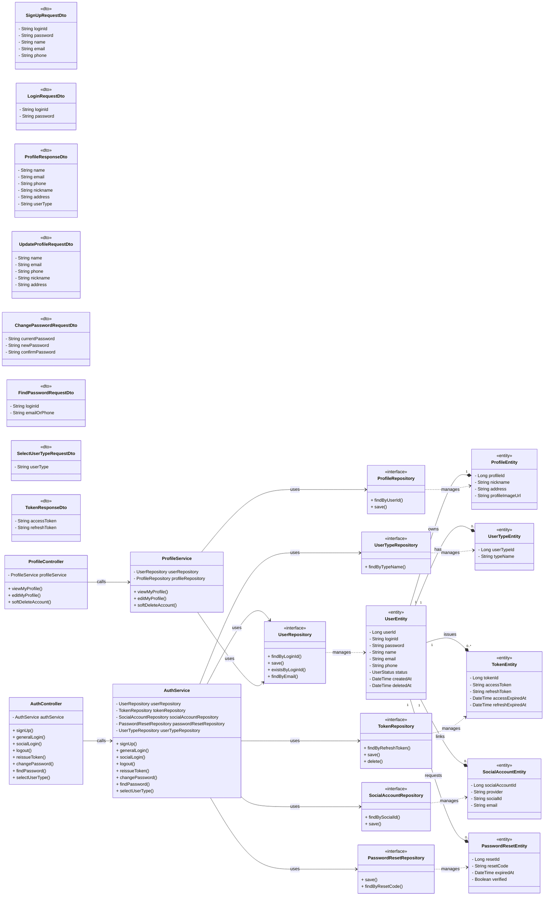
```mermaid
classDiagram
    direction LR

    %% =========================
    %% Entity Layer
    %% =========================
    class UserEntity {
        <<entity>>
        - Long userId
        - String loginId
        - String password
        - String name
        - String email
        - String phone
        - UserStatus status
        - DateTime createdAt
        - DateTime deletedAt
    }

    class ProfileEntity {
        <<entity>>
        - Long profileId
        - String nickname
        - String address
        - String profileImageUrl
    }

    class UserTypeEntity {
        <<entity>>
        - Long userTypeId
        - String typeName
    }

    class TokenEntity {
        <<entity>>
        - Long tokenId
        - String accessToken
        - String refreshToken
        - DateTime accessExpiredAt
        - DateTime refreshExpiredAt
    }

    class SocialAccountEntity {
        <<entity>>
        - Long socialAccountId
        - String provider
        - String socialId
        - String email
    }

    class PasswordResetEntity {
        <<entity>>
        - Long resetId
        - String resetCode
        - DateTime expiredAt
        - Boolean verified
    }

    %% =========================
    %% DTO Layer
    %% =========================
    class SignUpRequestDto {
        <<dto>>
        - String loginId
        - String password
        - String name
        - String email
        - String phone
    }

    class LoginRequestDto {
        <<dto>>
        - String loginId
        - String password
    }

    class ProfileResponseDto {
        <<dto>>
        - String name
        - String email
        - String phone
        - String nickname
        - String address
        - String userType
    }

    class UpdateProfileRequestDto {
        <<dto>>
        - String name
        - String email
        - String phone
        - String nickname
        - String address
    }

    class ChangePasswordRequestDto {
        <<dto>>
        - String currentPassword
        - String newPassword
        - String confirmPassword
    }

    class FindPasswordRequestDto {
        <<dto>>
        - String loginId
        - String emailOrPhone
    }

    class SelectUserTypeRequestDto {
        <<dto>>
        - String userType
    }

    class TokenResponseDto {
        <<dto>>
        - String accessToken
        - String refreshToken
    }

    %% =========================
    %% Repository Layer
    %% =========================
    class UserRepository {
        <<interface>>
        + findByLoginId()
        + save()
        + existsByLoginId()
        + findByEmail()
    }

    class ProfileRepository {
        <<interface>>
        + findByUserId()
        + save()
    }

    class TokenRepository {
        <<interface>>
        + findByRefreshToken()
        + save()
        + delete()
    }

    class SocialAccountRepository {
        <<interface>>
        + findBySocialId()
        + save()
    }

    class PasswordResetRepository {
        <<interface>>
        + save()
        + findByResetCode()
    }

    class UserTypeRepository {
        <<interface>>
        + findByTypeName()
    }

    %% =========================
    %% Service Layer
    %% =========================
    class AuthService {
        - UserRepository userRepository
        - TokenRepository tokenRepository
        - SocialAccountRepository socialAccountRepository
        - PasswordResetRepository passwordResetRepository
        - UserTypeRepository userTypeRepository
        + signUp()
        + generalLogin()
        + socialLogin()
        + logout()
        + reissueToken()
        + changePassword()
        + findPassword()
        + selectUserType()
    }

    class ProfileService {
        - UserRepository userRepository
        - ProfileRepository profileRepository
        + viewMyProfile()
        + editMyProfile()
        + softDeleteAccount()
    }

    %% =========================
    %% Controller Layer
    %% =========================
    class AuthController {
        - AuthService authService
        + signUp()
        + generalLogin()
        + socialLogin()
        + logout()
        + reissueToken()
        + changePassword()
        + findPassword()
        + selectUserType()
    }

    class ProfileController {
        - ProfileService profileService
        + viewMyProfile()
        + editMyProfile()
        + softDeleteAccount()
    }

    %% =========================
    %% Relationships
    %% =========================
    UserEntity "1" --* "1" ProfileEntity : owns
    UserEntity "1" --* "0..1" UserTypeEntity : has
    UserEntity "1" --* "0..*" TokenEntity : issues
    UserEntity "1" --* "0..1" SocialAccountEntity : links
    UserEntity "1" --* "0..*" PasswordResetEntity : requests

    UserRepository ..> UserEntity : manages
    ProfileRepository ..> ProfileEntity : manages
    TokenRepository ..> TokenEntity : manages
    SocialAccountRepository ..> SocialAccountEntity : manages
    PasswordResetRepository ..> PasswordResetEntity : manages
    UserTypeRepository ..> UserTypeEntity : manages

    AuthService --> UserRepository : uses
    AuthService --> TokenRepository : uses
    AuthService --> SocialAccountRepository : uses
    AuthService --> PasswordResetRepository : uses
    AuthService --> UserTypeRepository : uses

    ProfileService --> UserRepository : uses
    ProfileService --> ProfileRepository : uses

    AuthController --> AuthService : calls
    ProfileController --> ProfileService : calls
```

#### Entity Class

| Class Name        | UserEntity             |            |            |             |
| ----------------- | ---------------------- | ---------- | ---------- | ----------- |
| Class Description | 회원의 기본 계정 정보를 저장하는 엔티티 |            |            |             |
| 구분                | Name                   | Type       | Visibility | Description |
| ---               | ---                    | ---        | ---        | ---         |
| Attribute         | userId                 | Long       | Private    | 회원 PK       |
| Attribute         | loginId                | String     | Private    | 로그인 ID      |
| Attribute         | password               | String     | Private    | 비밀번호        |
| Attribute         | name                   | String     | Private    | 회원 이름       |
| Attribute         | email                  | String     | Private    | 이메일         |
| Attribute         | phone                  | String     | Private    | 전화번호        |
| Attribute         | status                 | UserStatus | Private    | 계정 상태       |
| Attribute         | createdAt              | DateTime   | Private    | 생성 일시       |
| Attribute         | deletedAt              | DateTime   | Private    | 삭제 일시       |

| Class Name        | ProfileEntity           |        |            |             |
| ----------------- | ----------------------- | ------ | ---------- | ----------- |
| Class Description | 회원의 프로필 상세 정보를 저장하는 엔티티 |        |            |             |
| 구분                | Name                    | Type   | Visibility | Description |
| ---               | ---                     | ---    | ---        | ---         |
| Attribute         | profileId               | Long   | Private    | 프로필 PK      |
| Attribute         | nickname                | String | Private    | 닉네임         |
| Attribute         | address                 | String | Private    | 주소          |
| Attribute         | profileImageUrl         | String | Private    | 프로필 이미지 URL |

| Class Name        | UserTypeEntity                 |        |            |             |
| ----------------- | ------------------------------ | ------ | ---------- | ----------- |
| Class Description | 사용자 유형(학부모, 학원, 관리자)을 저장하는 엔티티 |        |            |             |
| 구분                | Name                           | Type   | Visibility | Description |
| ---               | ---                            | ---    | ---        | ---         |
| Attribute         | userTypeId                     | Long   | Private    | 사용자 유형 PK   |
| Attribute         | typeName                       | String | Private    | 사용자 유형명     |

| Class Name        | TokenEntity                       |          |            |               |
| ----------------- | --------------------------------- | -------- | ---------- | ------------- |
| Class Description | JWT 액세스 토큰 및 리프레시 토큰 정보를 저장하는 엔티티 |          |            |               |
| 구분                | Name                              | Type     | Visibility | Description   |
| ---               | ---                               | ---      | ---        | ---           |
| Attribute         | tokenId                           | Long     | Private    | 토큰 PK         |
| Attribute         | accessToken                       | String   | Private    | 액세스 토큰        |
| Attribute         | refreshToken                      | String   | Private    | 리프레시 토큰       |
| Attribute         | accessExpiredAt                   | DateTime | Private    | 액세스 토큰 만료 시각  |
| Attribute         | refreshExpiredAt                  | DateTime | Private    | 리프레시 토큰 만료 시각 |

| Class Name        | SocialAccountEntity    |        |            |             |
| ----------------- | ---------------------- | ------ | ---------- | ----------- |
| Class Description | 소셜 로그인 연동 정보를 저장하는 엔티티 |        |            |             |
| 구분                | Name                   | Type   | Visibility | Description |
| ---               | ---                    | ---    | ---        | ---         |
| Attribute         | socialAccountId        | Long   | Private    | 소셜 계정 PK    |
| Attribute         | provider               | String | Private    | 소셜 로그인 제공자  |
| Attribute         | socialId               | String | Private    | 소셜 계정 식별자   |
| Attribute         | email                  | String | Private    | 소셜 계정 이메일   |

#### DTO Class
| Class Name        | SignUpRequestDto      |        |            |             |
| ----------------- | --------------------- | ------ | ---------- | ----------- |
| Class Description | 회원가입 요청 데이터를 전달하는 DTO |        |            |             |
| 구분                | Name                  | Type   | Visibility | Description |
| ---               | ---                   | ---    | ---        | ---         |
| Attribute         | loginId               | String | Private    | 로그인 ID      |
| Attribute         | password              | String | Private    | 비밀번호        |
| Attribute         | name                  | String | Private    | 회원 이름       |
| Attribute         | email                 | String | Private    | 이메일         |
| Attribute         | phone                 | String | Private    | 전화번호        |

| Class Name        | LoginRequestDto         |        |            |             |
| ----------------- | ----------------------- | ------ | ---------- | ----------- |
| Class Description | 일반 로그인 요청 데이터를 전달하는 DTO |        |            |             |
| 구분                | Name                    | Type   | Visibility | Description |
| ---               | ---                     | ---    | ---        | ---         |
| Attribute         | loginId                 | String | Private    | 로그인 ID      |
| Attribute         | password                | String | Private    | 비밀번호        |

| Class Name        | ProfileResponseDto      |        |            |             |
| ----------------- | ----------------------- | ------ | ---------- | ----------- |
| Class Description | 프로필 조회 응답 데이터를 전달하는 DTO |        |            |             |
| 구분                | Name                    | Type   | Visibility | Description |
| ---               | ---                     | ---    | ---        | ---         |
| Attribute         | name                    | String | Private    | 회원 이름       |
| Attribute         | email                   | String | Private    | 이메일         |
| Attribute         | phone                   | String | Private    | 전화번호        |
| Attribute         | nickname                | String | Private    | 닉네임         |
| Attribute         | address                 | String | Private    | 주소          |
| Attribute         | userType                | String | Private    | 사용자 유형      |

| Class Name        | UpdateProfileRequestDto |        |            |             |
| ----------------- | ----------------------- | ------ | ---------- | ----------- |
| Class Description | 프로필 수정 요청 데이터를 전달하는 DTO |        |            |             |
| 구분                | Name                    | Type   | Visibility | Description |
| ---               | ---                     | ---    | ---        | ---         |
| Attribute         | name                    | String | Private    | 회원 이름       |
| Attribute         | email                   | String | Private    | 이메일         |
| Attribute         | phone                   | String | Private    | 전화번호        |
| Attribute         | nickname                | String | Private    | 닉네임         |
| Attribute         | address                 | String | Private    | 주소          |

| Class Name        | ChangePasswordRequestDto |        |            |             |
| ----------------- | ------------------------ | ------ | ---------- | ----------- |
| Class Description | 비밀번호 변경 요청 데이터를 전달하는 DTO |        |            |             |
| 구분                | Name                     | Type   | Visibility | Description |
| ---               | ---                      | ---    | ---        | ---         |
| Attribute         | currentPassword          | String | Private    | 현재 비밀번호     |
| Attribute         | newPassword              | String | Private    | 새 비밀번호      |
| Attribute         | confirmPassword          | String | Private    | 새 비밀번호 확인   |

| Class Name        | FindPasswordRequestDto   |        |            |             |
| ----------------- | ------------------------ | ------ | ---------- | ----------- |
| Class Description | 비밀번호 찾기 요청 데이터를 전달하는 DTO |        |            |             |
| 구분                | Name                     | Type   | Visibility | Description |
| ---               | ---                      | ---    | ---        | ---         |
| Attribute         | loginId                  | String | Private    | 로그인 ID      |
| Attribute         | emailOrPhone             | String | Private    | 이메일 또는 전화번호 |

| Class Name        | SelectUserTypeRequestDto   |        |            |             |
| ----------------- | -------------------------- | ------ | ---------- | ----------- |
| Class Description | 사용자 유형 선택 요청 데이터를 전달하는 DTO |        |            |             |
| 구분                | Name                       | Type   | Visibility | Description |
| ---               | ---                        | ---    | ---        | ---         |
| Attribute         | userType                   | String | Private    | 사용자 유형      |

| Class Name        | TokenResponseDto                 |        |            |             |
| ----------------- | -------------------------------- | ------ | ---------- | ----------- |
| Class Description | 로그인 또는 재발급 후 토큰 응답 데이터를 전달하는 DTO |        |            |             |
| 구분                | Name                             | Type   | Visibility | Description |
| ---               | ---                              | ---    | ---        | ---         |
| Attribute         | accessToken                      | String | Private    | 액세스 토큰      |
| Attribute         | refreshToken                     | String | Private    | 리프레시 토큰     |

#### Repository Class
| Class Name        | UserRepository                      |            |            |                 |
| ----------------- | ----------------------------------- | ---------- | ---------- | --------------- |
| Class Description | UserEntity 저장 및 조회를 담당하는 Repository |            |            |                 |
| 구분                | Name                                | Type       | Visibility | Description     |
| ---               | ---                                 | ---        | ---        | ---             |
| Method            | findByLoginId()                     | UserEntity | Public     | 로그인 ID로 회원 조회   |
| Method            | save()                              | UserEntity | Public     | 회원 정보 저장        |
| Method            | existsByLoginId()                   | Boolean    | Public     | 로그인 ID 중복 여부 확인 |
| Method            | findByEmail()                       | UserEntity | Public     | 이메일로 회원 조회      |

| Class Name        | ProfileRepository                      |               |            |               |
| ----------------- | -------------------------------------- | ------------- | ---------- | ------------- |
| Class Description | ProfileEntity 저장 및 조회를 담당하는 Repository |               |            |               |
| 구분                | Name                                   | Type          | Visibility | Description   |
| ---               | ---                                    | ---           | ---        | ---           |
| Method            | findByUserId()                         | ProfileEntity | Public     | 회원 ID로 프로필 조회 |
| Method            | save()                                 | ProfileEntity | Public     | 프로필 정보 저장     |

| Class Name        | TokenRepository                         |             |            |                 |
| ----------------- | --------------------------------------- | ----------- | ---------- | --------------- |
| Class Description | TokenEntity 저장, 조회, 삭제를 담당하는 Repository |             |            |                 |
| 구분                | Name                                    | Type        | Visibility | Description     |
| ---               | ---                                     | ---         | ---        | ---             |
| Method            | findByRefreshToken()                    | TokenEntity | Public     | 리프레시 토큰으로 토큰 조회 |
| Method            | save()                                  | TokenEntity | Public     | 토큰 저장           |
| Method            | delete()                                | void        | Public     | 토큰 삭제           |

| Class Name        | SocialAccountRepository                      |                     |            |              |
| ----------------- | -------------------------------------------- | ------------------- | ---------- | ------------ |
| Class Description | SocialAccountEntity 저장 및 조회를 담당하는 Repository |                     |            |              |
| 구분                | Name                                         | Type                | Visibility | Description  |
| ---               | ---                                          | ---                 | ---        | ---          |
| Method            | findBySocialId()                             | SocialAccountEntity | Public     | 소셜 ID로 계정 조회 |
| Method            | save()                                       | SocialAccountEntity | Public     | 소셜 계정 정보 저장  |

| Class Name        | PasswordResetRepository                      |                     |            |                  |
| ----------------- | -------------------------------------------- | ------------------- | ---------- | ---------------- |
| Class Description | PasswordResetEntity 저장 및 조회를 담당하는 Repository |                     |            |                  |
| 구분                | Name                                         | Type                | Visibility | Description      |
| ---               | ---                                          | ---                 | ---        | ---              |
| Method            | save()                                       | PasswordResetEntity | Public     | 재설정 요청 저장        |
| Method            | findByResetCode()                            | PasswordResetEntity | Public     | 인증 코드로 재설정 정보 조회 |

| Class Name        | UserTypeRepository                 |                |            |                 |
| ----------------- | ---------------------------------- | -------------- | ---------- | --------------- |
| Class Description | UserTypeEntity 조회를 담당하는 Repository |                |            |                 |
| 구분                | Name                               | Type           | Visibility | Description     |
| ---               | ---                                | ---            | ---        | ---             |
| Method            | findByTypeName()                   | UserTypeEntity | Public     | 유형명으로 사용자 유형 조회 |

#### Service Class
| Class Name        | AuthService                                                    |                         |                 |                     |
| ----------------- | -------------------------------------------------------------- | ----------------------- | --------------- | ------------------- |
| Class Description | 회원가입, 로그인, 로그아웃, 토큰 재발급, 비밀번호 변경, 비밀번호 찾기, 사용자 유형 선택을 처리하는 서비스 |                         |                 |                     |
| 구분                | Name                                                           | Type                    | Visibility      | Description         |
| ---               | ---                                                            | ---                     | ---             | ---                 |
| Attribute         | userRepository                                                 | UserRepository          | Private / Final | 회원 정보 조회 및 저장       |
| Attribute         | tokenRepository                                                | TokenRepository         | Private / Final | 토큰 저장 및 조회          |
| Attribute         | socialAccountRepository                                        | SocialAccountRepository | Private / Final | 소셜 계정 조회 및 저장       |
| Attribute         | passwordResetRepository                                        | PasswordResetRepository | Private / Final | 비밀번호 재설정 정보 조회 및 저장 |
| Attribute         | userTypeRepository                                             | UserTypeRepository      | Private / Final | 사용자 유형 조회           |
| 구분                | Name                                                           | Type                    | Visibility      | Description         |
| ---               | ---                                                            | ---                     | ---             | ---                 |
| Method            | signUp()                                                       | UserEntity              | Public          | 회원가입 처리             |
| Method            | generalLogin()                                                 | TokenResponseDto        | Public          | 일반 로그인 처리           |
| Method            | socialLogin()                                                  | TokenResponseDto        | Public          | 소셜 로그인 처리           |
| Method            | logout()                                                       | void                    | Public          | 로그아웃 처리             |
| Method            | reissueToken()                                                 | TokenResponseDto        | Public          | 토큰 재발급 처리           |
| Method            | changePassword()                                               | void                    | Public          | 비밀번호 변경 처리          |
| Method            | findPassword()                                                 | void                    | Public          | 비밀번호 찾기 및 재설정 처리    |
| Method            | selectUserType()                                               | UserTypeEntity          | Public          | 사용자 유형 선택 처리        |

| Class Name        | ProfileService                       |                    |                 |             |
| ----------------- | ------------------------------------ | ------------------ | --------------- | ----------- |
| Class Description | 내 프로필 조회, 내 프로필 수정, 소프트 삭제를 처리하는 서비스 |                    |                 |             |
| 구분                | Name                                 | Type               | Visibility      | Description |
| ---               | ---                                  | ---                | ---             | ---         |
| Attribute         | userRepository                       | UserRepository     | Private / Final | 회원 조회       |
| Attribute         | profileRepository                    | ProfileRepository  | Private / Final | 프로필 조회 및 저장 |
| 구분                | Name                                 | Type               | Visibility      | Description |
| ---               | ---                                  | ---                | ---             | ---         |
| Method            | viewMyProfile()                      | ProfileResponseDto | Public          | 내 프로필 조회    |
| Method            | editMyProfile()                      | ProfileEntity      | Public          | 내 프로필 수정    |
| Method            | softDeleteAccount()                  | void               | Public          | 계정 소프트 삭제   |

#### Controller Class
| Class Name        | AuthController                                                           |                |                 |               |
| ----------------- | ------------------------------------------------------------------------ | -------------- | --------------- | ------------- |
| Class Description | 회원가입, 로그인, 로그아웃, 토큰 재발급, 비밀번호 변경, 비밀번호 찾기, 사용자 유형 선택 요청을 처리하는 Controller |                |                 |               |
| 구분                | Name                                                                     | Type           | Visibility      | Description   |
| ---               | ---                                                                      | ---            | ---             | ---           |
| Attribute         | authService                                                              | AuthService    | Private / Final | 인증/회원관리 서비스   |
| 구분                | Name                                                                     | Type           | Visibility      | Description   |
| ---               | ---                                                                      | ---            | ---             | ---           |
| Method            | signUp()                                                                 | ResponseEntity | Public          | 회원가입 API      |
| Method            | generalLogin()                                                           | ResponseEntity | Public          | 일반 로그인 API    |
| Method            | socialLogin()                                                            | ResponseEntity | Public          | 소셜 로그인 API    |
| Method            | logout()                                                                 | ResponseEntity | Public          | 로그아웃 API      |
| Method            | reissueToken()                                                           | ResponseEntity | Public          | 토큰 재발급 API    |
| Method            | changePassword()                                                         | ResponseEntity | Public          | 비밀번호 변경 API   |
| Method            | findPassword()                                                           | ResponseEntity | Public          | 비밀번호 찾기 API   |
| Method            | selectUserType()                                                         | ResponseEntity | Public          | 사용자 유형 선택 API |

| Class Name        | ProfileController                              |                |                 |               |
| ----------------- | ---------------------------------------------- | -------------- | --------------- | ------------- |
| Class Description | 내 프로필 조회, 내 프로필 수정, 소프트 삭제 요청을 처리하는 Controller |                |                 |               |
| 구분                | Name                                           | Type           | Visibility      | Description   |
| ---               | ---                                            | ---            | ---             | ---           |
| Attribute         | profileService                                 | ProfileService | Private / Final | 프로필 서비스       |
| 구분                | Name                                           | Type           | Visibility      | Description   |
| ---               | ---                                            | ---            | ---             | ---           |
| Method            | viewMyProfile()                                | ResponseEntity | Public          | 내 프로필 조회 API  |
| Method            | editMyProfile()                                | ResponseEntity | Public          | 내 프로필 수정 API  |
| Method            | softDeleteAccount()                            | ResponseEntity | Public          | 계정 소프트 삭제 API |

### AI

> 2026.10.06: 이 절의 클래스 표는 현재 코드(`com.i_route.backend.ai`)에 맞춰 다시 작성했다. 예전 표는 형식이 깨져 있었고, 일부 클래스명(과목명 기준 성적은 `GradeRepository`, 과목 ID 기준 성적은 `GradeEntityRepository`)과 설명(예측·로드맵·복습은 머신러닝·군집 분석이 아니라 규칙·통계 계산)이 구현과 달랐다. AI 서버(FastAPI)와 연동하는 클래스는 아래 "추가 구현" 절의 다이어그램을 함께 본다.

```mermaid
classDiagram
    direction LR

    %% ===== Entity =====
    class StudentEntity {
        <<entity>>
        - Long studentId
        - String name
        - StudyTendency learningTendency
        - Integer currentLevel
    }
    class GradeEntity {
        <<entity>>
        - Long gradeId
        - Long studentId
        - Long subjectId
        - Integer score
        - LocalDate testDate
        - Double percentile
        + void updateScore(Integer score)
    }
    class StudyLogEntity {
        <<entity>>
        - Long logId
        - Long studentId
        - Long subjectId
        - Integer durationMinutes
        - LocalDateTime startTime
        - LocalDateTime endTime
    }
    class WrongAnswerEntity {
        <<entity>>
        - Long wrongAnswerId
        - Long studentId
        - Long questionId
        - Integer failCount
        - LocalDate lastFailedDate
        + void incrementFailCount()
    }
    class TargetGoalEntity {
        <<entity>>
        - Long goalId
        - Long studentId
        - String targetKeyword
        - LocalDate targetDate
        - Integer dailyStudyHours
    }
    class Grade {
        <<entity>>
        - Long id
        - Long studentId
        - String subject
        - int score
        - double percentile
        - String examType
        - LocalDate examDate
        - String weakConceptTag
    }
    class WrongAnswer {
        <<entity>>
        - Long id
        - Long studentId
        - String subject
        - String questionId
        - String conceptTag
        - ErrorType errorType
        - int failCount
    }
    class LearningActivity {
        <<entity>>
        - Long id
        - Long studentId
        - String subject
        - LocalDate studyDate
        - LocalTime studyStartTime
        - int studyDurationMinutes
        - int understandingScore
        - int concentrationScore
        - String instructorFeedback
        + void updateFeedback(String feedback)
    }
    class AiRecommendation {
        <<entity>>
        - Long id
        - Long studentId
        - String title
        - String careerAnalysis
        - String learningGuide
        - LocalDateTime createdAt
    }
    class Question {
        <<entity>>
        - Long questionId
        - Long subjectId
        - String conceptTag
        - String content
        - Integer difficulty
    }

    %% ===== Repository =====
    class GradeEntityRepository { <<interface>> }
    class GradeRepository { <<interface>> }
    class WrongAnswerEntityRepository { <<interface>> }
    class WrongAnswerRepository { <<interface>> }
    class LearningActivityRepository { <<interface>> }
    class AiRecommendationRepository { <<interface>> }
    class QuestionRepository { <<interface>> }
    class TargetGoalRepository { <<interface>> }

    %% ===== Service =====
    class AiRecommendationService {
        <<service>>
        + List recommendMaterials(Long studentId)
        + StudyMethodDto suggestStudyMethod(Long studentId, Long subjectId)
        + StudyRoadmapDto recommendGoalRoadmap(Long studentId)
        + List recommendByPeerContent(Long studentId)
        + PeerSuccessPathDto recommendPeerSuccessPath(Long studentId, String subject)
        + List recommendDailyReview(Long studentId)
    }
    class ReportAnalysisService {
        <<service>>
        + AnalysisReportDto getAnalysisReport(Long studentId, String subject)
        + AnalysisReportDto generateScoreReport(Long studentId, Long testId)
        + StudyPatternDto analyzeStudyPattern(Long studentId)
        + MetaCognitionGapDto analyzeMetaCognitionGap(Long studentId, String subject)
        + RiskDetectionDto analyzeRisk(Long studentId)
        + StrengthAnalysisDto analyzeStrengths(Long studentId)
    }
    class ReviewGenerationService {
        <<service>>
        + ReviewPaperDto generateCustomReviewPaper(Long studentId)
    }
    class PredictionService {
        <<service>>
        + PredictedScoreDto predictNextScore(Long studentId, Long subjectId)
    }
    class StudyPlanningService {
        <<service>>
        + StudyRoadmapDto designProgressPlan(Long studentId, TargetGoalDto goalDto)
    }
    class ReviewSchedulerService {
        <<service>>
        + void sendEbbinghausReviewAlerts()
        + ReviewTodayDto getTodayReviews(Long studentId)
    }
    class GradeAnalysisService {
        <<service>>
        + List processStudentGrade(Long studentId, int score, List allScores, String weakConceptTag)
    }
    class LearningActivityService {
        <<service>>
        + LearningActivityResponse saveActivity(LearningActivityRequest request)
        + LearningActivityResponse updateFeedback(Long activityId, FeedbackRequest request)
    }

    %% ===== Controller =====
    class RecommendationController { <<controller>> }
    class AnalysisReportController { <<controller>> }
    class StudyPlanController { <<controller>> }
    class ReviewController { <<controller>> }
    class GradeAnalysisController { <<controller>> }
    class LearningActivityController { <<controller>> }

    %% ===== Relationships =====
    StudentEntity "1" --* "0..*" GradeEntity : owns
    StudentEntity "1" --* "0..*" StudyLogEntity : generates
    StudentEntity "1" --* "0..*" WrongAnswerEntity : records
    StudentEntity "1" --* "0..1" TargetGoalEntity : sets

    GradeEntityRepository ..> GradeEntity : manages
    GradeRepository ..> Grade : manages
    WrongAnswerEntityRepository ..> WrongAnswerEntity : manages
    WrongAnswerRepository ..> WrongAnswer : manages
    LearningActivityRepository ..> LearningActivity : manages
    AiRecommendationRepository ..> AiRecommendation : manages
    QuestionRepository ..> Question : manages
    TargetGoalRepository ..> TargetGoalEntity : manages

    AiRecommendationService --> GradeRepository : 같은 성적대 비교
    AiRecommendationService --> WrongAnswerEntityRepository : 복습 대상
    AiRecommendationService --> TargetGoalRepository : 로드맵
    ReportAnalysisService --> GradeRepository : 성적 분석
    ReportAnalysisService --> LearningActivityRepository : 패턴·괴리
    ReportAnalysisService --> WrongAnswerRepository : 오류 유형
    ReviewGenerationService --> WrongAnswerEntityRepository : 취약 문제
    ReviewGenerationService --> QuestionRepository : 문항 추출
    PredictionService --> GradeEntityRepository : 점수 추세
    StudyPlanningService --> TargetGoalRepository : 목표 저장
    ReviewSchedulerService --> AiRecommendationRepository : 1·3·7일 전 리포트
    GradeAnalysisService --> AiRecommendationRepository : 족보 저장
    LearningActivityService --> LearningActivityRepository : 활동 저장

    RecommendationController --> AiRecommendationService : calls
    AnalysisReportController --> ReportAnalysisService : calls
    AnalysisReportController --> PredictionService : calls
    StudyPlanController --> StudyPlanningService : calls
    StudyPlanController --> ReviewGenerationService : calls
    ReviewController --> ReviewSchedulerService : calls
    GradeAnalysisController --> GradeAnalysisService : calls
    LearningActivityController --> LearningActivityService : calls
```

#### Entity Class

**StudentEntity**

| 구분 | Name | Type | Visibility | Description |
| --- | --- | --- | --- | --- |
| Class | `StudentEntity` | | | AI 추천(자료·공부법)에 쓰는 학생의 학습 성향과 레벨을 저장하는 엔티티 |
| Attribute | `studentId` | `Long` | Private | 학생 PK |
| Attribute | `name` | `String` | Private | 학생 이름 |
| Attribute | `learningTendency` | `StudyTendency` | Private | 학습 성향(VISUAL 시각 / AUDITORY 청각 / KINESTHETIC 행동) |
| Attribute | `currentLevel` | `Integer` | Private | 현재 학습 수준(레벨) |

**GradeEntity**

| 구분 | Name | Type | Visibility | Description |
| --- | --- | --- | --- | --- |
| Class | `GradeEntity` | | | 과목 ID 기준 시험 성적 엔티티. 성장 예측·강점 분석·복습 문제지 대체 구성에 사용 |
| Attribute | `gradeId` | `Long` | Private | 성적 PK |
| Attribute | `studentId` | `Long` | Private | 학생 ID |
| Attribute | `subjectId` | `Long` | Private | 과목 ID(1 국어, 2 수학, 3 영어, 4 과학, 5 사회) |
| Attribute | `score` | `Integer` | Private | 시험 점수 |
| Attribute | `testDate` | `LocalDate` | Private | 시험 일자 |
| Attribute | `percentile` | `Double` | Private | 백분위 |
| Method | `updateScore(Integer score)` | `void` | Public | 점수 수정 |

**StudyLogEntity**

| 구분 | Name | Type | Visibility | Description |
| --- | --- | --- | --- | --- |
| Class | `StudyLogEntity` | | | 학습 시간대·지속 시간 로그 엔티티. 학습 패턴 분석과 성장 예측의 학습량 보정에 사용 |
| Attribute | `logId` | `Long` | Private | 학습 로그 PK |
| Attribute | `studentId` | `Long` | Private | 학생 ID |
| Attribute | `subjectId` | `Long` | Private | 학습 과목 ID |
| Attribute | `durationMinutes` | `Integer` | Private | 학습 지속 시간(분) |
| Attribute | `startTime` | `LocalDateTime` | Private | 세션 시작 시각 |
| Attribute | `endTime` | `LocalDateTime` | Private | 세션 종료 시각 |

**WrongAnswerEntity**

| 구분 | Name | Type | Visibility | Description |
| --- | --- | --- | --- | --- |
| Class | `WrongAnswerEntity` | | | 문제 단위 누적 오답 엔티티. 맞춤 복습 시험지와 오늘의 복습 대상 추출에 사용 |
| Attribute | `wrongAnswerId` | `Long` | Private | 오답 기록 PK |
| Attribute | `studentId` | `Long` | Private | 학생 ID |
| Attribute | `questionId` | `Long` | Private | 문제 ID |
| Attribute | `failCount` | `Integer` | Private | 누적 오답 횟수 |
| Attribute | `lastFailedDate` | `LocalDate` | Private | 마지막 오답 일자 |
| Method | `incrementFailCount()` | `void` | Public | 오답 횟수 1 증가 |

**TargetGoalEntity**

| 구분 | Name | Type | Visibility | Description |
| --- | --- | --- | --- | --- |
| Class | `TargetGoalEntity` | | | 학생이 설정한 학습 목표와 진도 설계 기준 정보 엔티티(학생당 1건, 다시 저장하면 덮어씀) |
| Attribute | `goalId` | `Long` | Private | 목표 PK |
| Attribute | `studentId` | `Long` | Private | 학생 ID |
| Attribute | `targetKeyword` | `String` | Private | 목표 키워드(예: 컴공과 합격) |
| Attribute | `targetDate` | `LocalDate` | Private | 목표 달성(시험) 일자 |
| Attribute | `dailyStudyHours` | `Integer` | Private | 하루 목표 학습 시간 |

**Grade**

| 구분 | Name | Type | Visibility | Description |
| --- | --- | --- | --- | --- |
| Class | `Grade` | | | 과목명(문자열) 기준 성적 엔티티. 성적 입력·분석 리포트·AI 리포트의 백분위와 취약 개념 태그에 사용 |
| Attribute | `id` | `Long` | Private | 성적 PK |
| Attribute | `studentId` | `Long` | Private | 학생 ID |
| Attribute | `subject` | `String` | Private | 과목명(수학·영어·국어·과학·사회) |
| Attribute | `score` | `int` | Private | 점수 |
| Attribute | `gradeLevel` | `int` | Private | 등급 |
| Attribute | `percentile` | `double` | Private | 백분위 |
| Attribute | `examType` | `String` | Private | 시험 종류(중간/기말/모의고사 등) |
| Attribute | `examDate` | `LocalDate` | Private | 시험 일자 |
| Attribute | `weakConceptTag` | `String` | Private | 그 시험의 취약 개념 태그(개념 추천의 입력) |
| Method | `updateScore(int score, int gradeLevel, double percentile)` | `void` | Public | 점수·등급·백분위 수정 |

**WrongAnswer**

| 구분 | Name | Type | Visibility | Description |
| --- | --- | --- | --- | --- |
| Class | `WrongAnswer` | | | 과목·개념 태그를 가진 오답 엔티티. 오답 API와 OCR 채점(#62)이 기록하고 AI 리포트가 취약 개념을 읽는다 |
| Attribute | `id` | `Long` | Private | 오답 PK |
| Attribute | `studentId` | `Long` | Private | 학생 ID |
| Attribute | `subject` | `String` | Private | 과목명 |
| Attribute | `questionId` | `String` | Private | 문항 ID |
| Attribute | `conceptTag` | `String` | Private | 개념 태그 |
| Attribute | `errorType` | `ErrorType` | Private | 오류 유형(CONCEPT_GAP 개념 부족 / CALCULATION_ERROR 계산 실수 / CARELESS_MISTAKE 부주의 / MEMORIZATION_GAP 암기 부족) |
| Attribute | `failCount` | `int` | Private | 같은 문항을 틀린 횟수 |
| Attribute | `createdAt` | `LocalDateTime` | Private | 기록 시각 |
| Method | `prePersist()` | `void` | Public | 저장 직전 기록 시각 설정 |

**LearningActivity**

| 구분 | Name | Type | Visibility | Description |
| --- | --- | --- | --- | --- |
| Class | `LearningActivity` | | | 학습 활동 기록 엔티티. 자기 평가(이해도·집중도), 강사 피드백, 학습 시간을 담고 라즈베리파이 집중도 기록(#63)도 같은 곳에 저장 |
| Attribute | `id` | `Long` | Private | 활동 PK |
| Attribute | `studentId` | `Long` | Private | 학생 ID |
| Attribute | `subject` | `String` | Private | 학습 과목 |
| Attribute | `studyDate` | `LocalDate` | Private | 학습 일자 |
| Attribute | `studyStartTime` | `LocalTime` | Private | 학습 시작 시각(골든타임 분석용) |
| Attribute | `studyDurationMinutes` | `int` | Private | 학습 지속 시간(분) |
| Attribute | `understandingScore` | `int` | Private | 이해도 별점(1~5) |
| Attribute | `concentrationScore` | `int` | Private | 집중도 별점(1~5) |
| Attribute | `instructorFeedback` | `String` | Private | 강사 피드백 |
| Method | `updateFeedback(String feedback)` | `void` | Public | 강사 피드백 수정 |

**AiRecommendation**

| 구분 | Name | Type | Visibility | Description |
| --- | --- | --- | --- | --- |
| Class | `AiRecommendation` | | | AI가 만든 리포트·족보 검색 결과 저장 엔티티. 오늘의 복습 항목(#26)의 기준 데이터 |
| Attribute | `id` | `Long` | Private | PK |
| Attribute | `studentId` | `Long` | Private | 학생 ID |
| Attribute | `title` | `String` | Private | 리포트 제목 |
| Attribute | `careerAnalysis` | `String` | Private | 분석 결과(또는 검색된 족보 본문) |
| Attribute | `learningGuide` | `String` | Private | 학습 가이드 |
| Attribute | `createdAt` | `LocalDateTime` | Private | 생성 시각 |

**StudyMaterial**

| 구분 | Name | Type | Visibility | Description |
| --- | --- | --- | --- | --- |
| Class | `StudyMaterial` | | | 추천 대상 교재·인강 자료 엔티티 |
| Attribute | `materialId` | `Long` | Private | 자료 PK |
| Attribute | `title` | `String` | Private | 자료 제목 |
| Attribute | `materialType` | `String` | Private | 자료 유형(교재/인강) |
| Attribute | `level` | `Integer` | Private | 권장 레벨 |
| Attribute | `subjectId` | `Long` | Private | 과목 ID |

**Question**

| 구분 | Name | Type | Visibility | Description |
| --- | --- | --- | --- | --- |
| Class | `Question` | | | 문제 은행 엔티티. 맞춤 복습 시험지의 문항 출처 |
| Attribute | `questionId` | `Long` | Private | 문제 PK |
| Attribute | `subjectId` | `Long` | Private | 과목 ID |
| Attribute | `conceptTag` | `String` | Private | 개념 태그 |
| Attribute | `content` | `String` | Private | 문제 본문 |
| Attribute | `difficulty` | `Integer` | Private | 난이도 |

**ReviewNotification**

| 구분 | Name | Type | Visibility | Description |
| --- | --- | --- | --- | --- |
| Class | `ReviewNotification` | | | 복습 알림 엔티티 |
| Attribute | `id` | `Long` | Private | 알림 PK |
| Attribute | `studentId` | `Long` | Private | 학생 ID |
| Attribute | `title` | `String` | Private | 알림 제목 |
| Attribute | `message` | `String` | Private | 알림 문구 |
| Attribute | `isRead` | `boolean` | Private | 읽음 여부 |
| Attribute | `createdAt` | `LocalDateTime` | Private | 생성 시각 |
| Method | `markAsRead()` | `void` | Public | 읽음 처리 |

**Student(AI 연동 필드)**

| 구분 | Name | Type | Visibility | Description |
| --- | --- | --- | --- | --- |
| Class | `Student(AI 연동 필드)` | | | GPS 도메인의 학생 엔티티 중 AI 리포트가 읽는 필드(나머지 필드는 GPS 절 참고) |
| Attribute | `studentId` | `Long` | Private | 학생 PK |
| Attribute | `name` | `String` | Private | 이름 |
| Attribute | `currentLevel` | `Integer` | Private | 현재 레벨 |
| Attribute | `learningTendency` | `LearningTendency` | Private | 학습 성향 |
| Attribute | `currentKoreanGrade` | `Double` | Private | 국어 백분위(과목 백분위가 없을 때 대신 쓰는 학업 수준) |
| Attribute | `studyTime` | `Double` | Private | 하루 학습 시간 |
| Attribute | `studentNote` | `String` | Private | 학생이 적은 자기 평가 메모 |
| Attribute | `recommendContext` | `String` | Private | 추천 맥락(취약 개념이 없을 때 AI 서버가 쓰는 보조 문구) |

#### DTO Class

**MaterialRecommendationDto**

| 구분 | Name | Type | Visibility | Description |
| --- | --- | --- | --- | --- |
| Class | `MaterialRecommendationDto` | | | 맞춤 학습 자료 추천 응답 DTO |
| Attribute | `materialId` | `Long` | Private | 자료 PK |
| Attribute | `title` | `String` | Private | 자료 제목 |
| Attribute | `materialType` | `String` | Private | 자료 유형(교재/인강) |
| Attribute | `matchReason` | `String` | Private | 추천 이유(학습 성향·자료 유형·레벨 기준 문구) |

**AnalysisReportDto**

| 구분 | Name | Type | Visibility | Description |
| --- | --- | --- | --- | --- |
| Class | `AnalysisReportDto` | | | 성적 분석 리포트 응답 DTO |
| Attribute | `subjectName` | `String` | Private | 분석 과목명 |
| Attribute | `myPercentile` | `double` | Private | 최근 백분위 |
| Attribute | `averageScore` | `double` | Private | 과목 평균 점수 |
| Attribute | `standardDeviation` | `double` | Private | 표준편차 |
| Attribute | `scoreChangeFromPrevious` | `double` | Private | 전회 대비 점수 변동 |
| Attribute | `trendSummary` | `String` | Private | 추세(상승/하락/유지) |
| Attribute | `weakPointSummary` | `String` | Private | 취약 개념·오류 유형 요약 |

**ReviewPaperDto**

| 구분 | Name | Type | Visibility | Description |
| --- | --- | --- | --- | --- |
| Class | `ReviewPaperDto` | | | 맞춤 복습 시험지 응답 DTO |
| Attribute | `paperId` | `Long` | Private | 시험지 식별자 |
| Attribute | `questions` | `List<String>` | Private | 문항 본문 목록(최대 10개) |
| Attribute | `weakConcepts` | `List<String>` | Private | 기반이 된 취약 개념 태그 |

**PredictedScoreDto**

| 구분 | Name | Type | Visibility | Description |
| --- | --- | --- | --- | --- |
| Class | `PredictedScoreDto` | | | 성장 예측 응답 DTO |
| Attribute | `expectedScoreMin` | `Integer` | Private | 예상 점수 최소 |
| Attribute | `expectedScoreMax` | `Integer` | Private | 예상 점수 최대 |
| Attribute | `achievementProbability` | `Double` | Private | 달성 확률(%) |

**StudyMethodDto**

| 구분 | Name | Type | Visibility | Description |
| --- | --- | --- | --- | --- |
| Class | `StudyMethodDto` | | | 과목별 공부 방식 제안 응답 DTO |
| Attribute | `studentId` | `Long` | Private | 학생 ID |
| Attribute | `subjectId` | `Long` | Private | 과목 ID |
| Attribute | `tendency` | `String` | Private | 학습 성향(미설정이면 '미설정') |
| Attribute | `studyGuide` | `String` | Private | 성향별 공부 가이드 |
| Attribute | `recommendedApproach` | `String` | Private | 권장 학습 방식 |

**TargetGoalDto**

| 구분 | Name | Type | Visibility | Description |
| --- | --- | --- | --- | --- |
| Class | `TargetGoalDto` | | | 학습 목표 입력 DTO |
| Attribute | `targetKeyword` | `String` | Private | 목표 키워드 |
| Attribute | `targetDate` | `LocalDate` | Private | 목표일 |
| Attribute | `dailyStudyHours` | `Integer` | Private | 하루 학습 시간(없으면 2) |

**StudyRoadmapDto**

| 구분 | Name | Type | Visibility | Description |
| --- | --- | --- | --- | --- |
| Class | `StudyRoadmapDto` | | | 진도 설계·목표 로드맵 응답 DTO |
| Attribute | `studentId` | `Long` | Private | 학생 ID |
| Attribute | `targetKeyword` | `String` | Private | 목표 키워드 |
| Attribute | `targetDate` | `LocalDate` | Private | 목표일 |
| Attribute | `weeklyMilestones` | `List<String>` | Private | 주차별 마일스톤(최대 8주) |
| Attribute | `overallStrategy` | `String` | Private | 전체 전략 문구 |

**StudyPatternDto**

| 구분 | Name | Type | Visibility | Description |
| --- | --- | --- | --- | --- |
| Class | `StudyPatternDto` | | | 학습 패턴 분석 응답 DTO |
| Attribute | `studentId` | `Long` | Private | 학생 ID |
| Attribute | `goldenTime` | `String` | Private | 가장 많이 공부한 시간대(예: 21시~22시) |
| Attribute | `subjectStudyMinutes` | `Map<String, Integer>` | Private | 과목별 학습 시간(분) |
| Attribute | `studyBalanceSummary` | `String` | Private | 총 학습 시간·골든타임 요약 |

**StrengthAnalysisDto**

| 구분 | Name | Type | Visibility | Description |
| --- | --- | --- | --- | --- |
| Class | `StrengthAnalysisDto` | | | 강점 분석 응답 DTO |
| Attribute | `studentId` | `Long` | Private | 학생 ID |
| Attribute | `strongSubjectIds` | `List<Long>` | Private | 평균 백분위 70 이상인 과목 ID |
| Attribute | `strengthSummary` | `String` | Private | 강점 요약 문구 |

**MetaCognitionGapDto**

| 구분 | Name | Type | Visibility | Description |
| --- | --- | --- | --- | --- |
| Class | `MetaCognitionGapDto` | | | 메타인지 괴리 분석 응답 DTO |
| Attribute | `studentId` | `Long` | Private | 학생 ID |
| Attribute | `subject` | `String` | Private | 과목 |
| Attribute | `avgUnderstandingScore` | `double` | Private | 자기 평가 이해도 평균(5점 만점) |
| Attribute | `avgActualScore` | `double` | Private | 실제 성적 평균 |
| Attribute | `scaledUnderstandingScore` | `double` | Private | 이해도를 100점으로 환산한 값 |
| Attribute | `gapScore` | `double` | Private | 자기 평가와 실제 성적의 차이 |
| Attribute | `gapLevel` | `String` | Private | HIGH(20점 이상) / MEDIUM(10점 이상) / LOW |
| Attribute | `gapSummary` | `String` | Private | 괴리 요약 |
| Attribute | `advice` | `String` | Private | 조언 |

**RiskDetectionDto**

| 구분 | Name | Type | Visibility | Description |
| --- | --- | --- | --- | --- |
| Class | `RiskDetectionDto` | | | 위험 학생 탐지 응답 DTO |
| Attribute | `studentId` | `Long` | Private | 학생 ID |
| Attribute | `atRisk` | `boolean` | Private | 위험 여부 |
| Attribute | `riskLevel` | `String` | Private | NONE / LOW / HIGH |
| Attribute | `riskSummary` | `String` | Private | 요약 문구 |
| Attribute | `subjectRisks` | `List<SubjectRisk>` | Private | 과목별 위험(과목, 연속 하락 횟수, 하락 폭, 문구) |

**PeerSuccessPathDto**

| 구분 | Name | Type | Visibility | Description |
| --- | --- | --- | --- | --- |
| Class | `PeerSuccessPathDto` | | | 같은 성적대 학생의 성공 경로 응답 DTO |
| Attribute | `subject` | `String` | Private | 과목 |
| Attribute | `similarStudentsCount` | `int` | Private | 시작 점수가 비슷하고(±15점) 10점 이상 오른 학생 수 |
| Attribute | `avgInitialScore` | `double` | Private | 그 학생들의 첫 점수 평균 |
| Attribute | `avgFinalScore` | `double` | Private | 그 학생들의 최근 점수 평균 |
| Attribute | `avgImprovement` | `double` | Private | 평균 향상 폭 |
| Attribute | `studyStrategyPattern` | `String` | Private | 학습 전략 요약 문구 |
| Attribute | `successMessage` | `String` | Private | 요약 문구 |
| Attribute | `keyInsights` | `List<String>` | Private | 핵심 시사점 |

**ReviewTodayDto**

| 구분 | Name | Type | Visibility | Description |
| --- | --- | --- | --- | --- |
| Class | `ReviewTodayDto` | | | 오늘의 복습 항목 응답 DTO |
| Attribute | `studentId` | `Long` | Private | 학생 ID |
| Attribute | `hasReview` | `boolean` | Private | 복습 항목 존재 여부 |
| Attribute | `reviews` | `List<ReviewItem>` | Private | 복습 항목(id, title, dayLabel 1·3·7일 차, originalDate, message) |

**LearningActivityRequest**

| 구분 | Name | Type | Visibility | Description |
| --- | --- | --- | --- | --- |
| Class | `LearningActivityRequest` | | | 학습 활동(자기 평가) 저장 요청 DTO |
| Attribute | `studentId` | `Long` | Private | 학생 ID |
| Attribute | `subject` | `String` | Private | 과목 |
| Attribute | `studyDate` | `LocalDate` | Private | 학습 일자 |
| Attribute | `studyStartTime` | `LocalTime` | Private | 시작 시각 |
| Attribute | `studyDurationMinutes` | `int` | Private | 학습 시간(분) |
| Attribute | `understandingScore` | `int` | Private | 이해도(1~5) |
| Attribute | `concentrationScore` | `int` | Private | 집중도(1~5) |
| Attribute | `instructorFeedback` | `String` | Private | 강사 피드백(선택) |

**FeedbackRequest**

| 구분 | Name | Type | Visibility | Description |
| --- | --- | --- | --- | --- |
| Class | `FeedbackRequest` | | | 강사 피드백 수정 요청 DTO |
| Attribute | `instructorFeedback` | `String` | Private | 피드백 본문 |

**AiReportRequest**

| 구분 | Name | Type | Visibility | Description |
| --- | --- | --- | --- | --- |
| Class | `AiReportRequest` | | | Backend → AI 서버 리포트 요청 DTO. AI 서버가 오답 API를 다시 부르지 않도록 필요한 값을 담아 보낸다 |
| Attribute | `studentId` | `Long` | Private | 학생 ID |
| Attribute | `currentKoreanGrade` | `Double` | Private | 국어 백분위 |
| Attribute | `studyTime` | `Double` | Private | 하루 학습 시간 |
| Attribute | `studentNote` | `String` | Private | 학생 자기 평가 메모 |
| Attribute | `recommendContext` | `String` | Private | 추천 맥락 |
| Attribute | `instructorFeedback` | `String` | Private | 가장 최근 강사 피드백 |
| Attribute | `weakConcept` | `String` | Private | 그 과목 최다 오답 개념 |
| Attribute | `weakSubject` | `String` | Private | 프리미엄 리포트: 오답이 가장 많은 과목 |
| Attribute | `subjectPercentile` | `Double` | Private | 그 과목 최근 시험 백분위 |

**AiReportResponse**

| 구분 | Name | Type | Visibility | Description |
| --- | --- | --- | --- | --- |
| Class | `AiReportResponse` | | | AI 서버 리포트 응답 DTO |
| Attribute | `studentId` | `Long` | Private | 학생 ID |
| Attribute | `title` | `String` | Private | 리포트 제목 |
| Attribute | `careerAnalysis` | `String` | Private | 분석 결과 |
| Attribute | `learningGuide` | `String` | Private | 학습 가이드 |

**AiQuestionDto.Request**

| 구분 | Name | Type | Visibility | Description |
| --- | --- | --- | --- | --- |
| Class | `AiQuestionDto.Request` | | | AI에게 질문하기 요청 DTO(#59) |
| Attribute | `question` | `String` | Private | 질문(2~300자) |
| Attribute | `subject` | `String` | Private | 과목(비우면 AI 서버가 질문에서 감지) |

#### Repository Class

**GradeEntityRepository**

| 구분 | Name | Type | Visibility | Description |
| --- | --- | --- | --- | --- |
| Class | `GradeEntityRepository` | | | GradeEntity(과목 ID 기준 성적) JPA Repository |
| Method | `findByStudentIdOrderByTestDateAsc(Long studentId)` | `List<GradeEntity>` | Public | 시험일 오름차순 조회 |
| Method | `findByStudentIdAndSubjectIdOrderByTestDateAsc(Long studentId, Long subjectId)` | `List<GradeEntity>` | Public | 과목별 시험일 오름차순 조회 |

**GradeRepository**

| 구분 | Name | Type | Visibility | Description |
| --- | --- | --- | --- | --- |
| Class | `GradeRepository` | | | Grade(과목명 기준 성적) JPA Repository |
| Method | `findByStudentIdOrderByExamDateDesc(Long studentId)` | `List<Grade>` | Public | 최신순 조회 |
| Method | `findByStudentIdAndSubjectOrderByExamDateDesc(Long studentId, String subject)` | `List<Grade>` | Public | 과목별 최신순 조회 |
| Method | `findDistinctSubjectsByStudentId(Long studentId)` | `List<String>` | Public | 학생이 성적을 입력한 과목 목록(위험 탐지) |
| Method | `findAllStudentAverageScores()` | `List<Object[]>` | Public | 전체 학생 평균 점수(같은 성적대 비교용) |

**WrongAnswerEntityRepository**

| 구분 | Name | Type | Visibility | Description |
| --- | --- | --- | --- | --- |
| Class | `WrongAnswerEntityRepository` | | | WrongAnswerEntity(문제 단위 누적 오답) JPA Repository |
| Method | `findByStudentIdOrderByFailCountDesc(Long studentId)` | `List<WrongAnswerEntity>` | Public | 다빈도 오답을 내림차순으로 조회 |

**WrongAnswerRepository**

| 구분 | Name | Type | Visibility | Description |
| --- | --- | --- | --- | --- |
| Class | `WrongAnswerRepository` | | | WrongAnswer(과목·개념 태그 오답) JPA Repository |
| Method | `findByStudentId(Long studentId)` | `List<WrongAnswer>` | Public | 학생의 오답 전체 |
| Method | `findByStudentIdAndQuestionId(Long studentId, String questionId)` | `Optional<WrongAnswer>` | Public | 같은 문항 오답 조회(다시 틀리면 failCount 증가) |
| Method | `findTopWeaknessByStudentIdAndSubject(Long studentId, String subject)` | `List<WrongAnswer>` | Public | 과목별 최다 오답(취약 개념) 조회 |

**TargetGoalRepository**

| 구분 | Name | Type | Visibility | Description |
| --- | --- | --- | --- | --- |
| Class | `TargetGoalRepository` | | | TargetGoalEntity(학습 목표) JPA Repository |
| Method | `findByStudentId(Long studentId)` | `Optional<TargetGoalEntity>` | Public | 학생의 학습 목표 조회 |

**LearningActivityRepository**

| 구분 | Name | Type | Visibility | Description |
| --- | --- | --- | --- | --- |
| Class | `LearningActivityRepository` | | | LearningActivity(학습 활동) JPA Repository |
| Method | `findByStudentIdOrderByStudyDateDesc(Long studentId)` | `List<LearningActivity>` | Public | 최신순 조회 |
| Method | `findByStudentIdAndSubject(Long studentId, String subject)` | `List<LearningActivity>` | Public | 과목별 조회(메타인지 괴리 분석) |
| Method | `findFirstByStudentIdAndInstructorFeedbackIsNotNullOrderByStudyDateDesc(Long studentId)` | `Optional<LearningActivity>` | Public | 가장 최근 강사 피드백 |

**AiRecommendationRepository**

| 구분 | Name | Type | Visibility | Description |
| --- | --- | --- | --- | --- |
| Class | `AiRecommendationRepository` | | | AiRecommendation(AI 리포트·족보) JPA Repository |
| Method | `findByStudentIdOrderByCreatedAtDesc(Long studentId)` | `List<AiRecommendation>` | Public | 학생의 리포트 최신순 |
| Method | `findByStudentIdAndCreatedAtBetween(Long studentId, LocalDateTime start, LocalDateTime end)` | `List<AiRecommendation>` | Public | 그날 생성된 리포트(복습 알림 대상) |

**StudyLogRepository**

| 구분 | Name | Type | Visibility | Description |
| --- | --- | --- | --- | --- |
| Class | `StudyLogRepository` | | | StudyLogEntity(학습 로그) JPA Repository |
| Method | `findByStudentId(Long studentId)` | `List<StudyLogEntity>` | Public | 학생의 학습 로그 전체 |

**StudyMaterialRepository**

| 구분 | Name | Type | Visibility | Description |
| --- | --- | --- | --- | --- |
| Class | `StudyMaterialRepository` | | | StudyMaterial(추천 자료) JPA Repository |
| Method | `findByLevelLessThanEqualOrderByLevelDesc(Integer level)` | `List<StudyMaterial>` | Public | 레벨 이하 자료를 높은 레벨 순으로 조회 |

**QuestionRepository**

| 구분 | Name | Type | Visibility | Description |
| --- | --- | --- | --- | --- |
| Class | `QuestionRepository` | | | Question(문제 은행) JPA Repository |
| Method | `findByConceptTag(String conceptTag)` | `List<Question>` | Public | 같은 개념 태그의 문제 조회 |

**ReviewNotificationRepository**

| 구분 | Name | Type | Visibility | Description |
| --- | --- | --- | --- | --- |
| Class | `ReviewNotificationRepository` | | | ReviewNotification(복습 알림) JPA Repository |
| Method | `findByStudentIdOrderByCreatedAtDesc(Long studentId)` | `List<ReviewNotification>` | Public | 학생의 알림 최신순 |
| Method | `findByStudentIdAndIsReadFalseOrderByCreatedAtDesc(Long studentId)` | `List<ReviewNotification>` | Public | 읽지 않은 알림 |

#### Service Class

**AiRecommendationService**

| 구분 | Name | Type | Visibility | Description |
| --- | --- | --- | --- | --- |
| Class | `AiRecommendationService` | | | 맞춤 학습 자료, 공부 방식, 목표 로드맵, 같은 성적대 비교, 오답 복습 대상을 규칙 기반으로 추천하는 서비스 |
| Attribute | `studentRepository` | `StudentEntityRepository` | Private / Final | 학생 성향·레벨 조회 |
| Attribute | `materialRepository` | `StudyMaterialRepository` | Private / Final | 교재/인강 조회 |
| Attribute | `wrongAnswerRepository` | `WrongAnswerEntityRepository` | Private / Final | 오답 조회 |
| Attribute | `targetGoalRepository` | `TargetGoalRepository` | Private / Final | 학습 목표 조회 |
| Attribute | `gradeRepository` | `GradeRepository` | Private / Final | 성적 조회(같은 성적대 비교) |
| Method | `recommendMaterials(Long studentId)` | `List<MaterialRecommendationDto>` | Public | 현재 레벨 이하 자료를 성향별 추천 이유와 함께 반환(#14) |
| Method | `suggestStudyMethod(Long studentId, Long subjectId)` | `StudyMethodDto` | Public | 학습 성향별 공부 가이드 반환(#19) |
| Method | `recommendGoalRoadmap(Long studentId)` | `StudyRoadmapDto` | Public | 저장된 목표의 남은 주수로 주차별 로드맵 반환(#23) |
| Method | `recommendByPeerContent(Long studentId)` | `List<MaterialRecommendationDto>` | Public | 내 평균 점수 ±10점 이내 학생 수를 근거로 그 성적대 레벨의 자료 반환(열람 기록이 아니라 레벨 기준) |
| Method | `recommendPeerSuccessPath(Long studentId, String subject)` | `PeerSuccessPathDto` | Public | 시작 점수가 비슷하고 10점 이상 오른 학생들의 평균 향상 폭과 전략 문구 반환 |
| Method | `recommendDailyReview(Long studentId)` | `List<WrongAnswerEntity>` | Public | 마지막 오답일이 1·3·7일 전인 오답 반환(#26) |

**ReportAnalysisService**

| 구분 | Name | Type | Visibility | Description |
| --- | --- | --- | --- | --- |
| Class | `ReportAnalysisService` | | | 성적 분석, 학습 패턴, 메타인지 괴리, 위험 학생, 강점을 분석하는 서비스(모두 규칙·통계 계산) |
| Attribute | `gradeRepository` | `GradeRepository` | Private / Final | 과목명 기준 성적 |
| Attribute | `gradeEntityRepository` | `GradeEntityRepository` | Private / Final | 과목 ID 기준 성적 |
| Attribute | `studyLogRepository` | `StudyLogRepository` | Private / Final | 학습 로그 |
| Attribute | `learningActivityRepository` | `LearningActivityRepository` | Private / Final | 학습 활동 |
| Attribute | `wrongAnswerRepository` | `WrongAnswerRepository` | Private / Final | 오답 |
| Method | `getAnalysisReport(Long studentId, String subject)` | `AnalysisReportDto` | Public | 과목별 성적 분석 리포트(성적이 없으면 null)(#15) |
| Method | `generateScoreReport(Long studentId, Long testId)` | `AnalysisReportDto` | Public | 특정 시험 종합 리포트(#15) |
| Method | `analyzeStudyPattern(Long studentId)` | `StudyPatternDto` | Public | 학습 로그 기반 골든타임·과목별 학습 시간(#16) |
| Method | `analyzeStudyPatternByStudentId(Long studentId)` | `StudyPatternDto` | Public | 학습 활동 기반 골든타임·과목별 학습 시간(#16) |
| Method | `analyzeMetaCognitionGap(Long studentId, String subject)` | `MetaCognitionGapDto` | Public | 자기 평가와 실제 성적의 괴리 분석(#20) |
| Method | `analyzeRisk(Long studentId)` | `RiskDetectionDto` | Public | 연속 성적 하락 위험 탐지(#22) |
| Method | `analyzeStrengths(Long studentId)` | `StrengthAnalysisDto` | Public | 평균 백분위 70 이상 과목 추출(#24) |

**ReviewGenerationService**

| 구분 | Name | Type | Visibility | Description |
| --- | --- | --- | --- | --- |
| Class | `ReviewGenerationService` | | | 누적 오답에서 취약 개념을 찾아 문제 은행으로 복습 시험지를 만드는 서비스 |
| Attribute | `wrongAnswerRepository` | `WrongAnswerEntityRepository` | Private / Final | 취약 문제 식별 |
| Attribute | `questionRepository` | `QuestionRepository` | Private / Final | 같은 개념의 문항 추출 |
| Attribute | `gradeEntityRepository` | `GradeEntityRepository` | Private / Final | 오답이 없을 때 가장 낮은 과목 판단 |
| Method | `generateCustomReviewPaper(Long studentId)` | `ReviewPaperDto` | Public | 오답 상위 5개의 개념 태그로 문항 최대 10개를 구성, 오답이 없으면 가장 낮은 과목 문제로 대체(#17) |

**PredictionService**

| 구분 | Name | Type | Visibility | Description |
| --- | --- | --- | --- | --- |
| Class | `PredictionService` | | | 과거 점수의 선형 회귀와 최근 학습량으로 다음 시험 점수를 예측하는 서비스 |
| Attribute | `gradeRepository` | `GradeEntityRepository` | Private / Final | 누적 성적 추세 |
| Attribute | `studyLogRepository` | `StudyLogRepository` | Private / Final | 최근 학습량 |
| Method | `predictNextScore(Long studentId, Long subjectId)` | `PredictedScoreDto` | Public | 30일 뒤 예상 점수 구간(±7)과 달성 확률(성적 2회 미만이면 기본값)(#22) |

**StudyPlanningService**

| 구분 | Name | Type | Visibility | Description |
| --- | --- | --- | --- | --- |
| Class | `StudyPlanningService` | | | 학습 목표를 저장하고 주차별 진도 계획을 만드는 서비스 |
| Attribute | `targetGoalRepository` | `TargetGoalRepository` | Private / Final | 목표 저장·조회 |
| Method | `designProgressPlan(Long studentId, TargetGoalDto goalDto)` | `StudyRoadmapDto` | Public | 목표 저장(덮어쓰기) 후 남은 기간을 최대 8주로 나눠 주차별 계획 반환(#18) |

**ReviewSchedulerService**

| 구분 | Name | Type | Visibility | Description |
| --- | --- | --- | --- | --- |
| Class | `ReviewSchedulerService` | | | 에빙하우스 복습 알림 스케줄러와 오늘의 복습 항목 조회 서비스 |
| Attribute | `aiRecommendationRepository` | `AiRecommendationRepository` | Private / Final | 1·3·7일 전 리포트 조회 |
| Attribute | `reviewNotificationRepository` | `ReviewNotificationRepository` | Private / Final | 복습 알림 저장 |
| Method | `sendEbbinghausReviewAlerts()` | `void` | Public | 매일 09:00에 1·3·7일 전 리포트의 복습 알림 생성(@Scheduled) |
| Method | `getTodayReviews(Long studentId)` | `ReviewTodayDto` | Public | 오늘 복습할 1·3·7일 차 항목 반환(#26) |
| Method | `triggerReviewNotificationsForStudent(Long studentId)` | `int` | Public | 특정 학생의 복습 알림을 즉시 생성 |
| Method | `deleteReview(Long reviewId)` | `void` | Public | 복습 항목 삭제(닫기) |

**GradeAnalysisService**

| 구분 | Name | Type | Visibility | Description |
| --- | --- | --- | --- | --- |
| Class | `GradeAnalysisService` | | | 성적을 분석하고 취약 개념의 교과 자료(족보)를 AI 서버에서 찾아 저장하는 서비스 |
| Attribute | `webClient` | `WebClient` | Private / Final | AI 서버 호출(fastApiWebClient) |
| Attribute | `aiRecommendationRepository` | `AiRecommendationRepository` | Private / Final | 검색 결과 저장 |
| Method | `processStudentGrade(Long studentId, int studentScore, List<Integer> allScores, String weakConceptTag)` | `List<String>` | Public | 평균·표준편차 계산 후 AI 서버 /api/ai/search로 관련 자료를 찾아 저장·반환(#64) |

**LearningActivityService**

| 구분 | Name | Type | Visibility | Description |
| --- | --- | --- | --- | --- |
| Class | `LearningActivityService` | | | 학습 활동(자기 평가·집중도·강사 피드백) 저장·조회 서비스 |
| Attribute | `learningActivityRepository` | `LearningActivityRepository` | Private / Final | 활동 저장·조회 |
| Method | `saveActivity(LearningActivityRequest request)` | `LearningActivityResponse` | Public | 학습 활동 저장(#20, #63) |
| Method | `getActivitiesByStudent(Long studentId)` | `List<LearningActivityResponse>` | Public | 학생의 활동을 최신순으로 반환 |
| Method | `updateFeedback(Long activityId, FeedbackRequest request)` | `LearningActivityResponse` | Public | 강사 피드백 저장(#21) |

**WrongAnswerService**

| 구분 | Name | Type | Visibility | Description |
| --- | --- | --- | --- | --- |
| Class | `WrongAnswerService` | | | 오답 기록과 AI 서버용 취약 개념 조회 서비스 |
| Attribute | `wrongAnswerRepository` | `WrongAnswerRepository` | Private / Final | 오답 저장·조회 |
| Method | `recordWrongAnswer(Long studentId, String subject, String questionId, String conceptTag, ErrorType errorType)` | `WrongAnswer` | Public | 오답 기록(같은 문항이면 failCount 증가)(#62) |
| Method | `getAiTargetWeakness(Long studentId, String subject)` | `List<WrongAnswer>` | Public | AI 서버가 요청하는 과목별 취약 개념 오답 |

**AiCounselingService**

| 구분 | Name | Type | Visibility | Description |
| --- | --- | --- | --- | --- |
| Class | `AiCounselingService` | | | 과목별 AI 리포트(수학·국어·프리미엄·영어·과학·사회)를 DB 정보와 함께 AI 서버에 요청하고 결과를 저장하는 서비스 |
| Attribute | `fastApiWebClient` | `WebClient` | Private / Final | AI 서버 호출 |
| Attribute | `aiRecommendationRepository` | `AiRecommendationRepository` | Private / Final | 리포트 저장 |
| Attribute | `studentRepository` | `StudentRepository` | Private / Final | 학생 정보 |
| Attribute | `learningActivityRepository` | `LearningActivityRepository` | Private / Final | 강사 피드백 |
| Attribute | `wrongAnswerRepository` | `WrongAnswerRepository` | Private / Final | 취약 개념 |
| Attribute | `gradeRepository` | `GradeRepository` | Private / Final | 백분위 |
| Method | `generateMathReport / generateWritingReport / generatePremiumReport(Long studentId)` | `Mono<AiReportResponse>` | Public | 수학·국어(진로)·프리미엄 리포트 |
| Method | `generateSubjectReport(Long studentId, String subject)` | `Mono<AiReportResponse>` | Public | 영어·과학·사회 리포트, 그 외 과목은 400(#60) |

**AiQuestionService**

| 구분 | Name | Type | Visibility | Description |
| --- | --- | --- | --- | --- |
| Class | `AiQuestionService` | | | 학생 질문을 검증하고 AI 서버 /api/ai/ask에 넘기는 서비스(최대 50초 대기) |
| Attribute | `fastApiWebClient` | `WebClient` | Private / Final | AI 서버 호출 |
| Method | `ask(String question, String subject)` | `Map<String, Object>` | Public | 입력 검증 후 답변 반환, 실패 시 400/503(#59) |

#### Controller Class

**RecommendationController**

| 구분 | Name | Type | Visibility | Description |
| --- | --- | --- | --- | --- |
| Class | `RecommendationController` | | | /api/recommendations — 자료·로드맵·복습·공부법·같은 성적대 추천 API |
| Attribute | `aiRecommendationService` | `AiRecommendationService` | Private / Final | 추천 로직 |
| Method | `getMaterialRecommendations(Long studentId)` | `ResponseEntity<List>` | Public | GET /materials 맞춤 자료 |
| Method | `getGoalRoadmap(Long studentId)` | `ResponseEntity` | Public | GET /roadmap 목표 로드맵 |
| Method | `getDailyReviewTasks(Long studentId)` | `ResponseEntity<List>` | Public | GET /daily-review 오답 복습 대상 |
| Method | `getStudyMethod(Long studentId, Long subjectId)` | `ResponseEntity` | Public | GET /study-method 공부 방식 |
| Method | `getPeerContent(Long studentId)` | `ResponseEntity<List>` | Public | GET /peer-content 같은 성적대 레벨의 자료 |
| Method | `getPeerSuccessPath(Long studentId, String subject)` | `ResponseEntity` | Public | GET /peer-path 같은 성적대 성공 경로 |

**AnalysisReportController**

| 구분 | Name | Type | Visibility | Description |
| --- | --- | --- | --- | --- |
| Class | `AnalysisReportController` | | | /api/analysis — 성적·패턴·강점·예측·메타인지·위험 분석 API |
| Attribute | `reportAnalysisService` | `ReportAnalysisService` | Private / Final | 분석 로직 |
| Attribute | `predictionService` | `PredictionService` | Private / Final | 예측 로직 |
| Method | `getLegacyScoreReport(Long studentId, String subject)` | `ResponseEntity` | Public | GET /report 과목별 성적 분석(없으면 404) |
| Method | `getScoreReport(Long studentId, Long testId)` | `ResponseEntity` | Public | GET /score-report 특정 시험 리포트 |
| Method | `getStudyPattern / getStudyPatternV2(Long studentId)` | `ResponseEntity` | Public | GET /study-pattern, /study-pattern-v2 학습 패턴 |
| Method | `getStrengthAnalysis(Long studentId)` | `ResponseEntity` | Public | GET /strengths 강점 분석 |
| Method | `predictScore(Long studentId, Long subjectId)` | `ResponseEntity` | Public | GET /predict 성장 예측 |
| Method | `getMetaCognitionGap(Long studentId, String subject)` | `ResponseEntity` | Public | GET /meta-cognition 메타인지 괴리 |
| Method | `getRiskDetection(Long studentId)` | `ResponseEntity` | Public | GET /risk 위험 학생 탐지 |

**StudyPlanController**

| 구분 | Name | Type | Visibility | Description |
| --- | --- | --- | --- | --- |
| Class | `StudyPlanController` | | | /api/study-plan — 진도 설계와 복습 시험지 API |
| Attribute | `studyPlanningService` | `StudyPlanningService` | Private / Final | 진도 설계 |
| Attribute | `reviewGenerationService` | `ReviewGenerationService` | Private / Final | 복습 시험지 |
| Method | `generateReviewPaper(Long studentId)` | `ResponseEntity` | Public | POST /review-paper 맞춤 복습 시험지 |
| Method | `designProgressPlan(Long studentId, TargetGoalDto goalDto)` | `ResponseEntity` | Public | POST /progress 진도 설계 |

**ReviewController**

| 구분 | Name | Type | Visibility | Description |
| --- | --- | --- | --- | --- |
| Class | `ReviewController` | | | /api/review — 오늘의 복습 API |
| Attribute | `reviewSchedulerService` | `ReviewSchedulerService` | Private / Final | 복습 로직 |
| Method | `getTodayReviews(Long studentId)` | `ResponseEntity` | Public | GET /today 오늘 복습할 항목 |
| Method | `deleteReview(Long reviewId)` | `ResponseEntity` | Public | DELETE /{reviewId} 복습 항목 닫기 |

**GradeAnalysisController**

| 구분 | Name | Type | Visibility | Description |
| --- | --- | --- | --- | --- |
| Class | `GradeAnalysisController` | | | /api/grades/analyze — 성적 분석과 AI 맞춤 족보 탐색 API |
| Attribute | `gradeAnalysisService` | `GradeAnalysisService` | Private / Final | 분석·검색 로직 |
| Method | `analyzeGrade(GradeInputRequest request)` | `ResponseEntity` | Public | POST /analyze 취약 개념 족보 검색(#64) |

**LearningActivityController**

| 구분 | Name | Type | Visibility | Description |
| --- | --- | --- | --- | --- |
| Class | `LearningActivityController` | | | /api/activities — 학습 활동·자기 평가·강사 피드백 API |
| Attribute | `learningActivityService` | `LearningActivityService` | Private / Final | 활동 로직 |
| Method | `saveActivity(LearningActivityRequest request)` | `ResponseEntity` | Public | POST 학습 활동 저장 |
| Method | `getActivities(Long studentId)` | `ResponseEntity<List>` | Public | GET /{studentId} 학습 활동 조회 |
| Method | `updateFeedback(Long activityId, FeedbackRequest request)` | `ResponseEntity` | Public | PATCH /{activityId}/feedback 강사 피드백 |

**WrongAnswerController**

| 구분 | Name | Type | Visibility | Description |
| --- | --- | --- | --- | --- |
| Class | `WrongAnswerController` | | | /api/wrong-answer — 오답 기록 API와 AI 서버 전용 내부 API |
| Attribute | `wrongAnswerService` | `WrongAnswerService` | Private / Final | 오답 로직 |
| Method | `recordWrong(Long studentId, String subject, String questionId, String conceptTag, ErrorType errorType)` | `ResponseEntity` | Public | POST /record 오답 기록(OCR 채점 포함) |
| Method | `getAiPipelineData(Long studentId, String subject)` | `ResponseEntity<List>` | Public | GET /ai-pipeline AI 서버 전용, X-AI-Key 필요 |

**AiReportController**

| 구분 | Name | Type | Visibility | Description |
| --- | --- | --- | --- | --- |
| Class | `AiReportController` | | | /api/ai — 개념 추천 위임과 간편 성적 예측 API |
| Attribute | `gradeRepository` | `GradeRepository` | Private / Final | 성적 조회 |
| Attribute | `fastApiWebClient` | `WebClient` | Private / Final | AI 서버 호출 |
| Method | `subjectRecommend(Long studentId, String subject)` | `ResponseEntity` | Public | POST /report/subject-recommend AI 서버에 맡기고 실패하면 규칙 기반 리포트(#61) |
| Method | `predictScore(PredictRequest request)` | `ResponseEntity` | Public | POST /predict 과거 평균 + 하루 학습 시간×2.5점으로 간편 예측(#22) |

**MathAiController**

| 구분 | Name | Type | Visibility | Description |
| --- | --- | --- | --- | --- |
| Class | `MathAiController` | | | /api/counseling — 과목별 AI 리포트 API |
| Attribute | `aiCounselingService` | `AiCounselingService` | Private / Final | 리포트 생성 |
| Method | `generateMathReport / generateWritingReport / generatePremiumReport(Long studentId)` | `AiReportResponse` | Public | POST /math, /writing, /premium |
| Method | `generateSubjectReport(String subject, Long studentId)` | `AiReportResponse` | Public | POST /{영어\|과학\|사회}(#60) |

**AiQuestionController**

| 구분 | Name | Type | Visibility | Description |
| --- | --- | --- | --- | --- |
| Class | `AiQuestionController` | | | /api/ai/ask — AI에게 질문하기 API(로그인 필요) |
| Attribute | `aiQuestionService` | `AiQuestionService` | Private / Final | 질문 처리 |
| Method | `ask(AiQuestionDto.Request request)` | `ResponseEntity<Map>` | Public | POST /api/ai/ask 질문에 답변(#59) |

#### AI 기능 흐름

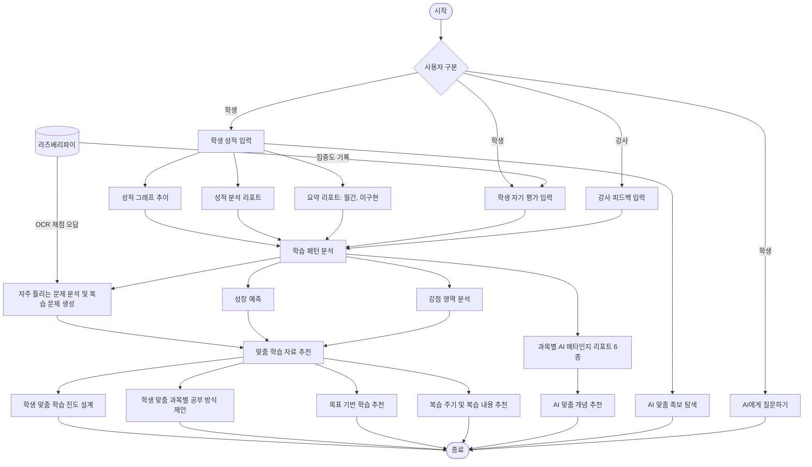
```mermaid
graph TD
    Start([시작]) --> UserType{사용자 구분}

    UserType -->|학생| StudentGrade[학생 성적 입력]
    UserType -->|학생| StudentEval[학생 자기 평가 입력]
    UserType -->|강사| TeacherFeedback[강사 피드백 입력]
    UserType -->|학생| AskAI[AI에게 질문하기]
    Pi[(라즈베리파이)] -->|OCR 채점 오답| WeaknessAnalysis
    Pi -->|집중도 기록| StudentEval

    StudentGrade --> TrendGraph[성적 그래프 추이]
    StudentGrade --> AnalysisReport[성적 분석 리포트]
    StudentGrade --> SummaryReport[요약 리포트: 월간, 미구현]
    StudentGrade --> AncestorSearch[AI 맞춤 족보 탐색]

    TrendGraph --> PatternAnalysis[학습 패턴 분석]
    AnalysisReport --> PatternAnalysis
    SummaryReport --> PatternAnalysis
    StudentEval --> PatternAnalysis
    TeacherFeedback --> PatternAnalysis

    PatternAnalysis --> WeaknessAnalysis[자주 틀리는 문제 분석 및 복습 문제 생성]
    PatternAnalysis --> GrowthPrediction[성장 예측]
    PatternAnalysis --> StrengthAnalysis[강점 영역 분석]
    PatternAnalysis --> SubjectReport[과목별 AI 메타인지 리포트 6종]

    WeaknessAnalysis --> CustomRecommendation[맞춤 학습 자료 추천]
    GrowthPrediction --> CustomRecommendation
    StrengthAnalysis --> CustomRecommendation
    SubjectReport --> ConceptRecommend[AI 맞춤 개념 추천]

    CustomRecommendation --> CustomPace[학생 맞춤 학습 진도 설계]
    CustomRecommendation --> StudyMethod[학생 맞춤 과목별 공부 방식 제안]
    CustomRecommendation --> GoalTrend[목표 기반 학습 추천]
    CustomRecommendation --> ReviewCycle[복습 주기 및 복습 내용 추천]

    CustomPace --> End([종료])
    StudyMethod --> End
    GoalTrend --> End
    ReviewCycle --> End
    ConceptRecommend --> End
    AncestorSearch --> End
    AskAI --> End
```

#### 추가 구현: Backend AI 연동 계층 (2026.10)

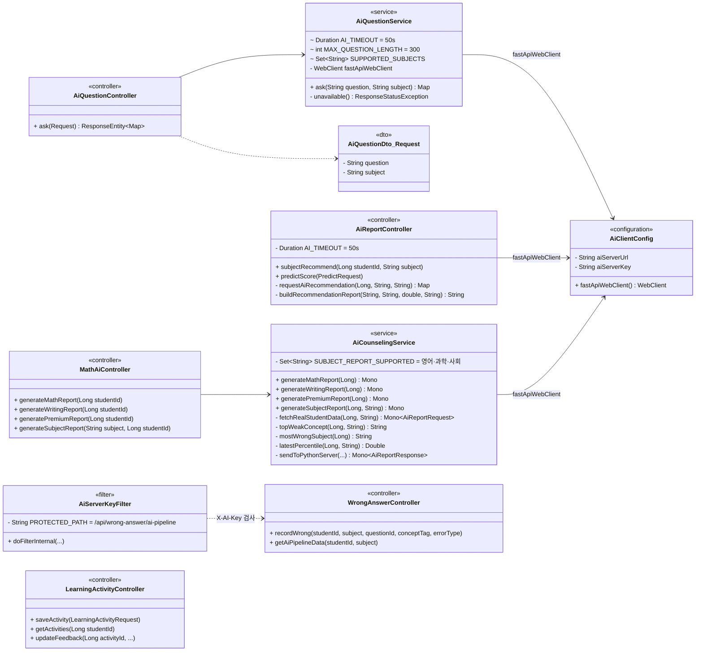
```mermaid
classDiagram
    direction LR

    class AiQuestionController {
        <<controller>>
        + ask(Request) ResponseEntity~Map~
    }
    class AiQuestionService {
        <<service>>
        ~ Duration AI_TIMEOUT = 50s
        ~ int MAX_QUESTION_LENGTH = 300
        ~ Set~String~ SUPPORTED_SUBJECTS
        - WebClient fastApiWebClient
        + ask(String question, String subject) Map
        - unavailable() ResponseStatusException
    }
    class AiQuestionDto_Request {
        <<dto>>
        - String question
        - String subject
    }

    class AiReportController {
        <<controller>>
        - Duration AI_TIMEOUT = 50s
        + subjectRecommend(Long studentId, String subject)
        + predictScore(PredictRequest)
        - requestAiRecommendation(Long, String, String) Map
        - buildRecommendationReport(String, String, double, String) String
    }

    class MathAiController {
        <<controller>>
        + generateMathReport(Long studentId)
        + generateWritingReport(Long studentId)
        + generatePremiumReport(Long studentId)
        + generateSubjectReport(String subject, Long studentId)
    }
    class AiCounselingService {
        <<service>>
        - Set~String~ SUBJECT_REPORT_SUPPORTED = 영어·과학·사회
        + generateMathReport(Long) Mono
        + generateWritingReport(Long) Mono
        + generatePremiumReport(Long) Mono
        + generateSubjectReport(Long, String) Mono
        - fetchRealStudentData(Long, String) Mono~AiReportRequest~
        - topWeakConcept(Long, String) String
        - mostWrongSubject(Long) String
        - latestPercentile(Long, String) Double
        - sendToPythonServer(...) Mono~AiReportResponse~
    }

    class AiClientConfig {
        <<configuration>>
        - String aiServerUrl
        - String aiServerKey
        + fastApiWebClient() WebClient
    }
    class AiServerKeyFilter {
        <<filter>>
        - String PROTECTED_PATH = /api/wrong-answer/ai-pipeline
        + doFilterInternal(...)
    }

    class WrongAnswerController {
        <<controller>>
        + recordWrong(studentId, subject, questionId, conceptTag, errorType)
        + getAiPipelineData(studentId, subject)
    }
    class LearningActivityController {
        <<controller>>
        + saveActivity(LearningActivityRequest)
        + getActivities(Long studentId)
        + updateFeedback(Long activityId, ...)
    }

    AiQuestionController --> AiQuestionService
    AiQuestionController ..> AiQuestionDto_Request
    MathAiController --> AiCounselingService
    AiQuestionService --> AiClientConfig : fastApiWebClient
    AiReportController --> AiClientConfig : fastApiWebClient
    AiCounselingService --> AiClientConfig : fastApiWebClient
    AiServerKeyFilter ..> WrongAnswerController : X-AI-Key 검사
```

- `fastApiWebClient`는 기본 주소(`ai.server.url`)와, 키가 정해져 있으면 `X-AI-Key` 헤더를 붙인다. 연결·응답 한도는 3분이지만 개념 추천(#61)과 질문(#59)은 호출부에서 50초로 끊는다.
- 삭제: `MathAiService`, `AiDto`(Ollama 모델 직접 호출용, 어디서도 쓰이지 않았음).

#### 추가 구현: AI 서버(FastAPI) 모듈 (2026.10)

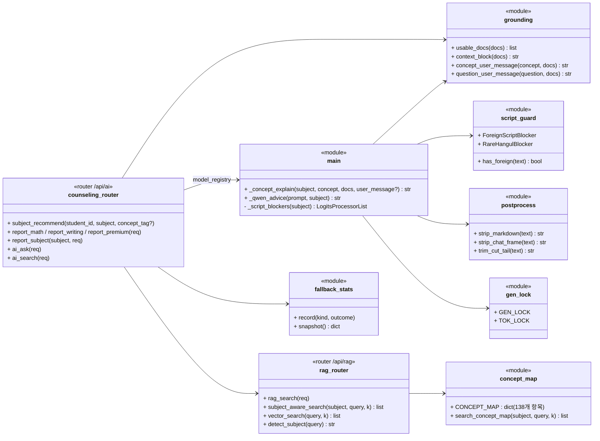
```mermaid
classDiagram
    direction LR

    class main {
        <<module>>
        + _concept_explain(subject, concept, docs, user_message?) str
        + _qwen_advice(prompt, subject) str
        - _script_blockers(subject) LogitsProcessorList
    }
    class counseling_router {
        <<router /api/ai>>
        + subject_recommend(student_id, subject, concept_tag?)
        + report_math / report_writing / report_premium(req)
        + report_subject(subject, req)
        + ai_ask(req)
        + ai_search(req)
    }
    class rag_router {
        <<router /api/rag>>
        + rag_search(req)
        + subject_aware_search(subject, query, k) list
        + vector_search(query, k) list
        + detect_subject(query) str
    }
    class concept_map {
        <<module>>
        + CONCEPT_MAP : dict (138개 항목)
        + search_concept_map(subject, query, k) list
    }
    class grounding {
        <<module>>
        + usable_docs(docs) list
        + context_block(docs) str
        + concept_user_message(concept, docs) str
        + question_user_message(question, docs) str
    }
    class script_guard {
        <<module>>
        + ForeignScriptBlocker
        + RareHangulBlocker
        + has_foreign(text) bool
    }
    class postprocess {
        <<module>>
        + strip_markdown(text) str
        + strip_chat_frame(text) str
        + trim_cut_tail(text) str
    }
    class gen_lock {
        <<module>>
        + GEN_LOCK
        + TOK_LOCK
    }
    class fallback_stats {
        <<module>>
        + record(kind, outcome)
        + snapshot() dict
    }

    counseling_router --> main : model_registry
    counseling_router --> rag_router
    counseling_router --> grounding
    counseling_router --> fallback_stats
    rag_router --> concept_map
    main --> grounding
    main --> script_guard
    main --> postprocess
    main --> gen_lock
```

### GPS

```mermaid
classDiagram
    direction LR

    %% =========================
    %% 도메인(Entity)
    %% =========================
    class ParentEntity {
        <<entity>>
        - Long parentId
        - String name
        - String phoneNumber
        - String fcmToken
        + void updateFcmToken(String fcmToken)
    }

    class StudentEntity {
        <<entity>>
        - Long studentId
        - String name
        - String cardUid
        - LocalTime scheduledDropTime
        - StudentStatus status
        + void changeStatus(StudentStatus status)
    }

    class DriverEntity {
        <<entity>>
        - Long driverId
        - String name
        - String phoneNumber
        + void updatePhoneNumber(String phoneNumber)
    }

    class VehicleEntity {
        <<entity>>
        - Long vehicleId
        - String vehicleNumber
        - String vehicleName
        - Integer capacity
        - VehicleStatus status
        + void changeStatus(VehicleStatus status)
    }

    class RouteEntity {
        <<entity>>
        - Long routeId
        - String routeName
        - boolean active
        + void changeActive(boolean active)
    }

    class StopEntity {
        <<entity>>
        - Long stopId
        - String stopName
        - Double latitude
        - Double longitude
    }

    class RouteStopEntity {
        <<entity>>
        - Long routeStopId
        - Integer stopSequence
    }

    class StudentRouteAssignmentEntity {
        <<entity>>
        - Long assignmentId
        - LocalTime scheduledDropTime
        - boolean active
        + void changeActive(boolean active)
    }

    class RideSessionEntity {
        <<entity>>
        - Long rideSessionId
        - LocalDate operationDate
        - RideSessionStatus status
        - Instant startedAt
        - Instant endedAt
        + void startSession()
        + void endSession()
    }

    class RideStatusEntity {
        <<entity>>
        - Long rideStatusId
        - Instant boardedAt
        - Instant droppedAt
        - RideState state
        + void markBoarded()
        + void markDropped()
    }

    class NfcLogEntity {
        <<entity>>
        - Long nfcLogId
        - String cardUid
        - Instant taggedAt
        - NfcEventType eventType
    }

    class GpsRecordEntity {
        <<entity>>
        - Long gpsRecordId
        - Double latitude
        - Double longitude
        - Double speed
        - Instant recordedAt
    }

    class RouteProgressEntity {
        <<entity>>
        - Long progressId
        - Integer currentSequence
        - ProgressStatus progressStatus
        - Instant updatedAt
        + void updateProgress(Integer currentSequence, ProgressStatus progressStatus)
    }

    class EtaInfoEntity {
        <<entity>>
        - Long etaId
        - Instant expectedArrivalTime
        - Integer remainingMinutes
        - Integer delayMinutes
        - boolean delayed
        + void updateEta(Instant expectedArrivalTime, Integer remainingMinutes, Integer delayMinutes, boolean delayed)
    }

    class DelayAnalysisEntity {
        <<entity>>
        - Long analysisId
        - DelayReason reason
        - Integer stopDurationSeconds
        - boolean trafficCongestion
        + void updateReason(DelayReason reason)
    }

    class NotificationEntity {
        <<entity>>
        - Long notificationId
        - NotificationType type
        - String title
        - String message
        - Instant sentAt
        - NotificationStatus status
        + void markSent()
        + void markFailed()
        + void markBlocked()
    }

    class NotificationPolicyEntity {
        <<entity>>
        - Long policyId
        - Integer cooldownMinutes
        - boolean duplicateBlockEnabled
        + boolean canSend(NotificationType type, Long studentId)
    }

    class NotificationLogEntity {
        <<entity>>
        - Long notificationLogId
        - NotificationType type
        - Long targetStudentId
        - Instant sentAt
        - boolean success
        + void record(NotificationType type, Long targetStudentId, boolean success)
    }

    %% =========================
    %% DTOs
    %% =========================
    class VehicleLocationResponseDto {
        - Long vehicleId
        - Double latitude
        - Double longitude
        - Instant recordedAt
        - String sharingStatus
    }

    class RouteInfoResponseDto {
        - Long routeId
        - String routeName
        - List~StopSummaryDto~ stops
        - String vehicleNumber
        - String vehicleName
    }

    class StopSummaryDto {
        - Long stopId
        - String stopName
        - Integer stopSequence
        - String progressStatus
    }

    class EtaResponseDto {
        - Long studentId
        - Instant expectedArrivalTime
        - Integer remainingMinutes
        - Integer delayMinutes
        - boolean delayed
        - String delayReason
    }

    class NotificationResponseDto {
        - Long notificationId
        - String type
        - String title
        - String message
        - Instant sentAt
        - String status
    }

    class DriverVehicleInfoResponseDto {
        - String driverName
        - String driverPhoneNumber
        - String vehicleNumber
        - String vehicleName
    }

    class PlannedBoardingStudentDto {
        - Long studentId
        - String studentName
        - String stopName
        - LocalTime scheduledDropTime
    }

    %% =========================
    %% Repository
    %% =========================
    class ParentRepository {
        <<interface>>
        + Optional~ParentEntity~ findById(Long parentId)
    }

    class StudentRepository {
        <<interface>>
        + Optional~StudentEntity~ findById(Long studentId)
    }

    class VehicleRepository {
        <<interface>>
        + Optional~VehicleEntity~ findById(Long vehicleId)
    }

    class RouteRepository {
        <<interface>>
        + Optional~RouteEntity~ findById(Long routeId)
    }

    class RideSessionRepository {
        <<interface>>
        + Optional~RideSessionEntity~ findActiveByVehicleId(Long vehicleId)
    }

    class RideStatusRepository {
        <<interface>>
        + Optional~RideStatusEntity~ findByRideSessionIdAndStudentId(Long rideSessionId, Long studentId)
    }

    class GpsRecordRepository {
        <<interface>>
        + Optional~GpsRecordEntity~ findTopByVehicleIdOrderByRecordedAtDesc(Long vehicleId)
    }

    class EtaInfoRepository {
        <<interface>>
        + Optional~EtaInfoEntity~ findByRideSessionIdAndStudentId(Long rideSessionId, Long studentId)
    }

    class NotificationRepository {
        <<interface>>
        + NotificationEntity save(NotificationEntity notification)
    }

    class NotificationLogRepository {
        <<interface>>
        + Optional~NotificationLogEntity~ findTopByTypeAndTargetStudentIdOrderBySentAtDesc(NotificationType type, Long studentId)
    }

    %% =========================
    %% Service 계층
    %% =========================
    class GpsTrackingService {
        - GpsRecordRepository gpsRecordRepository
        - RideStatusRepository rideStatusRepository
        + VehicleLocationResponseDto getRealtimeLocation(Long parentId, Long studentId)
        + void saveGpsRecord(Long vehicleId, Double latitude, Double longitude, Double speed)
        + boolean isLocationShareAllowed(Long studentId)
    }

    class RouteQueryService {
        - RouteRepository routeRepository
        - VehicleRepository vehicleRepository
        + RouteInfoResponseDto getRouteInfo(Long parentId, Long studentId)
        + List~StopSummaryDto~ getStopProgress(Long vehicleId)
    }

    class EtaService {
        - GpsRecordRepository gpsRecordRepository
        - EtaInfoRepository etaInfoRepository
        + EtaResponseDto calculateStudentEta(Long studentId)
        + List~EtaResponseDto~ calculateStopEta(Long vehicleId)
    }

    class DelayAnalysisService {
        - EtaInfoRepository etaInfoRepository
        + String analyzeDelayReason(Long studentId)
        + boolean isTardyRisk(Long studentId)
        + boolean isAbnormalStop(Long vehicleId)
        + boolean isRouteDeviation(Long vehicleId)
    }

    class NotificationPolicyService {
        - NotificationLogRepository notificationLogRepository
        + boolean canSend(NotificationType type, Long studentId)
    }

    class NotificationService {
        - NotificationRepository notificationRepository
        - NotificationLogRepository notificationLogRepository
        - NotificationPolicyService notificationPolicyService
        + NotificationResponseDto sendBoardingAlert(Long studentId)
        + NotificationResponseDto sendDropoffAlert(Long studentId)
        + NotificationResponseDto sendTardinessAlert(Long studentId)
        + NotificationResponseDto sendAbnormalStopAlert(Long vehicleId)
        + NotificationResponseDto sendRouteDeviationAlert(Long vehicleId)
    }

    class RideService {
        - RideStatusRepository rideStatusRepository
        - RideSessionRepository rideSessionRepository
        + void processBoarding(Long studentId, String cardUid)
        + void processDropoff(Long studentId, String cardUid)
        + List~PlannedBoardingStudentDto~ getPlannedBoardingStudents(Long vehicleId)
    }

    %% =========================
    %% Controller 계층
    %% =========================
    class GpsController {
        - GpsTrackingService gpsTrackingService
        - RouteQueryService routeQueryService
        - EtaService etaService
        + ResponseEntity~VehicleLocationResponseDto~ getRealtimeLocation(Long studentId)
        + ResponseEntity~RouteInfoResponseDto~ getRouteInfo(Long studentId)
        + ResponseEntity~List~StopSummaryDto~~ getStopProgress(Long studentId)
        + ResponseEntity~EtaResponseDto~ getStudentEta(Long studentId)
        + ResponseEntity~List~EtaResponseDto~~ getStopEta(Long studentId)
    }

    class NotificationController {
        - NotificationService notificationService
        + ResponseEntity~NotificationResponseDto~ sendBoardingAlert(Long studentId)
        + ResponseEntity~NotificationResponseDto~ sendDropoffAlert(Long studentId)
        + ResponseEntity~NotificationResponseDto~ sendTardinessAlert(Long studentId)
    }

    class RideController {
        - RideService rideService
        + ResponseEntity~Void~ tagBoarding(Long studentId, String cardUid)
        + ResponseEntity~Void~ tagDropoff(Long studentId, String cardUid)
        + ResponseEntity~List~PlannedBoardingStudentDto~~ getPlannedStudents(Long vehicleId)
    }

    %% =========================
    %% 관계
    %% =========================
    ParentRepository --> ParentEntity : manages
    StudentRepository --> StudentEntity : manages
    VehicleRepository --> VehicleEntity : manages
    RouteRepository --> RouteEntity : manages
    RideSessionRepository --> RideSessionEntity : manages
    RideStatusRepository --> RideStatusEntity : manages
    GpsRecordRepository --> GpsRecordEntity : manages
    EtaInfoRepository --> EtaInfoEntity : manages
    NotificationRepository --> NotificationEntity : manages
    NotificationLogRepository --> NotificationLogEntity : manages

    ParentEntity "1" --> "1..*" StudentEntity : protects
    DriverEntity "1" --> "1" VehicleEntity : drives
    VehicleEntity "1" --> "1" RouteEntity : assignedTo
    RouteEntity "1" --> "1..*" RouteStopEntity : contains
    RouteStopEntity "*" --> "1" StopEntity : refersTo
    StudentEntity "1" --> "1" StudentRouteAssignmentEntity : has
    StudentRouteAssignmentEntity "*" --> "1" RouteEntity : belongsTo
    StudentRouteAssignmentEntity "*" --> "1" StopEntity : dropStop

    VehicleEntity "1" --> "0..*" RideSessionEntity : operates
    RideSessionEntity "1" --> "0..*" RideStatusEntity : tracks
    StudentEntity "1" --> "0..*" RideStatusEntity : has
    StudentEntity "1" --> "0..*" NfcLogEntity : taggedBy
    VehicleEntity "1" --> "0..*" GpsRecordEntity : generates
    RideSessionEntity "1" --> "1" RouteProgressEntity : has
    StudentEntity "1" --> "0..*" EtaInfoEntity : has
    EtaInfoEntity "1" --> "0..1" DelayAnalysisEntity : analyzedBy
    NotificationEntity "1" --> "0..1" NotificationLogEntity : recordedAs

    GpsTrackingService --> GpsRecordRepository : uses
    GpsTrackingService --> RideStatusRepository : uses
    GpsTrackingService --> VehicleLocationResponseDto : returns

    RouteQueryService --> RouteRepository : uses
    RouteQueryService --> VehicleRepository : uses
    RouteQueryService --> RouteInfoResponseDto : returns
    RouteQueryService --> StopSummaryDto : returns

    EtaService --> GpsRecordRepository : uses
    EtaService --> EtaInfoRepository : uses
    EtaService --> EtaResponseDto : returns

    DelayAnalysisService --> EtaInfoRepository : uses

    NotificationPolicyService --> NotificationLogRepository : uses
    NotificationService --> NotificationRepository : uses
    NotificationService --> NotificationLogRepository : uses
    NotificationService --> NotificationPolicyService : uses
    NotificationService --> NotificationResponseDto : returns

    RideService --> RideStatusRepository : uses
    RideService --> RideSessionRepository : uses
    RideService --> PlannedBoardingStudentDto : returns

    GpsController --> GpsTrackingService : uses
    GpsController --> RouteQueryService : uses
    GpsController --> EtaService : uses
    NotificationController --> NotificationService : uses
    RideController --> RideService : uses

```

#### Entity Class

| Class Name        | ParentEntity                          |             |                 |                  |
| ----------------- | ------------------------------------- | ----------- | --------------- | ---------------- |
| Class Description | 학생 보호자 정보를 저장하고 푸시 알림 수신 정보를 관리하는 엔티티 |             |                 |                  |
| 구분                | Name                                  | Type        | Visibility      | Description      |
| ---               | ---                                   | ---         | ---             | ---              |
| Attribute         | parentId                              | Long        | Private         | 보호자 PK           |
| Attribute         | name                                  | String      | Private         | 보호자 이름           |
| Attribute         | phoneNumber                           | String      | Private         | 보호자 연락처          |
| Attribute         | fcmToken                              | String      | Private         | 푸시 알림 수신용 FCM 토큰 |
| 구분                | Name                                  | Return Type | Description     |                  |
| ---               | ---                                   | ---         | ---             |                  |
| Method            | updateFcmToken(String fcmToken)       | void        | 보호자의 FCM 토큰을 갱신 |                  |

| Class Name        | StudentEntity                        |               |             |              |
| ----------------- | ------------------------------------ | ------------- | ----------- | ------------ |
| Class Description | 통학 차량 추적 및 알림 대상이 되는 학생 정보를 저장하는 엔티티 |               |             |              |
| 구분                | Name                                 | Type          | Visibility  | Description  |
| ---               | ---                                  | ---           | ---         | ---          |
| Attribute         | studentId                            | Long          | Private     | 학생 PK        |
| Attribute         | name                                 | String        | Private     | 학생 이름        |
| Attribute         | cardUid                              | String        | Private     | NFC 카드 UID   |
| Attribute         | scheduledDropTime                    | LocalTime     | Private     | 학생별 하원 예정 시각 |
| Attribute         | status                               | StudentStatus | Private     | 학생 상태값       |
| 구분                | Name                                 | Return Type   | Description |              |
| ---               | ---                                  | ---           | ---         |              |
| Method            | changeStatus(StudentStatus status)   | void          | 학생 상태 변경    |              |

| Class Name        | DriverEntity                          |             |             |             |
| ----------------- | ------------------------------------- | ----------- | ----------- | ----------- |
| Class Description | 차량 운행을 담당하는 기사 정보를 저장하는 엔티티           |             |             |             |
| 구분                | Name                                  | Type        | Visibility  | Description |
| ---               | ---                                   | ---         | ---         | ---         |
| Attribute         | driverId                              | Long        | Private     | 기사 PK       |
| Attribute         | name                                  | String      | Private     | 기사 이름       |
| Attribute         | phoneNumber                           | String      | Private     | 기사 연락처      |
| 구분                | Name                                  | Return Type | Description |             |
| ---               | ---                                   | ---         | ---         |             |
| Method            | updatePhoneNumber(String phoneNumber) | void        | 기사 연락처 수정   |             |

| Class Name        | VehicleEntity                      |               |             |             |
| ----------------- | ---------------------------------- | ------------- | ----------- | ----------- |
| Class Description | 통학 차량의 식별 정보 및 운행 상태를 저장하는 엔티티     |               |             |             |
| 구분                | Name                               | Type          | Visibility  | Description |
| ---               | ---                                | ---           | ---         | ---         |
| Attribute         | vehicleId                          | Long          | Private     | 차량 PK       |
| Attribute         | vehicleNumber                      | String        | Private     | 차량 번호       |
| Attribute         | vehicleName                        | String        | Private     | 차량명 또는 호차   |
| Attribute         | capacity                           | Integer       | Private     | 차량 정원       |
| Attribute         | status                             | VehicleStatus | Private     | 차량 운행 상태    |
| 구분                | Name                               | Return Type   | Description |             |
| ---               | ---                                | ---           | ---         |             |
| Method            | changeStatus(VehicleStatus status) | void          | 차량 상태 변경    |             |

| Class Name        | RouteEntity                  |             |             |             |
| ----------------- | ---------------------------- | ----------- | ----------- | ----------- |
| Class Description | 차량의 고정 노선 정보를 저장하는 엔티티       |             |             |             |
| 구분                | Name                         | Type        | Visibility  | Description |
| ---               | ---                          | ---         | ---         | ---         |
| Attribute         | routeId                      | Long        | Private     | 노선 PK       |
| Attribute         | routeName                    | String      | Private     | 노선 이름       |
| Attribute         | active                       | boolean     | Private     | 노선 활성화 여부   |
| 구분                | Name                         | Return Type | Description |             |
| ---               | ---                          | ---         | ---         |             |
| Method            | changeActive(boolean active) | void        | 노선 활성 상태 변경 |             |

| Class Name        | StopEntity                   |        |            |             |
| ----------------- | ---------------------------- | ------ | ---------- | ----------- |
| Class Description | 노선에 포함되는 개별 정류장 정보를 저장하는 엔티티 |        |            |             |
| 구분                | Name                         | Type   | Visibility | Description |
| ---               | ---                          | ---    | ---        | ---         |
| Attribute         | stopId                       | Long   | Private    | 정류장 PK      |
| Attribute         | stopName                     | String | Private    | 정류장 이름      |
| Attribute         | latitude                     | Double | Private    | 정류장 위도      |
| Attribute         | longitude                    | Double | Private    | 정류장 경도      |

| Class Name        | RouteStopEntity          |         |            |              |
| ----------------- | ------------------------ | ------- | ---------- | ------------ |
| Class Description | 노선 내 정류장 순서를 관리하는 매핑 엔티티 |         |            |              |
| 구분                | Name                     | Type    | Visibility | Description  |
| ---               | ---                      | ---     | ---        | ---          |
| Attribute         | routeStopId              | Long    | Private    | 노선-정류장 매핑 PK |
| Attribute         | stopSequence             | Integer | Private    | 노선 내 정류장 순서  |

| Class Name        | StudentRouteAssignmentEntity       |             |                |              |
| ----------------- | ---------------------------------- | ----------- | -------------- | ------------ |
| Class Description | 학생과 노선, 하차 정류장, 예정 시각을 연결하는 매핑 엔티티 |             |                |              |
| 구분                | Name                               | Type        | Visibility     | Description  |
| ---               | ---                                | ---         | ---            | ---          |
| Attribute         | assignmentId                       | Long        | Private        | 학생-노선 배정 PK  |
| Attribute         | scheduledDropTime                  | LocalTime   | Private        | 학생별 하차 예정 시각 |
| Attribute         | active                             | boolean     | Private        | 배정 활성화 여부    |
| 구분                | Name                               | Return Type | Description    |              |
| ---               | ---                                | ---         | ---            |              |
| Method            | changeActive(boolean active)       | void        | 학생 배정 활성 상태 변경 |              |

| Class Name        | RideSessionEntity         |                   |             |             |
| ----------------- | ------------------------- | ----------------- | ----------- | ----------- |
| Class Description | 날짜별 차량 운행 세션 정보를 저장하는 엔티티 |                   |             |             |
| 구분                | Name                      | Type              | Visibility  | Description |
| ---               | ---                       | ---               | ---         | ---         |
| Attribute         | rideSessionId             | Long              | Private     | 운행 세션 PK    |
| Attribute         | operationDate             | LocalDate         | Private     | 운행 일자       |
| Attribute         | status                    | RideSessionStatus | Private     | 운행 상태       |
| Attribute         | startedAt                 | Instant           | Private     | 운행 시작 시각    |
| Attribute         | endedAt                   | Instant           | Private     | 운행 종료 시각    |
| 구분                | Name                      | Return Type       | Description |             |
| ---               | ---                       | ---               | ---         |             |
| Method            | startSession()            | void              | 운행 시작 처리    |             |
| Method            | endSession()              | void              | 운행 종료 처리    |             |

| Class Name        | RideStatusEntity               |             |             |             |
| ----------------- | ------------------------------ | ----------- | ----------- | ----------- |
| Class Description | 운행 세션 내 학생별 탑승/하차 상태를 관리하는 엔티티 |             |             |             |
| 구분                | Name                           | Type        | Visibility  | Description |
| ---               | ---                            | ---         | ---         | ---         |
| Attribute         | rideStatusId                   | Long        | Private     | 운행 상태 PK    |
| Attribute         | boardedAt                      | Instant     | Private     | 탑승 시각       |
| Attribute         | droppedAt                      | Instant     | Private     | 하차 시각       |
| Attribute         | state                          | RideState   | Private     | 학생 탑승 상태    |
| 구분                | Name                           | Return Type | Description |             |
| ---               | ---                            | ---         | ---         |             |
| Method            | markBoarded()                  | void        | 탑승 상태로 변경   |             |
| Method            | markDropped()                  | void        | 하차 상태로 변경   |             |

| Class Name        | NfcLogEntity               |              |            |              |
| ----------------- | -------------------------- | ------------ | ---------- | ------------ |
| Class Description | 학생의 NFC 태그 이력을 저장하는 로그 엔티티 |              |            |              |
| 구분                | Name                       | Type         | Visibility | Description  |
| ---               | ---                        | ---          | ---        | ---          |
| Attribute         | nfcLogId                   | Long         | Private    | NFC 로그 PK    |
| Attribute         | cardUid                    | String       | Private    | 태깅된 카드 UID   |
| Attribute         | taggedAt                   | Instant      | Private    | 태깅 시각        |
| Attribute         | eventType                  | NfcEventType | Private    | 탑승/하차 이벤트 구분 |

| Class Name        | GpsRecordEntity                         |         |            |             |
| ----------------- | --------------------------------------- | ------- | ---------- | ----------- |
| Class Description | 기사 앱에서 주기적으로 전송한 차량 GPS 위치 기록을 저장하는 엔티티 |         |            |             |
| 구분                | Name                                    | Type    | Visibility | Description |
| ---               | ---                                     | ---     | ---        | ---         |
| Attribute         | gpsRecordId                             | Long    | Private    | GPS 기록 PK   |
| Attribute         | latitude                                | Double  | Private    | 차량 위도       |
| Attribute         | longitude                               | Double  | Private    | 차량 경도       |
| Attribute         | speed                                   | Double  | Private    | 차량 속도       |
| Attribute         | recordedAt                              | Instant | Private    | 위치 기록 시각    |

| Class Name        | RouteProgressEntity                                                    |                |              |              |
| ----------------- | ---------------------------------------------------------------------- | -------------- | ------------ | ------------ |
| Class Description | 현재 차량이 노선의 어느 정류장 구간을 통과 중인지 저장하는 엔티티                                  |                |              |              |
| 구분                | Name                                                                   | Type           | Visibility   | Description  |
| ---               | ---                                                                    | ---            | ---          | ---          |
| Attribute         | progressId                                                             | Long           | Private      | 진행 상태 PK     |
| Attribute         | currentSequence                                                        | Integer        | Private      | 현재 기준 정류장 순서 |
| Attribute         | progressStatus                                                         | ProgressStatus | Private      | 진행 상태        |
| Attribute         | updatedAt                                                              | Instant        | Private      | 마지막 갱신 시각    |
| 구분                | Name                                                                   | Return Type    | Description  |              |
| ---               | ---                                                                    | ---            | ---          |              |
| Method            | updateProgress(Integer currentSequence, ProgressStatus progressStatus) | void           | 정류장 진행 상태 갱신 |              |

| Class Name        | EtaInfoEntity                                                                                           |             |             |             |
| ----------------- | ------------------------------------------------------------------------------------------------------- | ----------- | ----------- | ----------- |
| Class Description | 학생별 또는 정류장별 예상 도착 시간 정보를 저장하는 엔티티                                                                       |             |             |             |
| 구분                | Name                                                                                                    | Type        | Visibility  | Description |
| ---               | ---                                                                                                     | ---         | ---         | ---         |
| Attribute         | etaId                                                                                                   | Long        | Private     | ETA 정보 PK   |
| Attribute         | expectedArrivalTime                                                                                     | Instant     | Private     | 예상 도착 시각    |
| Attribute         | remainingMinutes                                                                                        | Integer     | Private     | 남은 예상 시간(분) |
| Attribute         | delayMinutes                                                                                            | Integer     | Private     | 지연 예상 시간(분) |
| Attribute         | delayed                                                                                                 | boolean     | Private     | 지연 여부       |
| 구분                | Name                                                                                                    | Return Type | Description |             |
| ---               | ---                                                                                                     | ---         | ---         |             |
| Method            | updateEta(Instant expectedArrivalTime, Integer remainingMinutes, Integer delayMinutes, boolean delayed) | void        | ETA 정보 갱신   |             |

| Class Name        | DelayAnalysisEntity              |             |             |              |
| ----------------- | -------------------------------- | ----------- | ----------- | ------------ |
| Class Description | 지연 원인 분석 결과를 저장하는 엔티티            |             |             |              |
| 구분                | Name                             | Type        | Visibility  | Description  |
| ---               | ---                              | ---         | ---         | ---          |
| Attribute         | analysisId                       | Long        | Private     | 지연 분석 PK     |
| Attribute         | reason                           | DelayReason | Private     | 지연 원인 분류     |
| Attribute         | stopDurationSeconds              | Integer     | Private     | 장시간 정차 시간(초) |
| Attribute         | trafficCongestion                | boolean     | Private     | 교통 혼잡 여부     |
| 구분                | Name                             | Return Type | Description |              |
| ---               | ---                              | ---         | ---         |              |
| Method            | updateReason(DelayReason reason) | void        | 지연 원인 갱신    |              |

| Class Name        | NotificationEntity            |                    |                 |             |
| ----------------- | ----------------------------- | ------------------ | --------------- | ----------- |
| Class Description | 학부모에게 발송되는 푸시 알림 정보를 저장하는 엔티티 |                    |                 |             |
| 구분                | Name                          | Type               | Visibility      | Description |
| ---               | ---                           | ---                | ---             | ---         |
| Attribute         | notificationId                | Long               | Private         | 알림 PK       |
| Attribute         | type                          | NotificationType   | Private         | 알림 유형       |
| Attribute         | title                         | String             | Private         | 알림 제목       |
| Attribute         | message                       | String             | Private         | 알림 본문       |
| Attribute         | sentAt                        | Instant            | Private         | 발송 시각       |
| Attribute         | status                        | NotificationStatus | Private         | 발송 상태       |
| 구분                | Name                          | Return Type        | Description     |             |
| ---               | ---                           | ---                | ---             |             |
| Method            | markSent()                    | void               | 알림 발송 성공 처리     |             |
| Method            | markFailed()                  | void               | 알림 발송 실패 처리     |             |
| Method            | markBlocked()                 | void               | 중복 정책에 의해 차단 처리 |             |

| Class Name        | NotificationPolicyEntity                       |             |                            |                    |
| ----------------- | ---------------------------------------------- | ----------- | -------------------------- | ------------------ |
| Class Description | 알림 중복 방지 및 쿨다운 정책을 관리하는 엔티티                    |             |                            |                    |
| 구분                | Name                                           | Type        | Visibility                 | Description        |
| ---               | ---                                            | ---         | ---                        | ---                |
| Attribute         | policyId                                       | Long        | Private                    | 정책 PK              |
| Attribute         | cooldownMinutes                                | Integer     | Private                    | 동일 알림 재전송 제한 시간(분) |
| Attribute         | duplicateBlockEnabled                          | boolean     | Private                    | 중복 차단 기능 사용 여부     |
| 구분                | Name                                           | Return Type | Description                |                    |
| ---               | ---                                            | ---         | ---                        |                    |
| Method            | canSend(NotificationType type, Long studentId) | boolean     | 동일 학생/동일 유형 알림 발송 가능 여부 판단 |                    |

| Class Name        | NotificationLogEntity                                                |                  |             |             |
| ----------------- | -------------------------------------------------------------------- | ---------------- | ----------- | ----------- |
| Class Description | 알림 발송 이력을 저장하여 중복 방지 정책에 활용하는 로그 엔티티                                 |                  |             |             |
| 구분                | Name                                                                 | Type             | Visibility  | Description |
| ---               | ---                                                                  | ---              | ---         | ---         |
| Attribute         | notificationLogId                                                    | Long             | Private     | 알림 로그 PK    |
| Attribute         | type                                                                 | NotificationType | Private     | 발송 알림 유형    |
| Attribute         | targetStudentId                                                      | Long             | Private     | 알림 대상 학생 ID |
| Attribute         | sentAt                                                               | Instant          | Private     | 발송 시각       |
| Attribute         | success                                                              | boolean          | Private     | 발송 성공 여부    |
| 구분                | Name                                                                 | Return Type      | Description |             |
| ---               | ---                                                                  | ---              | ---         |             |
| Method            | record(NotificationType type, Long targetStudentId, boolean success) | void             | 알림 발송 이력 기록 |             |

#### DTO Class

| Class Name        | VehicleLocationResponseDto  |         |            |             |
| ----------------- | --------------------------- | ------- | ---------- | ----------- |
| Class Description | 학부모에게 현재 차량 위치를 반환하는 응답 DTO |         |            |             |
| 구분                | Name                        | Type    | Visibility | Description |
| ---               | ---                         | ---     | ---        | ---         |
| Attribute         | vehicleId                   | Long    | Private    | 차량 PK       |
| Attribute         | latitude                    | Double  | Private    | 차량 위도       |
| Attribute         | longitude                   | Double  | Private    | 차량 경도       |
| Attribute         | recordedAt                  | Instant | Private    | 위치 수신 시각    |
| Attribute         | sharingStatus               | String  | Private    | 위치 공유 가능 상태 |

| Class Name        | RouteInfoResponseDto            |                      |            |             |
| ----------------- | ------------------------------- | -------------------- | ---------- | ----------- |
| Class Description | 차량의 노선 및 정류장 목록 정보를 반환하는 응답 DTO |                      |            |             |
| 구분                | Name                            | Type                 | Visibility | Description |
| ---               | ---                             | ---                  | ---        | ---         |
| Attribute         | routeId                         | Long                 | Private    | 노선 PK       |
| Attribute         | routeName                       | String               | Private    | 노선명         |
| Attribute         | stops                           | List<StopSummaryDto> | Private    | 정류장 요약 목록   |
| Attribute         | vehicleNumber                   | String               | Private    | 차량 번호       |
| Attribute         | vehicleName                     | String               | Private    | 차량명         |

| Class Name        | StopSummaryDto       |         |            |             |
| ----------------- | -------------------- | ------- | ---------- | ----------- |
| Class Description | 정류장 진행 상태 표시용 요약 DTO |         |            |             |
| 구분                | Name                 | Type    | Visibility | Description |
| ---               | ---                  | ---     | ---        | ---         |
| Attribute         | stopId               | Long    | Private    | 정류장 PK      |
| Attribute         | stopName             | String  | Private    | 정류장명        |
| Attribute         | stopSequence         | Integer | Private    | 정류장 순서      |
| Attribute         | progressStatus       | String  | Private    | 정류장 진행 상태   |

| Class Name        | EtaResponseDto                  |         |            |             |
| ----------------- | ------------------------------- | ------- | ---------- | ----------- |
| Class Description | 학생별 또는 정류장별 ETA 정보를 반환하는 응답 DTO |         |            |             |
| 구분                | Name                            | Type    | Visibility | Description |
| ---               | ---                             | ---     | ---        | ---         |
| Attribute         | studentId                       | Long    | Private    | 학생 PK       |
| Attribute         | expectedArrivalTime             | Instant | Private    | 예상 도착 시각    |
| Attribute         | remainingMinutes                | Integer | Private    | 남은 예상 시간    |
| Attribute         | delayMinutes                    | Integer | Private    | 지연 예상 시간    |
| Attribute         | delayed                         | boolean | Private    | 지연 여부       |
| Attribute         | delayReason                     | String  | Private    | 지연 원인 표시 문구 |

| Class Name        | NotificationResponseDto |         |            |             |
| ----------------- | ----------------------- | ------- | ---------- | ----------- |
| Class Description | 알림 발송 결과를 반환하는 응답 DTO   |         |            |             |
| 구분                | Name                    | Type    | Visibility | Description |
| ---               | ---                     | ---     | ---        | ---         |
| Attribute         | notificationId          | Long    | Private    | 알림 PK       |
| Attribute         | type                    | String  | Private    | 알림 유형       |
| Attribute         | title                   | String  | Private    | 알림 제목       |
| Attribute         | message                 | String  | Private    | 알림 본문       |
| Attribute         | sentAt                  | Instant | Private    | 알림 발송 시각    |
| Attribute         | status                  | String  | Private    | 알림 처리 결과    |

| Class Name        | DriverVehicleInfoResponseDto  |        |            |             |
| ----------------- | ----------------------------- | ------ | ---------- | ----------- |
| Class Description | 학부모에게 차량 및 기사 정보를 반환하는 응답 DTO |        |            |             |
| 구분                | Name                          | Type   | Visibility | Description |
| ---               | ---                           | ---    | ---        | ---         |
| Attribute         | driverName                    | String | Private    | 기사 이름       |
| Attribute         | driverPhoneNumber             | String | Private    | 기사 연락처      |
| Attribute         | vehicleNumber                 | String | Private    | 차량 번호       |
| Attribute         | vehicleName                   | String | Private    | 차량명         |

| Class Name        | PlannedBoardingStudentDto   |           |            |             |
| ----------------- | --------------------------- | --------- | ---------- | ----------- |
| Class Description | 기사 앱에서 조회하는 탑승 예정 학생 정보 DTO |           |            |             |
| 구분                | Name                        | Type      | Visibility | Description |
| ---               | ---                         | ---       | ---        | ---         |
| Attribute         | studentId                   | Long      | Private    | 학생 PK       |
| Attribute         | studentName                 | String    | Private    | 학생 이름       |
| Attribute         | stopName                    | String    | Private    | 하차 예정 정류장명  |
| Attribute         | scheduledDropTime           | LocalTime | Private    | 예정 하차 시각    |

#### Repository Class

| Class Name        | ParentRepository                    |                        |             |
| ----------------- | ----------------------------------- | ---------------------- | ----------- |
| Class Description | ParentEntity에 대한 조회용 JPA Repository |                        |             |
| 구분                | Name                                | Return Type            | Description |
| ---               | ---                                 | ---                    | ---         |
| Method            | findById(Long parentId)             | Optional<ParentEntity> | 보호자 ID로 조회  |

| Class Name        | StudentRepository                    |                         |             |
| ----------------- | ------------------------------------ | ----------------------- | ----------- |
| Class Description | StudentEntity에 대한 조회용 JPA Repository |                         |             |
| 구분                | Name                                 | Return Type             | Description |
| ---               | ---                                  | ---                     | ---         |
| Method            | findById(Long studentId)             | Optional<StudentEntity> | 학생 ID로 조회   |

| Class Name        | VehicleRepository                    |                         |             |
| ----------------- | ------------------------------------ | ----------------------- | ----------- |
| Class Description | VehicleEntity에 대한 조회용 JPA Repository |                         |             |
| 구분                | Name                                 | Return Type             | Description |
| ---               | ---                                  | ---                     | ---         |
| Method            | findById(Long vehicleId)             | Optional<VehicleEntity> | 차량 ID로 조회   |

| Class Name        | RouteRepository                    |                       |             |
| ----------------- | ---------------------------------- | --------------------- | ----------- |
| Class Description | RouteEntity에 대한 조회용 JPA Repository |                       |             |
| 구분                | Name                               | Return Type           | Description |
| ---               | ---                                | ---                   | ---         |
| Method            | findById(Long routeId)             | Optional<RouteEntity> | 노선 ID로 조회   |

| Class Name        | RideSessionRepository                 |                             |                      |
| ----------------- | ------------------------------------- | --------------------------- | -------------------- |
| Class Description | 활성 운행 세션 조회용 Repository               |                             |                      |
| 구분                | Name                                  | Return Type                 | Description          |
| ---               | ---                                   | ---                         | ---                  |
| Method            | findActiveByVehicleId(Long vehicleId) | Optional<RideSessionEntity> | 차량 기준 현재 활성 운행 세션 조회 |

| Class Name        | RideStatusRepository                                                |                            |                    |
| ----------------- | ------------------------------------------------------------------- | -------------------------- | ------------------ |
| Class Description | 학생별 탑승/하차 상태 조회용 Repository                                         |                            |                    |
| 구분                | Name                                                                | Return Type                | Description        |
| ---               | ---                                                                 | ---                        | ---                |
| Method            | findByRideSessionIdAndStudentId(Long rideSessionId, Long studentId) | Optional<RideStatusEntity> | 운행 세션과 학생 기준 상태 조회 |

| Class Name        | GpsRecordRepository                                     |                           |                    |
| ----------------- | ------------------------------------------------------- | ------------------------- | ------------------ |
| Class Description | 차량 최신 GPS 위치 조회용 Repository                             |                           |                    |
| 구분                | Name                                                    | Return Type               | Description        |
| ---               | ---                                                     | ---                       | ---                |
| Method            | findTopByVehicleIdOrderByRecordedAtDesc(Long vehicleId) | Optional<GpsRecordEntity> | 차량 기준 최신 GPS 기록 조회 |

| Class Name        | EtaInfoRepository                                                   |                         |                     |
| ----------------- | ------------------------------------------------------------------- | ----------------------- | ------------------- |
| Class Description | ETA 정보 저장 및 조회용 Repository                                          |                         |                     |
| 구분                | Name                                                                | Return Type             | Description         |
| ---               | ---                                                                 | ---                     | ---                 |
| Method            | findByRideSessionIdAndStudentId(Long rideSessionId, Long studentId) | Optional<EtaInfoEntity> | 운행 세션과 학생 기준 ETA 조회 |

| Class Name        | NotificationRepository                |                    |             |
| ----------------- | ------------------------------------- | ------------------ | ----------- |
| Class Description | 알림 저장용 Repository                     |                    |             |
| 구분                | Name                                  | Return Type        | Description |
| ---               | ---                                   | ---                | ---         |
| Method            | save(NotificationEntity notification) | NotificationEntity | 알림 저장       |

| Class Name        | NotificationLogRepository                                                               |                                 |                         |
| ----------------- | --------------------------------------------------------------------------------------- | ------------------------------- | ----------------------- |
| Class Description | 알림 중복 방지용 최근 이력 조회 Repository                                                           |                                 |                         |
| 구분                | Name                                                                                    | Return Type                     | Description             |
| ---               | ---                                                                                     | ---                             | ---                     |
| Method            | findTopByTypeAndTargetStudentIdOrderBySentAtDesc(NotificationType type, Long studentId) | Optional<NotificationLogEntity> | 동일 학생/유형 기준 최근 발송 이력 조회 |

#### Service Class

| Class Name        | GpsTrackingService                                                             |                            |                                       |                         |
| ----------------- | ------------------------------------------------------------------------------ | -------------------------- | ------------------------------------- | ----------------------- |
| Class Description | 차량 실시간 위치 저장 및 학부모 위치 조회 기능을 담당하는 서비스                                          |                            |                                       |                         |
| 구분                | Name                                                                           | Type                       | Visibility                            | Description             |
| ---               | ---                                                                            | ---                        | ---                                   | ---                     |
| Attribute         | gpsRecordRepository                                                            | GpsRecordRepository        | Private / Final                       | GPS 기록 저장/조회 Repository |
| Attribute         | rideStatusRepository                                                           | RideStatusRepository       | Private / Final                       | 학생 탑승 상태 확인 Repository  |
| 구분                | Name                                                                           | Return Type                | Description                           |                         |
| ---               | ---                                                                            | ---                        | ---                                   |                         |
| Method            | getRealtimeLocation(Long parentId, Long studentId)                             | VehicleLocationResponseDto | 현재 위치 공유 가능 여부를 확인한 뒤 차량의 최신 위치 반환    |                         |
| Method            | saveGpsRecord(Long vehicleId, Double latitude, Double longitude, Double speed) | void                       | 기사 앱에서 받은 GPS 위치 기록 저장                |                         |
| Method            | isLocationShareAllowed(Long studentId)                                         | boolean                    | 운행 상태 및 학생 탑승 여부를 기반으로 위치 공유 가능 여부 판단 |                         |

| Class Name        | RouteQueryService                           |                      |                                |                  |
| ----------------- | ------------------------------------------- | -------------------- | ------------------------------ | ---------------- |
| Class Description | 차량 노선, 정류장 목록, 정류장 진행 상태 조회를 담당하는 서비스       |                      |                                |                  |
| 구분                | Name                                        | Type                 | Visibility                     | Description      |
| ---               | ---                                         | ---                  | ---                            | ---              |
| Attribute         | routeRepository                             | RouteRepository      | Private / Final                | 노선 조회 Repository |
| Attribute         | vehicleRepository                           | VehicleRepository    | Private / Final                | 차량 조회 Repository |
| 구분                | Name                                        | Return Type          | Description                    |                  |
| ---               | ---                                         | ---                  | ---                            |                  |
| Method            | getRouteInfo(Long parentId, Long studentId) | RouteInfoResponseDto | 학생에게 배정된 차량의 노선 및 정류장 정보를 반환   |                  |
| Method            | getStopProgress(Long vehicleId)             | List<StopSummaryDto> | 차량 현재 위치를 기준으로 정류장 진행 상태 목록 반환 |                  |

| Class Name        | EtaService                          |                      |                     |                      |
| ----------------- | ----------------------------------- | -------------------- | ------------------- | -------------------- |
| Class Description | 학생별 ETA 및 정류장별 ETA 계산을 담당하는 서비스     |                      |                     |                      |
| 구분                | Name                                | Type                 | Visibility          | Description          |
| ---               | ---                                 | ---                  | ---                 | ---                  |
| Attribute         | gpsRecordRepository                 | GpsRecordRepository  | Private / Final     | 최신 GPS 조회 Repository |
| Attribute         | etaInfoRepository                   | EtaInfoRepository    | Private / Final     | ETA 저장/조회 Repository |
| 구분                | Name                                | Return Type          | Description         |                      |
| ---               | ---                                 | ---                  | ---                 |                      |
| Method            | calculateStudentEta(Long studentId) | EtaResponseDto       | 학생의 하차 정류장까지 ETA 계산 |                      |
| Method            | calculateStopEta(Long vehicleId)    | List<EtaResponseDto> | 노선 전체 정류장별 ETA 계산   |                      |

| Class Name        | DelayAnalysisService               |                   |                                    |                   |
| ----------------- | ---------------------------------- | ----------------- | ---------------------------------- | ----------------- |
| Class Description | 지연 원인 분석 및 위험 이벤트 판단을 담당하는 서비스     |                   |                                    |                   |
| 구분                | Name                               | Type              | Visibility                         | Description       |
| ---               | ---                                | ---               | ---                                | ---               |
| Attribute         | etaInfoRepository                  | EtaInfoRepository | Private / Final                    | ETA 조회 Repository |
| 구분                | Name                               | Return Type       | Description                        |                   |
| ---               | ---                                | ---               | ---                                |                   |
| Method            | analyzeDelayReason(Long studentId) | String            | 지연 원인을 교통 혼잡, 장시간 정차, 복합 원인 등으로 분석 |                   |
| Method            | isTardyRisk(Long studentId)        | boolean           | 학생별 ETA와 예정 시각 비교 후 지각 위험 여부 판단    |                   |
| Method            | isAbnormalStop(Long vehicleId)     | boolean           | 차량 장시간 정차 여부 판단                    |                   |
| Method            | isRouteDeviation(Long vehicleId)   | boolean           | 차량이 고정 노선에서 크게 벗어났는지 판단            |                   |

| Class Name        | NotificationPolicyService                      |                           |                                      |                        |
| ----------------- | ---------------------------------------------- | ------------------------- | ------------------------------------ | ---------------------- |
| Class Description | 알림 중복 방지 정책 적용 여부를 판단하는 서비스                    |                           |                                      |                        |
| 구분                | Name                                           | Type                      | Visibility                           | Description            |
| ---               | ---                                            | ---                       | ---                                  | ---                    |
| Attribute         | notificationLogRepository                      | NotificationLogRepository | Private / Final                      | 최근 알림 이력 조회 Repository |
| 구분                | Name                                           | Return Type               | Description                          |                        |
| ---               | ---                                            | ---                       | ---                                  |                        |
| Method            | canSend(NotificationType type, Long studentId) | boolean                   | 동일 학생/동일 알림 유형에 대해 쿨다운 내 중복 발송 여부 판단 |                        |

| Class Name        | NotificationService                          |                           |                            |                           |
| ----------------- | -------------------------------------------- | ------------------------- | -------------------------- | ------------------------- |
| Class Description | 탑승, 하차, 지각 위험, 비정상 정차, 경로 이탈 알림 발송을 담당하는 서비스 |                           |                            |                           |
| 구분                | Name                                         | Type                      | Visibility                 | Description               |
| ---               | ---                                          | ---                       | ---                        | ---                       |
| Attribute         | notificationRepository                       | NotificationRepository    | Private / Final            | 알림 저장 Repository          |
| Attribute         | notificationLogRepository                    | NotificationLogRepository | Private / Final            | 알림 발송 이력 저장/조회 Repository |
| Attribute         | notificationPolicyService                    | NotificationPolicyService | Private / Final            | 중복 방지 정책 서비스              |
| 구분                | Name                                         | Return Type               | Description                |                           |
| ---               | ---                                          | ---                       | ---                        |                           |
| Method            | sendBoardingAlert(Long studentId)            | NotificationResponseDto   | 학생 탑승 시 학부모에게 푸시 알림 발송     |                           |
| Method            | sendDropoffAlert(Long studentId)             | NotificationResponseDto   | 학생 하차 시 학부모에게 푸시 알림 발송     |                           |
| Method            | sendTardinessAlert(Long studentId)           | NotificationResponseDto   | 도착 지연 예상 시 지각 위험 알림 발송     |                           |
| Method            | sendAbnormalStopAlert(Long vehicleId)        | NotificationResponseDto   | 일정 시간 이상 정차 시 비정상 정차 알림 발송 |                           |
| Method            | sendRouteDeviationAlert(Long vehicleId)      | NotificationResponseDto   | 등록 노선 이탈 시 경로 이탈 알림 발송     |                           |

| Class Name        | RideService                                     |                                 |                             |                           |
| ----------------- | ----------------------------------------------- | ------------------------------- | --------------------------- | ------------------------- |
| Class Description | NFC 태깅 기반 탑승/하차 처리 및 탑승 예정 학생 목록 조회를 담당하는 서비스   |                                 |                             |                           |
| 구분                | Name                                            | Type                            | Visibility                  | Description               |
| ---               | ---                                             | ---                             | ---                         | ---                       |
| Attribute         | rideStatusRepository                            | RideStatusRepository            | Private / Final             | 학생 운행 상태 조회/저장 Repository |
| Attribute         | rideSessionRepository                           | RideSessionRepository           | Private / Final             | 활성 운행 세션 조회 Repository    |
| 구분                | Name                                            | Return Type                     | Description                 |                           |
| ---               | ---                                             | ---                             | ---                         |                           |
| Method            | processBoarding(Long studentId, String cardUid) | void                            | NFC 태그를 통해 학생 탑승 처리 및 상태 변경 |                           |
| Method            | processDropoff(Long studentId, String cardUid)  | void                            | NFC 태그를 통해 학생 하차 처리 및 상태 변경 |                           |
| Method            | getPlannedBoardingStudents(Long vehicleId)      | List<PlannedBoardingStudentDto> | 기사 앱에서 조회할 탑승 예정 학생 목록 반환   |                           |

#### Controller Class

| Class Name        | GpsController                                  |                                            |                        |               |
| ----------------- | ---------------------------------------------- | ------------------------------------------ | ---------------------- | ------------- |
| Class Description | GPS 기반 위치, 노선, 정류장 진행 상태, ETA 조회 요청을 처리하는 컨트롤러 |                                            |                        |               |
| 구분                | Name                                           | Type                                       | Visibility             | Description   |
| ---               | ---                                            | ---                                        | ---                    | ---           |
| Attribute         | gpsTrackingService                             | GpsTrackingService                         | Private / Final        | 실시간 위치 추적 서비스 |
| Attribute         | routeQueryService                              | RouteQueryService                          | Private / Final        | 노선/정류장 조회 서비스 |
| Attribute         | etaService                                     | EtaService                                 | Private / Final        | ETA 계산 서비스    |
| 구분                | Name                                           | Return Type                                | Description            |               |
| ---               | ---                                            | ---                                        | ---                    |               |
| Method            | getRealtimeLocation(Long studentId)            | ResponseEntity<VehicleLocationResponseDto> | 학생 기준 현재 차량 위치 조회      |               |
| Method            | getRouteInfo(Long studentId)                   | ResponseEntity<RouteInfoResponseDto>       | 학생 기준 노선 및 정류장 정보 조회   |               |
| Method            | getStopProgress(Long studentId)                | ResponseEntity<List<StopSummaryDto>>       | 학생 기준 정류장 진행 상태 조회     |               |
| Method            | getStudentEta(Long studentId)                  | ResponseEntity<EtaResponseDto>             | 학생 기준 ETA 조회           |               |
| Method            | getStopEta(Long studentId)                     | ResponseEntity<List<EtaResponseDto>>       | 학생이 속한 노선의 정류장별 ETA 조회 |               |

| Class Name        | NotificationController             |                                         |                 |             |
| ----------------- | ---------------------------------- | --------------------------------------- | --------------- | ----------- |
| Class Description | 탑승/하차/지각 위험 관련 알림 발송 요청을 처리하는 컨트롤러 |                                         |                 |             |
| 구분                | Name                               | Type                                    | Visibility      | Description |
| ---               | ---                                | ---                                     | ---             | ---         |
| Attribute         | notificationService                | NotificationService                     | Private / Final | 알림 발송 서비스   |
| 구분                | Name                               | Return Type                             | Description     |             |
| ---               | ---                                | ---                                     | ---             |             |
| Method            | sendBoardingAlert(Long studentId)  | ResponseEntity<NotificationResponseDto> | 학생 탑승 알림 발송     |             |
| Method            | sendDropoffAlert(Long studentId)   | ResponseEntity<NotificationResponseDto> | 학생 하차 알림 발송     |             |
| Method            | sendTardinessAlert(Long studentId) | ResponseEntity<NotificationResponseDto> | 지각 위험 알림 발송     |             |

| Class Name        | RideController                               |                                                 |                      |              |
| ----------------- | -------------------------------------------- | ----------------------------------------------- | -------------------- | ------------ |
| Class Description | NFC 탑승/하차 처리 및 기사용 탑승 예정 학생 목록 조회를 처리하는 컨트롤러 |                                                 |                      |              |
| 구분                | Name                                         | Type                                            | Visibility           | Description  |
| ---               | ---                                          | ---                                             | ---                  | ---          |
| Attribute         | rideService                                  | RideService                                     | Private / Final      | 운행 상태 처리 서비스 |
| 구분                | Name                                         | Return Type                                     | Description          |              |
| ---               | ---                                          | ---                                             | ---                  |              |
| Method            | tagBoarding(Long studentId, String cardUid)  | ResponseEntity<Void>                            | NFC 태깅 기반 학생 탑승 처리   |              |
| Method            | tagDropoff(Long studentId, String cardUid)   | ResponseEntity<Void>                            | NFC 태깅 기반 학생 하차 처리   |              |
| Method            | getPlannedStudents(Long vehicleId)           | ResponseEntity<List<PlannedBoardingStudentDto>> | 차량 기준 탑승 예정 학생 목록 조회 |              |

### 게시판

```mermaid
classDiagram
    direction TB

    %% ===========================
    %% DOMAIN (ENTITY)
    %% ===========================
    class User {
        +Long userId
        +String name
        +String phoneNumber
        +String password
        +String role
    }

    class ParentUser
    class Instructor
    class Administrator

    class Board {
        +Long boardId
        +String name
        +String description
        +Date createdAt
        +Date updatedAt
    }

    class Tag {
        +Long tagId
        +String name
    }

    class Post {
        +Long postId
        +String title
        +String content
        +Boolean isAnonymous
        +Int viewCount
        +Date createdAt
        +Date updatedAt
    }

    class Attachment {
        +Long attachmentId
        +String fileUrl
        +String fileType
        +Date uploadedAt
    }

    class Comment {
        +Long commentId
        +String content
        +Date createdAt
        +Date updatedAt
    }

    class Reaction {
        +Long reactionId
        +String type
        +Date createdAt
    }

    class Favorite {
        +Long favoriteId
        +Date createdAt
    }

    %% 상속
    User <|-- ParentUser
    User <|-- Instructor
    User <|-- Administrator

    %% 작성자 관계
    User "1" --> "0..*" Board : creates
    User "1" --> "0..*" Post : writes
    User "1" --> "0..*" Comment : writes
    User "1" --> "0..*" Reaction : reacts
    User "1" --> "0..*" Favorite : bookmarks

    %% 게시판 구조
    Board "1" --> "0..*" Post : contains
    Board "1" --> "0..*" Favorite : bookmarked by
    Board "0..*" --> "0..*" Tag : categorized by

    %% 게시글 구조
    Post "1" --> "0..*" Comment : has
    Post "1" --> "0..*" Reaction : receives
    Post "1" --> "0..*" Attachment : includes
    Post "0..*" --> "0..*" Tag : tagged with


    %% ===========================
    %% DTO
    %% ===========================
    class UserDto {
        +Long userId
        +String name
        +String phoneNumber
        +String role
    }

    class BoardDto {
        +Long boardId
        +String name
        +String description
        +String creatorName
        +Date createdAt
    }

    class PostDto {
        +Long postId
        +String title
        +String content
        +Boolean isAnonymous
        +Int viewCount
        +String authorName
        +Long boardId
        +Date createdAt
    }

    class CommentDto {
        +Long commentId
        +String content
        +String userName
        +Date createdAt
    }

    class ReactionDto {
        +Long reactionId
        +String type
        +Long postId
        +Long userId
        +Date createdAt
    }

    class FavoriteDto {
        +Long favoriteId
        +Long userId
        +Long boardId
        +Date createdAt
    }

    class AttachmentDto {
        +Long attachmentId
        +String fileUrl
        +String fileType
        +Date uploadedAt
    }

    class TagDto {
        +Long tagId
        +String name
    }


    %% ===========================
    %% REPOSITORY
    %% ===========================
    class UserRepository {
        <<interface>>
    }

    class BoardRepository {
        <<interface>>
    }

    class PostRepository {
        <<interface>>
    }

    class CommentRepository {
        <<interface>>
    }

    class ReactionRepository {
        <<interface>>
    }

    class FavoriteRepository {
        <<interface>>
    }

    class AttachmentRepository {
        <<interface>>
    }

    class TagRepository {
        <<interface>>
    }


    %% ===========================
    %% SERVICE
    %% ===========================
    class BoardService {
        +createBoard()
        +getBoard()
        +getAllBoards()
    }

    class PostService {
        +createPost()
        +getPostsByBoard()
        +getPost()
    }

    class CommentService {
        +createComment()
        +getComments()
    }

    class ReactionService {
        +addReaction()
        +removeReaction()
        +getReactions()
    }

    class FavoriteService {
        +addFavorite()
        +removeFavorite()
        +getFavorites()
    }

    class AttachmentService {
        +upload()
        +delete()
        +getAttachments()
    }

    class TagService {
        +createTag()
        +deleteTag()
        +assignTagToPost()
        +removeTagFromPost()
    }


    %% ===========================
    %% CONTROLLER
    %% ===========================
    class BoardController {
        +createBoard()
        +getBoards()
        +getBoard()
    }

    class PostController {
        +createPost()
        +getPosts()
        +getPost()
    }

    class CommentController {
        +createComment()
        +getComments()
    }

    class ReactionController {
        +addReaction()
        +removeReaction()
        +getPostReactions()
    }

    class FavoriteController {
        +addFavorite()
        +removeFavorite()
        +getUserFavorites()
    }

    class AttachmentController {
        +upload()
        +download()
        +delete()
    }

    class TagController {
        +createTag()
        +deleteTag()
        +assignTag()
        +removeTag()
    }


    %% ===========================
    %% 연결 관계
    %% ===========================

    %% SERVICE → REPOSITORY
    BoardService --> BoardRepository
    BoardService --> UserRepository

    PostService --> PostRepository
    PostService --> BoardRepository
    PostService --> UserRepository

    CommentService --> CommentRepository
    CommentService --> UserRepository
    CommentService --> PostRepository

    ReactionService --> ReactionRepository
    ReactionService --> UserRepository
    ReactionService --> PostRepository

    FavoriteService --> FavoriteRepository
    FavoriteService --> BoardRepository
    FavoriteService --> UserRepository

    AttachmentService --> AttachmentRepository
    AttachmentService --> PostRepository

    TagService --> TagRepository
    TagService --> PostRepository
    TagService --> BoardRepository


    %% CONTROLLER → SERVICE
    BoardController --> BoardService
    PostController --> PostService
    CommentController --> CommentService
    ReactionController --> ReactionService
    FavoriteController --> FavoriteService
    AttachmentController --> AttachmentService
    TagController --> TagService

```
#### Entity Class

| Class Name        | UserEntity                                                |        |            |                      |
| ----------------- | ---------------------------------------------------------- | ------ | ---------- | -------------------- |
| Class Description | 시스템 사용자 정보를 저장하는 상위 엔티티. 학부모, 학원 강사, 관리자 클래스의 공통 속성을 관리한다. |        |            |                      |
| 구분                | Name                                                       | Type   | Visibility | Description          |
| ---                  | ---                                | ---           | ---         | ---                               |
| Attribute         | userId                                                     | Long   | Private    | 사용자 식별자              |
| Attribute         | name                                                       | String | Private    | 사용자 이름               |
| Attribute         | phoneNumber                                                | String | Private    | 휴대폰 번호               |
| Attribute         | password                                                   | String | Private    | 로그인 비밀번호             |
| Attribute         | role                                                       | String | Private    | 사용자 역할(학부모, 강사, 관리자) |

| Class Name        | ParentUserEntity                            |      |            |                   |
| ----------------- | ---------------------------------- | ---- | ---------- | ----------------- |
| Class Description | 학부모 사용자 정보를 나타내는 엔티티. User를 상속받는다. |      |            |                   |
| 구분                | Name                               | Type | Visibility | Description       |
| ---                  | ---                                | ---           | ---         | ---                               |
| Attribute         | -                                  | -    | -          | User의 속성을 상속받아 사용 |

| Class Name        | InstructorEntity                   |      |            |                   |
| ----------------- | ------------------------------------ | ---- | ---------- | ----------------- |
| Class Description | 학원 강사 사용자 정보를 나타내는 엔티티. User를 상속받는다. |      |            |                   |
| 구분                | Name                                 | Type | Visibility | Description       |
| ---                  | ---                                | ---           | ---         | ---                               |
| Attribute         | -                                    | -    | -          | User의 속성을 상속받아 사용 |

| Class Name        | AdministratorEntity                     |      |            |                   |
| ----------------- | ---------------------------------- | ---- | ---------- | ----------------- |
| Class Description | 관리자 사용자 정보를 나타내는 엔티티. User를 상속받는다. |      |            |                   |
| 구분                | Name                               | Type | Visibility | Description       |
| ---                  | ---                                | ---           | ---         | ---                               |
| Attribute         | -                                  | -    | -          | User의 속성을 상속받아 사용 |

| Class Name        | BoardEntity                      |      |            |                   |
| ----------------- | ---------------------------------- | ---- | ---------- | ----------------- |
| Class Description | 게시판 정보를 저장하는 엔티티. 게시글(Post)을 포함하며, 생성자(User) 정보를 가진다. |      |            |                   |
| 구분                | Name                               | Type | Visibility | Description       |
| ---                  | ---                                | ---           | ---         | ---                               |
| Attribute         | boardId                         | Long      | Private          | 게시판 식별자  |
| Attribute         | name                             | String    | Private          | 게시판 이름  |
| Attribute         | description                      | String    | Private          | 게시판 설명 |
| Attribute         | createdAt                        | Date   | Private          | 생성 일시 |
| Attribute         | updatedAt                      | Date    | Private          | 수정 일시  |
| Attribute         | creator                           | User    | Private          | 게시판 생성자  |
| Relation          | posts                             | List<Post>    | Private          | 게시판에 포함된 게시글 목록 |

| Class Name        | PostEntity                      |      |            |                   |
| ----------------- | ---------------------------------- | ---- | ---------- | ----------------- |
| Class Description | 게시판 내 게시글 정보를 저장하는 엔티티. 작성자(User), 게시판(Board), 첨부파일, 댓글과 연관된다. |      |            |                   |
| 구분                | Name                               | Type | Visibility | Description       |
| ---                  | ---                                | ---           | ---         | ---                               |
| Attribute         | postId                     | Long      | Private          | 게시글 식별자  |
| Attribute         | title                            | String    | Private          | 게시글 제목  |
| Attribute         | content                      | String    | Private          | 게시글 내용 |
| Attribute         | isAnonymous                        | Boolean   | Private          | 작성 일시 |
| Attribute         | author                           | User    | Private          | 게시글 작성자  |
| Attribute         | viewCount                            | Integer    | Private          | 조회수 |
| Attribute         | createdAt                      | Date    | Private          | 작성 일시 |
| Attribute         | updatedAt                      | Date    | Private          | 수정 일시  |
| Attribute         | board                         | Board      | Private          | 게시판 참조  |
| Relation         | comments                     | List<Comment>      | Private          | 게시글에 달린 댓글 목록  |
| Relation         | reactions                       | List<Reaction>      | Private          | 게시글에 대한 사용자 반응 목록  |
| Relation         | attachments                   | List<Attachment>      | Private          | 게시글에 첨부된 파일 목록  |
| Relation         | tags                      | List<Tag>      | Private          | 게시글의 태그 목록  |

| Class Name        | CommentEntity                                                |        |            |                      |
| ----------------- | ---------------------------------------------------------- | ------ | ---------- | -------------------- |
| Class Description | 게시글에 작성된 댓글 정보를 저장하는 엔티티. 작성자(User)와 게시글(Post)에 연관된다.|        |            |                      |
| 구분                | Name                                                       | Type   | Visibility | Description          |
| ---                  | ---                                | ---           | ---         | ---                               |
| Attribute         | commentId                      | Long   | Private    | 댓글 식별자           |
| Attribute         | content                            | String | Private    | 댓글 내용            |
| Attribute         | createdAt                         | Date | Private    | 작성 일시               |
| Attribute         | updatedAt                       | Date | Private    | 수정 일시             |
| Attribute         | user                                | User | Private    | 댓글 작성자 |
| Attribute         | post                               | Post | Private    | 댓글이 속한 게시글 |

| Class Name        | CommentEntity                                                |        |            |                      |
| ----------------- | ---------------------------------------------------------- | ------ | ---------- | -------------------- |
| Class Description | 게시글에 대한 사용자의 반응(좋아요, 싫어요 등)을 저장하는 엔티티. |        |            |               |
| 구분                | Name                                                       | Type   | Visibility | Description          |
| ---                  | ---                                | ---           | ---         | ---                               |
| Attribute         | reactionId                       | Long   | Private    | 반응 식별자           |
| Attribute         | type                               | String | Private    | 반응 형(LIKE, DISLIKE 등)            |
| Attribute         | createdAt                         | Date | Private    | 작성 일시               |
| Attribute         | user                                | User | Private    | 반응 작성자 |
| Attribute         | post                               | Post | Private    | 반응 대상 게시글 |

| Class Name        | FavoriteEntity                                                |        |            |                      |
| ----------------- | ---------------------------------------------------------- | ------ | ---------- | -------------------- |
| Class Description | 사용자가 즐겨찾기한 게시판 정보를 저장하는 엔티티. |        |            |               |
| 구분                | Name                                                       | Type   | Visibility | Description          |
| ---                  | ---                                | ---           | ---         | ---                               |
| Attribute         | favoriteId                      | Long   | Private    | 즐겨찾기 식별자       |
| Attribute         | user                                | User | Private    | 즐겨찾기 등록자 |
| Attribute         | createdAt                         | Date | Private    | 작성 일시               |
| Attribute         | board                               | Board | Private    | 즐겨찾기된 게시판  |

| Class Name        | AttachmentEntity                                                |        |            |                      |
| ----------------- | ---------------------------------------------------------- | ------ | ---------- | -------------------- |
| Class Description | 게시글에 첨부된 파일 정보를 저장하는 엔티티.  |        |            |               |
| 구분                | Name                                                       | Type   | Visibility | Description          |
| ---                  | ---                                | ---           | ---         | ---                               |
| Attribute         | attachmentId                      | Long   | Private    | 첨부 파일 식별자       |
| Attribute         | fileUrl                                | String | Private    | 파일 경로 또는 URL |
| Attribute         | fileType                               | String | Private    | 파일 형식 |
| Attribute         | uploadAt                         | Date | Private    | 업로드 일시               |
| Attribute         | post                               | Post | Private    | 첨부된 게시글  |

#### DTO Class

| Class Name    | UserDto |    |    |    |
| ----------------- | ---------------------------------------------------------- | ------ | ---------- | -------------------- |
| Class Description    | 사용자(User) 정보를 외부로 전달할 때 사용하는 데이터 전송 객체. 비밀번호 등 민감 정보는 제외된다. |    |    |    |
| 구분     | Name    | Type    | Visibility    | Description |
| ---                  | ---                                | ---           | ---         | ---                               |
| Attribute    | userId    | Long    | Private    | 사용자 식별자 |
| Attribute    | name    | String    | Private    | 사용자 이름 |
| Attribute    | phoneNumber    | String    | Private    | 휴대폰 번호 |
| Attribute    | role    | String    | Private    | 사용자 역할 (학부모, 강사, 관리자) |

| Class Name    | BoardDto |    |    |    |
| ----------------- | ---------------------------------------------------------- | ------ | ---------- | -------------------- |
| Class Description    | 게시판(Board) 정보 요청 및 응답 시 사용되는 데이터 전송 객체. |    |    |    |
| 구분     | Name    | Type    | Visibility    | Description |
| ---                  | ---                                | ---           | ---         | ---                               |
| Attribute    | boardId    | Long    | Private    | 게시판 식별자 |
| Attribute    | name    | String    | Private    | 게시판 이름 |
| Attribute    | description    | String    | Private    | 게시판 설명 |
| Attribute    | creatorName    | String    | Private    | 게시판 생성자 이름 |
| Attribute    | createdAt    | Date    | Private    | 생성 일시 |
| Attribute    | updatedAt    | Date    | Private    | 수정 일시 |

| Class Name    | PostDto |    |    |    |
| ----------------- | ---------------------------------------------------------- | ------ | ---------- | -------------------- |
| Class Description    | 게시글(Post)의 등록, 수정, 상세 조회에 사용되는 데이터 전송 객체. |    |    |    |
| 구분     | Name    | Type    | Visibility    | Description |
| ---                  | ---                                | ---           | ---         | ---                               |
| Attribute    | postId    | Long    | Private    | 게시글 식별자 |
| Attribute    | title    | String    | Private    | 게시글 제목 |
| Attribute    | content    | String    | Private    | 게시글 내용 |
| Attribute    | isAnonymous    | Boolean    | Private    | 익명 여부 |
| Attribute    | viewCount    | Integer    | Private    | 조회 수 |
| Attribute    | authorName    | String    | Private    | 작성자 이름 |
| Attribute    | boardId    | Long    | Private    | 소속 게시판 식별자 |
| Attribute    | createdAt    | Date    | Private    | 작성 일시 |
| Attribute    | updatedAt    | Date    | Private    | 수정 일시 |

| Class Name    | CommentDto |    |    |    |
| ----------------- | ---------------------------------------------------------- | ------ | ---------- | -------------------- |
| Class Description    | 댓글(Comment)의 등록, 수정, 조회 요청/응답 시 사용되는 데이터 전송 객체. |    |    |    |
| 구분     | Name    | Type    | Visibility    | Description |
| ---                  | ---                                | ---           | ---         | ---                               |
| Attribute    | commentId    | Long    | Private    | 댓글 식별자 |
| Attribute    | postId    | Long    | Private    | 대상 게시글 식별자 |
| Attribute    | userName     | String    | Private    | 댓글 작성자 이름 |
| Attribute    | content    | String    | Private    | 댓글 내용 |
| Attribute    | createdAt    | Date    | Private    | 작성 일시 |
| Attribute    | updatedAt | Date    | Private    | 수정 일시 |

| Class Name    | ReactionDto |    |    |    |
| ----------------- | ---------------------------------------------------------- | ------ | ---------- | -------------------- |
| Class Description    | 게시글에 대한 반응(좋아요, 싫어요 등)을 전달하기 위한 데이터 전송 객체. |    |    |    |
| 구분     | Name    | Type    | Visibility    | Description |
| ---                  | ---                                | ---           | ---         | ---                               |
| Attribute    | reactionId     | Long    | Private    | 반응 식별자 |
| Attribute    | postId    | Long    | Private    | 대상 게시글 ID |
| Attribute    | userId    | Long    | Private    | 반응 생성자 ID |
| Attribute    | type     | String    | Private    | 반응 유형 (LIKE, DISLIKE 등) |
| Attribute    | createdAt    | Date    | Private    | 반응 생성 시각 |

| Class Name    | FavoriteDto |    |    |    |
| ----------------- | ---------------------------------------------------------- | ------ | ---------- | -------------------- |
| Class Description    | 사용자의 게시판 즐겨찾기(Favorite) 상태를 요청/응답할 때 사용하는 데이터 전송 객체. |    |    |    |
| 구분     | Name    | Type    | Visibility    | Description |
| ---                  | ---                                | ---           | ---         | ---                               |
| Attribute    | favoriteId    | Long    | Private    | 즐겨찾기 식별자 |
| Attribute    | userId    | Long    | Private    | 사용자 ID |
| Attribute    | boardId    | Long    | Private    | 게시판 ID |
| Attribute    | boardName    | String    | Private    | 즐겨찾기된 게시판 이름 |
| Attribute    | createdAt    | Date    | Private    | 등록 일시 |

| Class Name    | AttachmentDto |    |    |    |
| ----------------- | ---------------------------------------------------------- | ------ | ---------- | -------------------- |
| Class Description    | 게시글에 첨부된 파일 정보를 표현하는 DTO. 업로드/조회/삭제 응답에 사용된다. |    |    |    |
| 구분     | Name    | Type    | Visibility    | Description |
| ---                  | ---                                | ---           | ---         | ---                               |
| Attribute    | attachmentId    | Long    | Private    | 첨부 파일 식별자 |
| Attribute    | postId    | Long    | Private    | 첨부 대상 게시글 ID |
| Attribute    | fileUrl    | String    | Private    | 파일 경로 혹은 다운로드 URL |
| Attribute    | fileType    | String    | Private    | 파일 형식 (jpg, pdf, mp4 등) |
| Attribute    | uploadedAt    | Date    | Private    | 업로드 일시 |

| Class Name    | TagDto |    |    |    |
| ----------------- | ---------------------------------------------------------- | ------ | ---------- | -------------------- |
| Class Description    | 게시글이나 게시판에 연결되는 태그 정보를 전달하는 데이터 객체. |    |    |    |
| 구분     | Name    | Type    | Visibility    | Description |
| ---                  | ---                                | ---           | ---         | ---                               |
| Attribute    | tagId    | Long    | Private    | 태그 식별자 |
| Attribute    | name    | String    | Private    | 태그 이름 |

#### Repository Class

| Class Name    | UserRepository |    |    |    |
| ----------------- | ---------------------------------------------------------- | ------ | ---------- | -------------------- |
| Class Description    | 사용자 정보를 DB에 접근하기 위한 JPA Repository 인터페이스. 사용자 인증, 역할별 조회 등 기능 제공. |    |    |    |
| 구분     | Name    | Type    | Visibility       | Description   |
| ---                  | ---                                | ---           | ---         | ---                               |
| Attribute    | JpaRepository<User, Long>     | Interface    | Public    | User 엔티티 CRUD 기능 상속 |
| 구분     | Name    | Return Type    | Description    |
| ---                  | ---                                | ---           | ---         |
| Method    | findByPhoneNumber(String phoneNumber)    | Optional<User>    | 전화번호로 사용자 단일 조회    |
| Method    | findByRole(String role)     | List<User>    | 사용자 역할별 목록 조회    |

| Class Name    | BoardRepository |    |    |    |
| ----------------- | ---------------------------------------------------------- | ------ | ---------- | -------------------- |
| Class Description    | 게시판 엔티티(Board)에 대한 DB 접근을 담당하는 JPA Repository. |    |    |    |
| 구분     | Name    | Type    | Visibility    | Description |
| ---                  | ---                                | ---           | ---         | ---                               |
| Attribute    | JpaRepository<Board, Long>    | Interface    | Public    | Board 엔티티 CRUD 기능 상속 |
| 구분     | Name    | Return Type    | Description    |
| ---                  | ---                                | ---           | ---         |
| Method    | findByName(String name)    | Optional<Board>    | 게시판 이름으로 게시판 조회    |
| Method    | findByCreator(User creator)    | List<Board>    | 특정 생성자가 만든 게시판 목록 조회    |

| Class Name    | PostRepository |    |    |    |
| ----------------- | ---------------------------------------------------------- | ------ | ---------- | -------------------- |
| Class Description    | 게시글 데이터(Post) 저장, 수정, 조회를 담당하는 Repository. |    |    |    |
| 구분     | Name    |Type     | Visibility     | Description |
| ---                  | ---                                | ---           | ---         | ---                               |
| Attribute    | JpaRepository<Post, Long>     | Interface    | Public    | Post 엔티티 CRUD 기능 상속 |
| 구분     | Name    | Return Type    | Description    |
| ---                  | ---                                | ---           | ---         |
| Method    | findByBoard(Board board)    | List<Post>    | 특정 게시판의 모든 게시글 조회    |
| Method    | findByAuthor(User author)    | List<Post>    | 특정 사용자가 작성한 게시글 조회     |
| Method    | findByTitleContaining(String keyword)    | List<Post>    | 게시글 제목 키워드 검색    |

| Class Name    | CommentRepository |    |    |    |
| ----------------- | ---------------------------------------------------------- | ------ | ---------- | -------------------- |
| Class Description    | 게시글 댓글(Comment)에 대한 데이터 접근 기능을 제공하는 Repository. |    |    |    |
| 구분     | Name    | Type    | Visibility     | Description |
| ---                  | ---                                | ---           | ---         | ---                               |
| Attribute    | JpaRepository<Comment, Long>      | Interface    | Public    | Comment 엔티티 CRUD 기능 상속 |
| 구분     | Name    | Return Type    | Description    |
| ---                  | ---                                | ---           | ---         |
| Method    | findByPost(Post post)    | List<Comment>    | 특정 게시글의 댓글 목록 조회    |
| Method    | findByUser(User user)    | List<Comment>    | 특정 사용자가 작성한 댓글 목록 조회    |

| Class Name    | ReactionRepository |    |    |    |
| ----------------- | ---------------------------------------------------------- | ------ | ---------- | -------------------- |
| Class Description    | 게시글 반응(좋아요, 싫어요 등) 정보를 DB에서 CRUD 처리하는 Repository. |    |    |    |
| 구분     | Name    | Type    | Visibility    | Description |
| ---                  | ---                                | ---           | ---         | ---                               |
| Attribute    | JpaRepository<Reaction, Long>       | Interface    | Public    | Reaction 엔티티 CRUD 기능 상속 |
| 구분     | Name    | Return Type    | Description    |
| ---                  | ---                                | ---           | ---         |
| Method    | findByPost(Post post)     | List<Reaction>    | 게시글별 반응 목록 조회    |
| Method    | findByUser(User user)    | List<Reaction>    | 특정 사용자의 반응 내역 조회    |
| Method    | findByUserAndPost(User user, Post post)    | Optional<Reaction>    | 사용자가 남긴 특정 게시글의 반응 조회    |

| Class Name    | FavoriteRepository |    |    |    |
| ----------------- | ---------------------------------------------------------- | ------ | ---------- | -------------------- |
| Class Description    | 사용자 즐겨찾기(Favorite) 정보를 관리하는 Repository. |    |    |    |
| 구분     | Name    | Type    | Visibility    | Description |
| ---                  | ---                                | ---           | ---         | ---                               |
| Attribute    | JpaRepository<Favorite, Long>    | Interface    | Public    | Favorite 엔티티 CRUD 기능 상속 |
| 구분     | Name    | Return Type    | Description    |
| ---                  | ---                                | ---           | ---         |
| Method    | findByUser(User user)    | List<Favorite>    | 사용자의 즐겨찾기 목록 조회    |
| Method    | findByBoardAndUser(Board board, User user)    | Optional<Favorite>    | 특정 사용자의 게시판 즐겨찾기 여부 조회    |

| Class Name    | AttachmentRepository |    |    |    |
| ----------------- | ---------------------------------------------------------- | ------ | ---------- | -------------------- |
| Class Description    | 게시글 첨부파일(Attachment) 정보를 CRUD 처리하는 Repository. |    |    |    |
| 구분     | Name    | Type    | Visibility    | Description |
| ---                  | ---                                | ---           | ---         | ---                               |
| Attribute    | JpaRepository<Attachment, Long>    | Interface    | Public    | Attachment 엔티티 CRUD 기능 상속 |
| 구분     | Name    | Return Type    | Description    |
| ---                  | ---                                | ---           | ---         |
| Method    | findByPost(Post post)    | List<Attachment>    | 게시글별 첨부파일 목록 조회    |

| Class Name    | TagRepository |    |    |    |
| ----------------- | ---------------------------------------------------------- | ------ | ---------- | -------------------- |
| Class Description    | 태그(Tag) 데이터 관리 및 게시글/게시판 연결을 위한 Repository. |    |    |    |
| 구분     | Name    | Type    | Visibility    | Description |
| ---                  | ---                                | ---           | ---         | ---                               |
| Attribute    | JpaRepository<Tag, Long>    | Interface    | Public    | Tag 엔티티 CRUD 기능 상속 |
| 구분     | Name    | Return Type    | Description    |
| ---                  | ---                                | ---           | ---         |
| Method    | findByName(String name)    | Optional<Tag>    | 태그 이름으로 조회    |
| Method    | findByPosts_PostId(Long postId)    | List<Tag>     | 특정 게시글에 연결된 태그 목록 조회 |

#### Service Class

| Class Name    | BoardService |    |    |    |
| ----------------- | ---------------------------------------------------------- | ------ | ---------- | -------------------- |
| Class Description    | 게시판 생성, 수정, 조회 등의 비즈니스 로직을 처리하는 서비스 클래스. |    |    |    |
| 구분     | Name    | Type    | Visibility    | Description |
| ---                  | ---                                | ---           | ---         | ---                               |
| Attribute    | boardRepository    | BoardRepository    | Private / Final    | 게시판 데이터 접근 객체 |
| Attribute    | userRepository    | UserRepository    | Private / Final    | 게시판 생성자 검증 객체 |
| 구분     | Name    | Return Type    | Description    |
| ---                  | ---                                | ---           | ---         |
| Method    | createBoard(Long userId, BoardDto dto)    | Board    | 사용자 기반으로 게시판 생성    |
| Method    | getAllBoards()    | List<Board>    | 전체 게시판 목록 조회    |
| Method    | getBoardById(Long boardId)    | Board    | 특정 게시판 상세 조회    |
| Method    | updateBoard(Long boardId, BoardDto dto)    | Board    | 게시판 정보 수정    |
| Method    | deleteBoard(Long boardId)    | void     | 게시판 삭제    |

| Class Name    | PostService |    |    |    |
| ----------------- | ---------------------------------------------------------- | ------ | ---------- | -------------------- |
| Class Description    | 게시글 작성, 수정, 삭제, 조회 등의 핵심 비즈니스 로직을 처리하는 서비스 클래스. |    |    |    |
| 구분     | Name    | Type    | Visibility    | Description |
| ---                  | ---                                | ---           | ---         | ---                               |
| Attribute    | postRepository        | PostRepository        | Private / Final    | 게시글 데이터 접근 객체 |
| Attribute    | boardRepository    | BoardRepository    | Private / Final    | 게시판 검증용 Repository |
| Attribute    | userRepository        | UserRepository        | Private / Final    | 게시글 작성자 검증용 Repository |
| 구분     | Name    | Return Type    | Description    |
| ---                  | ---                                | ---           | ---       |
| Method    | createPost(Long userId, Long boardId, PostDto dto)     | Post    | 게시글 작성    |
| Method    | getPostsByBoard(Long boardId)    | List<Post>    | 특정 게시판의 게시글 목록 조회    |
| Method    | getPostById(Long postId)    | Post     | 특정 게시글 상세 조회    |
| Method    | updatePost(Long postId, PostDto dto)    | Post     | 게시글 수정    |
| Method    | deletePost(Long postId)    | void        | 게시글 삭제    |

| Class Name    | CommentService |    |    |    |
| ----------------- | ---------------------------------------------------------- | ------ | ---------- | -------------------- |
| Class Description    | 게시글에 작성된 댓글 생성, 조회, 수정, 삭제 로직을 처리하는 서비스 클래스. |    |    |    |
| 구분     | Name    | Type    | Visibility    | Description |
| ---                  | ---                                | ---           | ---         | ---                               |
| Attribute    | commentRepository    | CommentRepository    | Private / Final    | 댓글 데이터 접근 객체 |
| Attribute    | postRepository    | PostRepository    | Private / Final    | 댓글이 속한 게시글 조회용 Repository |
| Attribute    | userRepository     | UserRepository     | Private / Final    | 작성자 검증용 Repository |
| 구분 | Name    | Return Type    | Description    |
| ---                  | ---                                | ---           | ---         |
| Method    | createComment(Long postId, Long userId, CommentDto dto)    | Comment     | 댓글 작성    |
| Method    | getCommentsByPost(Long postId)    | List<Comment>    | 게시글별 댓글 조회    |
| Method    | updateComment(Long commentId, CommentDto dto)    | Comment     | 댓글 수정    |
| Method    | deleteComment(Long commentId)    | void     | 댓글 삭제    |

| Class Name    | ReactionService    |    |    |    |
| ----------------- | ---------------------------------------------------------- | ------ | ---------- | -------------------- |
| Class Description    | 게시글 좋아요/싫어요 등 반응 데이터를 처리하는 서비스 클래스. |    |    |    |
| 구분     | Name    | Type    | Visibility    | Description |
| ---                  | ---                                | ---           | ---         | ---                               |
| Attribute    | reactionRepository    | ReactionRepository    | Private / Final    | 사용자 반응 데이터 접근 객체 |
| Attribute     | postRepository     | PostRepository    | Private / Final    | 대상 게시글 검증용 Repository |
| Attribute    | userRepository    | UserRepository    | Private / Final    | 반응 생성자 검증 |
| 구분     | Name    | Return Type    | Description    |
| ---                  | ---                                | ---           | ---         |
| Method    | addReaction(Long postId, Long userId, String type)    | Reaction    | 특정 게시글에 반응 추가    |
| Method    | removeReaction(Long reactionId)     | void     | 반응 제거    |
| Method    | getReactionsByPost(Long postId)    | List<Reaction>    | 게시글별 반응 조회    |
| Method    | getReactionsByUser(Long userId)    | List<Reaction>    | 사용자별 반응 조회    |

| Class Name    | FavoriteService |        |    |    |
| ----------------- | ---------------------------------------------------------- | ------ | ---------- | -------------------- |
| Class Description    | 사용자의 게시판 즐겨찾기 등록, 조회, 삭제 로직을 처리하는 서비스 클래스. |    |    |    |
| 구분 | Name    | Type    | Visibility    | Description |
| ---                  | ---                                | ---           | ---         | ---                               |
| Attribute    | favoriteRepository    | FavoriteRepository    | Private / Final    | 즐겨찾기 데이터 접근 객체 |
| Attribute    | userRepository    | UserRepository    | Private / Final    | 즐겨찾기를 수행하는 사용자 검증 |
| Attribute    | boardRepository    | BoardRepository    | Private / Final    | 즐겨찾기 대상 게시판 검증 |
| 구분     | Name    | Return Type    | Description    |
| ---                  | ---                                | ---           | ---         |
| Method    | addFavorite(Long userId, Long boardId)     | Favorite     | 즐겨찾기 추가    |
| Method    | removeFavorite(Long favoriteId)     | void     | 즐겨찾기 삭제    |
| Method    | getFavoritesByUser(Long userId)     | List<Favorite>    | 사용자별 즐겨찾기 목록 조회    |

| Class Name    | AttachmentService |    |    |    |
| ----------------- | ---------------------------------------------------------- | ------ | ---------- | -------------------- |
| Class Description    | 게시글에 첨부파일 업로드, 다운로드, 삭제 기능을 처리하는 서비스 클래스. |    |    |    |
| 구분     | Name    | Type    | Visibility     | Description |
| ---                  | ---                                | ---           | ---         | ---                               |
| Attribute    | attachmentRepository | AttachmentRepository    | Private / Final    | 첨부파일 데이터 접근 객체 |
| Attribute    | postRepository    | PostRepository    | Private / Final    | 첨부 대상 게시글 검증 |
| Attribute    | fileStorageService    | FileStorageService    | Private / Final    | 파일 저장 및 삭제 처리 서비스 |
| 구분     | Name    | Return Type    | Description    |
| ---                  | ---                                | ---           | ---      |
| Method    | uploadAttachment(Long postId, MultipartFile file)    | Attachment    | 파일 업로드    |
| Method    | getAttachmentsByPost(Long postId)    | List<Attachment>    | 게시글별 첨부파일 목록 조회    |
| Method    | deleteAttachment(Long attachmentId)    | void     | 첨부파일 삭제    |
| Method    | downloadAttachment(Long attachmentId)    | Resource     | 파일 다운로드 반환    |

| Class Name    | TagService |    |    |    |
| ----------------- | ---------------------------------------------------------- | ------ | ---------- | -------------------- |
| Class Description    | 게시글/게시판에 태그를 생성, 삭제, 연결하기 위한 비즈니스 로직을 처리하는 서비스 클래스. |    |    |    |
| 구분     | Name    | Type    | Visibility       | Description |
| ---                  | ---                                | ---           | ---         | ---                               |
| Attribute    | tagRepository    | TagRepository    | Private / Final    | 태그 데이터 접근 객체 |
| Attribute    | postRepository    | PostRepository    | Private / Final    | 게시글 연관 검증 |
| Attribute    | boardRepository    | BoardRepository    | Private / Final    | 게시판 연관 검증 |
| 구분     | Name    | Return Type    | Description    |
| ---                  | ---                                | ---           | ---      |
| Method    | createTag(TagDto dto)     | Tag     | 새 태그 생성    |
| Method    | deleteTag(Long tagId)     | void     | 태그 삭제     |
| Method    | getAllTags()    | List<Tag>     | 전체 태그 목록 조회    |
| Method    | assignTagToPost(Long postId, Long tagId)    | void     | 특정 게시글에 태그 연결    |
| Method    | removeTagFromPost(Long postId, Long tagId)    | void     | 게시글에서 태그 제거     |

#### Controller Class

| Class Name    | BoardController      |    |    |     |
| ----------------- | ---------------------------------------------------------- | ------ | ---------- | -------------------- |    
| Class Description    | 게시판 생성, 조회 등 게시판 관련 요청을 처리하는 REST 컨트롤러. |    |    |    |    
| 구분     | Name    | Type     | Visibility    | Description |
| ---                  | ---                                | ---           | ---         | ---                               |
| Attribute    | boardService    | BoardService    | Private / Final    | 게시판 관련 비즈니스 로직 서비스 |
| Attribute    | userService     | UserService    | Private / Final    | 사용자 조회 및 검증 서비스 |
| 구분     | Name    | Return Type    | Description    |
| ---                  | ---                                | ---           | ---        |
| Method    | createBoard(BoardDto dto, Long userId)    | ResponseEntity<BoardDto>    | 게시판 생성 요청 처리    |
| Method    | getAllBoards()    | ResponseEntity<List<BoardDto>>    | 전체 게시판 목록 조회    |
| Method    | getBoard(Long boardId)    | ResponseEntity<BoardDto>    | 특정 게시판 상세 조회    |

| Class Name    | PostController    |    |    |    |
| ----------------- | ---------------------------------------------------------- | ------ | ---------- | -------------------- |
| Class Description     | 게시글 등록, 조회, 수정, 삭제 등 게시글 관련 요청을 처리하는 컨트롤러.    |    |    |    |
| 구분     | Name    | Type     | Visibility    | Description |
| ---                  | ---                                | ---           | ---         | ---                               |
| Attribute    | postService    | PostService    | Private / Final    | 게시글 비즈니스 로직 처리 서비스 |
| Attribute    | boardService    | BoardService    | Private / Final    | 게시판 검증 및 연동 서비스 |
| Attribute    | userService         | UserService    | Private / Final    | 작성자 검증 서비스 |
| 구분        | Name    | Return Type    | Description |
| ---                  | ---                                | ---           | ---      |
| Method    | createPost(Long boardId, Long userId, PostDto dto)    | ResponseEntity<PostDto>    | 게시글 생성 요청 처리    |
| Method    | getPosts(Long boardId)    | ResponseEntity<List<PostDto>>    | 특정 게시판 내 게시글 목록 조회    |
| Method    | getPostDetail(Long postId)    | ResponseEntity<PostDto>    | 게시글 상세 조회    |
| Method    | updatePost(Long postId, PostDto dto)    | ResponseEntity<PostDto>    | 게시글 수정 요청 처리    |
| Method    | deletePost(Long postId)    | ResponseEntity<Void>    | 게시글 삭제 요청 처리    |

| Class Name    | CommentController    |    |    |    |
| ----------------- | ---------------------------------------------------------- | ------ | ---------- | -------------------- |
|Class Description    | 게시글에 대한 댓글 작성, 조회, 수정, 삭제 요청을 처리하는 REST 컨트롤러. |    |    |    |
| 구분        | Name    | Type        | Visibility    | Description |
| ---                  | ---                                | ---           | ---         | ---                               |
| Attribute    | commentService    | CommentService    | Private / Final    | 댓글 비즈니스 로직 처리 서비스 |
| Attribute    | postService    | PostService    | Private / Final    | 게시글 유효성 검증 서비스 |
| Attribute    | userService        | UserService    | Private / Final    | 댓글 작성자 검증 서비스 |
| 구분     | Name    | Return Type    | Description    |
| ---                  | ---                                | ---           | ---    |
| Method    | createComment(Long postId, Long userId, CommentDto dto)    | ResponseEntity<CommentDto>    | 댓글 생성 요청 처리    |
| Method    | getComments(Long postId)    | ResponseEntity<List<CommentDto>>    | 게시글별 댓글 목록 조회    |
| Method    | updateComment(Long commentId, CommentDto dto)    | ResponseEntity<CommentDto>    | 댓글 수정 요청 처리    |
| Method    | deleteComment(Long commentId)    | ResponseEntity<Void>    | 댓글 삭제 요청 처리 |

| Class Name    | ReactionController |    |    |    |
| ----------------- | ---------------------------------------------------------- | ------ | ---------- | -------------------- |
| Class Description    | 게시글에 대한 좋아요/싫어요 등 반응(Reaction) 요청을 처리하는 REST 컨트롤러. |    |    |    |
| 구분        | Name    | Type        | Visibility    | Description |
| ---                  | ---                                | ---           | ---         | ---                               |
| Attribute    | reactionService    | ReactionService    | Private / Final    | 게시글 반응 비즈니스 로직 서비스 |
| Attribute    | postService    | PostService    | Private / Final    | 게시글 상태 검증 및 연동 서비스 |
| Attribute    | userService     | UserService    | Private / Final    | 반응을 생성한 사용자 검증 서비스 |
| 구분     | Name    | Return Type    | Description    |
| ---                  | ---                                | ---           | ---         |
| Method    | addReaction(Long postId, Long userId, String type)    | ResponseEntity<ReactionDto>    | 특정 게시글에 사용자의 반응(좋아요 등) 추가    |
| Method    | removeReaction(Long reactionId)    | ResponseEntity<Void>    | 사용자가 남긴 반응 제거    |
| Method    | getPostReactions(Long postId)    | ResponseEntity<List<ReactionDto>>    | 게시글의 전체 반응 조회    |
| Method    | getUserReactions(Long userId)    | ResponseEntity<List<ReactionDto>>    | 특정 사용자가 남긴 반응 조회    |

| Class Name    | FavoriteController    |    |    |    |
| ----------------- | ---------------------------------------------------------- | ------ | ---------- | -------------------- |
| Class Description     | 사용자의 즐겨찾기(Board Favorite) 등록 및 해제, 조회 요청을 처리하는 컨트롤러. |    |    |    |
| 구분     | Name    | Type     | Visibility    | Description |
| ---                  | ---                                | ---           | ---         | ---                               |
| Attribute    | favoriteService    | FavoriteService    | Private / Final    | 즐겨찾기 비즈니스 로직 서비스 |
| Attribute    | boardService    | BoardService    | Private / Final    | 대상 게시판 유효성 검증 서비스 |
| Attribute    | userService     | UserService    | Private / Final    | 즐겨찾기 등록자 검증 서비스 |
| 구분    | Name    | Return Type    | Description    |
| ---                  | ---                                | ---           | ---         |
| Method    | addFavorite(Long userId, Long boardId)    | ResponseEntity<FavoriteDto>    | 사용자가 특정 게시판을 즐겨찾기로 등록    |
| Method    | removeFavorite(Long favoriteId)    | ResponseEntity<Void>     | 즐겨찾기 해제 요청    |
| Method    | getUserFavorites(Long userId)    | ResponseEntity<List<FavoriteDto>>    | 사용자의 전체 즐겨찾기 목록 조회    |

| Class Name    | AttachmentController |        |    |    |
| ----------------- | ---------------------------------------------------------- | ------ | ---------- | -------------------- |
| Class Description     | 게시글에 첨부된 파일(Attachment) 업로드, 다운로드, 삭제 요청을 처리하는 REST 컨트롤러. |    |    |    |
| 구분     | Name    | Type     | Visibility    | Description |
| ---                  | ---                                | ---           | ---         | ---                               |
| Attribute    | attachmentService    | AttachmentService    | Private / Final    | 첨부 파일 업로드/관리 비즈니스 로직 서비스 |
| Attribute    | postService    | PostService    | Private / Final    | 파일이 속한 게시글 검증 서비스 |
| Attribute    | fileStorageService    | FileStorageService    | Private / Final    | 파일 저장 및 경로 관리 서비스 |
| 구분     | Name    | Return Type    | Description    |
| ---                  | ---                                | ---           | ---    |
| Method    | uploadAttachment(Long postId, MultipartFile file)    | ResponseEntity<AttachmentDto>    | 특정 게시글에 파일 업로드    |
| Method    | downloadAttachment(Long attachmentId)    | ResponseEntity<Resource>    | 첨부 파일 다운로드    |
| Method    | deleteAttachment(Long attachmentId)    | ResponseEntity<Void>     | 첨부 파일 삭제 요청    |
| Method    | getAttachmentsByPost(Long postId)    | ResponseEntity<List<AttachmentDto>>    | 게시글에 첨부된 파일 목록 조회    |

| Class Name    | TagController |    |    |    |
| ----------------- | ---------------------------------------------------------- | ------ | ---------- | -------------------- |
| Class Description     | 게시판 또는 게시글에 태그(Tag)를 추가∙조회∙삭제하는 요청을 처리하는 컨트롤러. |    |    |    |
| 구분     | Name    | Type     | Visibility    | Description |
| ---                  | ---                                | ---           | ---         | ---                               |
| Attribute    | tagService    | TagService     | Private / Final    | 태그 관리 비즈니스 로직 서비스 |
| Attribute    | postService    | PostService    | Private / Final    | 게시글 태그 연동 관리 서비스 |
| Attribute    | boardService    | BoardService    | Private / Final    | 게시판 태그 연동 검증 서비스 |
| 구분     | Name    | Return Type    | Description    |
| ---                  | ---                                | ---           | ---         |
| Method    | createTag(TagDto dto)     | ResponseEntity<TagDto>    | 새로운 태그 생성    |
| Method    | deleteTag(Long tagId)         | ResponseEntity<Void>        | 특정 태그 삭제    |
| Method    | getAllTags()    | ResponseEntity<List<TagDto>>    | 전체 태그 목록 조회    |
| Method    | assignTagToPost(Long postId, Long tagId)    | ResponseEntity<Void>     | 게시글에 태그 연결    |
| Method    | removeTagFromPost(Long postId, Long tagId)    | ResponseEntity<Void>        | 게시글에서 태그 제거   |

### 다이렉트 메시지 
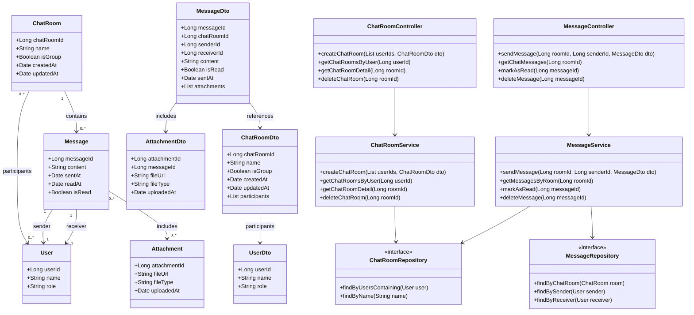
```mermaid
classDiagram
    direction TB

    %%==============================
    %% ENTITY
    %%==============================
    class User {
        +Long userId
        +String name
        +String role
    }

    class ChatRoom {
        +Long chatRoomId
        +String name
        +Boolean isGroup
        +Date createdAt
        +Date updatedAt
    }

    class Message {
        +Long messageId
        +String content
        +Date sentAt
        +Date readAt
        +Boolean isRead
    }

    class Attachment {
        +Long attachmentId
        +String fileUrl
        +String fileType
        +Date uploadedAt
    }

    %% 관계
    ChatRoom "1" --> "0..*" Message : contains
    ChatRoom "0..*" --> "0..*" User : participants
    Message "1" --> "1" User : sender
    Message "1" --> "1" User : receiver
    Message "0..*" --> "0..*" Attachment : includes

    %%==============================
    %% DTO
    %%==============================
    class ChatRoomDto {
        +Long chatRoomId
        +String name
        +Boolean isGroup
        +Date createdAt
        +Date updatedAt
        +List<UserDto> participants
    }

    class MessageDto {
        +Long messageId
        +Long chatRoomId
        +Long senderId
        +Long receiverId
        +String content
        +Boolean isRead
        +Date sentAt
        +List<AttachmentDto> attachments
    }

    class AttachmentDto {
        +Long attachmentId
        +Long messageId
        +String fileUrl
        +String fileType
        +Date uploadedAt
    }

    class UserDto {
        +Long userId
        +String name
        +String role
    }

    %%==============================
    %% REPOSITORY
    %%==============================
    class ChatRoomRepository {
        <<interface>>
        +findByUsersContaining(User user)
        +findByName(String name)
    }

    class MessageRepository {
        <<interface>>
        +findByChatRoom(ChatRoom room)
        +findBySender(User sender)
        +findByReceiver(User receiver)
    }

    %%==============================
    %% SERVICE
    %%==============================
    class ChatRoomService {
        +createChatRoom(List<Long> userIds, ChatRoomDto dto)
        +getChatRoomsByUser(Long userId)
        +getChatRoomDetail(Long roomId)
        +deleteChatRoom(Long roomId)
    }

    class MessageService {
        +sendMessage(Long roomId, Long senderId, MessageDto dto)
        +getMessagesByRoom(Long roomId)
        +markAsRead(Long messageId)
        +deleteMessage(Long messageId)
    }

    %% 연결 (Service → Repository)
    ChatRoomService --> ChatRoomRepository
    MessageService --> MessageRepository
    MessageService --> ChatRoomRepository

    %%==============================
    %% CONTROLLER
    %%==============================
    class ChatRoomController {
        +createChatRoom(List<Long> userIds, ChatRoomDto dto)
        +getChatRoomsByUser(Long userId)
        +getChatRoomDetail(Long roomId)
        +deleteChatRoom(Long roomId)
    }

    class MessageController {
        +sendMessage(Long roomId, Long senderId, MessageDto dto)
        +getChatMessages(Long roomId)
        +markAsRead(Long messageId)
        +deleteMessage(Long messageId)
    }

    %% 연결 (Controller → Service)
    ChatRoomController --> ChatRoomService
    MessageController --> MessageService

    %%==============================
    %% CROSS ENTITY-DATA RELATIONS
    %%==============================
    MessageDto --> ChatRoomDto : references
    MessageDto --> AttachmentDto : includes
    ChatRoomDto --> UserDto : participants

```

#### Entity Class

| Class Name    | Message |    |    |    |
| ----------------- | ---------------------------------------------------------- | ------ | ---------- | -------------------- |
| Class Description    | 사용자 간 송신 및 수신 메시지를 저장하는 엔티티. 읽음 여부 및 발송 시간을 관리한다. |    |    |    |
| 구분     | Name    | Type    | Visibility    | Description |
| ---                  | ---         | ---           | ---         | ---                 |
| Attribute    | messageId    | Long    | Private    | 메시지 식별자 |
| Attribute    | content    | String    | Private    | 메시지 본문 내용 |
| Attribute    | sentAt    | Date    | Private    | 메시지 전송 시각 |
| Attribute    | readAt    | Date    | Private    | 메시지 읽은 시각 |
| Attribute    | isRead    | Boolean    | Private    | 메시지 읽음 여부 |
| Attribute    | sender    | User     | Private    | 메시지를 보낸 사용자 |
| Attribute    | receiver    | User     | Private    | 메시지를 받는 사용자 |
| Attribute    | chatRoom    | ChatRoom    | Private    | 메시지가 속한 대화방 |
| Attribute    | attachments    | List<Attachment>    | Private    | 첨부 파일 목록 |
| 구분     | Name    | Return Type    | Description    |
| ---                  | ---                                | ---           | ---         |
| Method    | markAsRead()    | void     | 메시지를 읽음 처리하고 읽음 시각 갱신    |
| Method    | attachFile(Attachment attachment)     | void     | 메시지에 첨부 파일 추가 |

| Class Name    | ChatRoom |    |    |    |
| ----------------- | ---------------------------------------------------------- | ------ | ---------- | -------------------- |
| Class Description    | 사용자 간 메시지를 주고받는 대화방을 정의한 엔티티. 그룹방 여부 및 참가자 목록을 포함한다.    |    |    |    |
| 구분     | Name    | Type    | Visibility    | Description |
| ---                  | ---                                | ---           | ---         | ---                               |
| Attribute    | chatRoomId    | Long    | Private    | 대화방 식별자 |
| Attribute    | name    | String    | Private    | 대화방 이름 |
| Attribute    | isGroup    | Boolean    | Private    | 그룹방 여부(true면 단체방) |
| Attribute    | createdAt    | Date    | Private    | 생성 일시 |
| Attribute    | updatedAt    | Date    | Private    | 수정 일시 |
| Attribute    | users    | List<User>    | Private    | 대화방 참여자 목록 |
| Attribute    | messages    | List<Message>    | Private    | 해당 대화방 내 메시지 목록 |
| 구분     | Name    | Return Type    | Description    |
| ---                  | ---                                | ---           | ---         |
| Method    | addUser(User user)    | void     | 대화방에 사용자 추가    |
| Method    | removeUser(User user)    | void     | 대화방에서 사용자 제거 |

| Class Name    | Attachment |    |    |    |
| ----------------- | ---------------------------------------------------------- | ------ | ---------- | -------------------- |
| Class Description    | 메시지에 포함된 첨부 파일을 관리하는 엔티티. |    |    |    |
| 구분    | Name     | Type    | Visibility    | Description |
| ---                  | ---                                | ---           | ---         | ---                               |
| Attribute    | attachmentId    | Long    | Private    | 첨부 파일 식별자 |
| Attribute    | fileUrl     | String     | Private    | 파일 경로(URL) |
| Attribute    | fileType    | String     | Private    | 파일 형식 (jpg, png, pdf 등) |
| Attribute    | uploadedAt    | Date    | Private    | 업로드 시각 |
| Attribute    | message    | Message    | Private    | 해당 첨부파일이 속한 메시지 |
| 구분    | Name     | Return Type    | Description    |
| ---                  | ---                                | ---           | ---         |
| Method    | getFileExtension()     | String     | 파일 확장자 추출    |
| Method    | hasValidType()    | Boolean    | 허용된 파일 형식 여부 확인    |

#### DTO Class

| Class Name    | MessageDto |    |    |    |
| ----------------- | ---------------------------------------------------------- | ------ | ---------- | -------------------- |
| Class Description     | 메시지 송신, 조회, 삭제 요청 및 응답에 사용되는 데이터 전송 객체. |    |    |    |
| 구분    | Name     | Type    | Visibility    | Description |
| ---                  | ---                                | ---           | ---         | ---                               |
| Attribute    | messageId    | Long     | Private    | 메시지 식별자 |
| Attribute    | chatRoomId    | Long    | Private    | 소속 대화방 ID |
| Attribute    | senderId    | Long    | Private    | 송신자 ID |
| Attribute    | receiverId    | Long    | Private    | 수신자 ID |
| Attribute    | content    | String    | Private    | 메시지 본문 내용 |
| Attribute    | isRead    | Boolean    | Private    | 읽음 여부 |
| Attribute    | sentAt     | Date    | Private    | 메시지 발송 시각 |
| Attribute    | attachments    | List<AttachmentDto>     | Private    | 첨부 파일 DTO 목록 |

| Class Name    | ChatRoomDto |    |    |    |
| ----------------- | ---------------------------------------------------------- | ------ | ---------- | -------------------- |
| Class Description    | 대화방 생성, 조회 요청 및 응답에 사용하는 데이터 전송 객체.    |    |    |    |
| 구분    | Name     | Type    | Visibility    | Description |
| ---                  | ---                                | ---           | ---         | ---                               |
| Attribute    | chatRoomId    | Long    | Private    | 대화방 식별자 |
| Attribute    | name    | String    | Private    | 대화방 이름 |
| Attribute    | isGroup    | Boolean    | Private    | 그룹 여부 |
| Attribute    | createdAt    | Date    | Private    | 생성 일시 |
| Attribute    | updatedAt    | Date    | Private    | 수정 일시 |
| Attribute    | participants    | List<UserDto>    | Private    | 참여자 정보 목록    |

| Class Name    | AttachmentDto |    |    ||
| ----------------- | ---------------------------------------------------------- | ------ | ---------- | -------------------- |
| Class Description    | 메시지에 첨부된 파일 정보를 주고받기 위한 데이터 객체. |    |    |    |
| 구분    | Name     | Type    | Visibility    | Description |
| ---                  | ---                                | ---           | ---         | ---                               |
| Attribute    | attachmentId    | Long    | Private    | 첨부 파일 식별자 |
| Attribute    | messageId    | Long    | Private    | 메시지 ID |
| Attribute    | fileUrl     | String     | Private    | 파일 경로(URI) |
| Attribute    | fileType    | String     | Private    | 파일 형식 |
| Attribute    | uploadedAt    | Date    | Private    | 업로드 시각 |

| Class Name    | UserDto |    |    |    |
| ----------------- | ---------------------------------------------------------- | ------ | ---------- | -------------------- |
| Class Description    | 대화방 참여자 목록이나 송신자 정보에 표시되는 간략 사용자 DTO. |    |    |    |
| 구분    | Name     | Type    | Visibility     | Description |
| ---                  | ---                                | ---           | ---         | ---                               |
| Attribute    | userId    | Long    | Private    | 사용자 ID |
| Attribute    | name    | String    | Private    | 이름 |
| Attribute    | role    | String    | Private    | 사용자 역할 |

#### Repository Class

| Class Name    | ChatRoomRepository |    |    |    |
| ----------------- | ---------------------------------------------------------- | ------ | ---------- | -------------------- |
| Class Description    | 채팅방(ChatRoom) 정보를 관리하는 JPA Repository 인터페이스. |    |    |    |
| 구분    | Name     | Type    | Visibility    | Description |
| ---                  | ---                                | ---           | ---         | ---                               |
| Interface    | ChatRoomRepository    | JpaRepository<ChatRoom, Long>    | Public     | 대화방 엔티티 CRUD 제공 |
| 구분    | Name     | Return Type    | Description |
| ---                  | ---                                | ---           | ---         |
| Method    | findByUsersContaining(User user)    | List<ChatRoom>     | 특정 사용자가 포함된 대화방 목록 조회    |
| Method    | findByName(String name)     | Optional<ChatRoom>    | 대화방 이름으로 검색    |

| Class Name    | MessageRepository |    |    |    |
| ----------------- | ---------------------------------------------------------- | ------ | ---------- | -------------------- |
| Class Description    | 메시지 데이터를 관리하는 JPA Repository 인터페이스. |    |    |    |
| 구분    | Name     | Type    | Visibility    | Description |
| ---                  | ---                                | ---           | ---         | ---                               |
| Interface    | MessageRepository    | JpaRepository<Message, Long>    | Public     | 메시지 CRUD 담당 |
| 구분    | Name     | Return Type    | Description    |
| ---                  | ---                                | ---           | ---         |
| Method    | findByChatRoom(ChatRoom room)    | List<Message>    | 특정 대화방의 메시지 목록 조회    |
| Method    | findBySender(User sender)     | List<Message>    | 특정 사용자가 보낸 메시지 조회    |
| Method    | findByReceiver(User receiver)    | List<Message>    | 특정 사용자가 받은 메시지 조회    |

#### Service Class

| Class Name    | ChatRoomService |    |    |    |
| ----------------- | ---------------------------------------------------------- | ------ | ---------- | -------------------- |
| Class Description    | 대화방 생성, 삭제, 사용자 목록 조회 기능을 담당하는 비즈니스 로직 클래스. |    |    |    |
| 구분    | Name     | Type    | Visibility    | Description |
| ---                  | ---                                | ---           | ---         | ---                               |
| Attribute    | chatRoomRepository    | ChatRoomRepository    | Private / Final    | 대화방 데이터 접근 Repository |
| Attribute    | userRepository    | UserRepository    | Private / Final    | 대화방 참여자 연동 Repository |
| 구분    | Name     | Return Type    | Description    |
| ---                  | ---                                | ---           | ---         |
| Method    | createChatRoom(List<Long> userIds, ChatRoomDto dto)    | ChatRoom    | 사용자 목록 기반으로 새로운 대화방 생성    |
| Method    | getChatRoomsByUser(Long userId)    | List<ChatRoom>    | 해당 사용자가 포함된 대화방 목록 조회    |
| Method    | getChatRoomDetail(Long roomId)    | ChatRoom    | 대화방 상세 조회    |
| Method    | deleteChatRoom(Long roomId)    | void    | 대화방 삭제    |

| Class Name    | MessageService |    |    |    |
| ----------------- | ---------------------------------------------------------- | ------ | ---------- | -------------------- |
| Class Description    | 메시지 송신, 조회, 읽음 처리 등의 비즈니스 로직을 담당하는 서비스 클래스. |    |    |    |
| 구분    | Name     | Type    | Visibility    | Description |
| ---                  | ---                                | ---           | ---         | ---                               |
| Attribute    | messageRepository    | MessageRepository    | Private / Final | 메시지 데이터 접근 객체 |
| Attribute    | chatRoomRepository    | ChatRoomRepository    | Private / Final    | 대화방 검증 및 연동 Repository |
| Attribute    | userRepository    | UserRepository    | Private / Final    | 메시지 송신자/수신자 검증용 Repository |
| 구분    | Name     | Return Type    | Description |
| ---                  | ---                                | ---           | ---         |
| Method    | sendMessage(Long roomId, Long senderId, MessageDto dto)     | Message    | 메시지 전송 처리    |
| Method    | getMessagesByRoom(Long roomId)    | List<Message>    | 채팅방별 메시지 목록 조회    |
| Method    | markAsRead(Long messageId)     | void    | 메시지 읽음 상태 변경 |
| Method    | deleteMessage(Long messageId)    | void    | 메시지 삭제 처리    |

#### Controller Class
| Class Name    | ChatRoomController |    |    |    |
| ----------------- | ---------------------------------------------------------- | ------ | ---------- | -------------------- |
| Class Description    | 채팅방 생성, 조회, 참여자 관리 요청을 처리하는 컨트롤러. |    |    |    |
| 구분    | Name     | Type    | Visibility    | Description |
| ---                  | ---                                | ---           | ---         | ---                               |
| Attribute    | chatRoomService    | ChatRoomService    | Private / Final    | 대화방 비즈니스 로직 처리 서비스 |
| Attribute    | userService    | UserService    | Private / Final    | 사용자 검증 및 매핑 서비스 |
| 구분    | Name     | Return Type    | Description    |
| ---                  | ---                                | ---           | ---         |
| Method    | createChatRoom(List<Long> userIds, ChatRoomDto dto)    | ResponseEntity<ChatRoomDto>    | 참여자 목록을 기반으로 채팅방 생성    |
| Method    | getChatRoomsByUser(Long userId)    | ResponseEntity<List<ChatRoomDto>>    | 사용자가 참여 중인 대화방 목록 조회    |
| Method    | getChatRoomDetail(Long roomId)    | ResponseEntity<ChatRoomDto>    | 특정 채팅방 상세 정보 조회    |
| Method    | deleteChatRoom(Long roomId)    | ResponseEntity<Void>    | 채팅방 삭제 요청 처리    |

| Class Name    | MessageController |    |    |    |
| ----------------- | ---------------------------------------------------------- | ------ | ---------- | -------------------- |
| Class Description    | 사용자 간 1:1 또는 그룹 메시지 송수신 요청을 처리하는 컨트롤러. |    |    |    |
|구분    | Name     | Type    | Visibility    | Description |
| ---                  | ---                                | ---           | ---         | ---                               |
| Attribute    | messageService    | MessageService    | Private / Final    | 메시지 전송 및 조회 비즈니스 로직 처리 서비스 |
| Attribute    | userService    | UserService    | Private / Final    | 송신자 및 수신자 검증 서비스 |
| Attribute    | chatRoomService    | ChatRoomService    | Private / Final    | 대화방 관리 서비스 |
| 구분    | Name     | Return Type    | Description    |
| ---                  | ---                                | ---           | ---         |
| Method    | sendMessage(Long roomId, Long senderId, MessageDto dto)    | ResponseEntity<MessageDto>    | 특정 대화방에 메시지 전송 처리    |
| Method    | getChatMessages(Long roomId)    | ResponseEntity<List<MessageDto>>    | 대화방 내 메시지 목록 조회     |
| Method    | markAsRead(Long messageId)     | ResponseEntity<Void>    | 메시지 읽음 상태 변경    |
| Method    | deleteMessage(Long messageId)    | ResponseEntity<Void>    | 메시지 삭제 요청 처리    |

## 4. Sequence diagram
## 유저
### 1. GitHub OAuth 회원가입

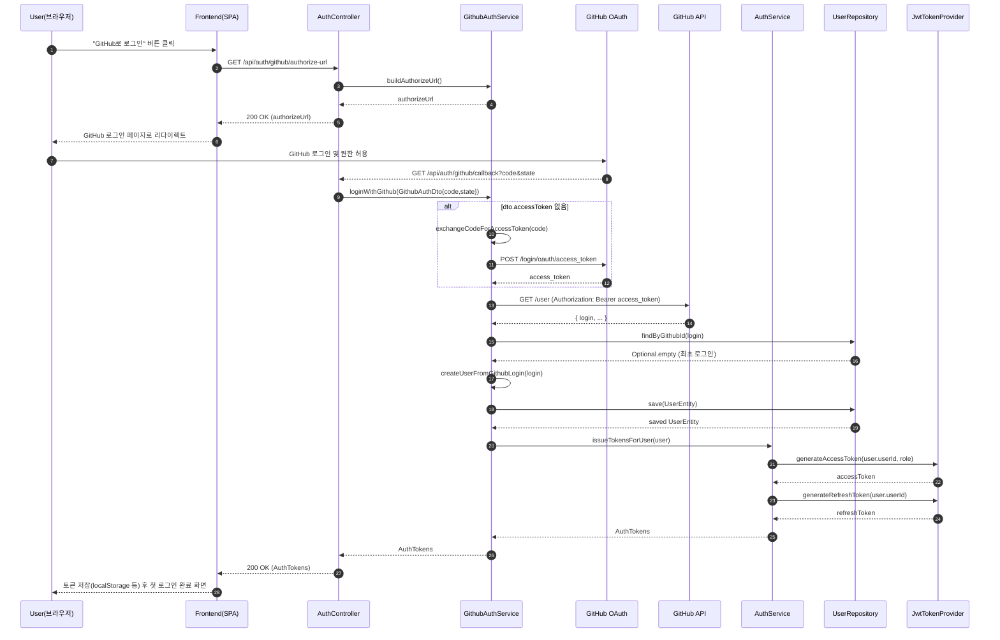
```mermaid
sequenceDiagram
    autonumber
    participant U as User(브라우저)
    participant FE as Frontend(SPA)
    participant AC as AuthController
    participant GAS as GithubAuthService
    participant GH as GitHub OAuth
    participant GAPI as GitHub API
    participant AS as AuthService
    participant UR as UserRepository
    participant JTP as JwtTokenProvider

    U->>FE: "GitHub로 로그인" 버튼 클릭
    FE->>AC: GET /api/auth/github/authorize-url
    AC->>GAS: buildAuthorizeUrl()
    GAS-->>AC: authorizeUrl
    AC-->>FE: 200 OK (authorizeUrl)
    FE-->>U: GitHub 로그인 페이지로 리다이렉트

    U->>GH: GitHub 로그인 및 권한 허용
    GH-->>AC: GET /api/auth/github/callback?code&state
    AC->>GAS: loginWithGithub(GithubAuthDto{code,state})

    alt dto.accessToken 없음
        GAS->>GAS: exchangeCodeForAccessToken(code)
        GAS->>GH: POST /login/oauth/access_token
        GH-->>GAS: access_token
    end

    GAS->>GAPI: GET /user (Authorization: Bearer access_token)
    GAPI-->>GAS: { login, ... }

    GAS->>UR: findByGithubId(login)
    UR-->>GAS: Optional.empty (최초 로그인)

    GAS->>GAS: createUserFromGithubLogin(login)
    GAS->>UR: save(UserEntity)
    UR-->>GAS: saved UserEntity

    GAS->>AS: issueTokensForUser(user)
    AS->>JTP: generateAccessToken(user.userId, role)
    JTP-->>AS: accessToken
    AS->>JTP: generateRefreshToken(user.userId)
    JTP-->>AS: refreshToken
    AS-->>GAS: AuthTokens
    GAS-->>AC: AuthTokens
    AC-->>FE: 200 OK (AuthTokens)
    FE-->>U: 토큰 저장(localStorage 등) 후 첫 로그인 완료 화면


```

사용자가 웹 서비스에서 “GitHub로 로그인” 버튼을 클릭하면, 프론트엔드는 먼저 백엔드의 GET /api/auth/github/authorize-url 엔드포인트를 호출해 GitHub 인증 페이지로 이동할 수 있는 authorize URL을 요청한다. AuthController는 내부적으로 GithubAuthService.buildAuthorizeUrl()을 호출하여 GitHub OAuth 인증 URL을 생성해 프론트엔드에 전달한다. 프론트엔드는 해당 URL로 리다이렉트시켜 사용자를 GitHub 로그인 화면으로 보내고, 사용자는 GitHub 계정으로 로그인 및 권한 허용을 진행한다.

GitHub 로그인에 성공하면 GitHub는 등록된 redirect URI로 code와 state를 포함하여 백엔드로 콜백 요청을 보낸다. 이때 AuthController.githubCallback()이 호출되며, 컨트롤러는 전달받은 code/state 값을 GithubAuthDto에 담아 GithubAuthService.loginWithGithub()에 넘긴다.

GithubAuthService는 우선 DTO에 accessToken이 없는 경우 GitHub 토큰 발급 엔드포인트(https://github.com/login/oauth/access_token)에 client_id, client_secret, code, redirect_uri를 담아 POST 요청을 보내 액세스토큰을 받아온다. 이어서 이 액세스 토큰을 이용하여 GitHub API의 /user 엔드포인트를 호출해 사용자의 GitHub 프로필 정보를 조회하고, 이 중 login 값을 가져와 서비스에서 사용하는 github_id로 활용한다.

그 다음 UserRepository.findByGithubId()를 호출하여 해당 github_id가 이미 존재하는지 조회한다. 최초 로그인이라면 해당 값이 없기 때문에, GithubAuthService는 createUserFromGithubLogin()을 호출하여 새로운 UserEntity를 생성한다. 이때 관리자 여부는 기본적으로 false이며, commit/issue/pr 통계는 모두 0으로 초기화되고 created_at 값이 현재 시각으로 설정된다. 생성된 엔티티는 DB에 저장된다.

사용자 엔터티가 준비되면, GithubAuthService는 AuthService.issueTokensForUser()를 호출해 Access Token과 Refresh Token을 발급받는다. AuthService는 JWT 생성기 JwtTokenProvider를 사용하여, userId와 역할(is_admin 여부)을 포함한 Access Token과 Refresh Token을 각각 생성한다. 생성된 토큰 세트(AuthTokens)는 다시 컨트롤러를 통해 프론트엔드로 반환되며, 프론트는 이 토큰을 저장하여 최초 회원가입 및 로그인 과정을 마친다.

### 2. 로그인 (GitHub OAuth 재로그인)
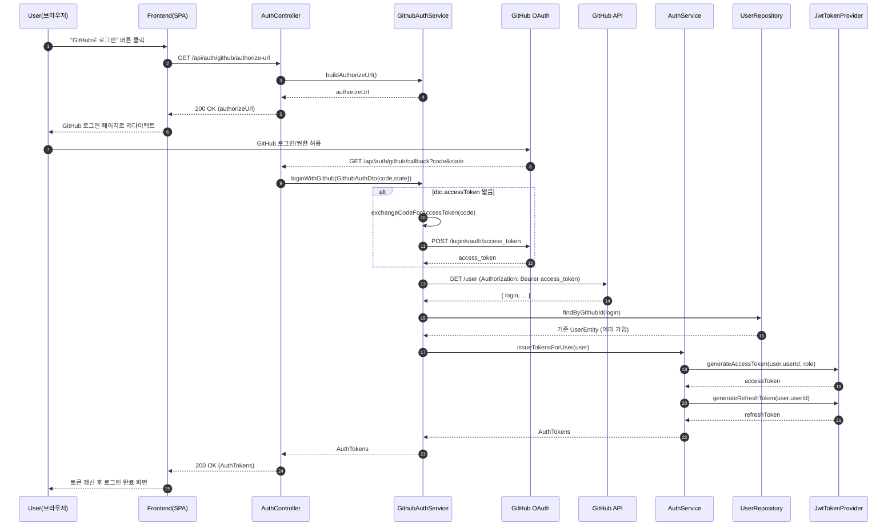
```mermaid
sequenceDiagram
    autonumber
    participant U as User(브라우저)
    participant FE as Frontend(SPA)
    participant AC as AuthController
    participant GAS as GithubAuthService
    participant GH as GitHub OAuth
    participant GAPI as GitHub API
    participant AS as AuthService
    participant UR as UserRepository
    participant JTP as JwtTokenProvider

    U->>FE: "GitHub로 로그인" 버튼 클릭
    FE->>AC: GET /api/auth/github/authorize-url
    AC->>GAS: buildAuthorizeUrl()
    GAS-->>AC: authorizeUrl
    AC-->>FE: 200 OK (authorizeUrl)
    FE-->>U: GitHub 로그인 페이지로 리다이렉트

    U->>GH: GitHub 로그인/권한 허용
    GH-->>AC: GET /api/auth/github/callback?code&state
    AC->>GAS: loginWithGithub(GithubAuthDto{code,state})

    alt dto.accessToken 없음
        GAS->>GAS: exchangeCodeForAccessToken(code)
        GAS->>GH: POST /login/oauth/access_token
        GH-->>GAS: access_token
    end

    GAS->>GAPI: GET /user (Authorization: Bearer access_token)
    GAPI-->>GAS: { login, ... }

    GAS->>UR: findByGithubId(login)
    UR-->>GAS: 기존 UserEntity (이미 가입)

    GAS->>AS: issueTokensForUser(user)
    AS->>JTP: generateAccessToken(user.userId, role)
    JTP-->>AS: accessToken
    AS->>JTP: generateRefreshToken(user.userId)
    JTP-->>AS: refreshToken
    AS-->>GAS: AuthTokens
    GAS-->>AC: AuthTokens
    AC-->>FE: 200 OK (AuthTokens)
    FE-->>U: 토큰 갱신 후 로그인 완료 화면


```

재로그인 흐름은 회원가입과 거의 동일하게 시작된다. 사용자는 “GitHub로 로그인” 버튼을 클릭하고, 프론트엔드는 백엔드에서 authorize URL을 받아 GitHub 인증 페이지로 이동시킨다. GitHub에서 code/state를 전달하며 콜백 요청을 보내면, 백엔드는 code를 accessToken으로 교환하여 GitHub 계정 정보를 다시 읽어온다.

가장 큰 차이는 이 시점 이후이다. GithubAuthService.loginWithGithub()은 GitHub에서 넘어온 login 값을 기준으로 UserRepository.findByGithubId()를 조회하고, 이번에는 DB에 이미 저장된 기존 사용자 엔터티가 존재하므로 새롭게 생성하지 않는다. 이후 기존 사용자 정보로 AuthService.issueTokensForUser()를 호출해 JWT 토큰 세트를 새로 발급받는다. 프론트는 새로운 Access Token과 Refresh Token을 저장하여 로그인 상태가 갱신된다.

즉, 재로그인 과정에서는 회원가입이 발생하지 않고, 이미 등록된 사용자의 인증만 수행하는 방식으로 작동한다.

## AI

### 1. AI에게 질문하기 (#59)

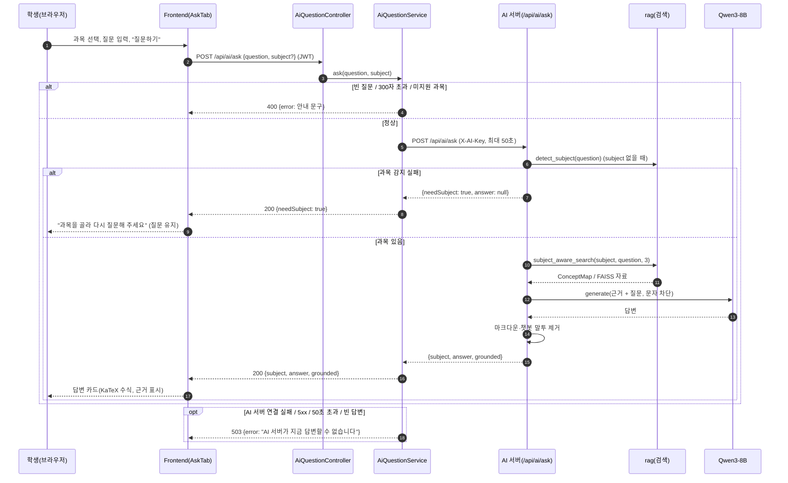
```mermaid
sequenceDiagram
    autonumber
    participant U as 학생(브라우저)
    participant FE as Frontend(AskTab)
    participant AQC as AiQuestionController
    participant AQS as AiQuestionService
    participant AI as AI 서버(/api/ai/ask)
    participant RAG as rag(검색)
    participant Q as Qwen3-8B

    U->>FE: 과목 선택, 질문 입력, "질문하기"
    FE->>AQC: POST /api/ai/ask {question, subject?} (JWT)
    AQC->>AQS: ask(question, subject)
    alt 빈 질문 / 300자 초과 / 미지원 과목
        AQS-->>FE: 400 {error: 안내 문구}
    else 정상
        AQS->>AI: POST /api/ai/ask (X-AI-Key, 최대 50초)
        AI->>RAG: detect_subject(question) (subject 없을 때)
        alt 과목 감지 실패
            AI-->>AQS: {needSubject: true, answer: null}
            AQS-->>FE: 200 {needSubject: true}
            FE-->>U: "과목을 골라 다시 질문해 주세요" (질문 유지)
        else 과목 있음
            AI->>RAG: subject_aware_search(subject, question, 3)
            RAG-->>AI: ConceptMap / FAISS 자료
            AI->>Q: generate(근거 + 질문, 문자 차단)
            Q-->>AI: 답변
            AI->>AI: 마크다운·챗봇 말투 제거
            AI-->>AQS: {subject, answer, grounded}
            AQS-->>FE: 200 {subject, answer, grounded}
            FE-->>U: 답변 카드(KaTeX 수식, 근거 표시)
        end
    end
    opt AI 서버 연결 실패 / 5xx / 50초 초과 / 빈 답변
        AQS-->>FE: 503 {error: "AI 서버가 지금 답변할 수 없습니다"}
    end
```

### 2. AI 맞춤 개념 추천 — AI 위임과 규칙 기반 대체 (#61)

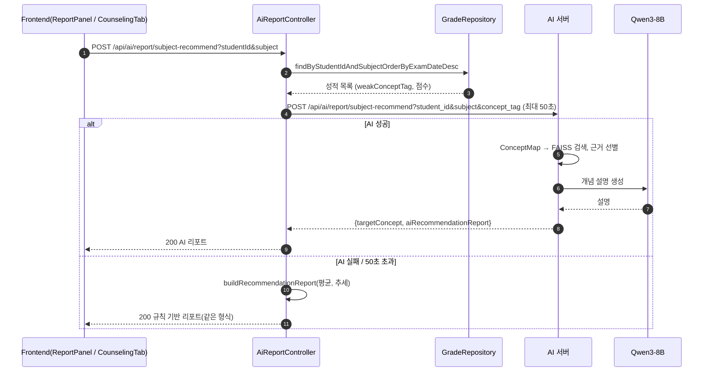
```mermaid
sequenceDiagram
    autonumber
    participant FE as Frontend(ReportPanel / CounselingTab)
    participant ARC as AiReportController
    participant GR as GradeRepository
    participant AI as AI 서버
    participant Q as Qwen3-8B

    FE->>ARC: POST /api/ai/report/subject-recommend?studentId&subject
    ARC->>GR: findByStudentIdAndSubjectOrderByExamDateDesc
    GR-->>ARC: 성적 목록 (weakConceptTag, 점수)
    ARC->>AI: POST /api/ai/report/subject-recommend?student_id&subject&concept_tag (최대 50초)
    alt AI 성공
        AI->>AI: ConceptMap → FAISS 검색, 근거 선별
        AI->>Q: 개념 설명 생성
        Q-->>AI: 설명
        AI-->>ARC: {targetConcept, aiRecommendationReport}
        ARC-->>FE: 200 AI 리포트
    else AI 실패 / 50초 초과
        ARC->>ARC: buildRecommendationReport(평균, 추세)
        ARC-->>FE: 200 규칙 기반 리포트(같은 형식)
    end
```

### 3. 과목별 메타인지 리포트 (#60)

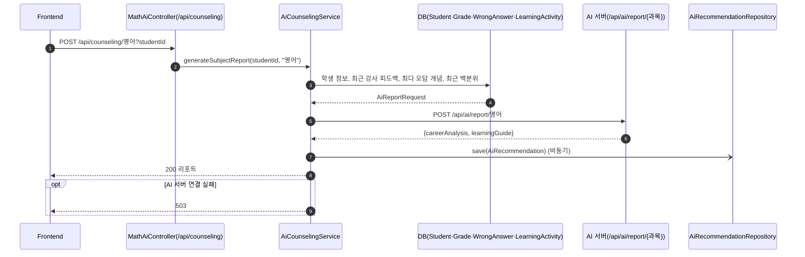
```mermaid
sequenceDiagram
    autonumber
    participant FE as Frontend
    participant MC as MathAiController(/api/counseling)
    participant ACS as AiCounselingService
    participant DB as DB(Student·Grade·WrongAnswer·LearningActivity)
    participant AI as AI 서버(/api/ai/report/{과목})
    participant AR as AiRecommendationRepository

    FE->>MC: POST /api/counseling/영어?studentId
    MC->>ACS: generateSubjectReport(studentId, "영어")
    ACS->>DB: 학생 정보, 최근 강사 피드백, 최다 오답 개념, 최근 백분위
    DB-->>ACS: AiReportRequest
    ACS->>AI: POST /api/ai/report/영어
    AI-->>ACS: {careerAnalysis, learningGuide}
    ACS-)AR: save(AiRecommendation) (비동기)
    ACS-->>FE: 200 리포트
    opt AI 서버 연결 실패
        ACS-->>FE: 503
    end
```

### 4. OCR 오답 기록이 리포트에 반영되는 흐름 (#62 → #60, #61)

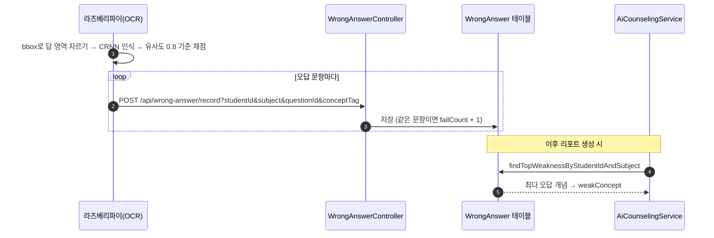
```mermaid
sequenceDiagram
    autonumber
    participant Pi as 라즈베리파이(OCR)
    participant WAC as WrongAnswerController
    participant DB as WrongAnswer 테이블
    participant ACS as AiCounselingService

    Pi->>Pi: bbox로 답 영역 자르기 → CRNN 인식 → 유사도 0.8 기준 채점
    loop 오답 문항마다
        Pi->>WAC: POST /api/wrong-answer/record?studentId&subject&questionId&conceptTag
        WAC->>DB: 저장 (같은 문항이면 failCount + 1)
    end
    Note over ACS,DB: 이후 리포트 생성 시
    ACS->>DB: findTopWeaknessByStudentIdAndSubject
    DB-->>ACS: 최다 오답 개념 → weakConcept
```

### 5. 학습 집중도 기록 (#63)

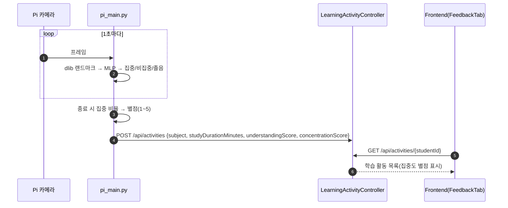
```mermaid
sequenceDiagram
    autonumber
    participant Cam as Pi 카메라
    participant Pi as pi_main.py
    participant LAC as LearningActivityController
    participant FE as Frontend(FeedbackTab)

    loop 1초마다
        Cam->>Pi: 프레임
        Pi->>Pi: dlib 랜드마크 → MLP → 집중/비집중/졸음
    end
    Pi->>Pi: 종료 시 집중 비율 → 별점(1~5)
    Pi->>LAC: POST /api/activities {subject, studyDurationMinutes, understandingScore, concentrationScore}
    FE->>LAC: GET /api/activities/{studentId}
    LAC-->>FE: 학습 활동 목록(집중도 별점 표시)
```

### 6. AI 맞춤 족보 탐색 (#64)

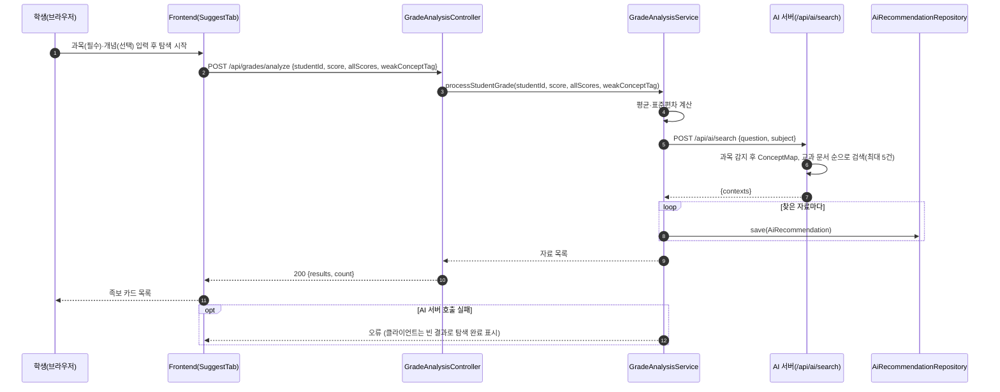
```mermaid
sequenceDiagram
    autonumber
    participant U as 학생(브라우저)
    participant FE as Frontend(SuggestTab)
    participant GAC as GradeAnalysisController
    participant GAS as GradeAnalysisService
    participant AI as AI 서버(/api/ai/search)
    participant AR as AiRecommendationRepository

    U->>FE: 과목(필수)·개념(선택) 입력 후 탐색 시작
    FE->>GAC: POST /api/grades/analyze {studentId, score, allScores, weakConceptTag}
    GAC->>GAS: processStudentGrade(studentId, score, allScores, weakConceptTag)
    GAS->>GAS: 평균·표준편차 계산
    GAS->>AI: POST /api/ai/search {question, subject}
    AI->>AI: 과목 감지 후 ConceptMap, 교과 문서 순으로 검색(최대 5건)
    AI-->>GAS: {contexts}
    loop 찾은 자료마다
        GAS->>AR: save(AiRecommendation)
    end
    GAS-->>GAC: 자료 목록
    GAC-->>FE: 200 {results, count}
    FE-->>U: 족보 카드 목록
    opt AI 서버 호출 실패
        GAS-->>FE: 오류 (클라이언트는 빈 결과로 탐색 완료 표시)
    end
```

### 7. AI 연동 공통 구현 사항 (2026.10)

#### 배포 구성 (2026-10-01, AWS 계정 207208119870, 서울 리전)

| 서비스 | 주소 | 구성 |
|---|---|---|
| Frontend | https://d2nos5u98g310z.cloudfront.net | S3 + CloudFront, `main` push 시 자동 배포 |
| Backend | https://d2t8h2oy220lpg.cloudfront.net | EC2(t3.small) + CloudFront(원본 응답 한도 60초), `develop` push 시 자동 배포 |
| AI 서버 | Tailscale 사설 주소:8082 | GPU PC(RTX 5070 Ti), 인터넷에 열지 않고 EC2와 같은 Tailscale 네트워크로만 연결 |

#### Backend ↔ AI 서버
- Backend는 `AI_SERVER_URL`(Tailscale 주소)과 `AI_SERVER_KEY`를 환경변수로 받는다. 키가 있으면 모든 AI 호출에 `X-AI-Key`를 붙이고, AI 서버는 키가 없거나 틀린 `/api/` 요청을 401로 거부한다.
- AI 서버가 Backend를 부르는 `/api/wrong-answer/ai-pipeline`은 JWT 없이 열려 있는 대신 `AiServerKeyFilter`가 같은 키로 막는다.
- AI 대기 한도: 개념 추천·질문은 **50초**(CloudFront 60초보다 짧아야 규칙 기반 대체·503이 제때 나간다). 리포트(`/api/counseling/*`)는 WebClient 기본 3분이라 60초를 넘기면 CloudFront가 먼저 504를 돌려줄 수 있다.

#### AI 서버 생성 규칙
- 모델: Qwen3-8B 4bit 베이스 하나(과목 어댑터는 로드하지 않음). 실패 시 Ollama(llama3.1) 대체. 폴백 횟수는 `GET /api/ai/stats/fallback`(kind: concept·advice·ask).
- 생성은 GPU 한 대에서 `GEN_LOCK`으로 한 번에 하나씩 한다. 동시 요청은 순서대로 처리되어 뒤 요청이 늦어진다.
- 근거: ConceptMap(사람이 쓴 개념 노트, 138개 항목, 운영 DB 개념 태그 33개 모두 대응)에서 온 자료만 프롬프트에 붙인다. FAISS 교과서 조각은 근거로 붙이지 않는다.
- 출력 정리: 다른 문자(한자·가나·키릴·베트남어 등)와 교과 문서에 한 번도 나오지 않은 한글 음절은 생성 단계에서 막고, 국어·사회는 영문자도 막는다. 마크다운 기호·표·반복 기호·챗봇식 머리말/맺음말은 후처리로 지운다. 수식(`$…$`)과 화살표(→ ⇔)는 남긴다.
- 품질 기준: 사실 정확도 평가(47개 개념, 사람이 판정) 44/47.

#### 보안·권한
- `/api/ai/**`, `/api/counseling/**`는 로그인(JWT) 필요. `/api/ai/ask`는 토큰 없이 부르면 403.
- 질문 길이 300자 제한, 지원 과목 화이트리스트(수학·영어·국어·과학·사회).

#### 알려진 제약
1. 동시 사용: 생성이 순차라 수학 개념 추천을 3명이 동시에 누르면 마지막 요청이 50초를 넘는다(규칙 기반으로 대체).
2. AI 답변은 샘플링 생성이라 드물게 용어 실수나 세부 오류가 있다(예: 허수부를 다른 말로 표현). 화면에 "교과서로 확인" 안내를 둔다.
3. OCR·집중도는 실제 Pi 촬영 환경에서 정확도를 재지 않았다. 자세 추정은 미구현.
4. Backend 테스트 9개 파일이 6월 이후 코드 변경을 따라가지 못해 컴파일되지 않는다(배포는 테스트를 건너뜀). 새로 추가한 `AiQuestionServiceTest`(5개)는 통과한다.
5. 같은 성적대 비교 API(`GET /api/recommendations/peer-content`, `/peer-path`)는 grade 테이블에 옛 형식의 학생 ID('S-0157' 등)가 섞여 있으면 500 오류가 난다(로컬 DB에서 재현). 운영 DB는 같은 덤프에서 복원했으므로 같은 증상이 날 수 있어 데이터 정리가 필요하다.

sds 내용인데 여기에서 다이렉트 메세지와 관련 부분을 삭제해주고, nfc 기능에 탑승/하차 알림과 탑승시 기사의 gps 공유 하차시 기사의 gps 공유 중지하고, 출결도 nfc를 통해서 관리하는 기능을 만들었으니까 추가해서 수정해줘
